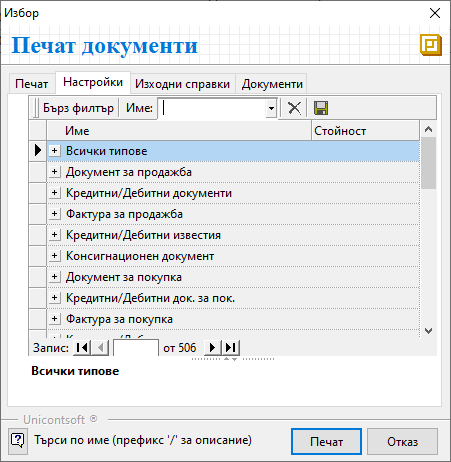
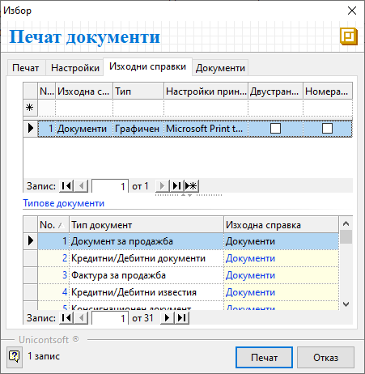

```{only} html
[Нагоре](000-index)
```

# Настройки при печат на документи

Системата осигурява възможност за персонализиране на настройките при печат на документи. Това позволява форматиране и прилагане на различен шаблон за печат при отделните типове документи.  

Последно конфигурираните настройки се запаметяват и системата ги предлага при следващ печат.  

 Бутоните **Преглед** и **Печат** са достъпни от:  
 - Лента с инструменти във формата за редакция на документ;  
 Избраният документ трябва да е отворен на екран.  
 - Меню **Файл** в основното меню на контейнера;  
 Избраният документ/и за печат трябва да бъде предварително маркиран.  
 - Лента с инструменти в контейнера;  
 Избраният документ/и за печат трябва да бъде предварително маркиран. 
 - Опционално меню, което се отваря с десен бутон върху предварително маркиран запис/и от списък с документи;    

В секция **Печат** могат да бъдат избрани документите, които системата да отпечата, чрез поставяне на отметка. За всеки отделен тип документ може да се настрои в колко екземпляра да бъде отпечатан. Чрез бутоните вдясно се отварят падащи менюта за избор на шаблон при печат. Системата дава възможност за избор на различен шаблон за всеки тип документ.  

{ class=align-center w=15cm }

В секция **Настройки** има възможност да бъдат форматирани страниците и съдържанието за печат общо за всички документи.  
Друга част от настройките са групирани отделно по типове документи. Системата позовлява индивидуална настройка за всеки тип документ, която се взема предвид с предимство пред общите настройки във *Всички типове*.  

{ class=align-center }

> Чрез наличните опции за адаптиране на съдържанието могат да бъдат управлявани подредбата и източниците на данните в печатния документ.

В секция **Изходни справки** може да се промени **Тип** на справката между
*Графичен* и *Текстов*.   

В полетата на колона **Настройки принтер** се избира на кой принтер да се извърши печата. Системата предлага списък с предварително настроените принтери и отбелязва принтерът по подразбиране. 

Настройката **Двустранен печат** дава възможност за отпечатване на документи, като се използват и двете страници на листа. Настройката се активира/ деактивира с поставяне/ махане на отметка.  

Чрез настройка **Номерация на страници** системата предлага визуализация на пореден номер за всяка отпечата страница от документ. Опцията се активира/деактивира чрез поставяне/махане на отметка.

{ class=align-center }
___
## Свързани статии

- [Как да извършим настройки за печат на документи?](https://www.unicontsoft.com/cms/node/157)  
- [Как да отпечатаме Документ за продажба?](https://www.unicontsoft.com/cms/node/27)  
- [Как да отпечатаме външнотърговска фактура?](https://www.unicontsoft.com/cms/node/135)  
- [Как да отпечатаме Документ за покупка?](https://www.unicontsoft.com/cms/node/25)  