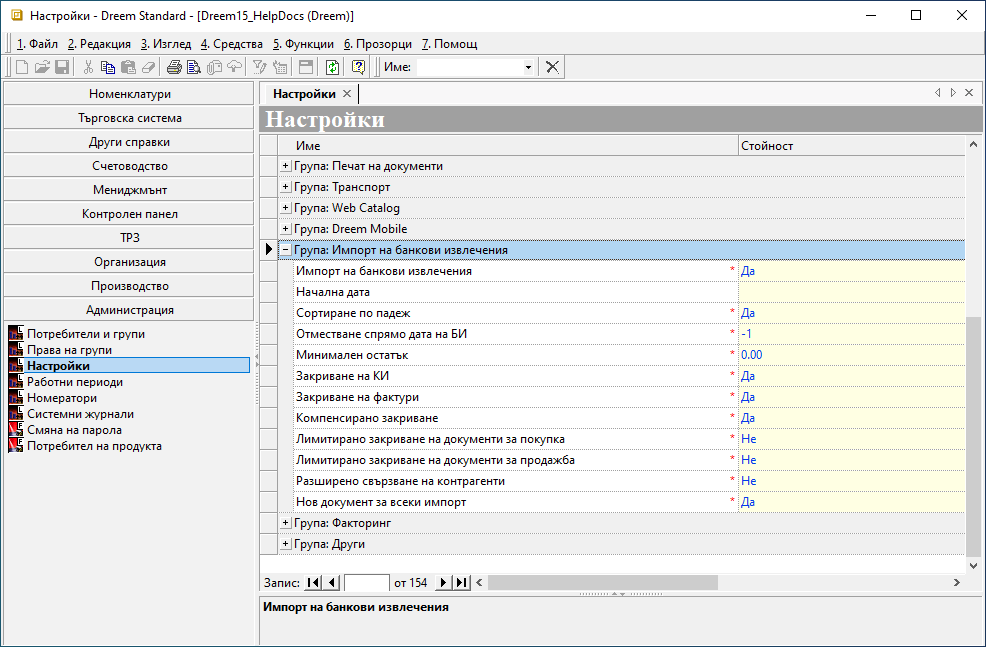
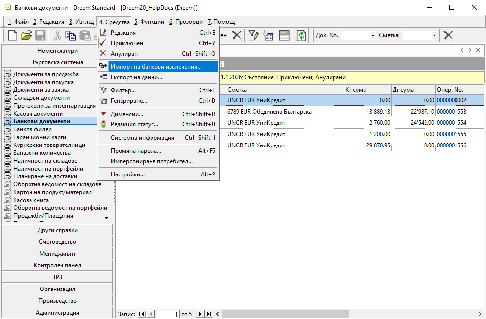
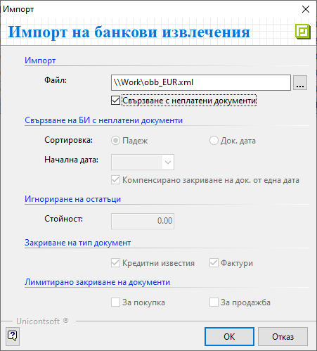
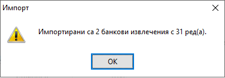
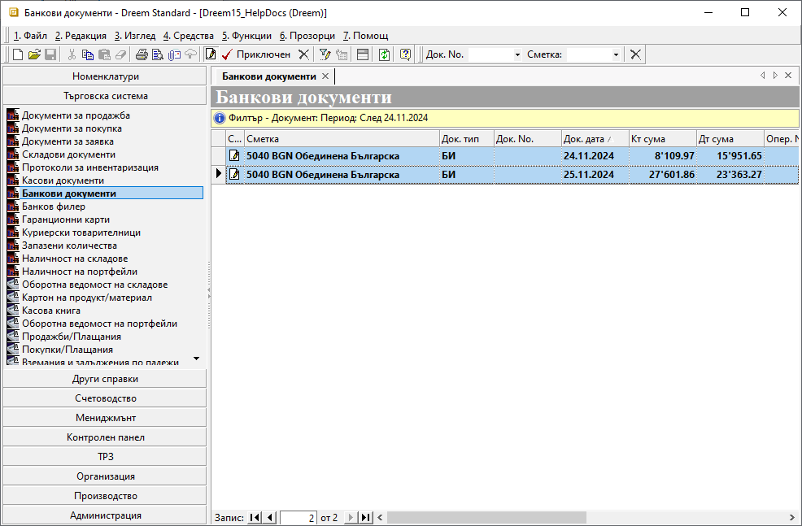
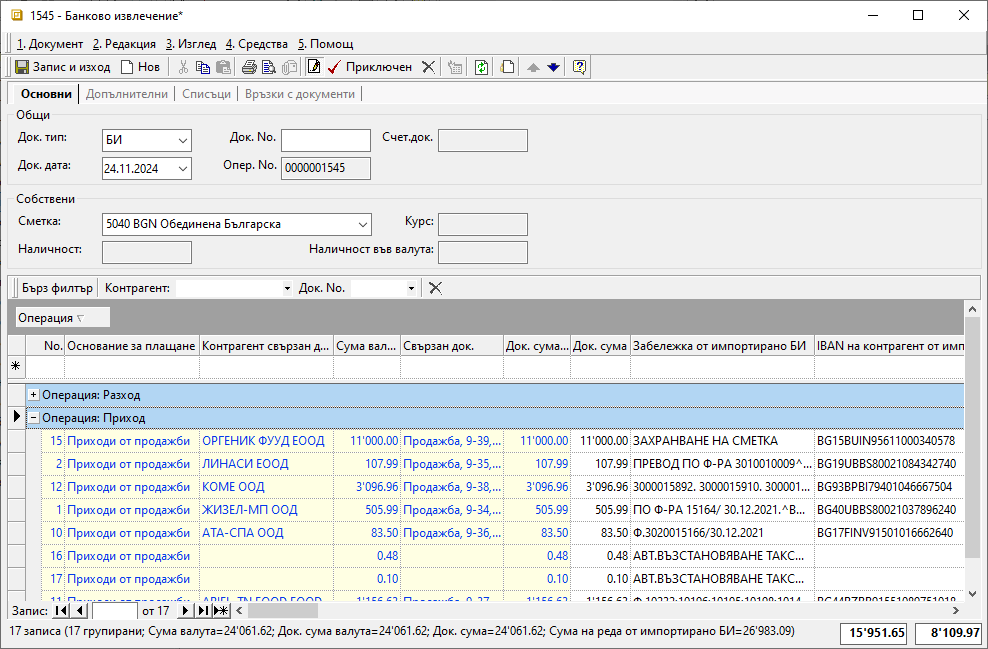
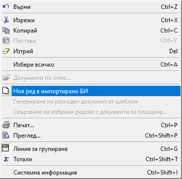

```{only} html
[Нагоре](000-index)
```

# **Импорт на банкови извлечения**

Системата разполага със средство за импорт на информация от банкови извлечения. Чрез него при прехвърлянето на трансакции от банкови сметки се упражнява прецизен контрол по данъчни документи, товарителници, ППП, което подобрява точността на финансовите данни.  

Системата обработва различни по формат файлове за интеграция с непрекъснато разширяващ се списъка от банки: ОББ, Уникредит, Алианц, Интернешънъл Асет Банк, Банка ДСК, Пощенска банка и други. 

## **Настройки**

За да използвате функцията за импорт, е необходимо да определите параметрите, при които системата ще оперира. Това може да направите от **Администрация » Настройки » Импорт на банкови извлечения**.   

{ class=align-center w=15cm }

-   *Импорт на банкови извлечения* - Указва позволение за импорт на банкови извлечения.  

-   *Начална дата* - Указва от коя дата се гледат вземания и задължения.  

-   *Сортиране по падеж* - Указва начин на сортиране по ‘падеж’ (ако не е избрано по ‘дата на издаване’).  

-   *Отместване спрямо дата на БИ* - Указва свързване на документи с дати преди/след датата на банковото извлечение.  

-   *Минимален остатък* - Указва минимален остатък за плащане, т.е. стойност, под която документите се прескачат.  

-   *Закриване на КИ* - Указва дали да се закриват кредитни известия.  

-   *Закриване на фактури* - Указва дали да се закриват документи от тип данъчни.  

-   *Компенсирано закриване* - Указва компенсирано закриване на фактури с кредитни известия, които са издадени или с падеж на плащане (според избраната опция за сортиране) на една дата. Компенсиращият документ може да не е посочен в банковото извлечение.  

-   *Лимитирано закриване на документи за покупка* - Указва по-консервативно закриване при плащания, инициирани от потребителя. В този случай се закриват само изброените в извлечението документи. Системата не ескалира закриване на повече документи, дори и да има остатъчна сума.  

-   *Лимитирано закриване на документи за продажба* - Указва по-консервативно закриване при плащания, инициирани от потребителя. В този случай се закриват само изброените в извлечението документи. Системата не ескалира закриване на повече документи, дори и да има остатъчна сума.  

-   *Разширено свързване на контрагенти* - Указва общо свързване на документи за контрагенти с еднакви идентификационни и данъчни номера.  

-    *Нов документ за всеки импорт* - Указва дали при всеки импорт се създава ново банково извлечение или се допълва текущото.  

Направените промени може да запишете чрез **[Ctrl]+[S]** или с бутон [**Запис**] от лентата с инструменти.  

## **Импорт на БИ**

Ще откриете инструмента за импорт на БИ в **Търговска система » Банкови документи**, навигирайки се до меню **Средства**.  

{ class=align-center w=15cm }

В отворената форма за импорт са видими предварително настроените реквизити с условията на импорт.  
Същинският импорт се извършва след избора на файл и потвърждаване на действието с [**Ok**].  

{ class=align-center }

При успешно завършен процес системата ще изведе съобщение с брой импортирани документи и редове.  

{ class=align-center }

Системата предпазва от дублиране на документи, за което ще видите предупредително съобщение.  

Всички импортирани банкови извлечения са в състояние *Редакция*, докато не бъдат валидирани в системата с *Приключен*.  
 
{ class=align-center w=15cm }

> - С прочитането на файла системата търси съвпадение по IBAN, така че да свърже всяка трансакция с точния контрагент и неплатените му документи. Когато не е открито съвпадение, записите за тези суми ще останат в редове без свързани документи и контрагенти.  
> - В банковия документ системата автоматично свързва данъчните документи по номерата, отговарящи на цитираните в основание за превод.    
> - Сумата на превода от контрагент може да надвишава остатъците за плащане по документи. Тогава системата добавя отделен ред с разликата.  

Колона *Основание за плащане* се обзавежда по подразбиране с *Разходи за покупки* за операции тип *Разход* или с *Приходи от продажби* за операции тип *Приход*. Основанията могат да бъдат редактирани. Спрямо тях системата ще приложи настройките от [**Автоматичен осчетоводител**](../001-ref/002-accounting/003-acc-wizard.md) при генериране на счетоводен запис.   

{ class=align-center w=15cm }

В банковия документ има функция за въвеждане на допълнителни редове. Тя може да се използва след импорта на данни. Достъпна е чрез десен бутон на мишката върху избран ред в документа и опция *Нов ред в импортирано БИ*. С това системата добавя ред - копие на маркирания ред, но с нулеви стойности в полетата със суми.  

> Не трябва да се добавят ръчно нови редове в импортирано БИ през реда за нов запис. За тях ще липсва задължителната връзка с импортирания файл.  

{ class=align-center }

```{Tip}
За да имате видимост към изходните данни, извлечени от файла,  чрез Изглед на списък може да изведете следните колони:  

- Контрагент от импортирано БИ;  
- IBAN на контрагент от импортирано БИ;  
- Сума на реда от импортирано БИ;  
- Забележка от импортирано БИ (основание на превода);  
- Банкова референция от импортирано БИ;  
- Операция от импортирано БИ (приход/разход);  
```
По-нататъшната обработка на документа може да продължи с редактиране и/или валидиране (*Приключен*).  
  
