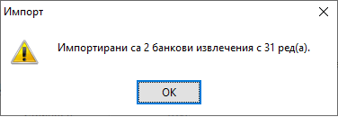
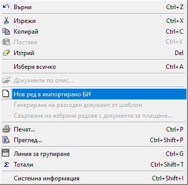

```{only} html
[Нагоре](000-index)
```

# **Импорт на банкови извлечения**

Чрез импорта на информация от банкови извлечения се подобрява точността на финансовите данни. Системата разполага със средство за автоматизирано прехвърляне на трансакции от банкови сметки и упражнява прецизен контрол по данъчни документи, товарителници, ППП.  

Системата обработва файлове в различни формати за интеграция с непрекъснато разширяващ се списъка от банки: ОББ, Уникредит, Алианц, Интернешънъл Асет Банк, Банка ДСК, Пощенска банка и други. 

За да използвате функцията за импорт, е необходимо в **Администрация || Настройки || Импорт на банкови извлечения** да определите параметрите, при които системата ще оперира. Всички настройки са подробно описани в [тази тема](https://www.unicontsoft.com/cms/node/256).    

{ class=align-center w=15cm }
 
Ще откриете инструмента за импорт на БИ в **Търговска система || Банкови документи**, навигирайки се до меню **Средства**.  

{ class=align-center w=15cm }
 
Същинският импорт се извършва с избора на файл, получен от банката.  
В отворената форма за импорт са видими предварително настроените реквизити с условията на импорт.  

{ class=align-center }

Когато процесът е преминал успешно, на екран се извежда информативно съобщение за брой импортирани редове и документи.  

{ class=align-center }

Също така, системата предпазва от дублиране на документи, за което ще видите предупредително съобщение.  

Всички импортирани банкови извлечения са в състояние *Редакция*, докато не бъдат валидирани в системата с *Приключен*.  
 
{ class=align-center w=15cm }

С прочитането на файла системата търси съвпадение по IBAN, така че да свърже всяка трансакция с точния контрагент в базата и неплатените му документи. Когато не е открито съвпадение, записите за тези суми ще останат в редове без свързани документи и контрагенти. 

> В банковия документ системата автоматично свързва данъчни документи по номера, отговарящи на тези, цитирани като основание за превод.    
> Ако сумата на превода от контрагент надвишава неплатените остатъци по документи, системата добавя разликата като отделен ред в банковия документ. 

За улеснение, по подразбиране колона *Основание за плащане* се обзавежда с *Разходи за покупки* за операции тип *Разход* и с *Приходи от продажби* за тези от тип *Приход*. Основанията могат да бъдат редактирани. Спрямо тях системата ще приложи настройките от [**Автоматичен осчетоводител**](../001-ref/002-accounting/003-acc-wizard.md).   

{ class=align-center w=15cm }

Системата предлага функция за въвеждане на допълнителни редове в банковия документ след импорта на данни. Това става с десен бутон на мишката върху ред от документа и опция *Нов ред в импортирано БИ*. Новият ред е копие на посочения с десен бутон ред, но с нулеви стойности в полетата със суми.  

> В импортирано БИ не трябва се добавят ръчно нови редове, т.к. за тях ще липсва връзка с импортирания файл.  

{ class=align-center }

```{Tip}
За да имате видимост към изходните данни, извлечени от файла, може да изведете следните колони чрез Изглед на списък:  

- Контрагент от импортирано БИ;  
- IBAN на контрагент от импортирано БИ;  
- Сума на реда от импортирано БИ;  
- Забележка от импортирано БИ (основание на превода);  
- Банкова референция от импортирано БИ;  
- Операция от импортирано БИ (приход/разход);  
```
По-нататъшната обработка на документа може да продължи с редактиране и/или валидиране (*Приключен*).  
  
