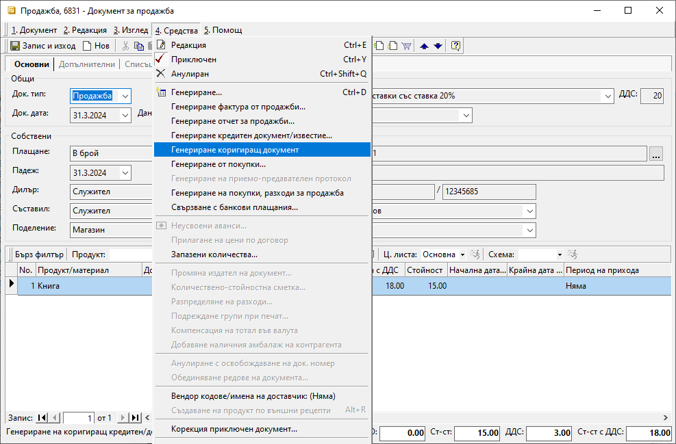
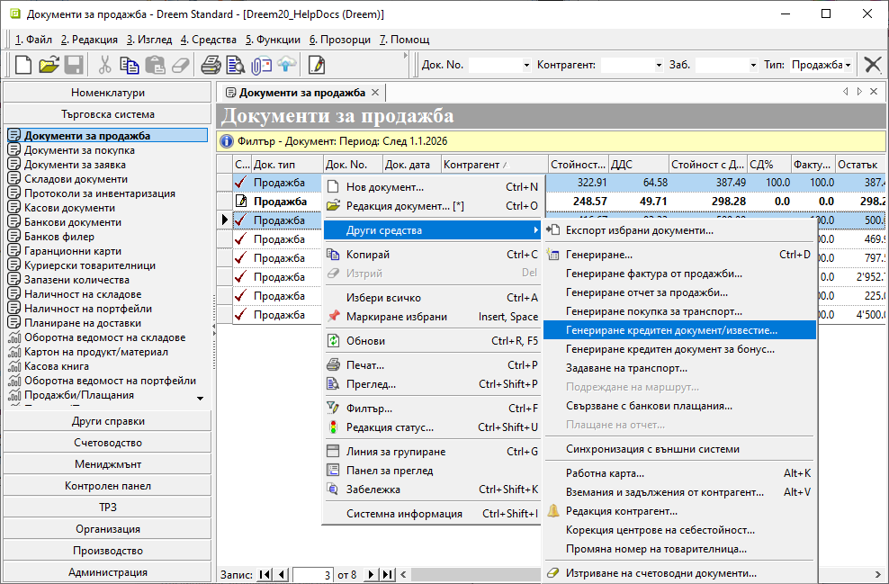
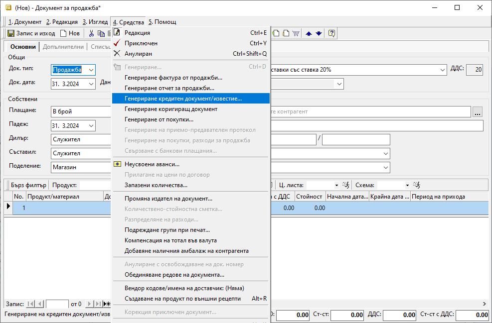
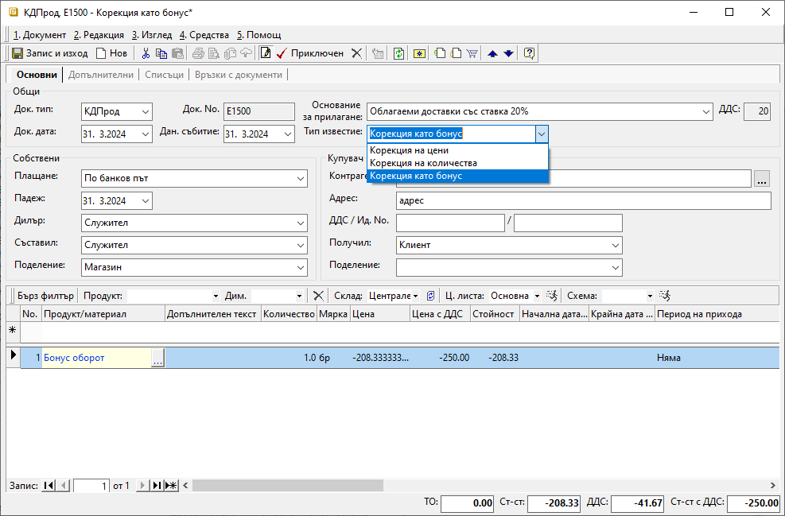
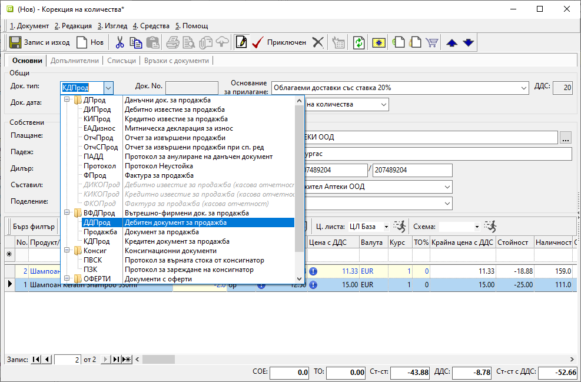

```{only} html
[Нагоре](000-index)
```
 
# **Коригиращи документи при продажба**  

- [Въведение](#въведение)  
- [Кредитен документ към една продажба](#кд-към-една-продажба)  
- [Кредитен документ към няколко продажби](#кд-към-няколко-продажби)  
- [Кредитен документ без връзка с продажба](#кд-без-връзка-с-продажба)  
- [Дебитни документи](#дебитни-документи)  
- [Свързани статии](#свързани-статии)  

## **Въведение**

Коригиращите документи се използват, когато за вече издадена продажба има промяна в цената или количеството на продукт/и. Затова при създаване на такъв документ трябва да изберете точната продажба, за която се отнася корекцията.  

Ако корекцията включва увеличаване на цена или количество, може да използвате дебитни документи за продажба.  
Ако промяната е в посока намаление, създавате кредитни документи от съответния тип - *Корекция на цена* или *Корекция на количество*. За тях системата генерира документ с отрицателен знак.     

Продажбите се регистрират в системата обикновено с вътрешнофирмен документ **Продажба**-*Документ за продажба*, за който в последствие ще има данъчен документ **ФПрод**-*Фактура за продажба*/**ОтчПрод**-*Отчет за извършени продажби*.  
Тази последователност се спазва и за коригиращите документи.  
Задължително първо генерирате вътрешнофирмен документ **КДПрод**-*Кредитен документ за продажба*. В последствие се генерира данъчният документ **КИПрод**-*Кредитно известие за продажба*.   

> **КДПрод** е аналогичен и пряко свързан с документ тип **Продажба**.  
**КИПрод** е аналогичен и пряко свързан с документ тип **ФПрод**.  

Има различни варианти за генерация на тези документи в системата. Всеки от тях се използва или е удобен в различна ситуация.  

## **КД към една продажба**

Ако създавате кредитен документ <ins>към една продажба</ins>, най-лесно е да използвате опцията **Генериране коригиращ документ**, която се намира в меню **Средства** в самата продажба. Така системата създава копие на документа за продажба, но с отрицателен знак.

{ class=align-center w=15cm }

## **КД към няколко продажби**

Когато създавате общ кредитен документ <ins>към няколко продажби</ins>, имате избор дали да го направите от списъка с документи, или чрез създаване на нов документ.   
Генерацията на кредитен документ от списъка с документи предполага да филтрирате така документите в него, че желаните продажби да са лесни за маркиране. След което с десен бутон на мишката върху маркировката избирате **Други средства » Генериране на кредитен документ/известие** и следвате стъпките.

{ class=align-center w=15cm }

При генерация чрез нов документ, първо създавате такъв, след което от меню **Средства » Генериране кредитен документ/известие** извеждате списъка с продажби. Тук филтрирате, за да изберете желаните документи, към които ще създадете коригиращ документ.

{ class=align-center w=15cm }

## **КД без връзка с продажба**

Дотук обсъжданите генерации изискват и служат за създаване на свързаност между продажба и коригиращ я документ. Има случаи, обаче, в които не може да посочим конкретни документи/фактура за продажба, а се налага издаване на кредитен документ. Например - когато искате да направите обща отстъпка за натрупан оборот, когато по някаква причина документът за продажба липсва в системата и пр.  

<ins>За тези случаи в системата има и трети тип коригиращ документ - **Корекция като бонус**.</ins> С използването му имате свобода при неговото създаване, каквато при типове *Корекция на цена* и *Корекция на количество* не се допуска. При тях се позволява да бъдат включени единствено продукти, участващи в свързаните продажби. Докато при типа *Корекция като бонус* съдържанието на кредитния документ може да бъде свободно избрано.

> Документ от тип *Корекция като бонус* се създава единствено чрез *Нов документ*, в който ръчно обзавеждате всички реквизити.  
> Най-често при този тип кредитен документ се въвежда един ред с обща отстъпка. За целта в системата се настройва отделен продукт от тип *Услуга*, който не изисква водене на склад.  

{ class=align-center w=15cm }

Тук отново важи правилото, че ако работите с вътрешнофирмени документи, първо се създава *Кредитен документ*, към който може да се генерира данъчният - *Кредитно известие*.

## **Дебитни документи**

Дебитните документи са коригиращ тип документ, използван за увеличаване на цена или количество по една или няколко продажби. Както споменахме при кредитните документи, така и при дебитните може да се коригират цена или количество единствено на участващи в продажбата продукти. 

> Ако желаете да завишите количества, може вместо дебитен документ да издадете нов документ за продажба.

Генерацията на дебитните документи в системата следва същите стъпки, които разгледахме за кредитни документи. Тъй като така се генерират коригиращи документи с отрицателен знак, задължително трябва да смените *Док. тип*.  
Когато работите с вътрешнофирмени документи, типът на документа трябва да бъде *Дебитен документ за продажба*.  
{ class=align-center w=15cm }

По-нататъшната обработка на документа е без особености.  
При приключването му системата може да генерира автоматично и данъчния документ - *Дебитно известие за продажба*.  


## **Свързани статии**

[**Кредитни документи за продажба**](../002-docs/002-trade-system/001-orders-sales-purchase-documents/007-credit-note.md)