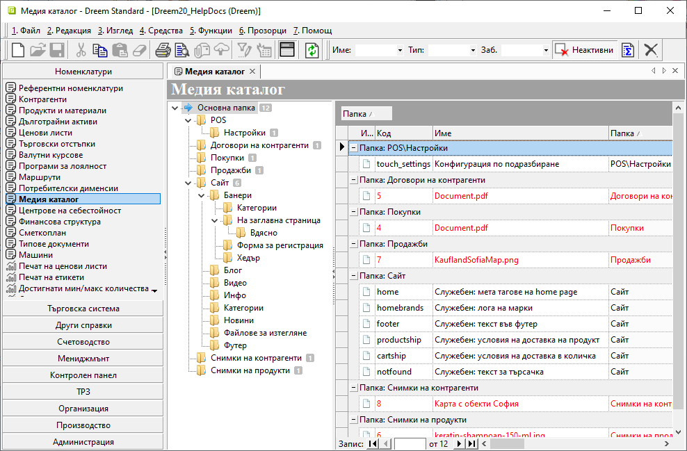
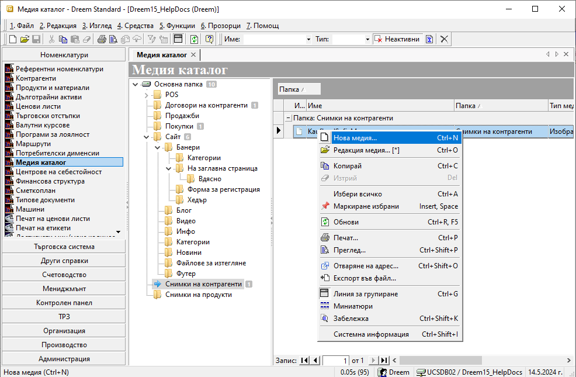
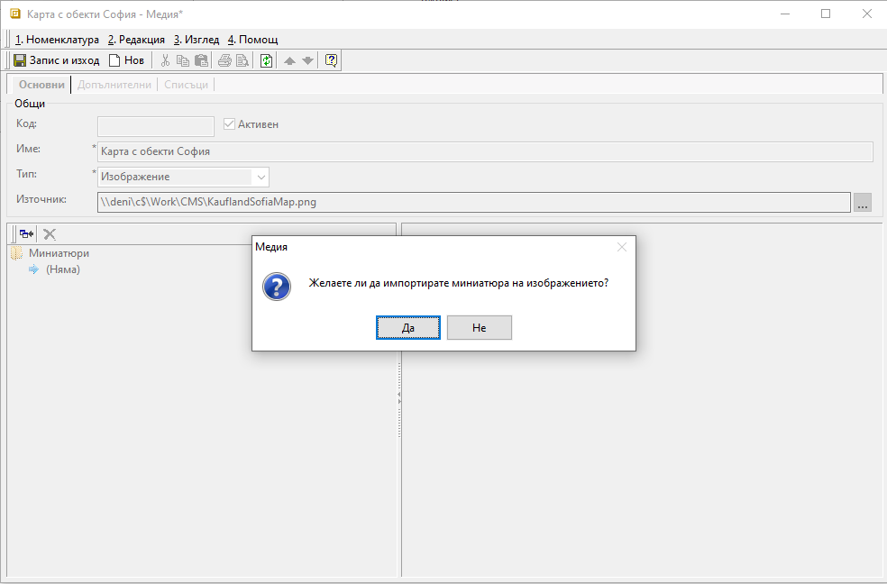
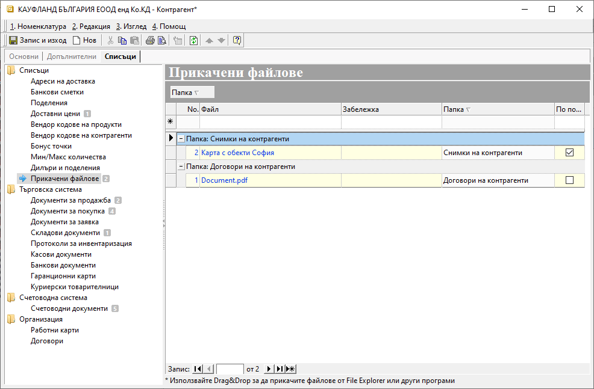
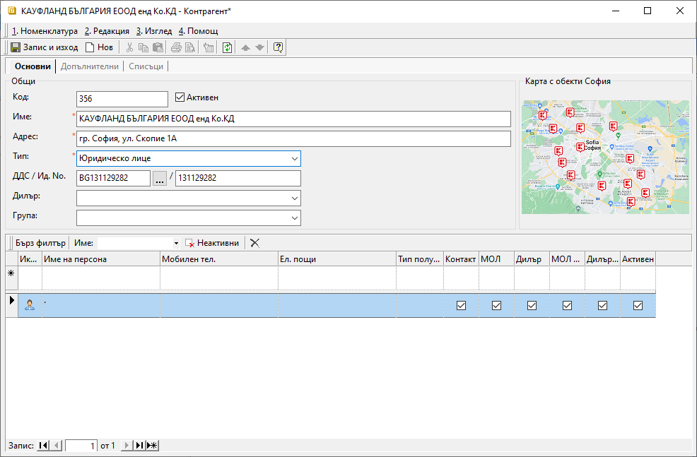
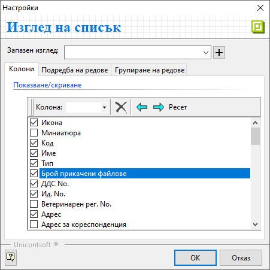
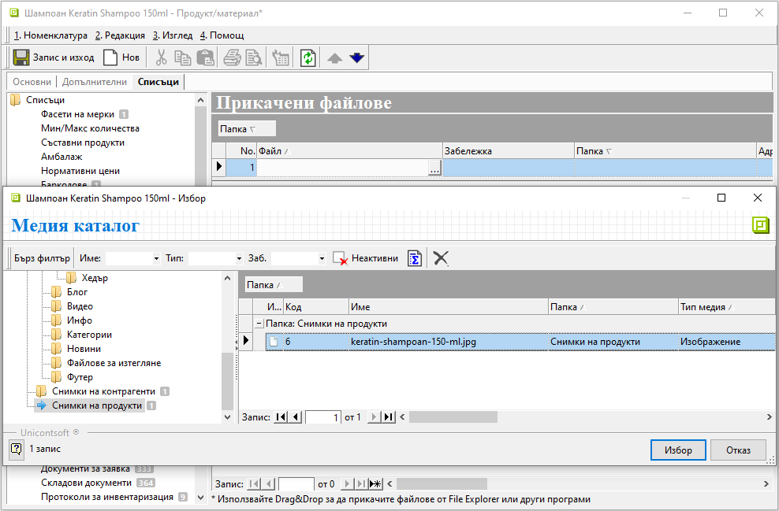
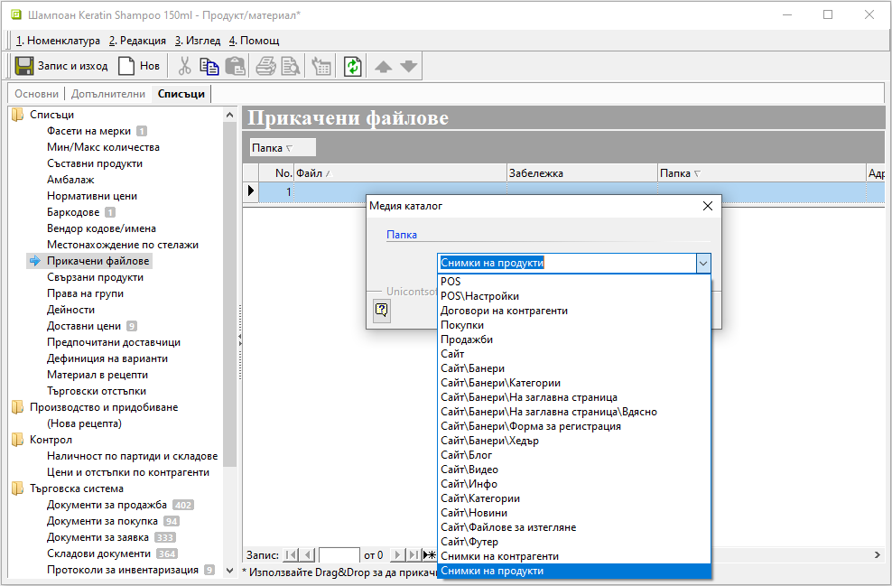
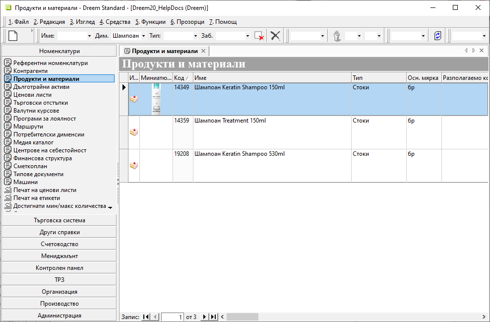
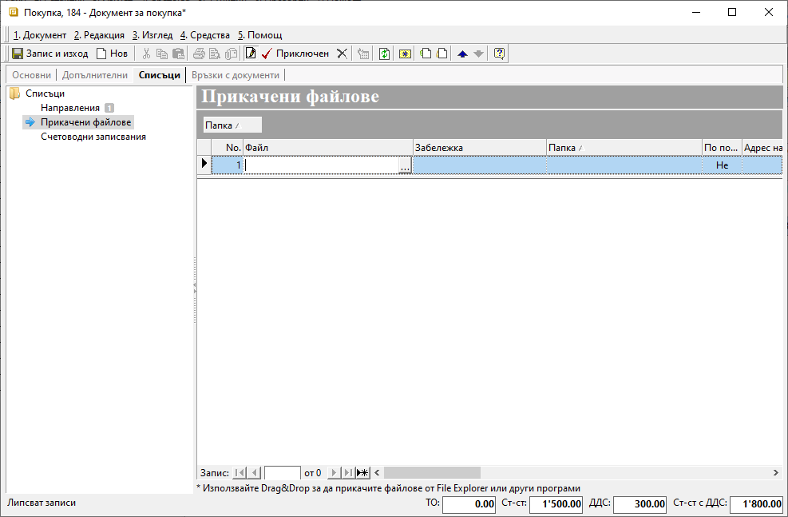

```{only} html
[Нагоре](000-index)
```

# **Прикачени файлове**  

- [Въведение](#въведение)    
- [Прикачване на файл за контрагент](#прикачване-на-файл-за-контрагент)  
- [Прикачване на файл към продукт](#прикачване-на-файл-към-продукт)  
- [Прикачване на файл в документ](#прикачване-на-файл-в-документ)  

## **Въведение**

Прикачените файлове са удобен начин за съхраняване и споделяне на информация. Системата дава възможност да прикачите един или няколко файла, както в някои от номенклатурите, така и в документи от **Търговска система**.  
Това предоставя на отделните потребители бърз достъп до важни детайли от един общ източник - улеснение за комуникацията и предотвратяването на грешки.  

> Условието потребителите да виждат прикачените файлове е да имат достъп до съответната локация. 

Различните файлове могат да бъдат систематизирани от **Номенклатури » Медия каталог**.  

{ class=align-center w=15cm }

За да се ориентирате бързо сред различните файлове, организирайте ги в подпапки, като използвате достатъчно ясни имена. Старайте се да избягвате безразборните списъци.  
Можете да създавате и редактирате папки чрез бутоните от лентата с инструменти или с десен бутон на мишката.   

> Процесът за прикачване на файл в системата съвпада с познатото добавяне на прикачен файл в имейл, чат приложение и т.н.  

Първо трябва да маркирате желаната папка от списъка вляво - указвате къде искате да се копира файлът. След това се навигирате до файла и чрез функцията за влачене и пускане с ляв бутон на мишката го добавяте.  

Ако този начин не е удобен, може да го направите чрез опцията **Нова медия** от контекстното меню. Тя е достъпна чрез десен бутон на мишката върху списъка от полето вдясно.  

{ class=align-center w=15cm }

На екран се отваря форма за редакция, в която попълвате задължителните реквизити *Име* и *Тип* на файла. От бутона в края на полето *Източник* може да посочите пътя до желания файл.  
Системата извежда съобщение за потвърждаване на избора.  

{ class=align-center w=15cm }

Промените трябва да бъдат записани. С това файлове стават достъпни за прикачване в **Контрагенти**, **Продукти и материали**, както и в някои документи.  

## **Прикачване на файл за контрагент**

Всяка информация, касаеща даден контрагент, може да бъде оформена в документ, таблица, изображение или друго и добавена към настройките му.  
Можете да добавяте множество на брой и различен тип файлове. За целта отваряте форма за редакция на избрания контрагент и се навигирате до раздел **Списъци » Прикачени файлове**.  

Ако файлът не е предварително въведен през **Медия каталог**, това може да стане и на момента чрез функцията за влачене и пускане (drag&drop).  
Ако файлът е бил въведен, в поле *Файл* на реда за нов запис посочвате пътя му до папката от **Медия каталог**.  

Ето как изглеждат вече прикачени файлове тип *Изображение* и тип *Документ*:  

{ class=align-center w=15cm }

На реда към всеки от файловете може да добавите и *Забележка*.  
Промените трябва да бъде записани.

```{tip}
Ако настроите по подразбиране прикачен файл тип *Изображение*, той ще се визуализира в колона *Миниатюри* от списъка с контрагенти.  
Същото изображение се показва и в раздел **Основни** на формата за редакция на контрагент.
```

{ class=align-center w=15cm }

В списък **Контрагенти** системата дава информация за общо прикачените файлове за всеки един контрагент. За целта трябва да изведете колона *Брой прикачени файлове*.  

{ class=align-center }

## **Прикачване на файл към продукт**

Често към продуктите е важно да бъде добавено изображение, галерия, видео с инструкции или други файлове с полезна информация. Тези файлове може да са предварително въведени през **Медия каталог** или да се прикачват на момента.  

Започнете с отваряне на форма за редакция на продукт.  
Навигирате се до **Списъци » Прикачени файлове**. В поле *Файл* може да отворите **Медия каталог** и да изберете файла, ако сте го въвели предварително.    

{ class=align-center w=15cm }

Ако добавяте файла в момента, използвайте drag&drop функцията. Системата автоматично ще отвори на екран падащ списък за избор на папка от **Медия каталог**, в която да копирате файла.  

{ class=align-center w=15cm }

За да бъдат запазени настройките, промените трябва да бъдат записани.  

```{tip}
Ако настроите по подразбиране прикачен файл тип *Изображение*, той ще се визуализира в колона *Миниатюри* от списъка с продукти.  
Същото изображение се показва и в панел **Основни** на формата за редакция на продукта.
```
{ class=align-center w=15cm }

## **Прикачване на файл в документ**

Файлове може да добавяте в документите за продажба, покупка, заявка, договори и складови документи. Опцията е достъпна от форма за редакция на документ в раздел **Списъци » Прикачени файлове**.  

- При документи в състояние *Редакция* файловете могат да се  добавят чрез drag&drop и чрез избор от **Медия каталог** в поле *Файл*.  

- При документи в състояние *Приключен* файловете могат да бъдат добавяни единствено чрез drag&drop функцията.  

{ class=align-center w=15cm }

