```{only} html
[Нагоре](000-index)
```


# **Разпределение на разходи за придобиване**

- [Въведение](#въведение)  
- [Методи за разпределение](#методи-за-разпределение)   
- [Стоки и разходи за придобиване в отделни документи](#стоки-и-разходи-за-придобиване-в-отделни-документи)  
- [Стоки и разходи за придобиване в общ документ](#стоки-и-разходи-за-придобиване-в-общ-документ)    
- [Справки](#справки)  
- [Счетоводни настройки и документи](#счетоводни-данни)  

## **Въведение**

Получените от доставчик стоково-материални запаси се регистрират в системата с [въвеждането на документи за покупка](../002-docs/002-trade-system/001-orders-sales-purchase-documents/002-create-purchase-documents.md). Към тях се генерират складови документи и с това продуктите се заприходяват по покупна цена (без ДДС). Към разходите по закупуване трябва да се включват също вносни мита и такси, невъзстановими данъци и акцизи, разходи по доставка, товаро-разтоварни операции, монтаж и др.  

> Всички тези разходи, свързани със закупуване, преработка и доставка, ще формират доставната стойност на стоково-материалните запаси.  

Системата разполага със средство за [автоматично разпределяне на разходите по покупки](../002-docs/002-trade-system/001-orders-sales-purchase-documents/009-purchases-transport-expenses.md). Като резултат в справките ще разполагате с реалната себестойност на продукти и материали.  

```{tip}
Препоръчително е за различните разходи, които ще разпределяте, да въведете отделни продукти при продажба, при придобиване и като общи разходи. Всички те трябва да бъдат от тип на продукта, настроен като услуга. Спрямо типа се добавят и настройките за автоматично осчетоводяване.  
```
Пример:  
За транспортните разходи може да създадете следните три продукта: *Транспорт (по придобиване)*, *Транспорт (при продажба)* и *Транспорт (общи разходи)*.  

## **Методи за разпределение**

Системата позволява избор от няколко различни метода за разпределение в отделните документи. При всеки от тях инструментът за разпределение използва различна база при автоматичните изчисления. Чрез тях имате възможност да променяте метода спрямо вида на разхода и/или типа на стоките.  

- **Ръчно**  - При него системата "отключва" колона *Сума за разпределяне* и имате пълната свобода да разделите общата сума на разхода по продукти.

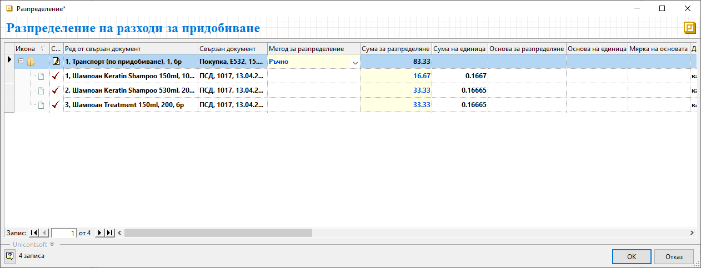{ class=align-center w=15cm }

- **Количество по основна мярка** - При този метод системата автоматично разпределя общата сума на разхода спрямо количествата в основна мерна единица.  

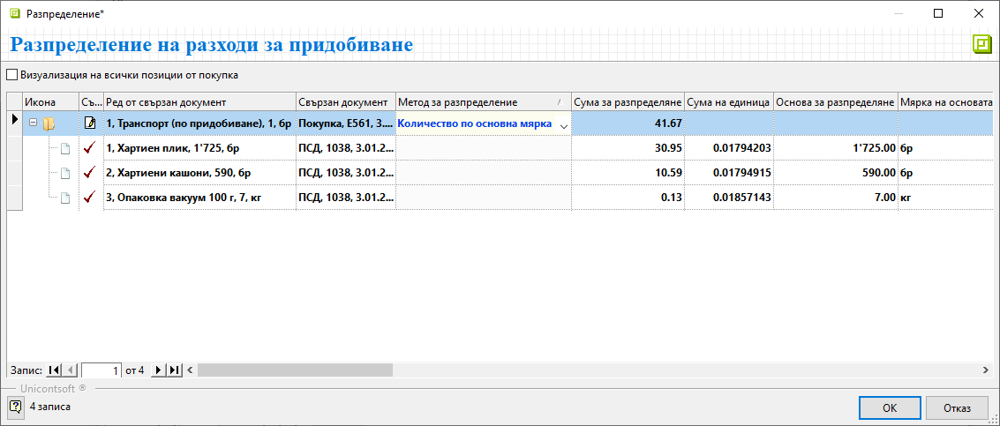{ class=align-center w=15cm }

- **Количество по допълнителна мярка** - За да използвате този метод, трябва предварително да настроите допълнителни мерки на продуктите.  
В примера за всички продукти има добавена допълнителна мярка *Кашон*, съдържащ 10 броя шампоан. Ето как би изглеждало примерното разпределение на разходите:

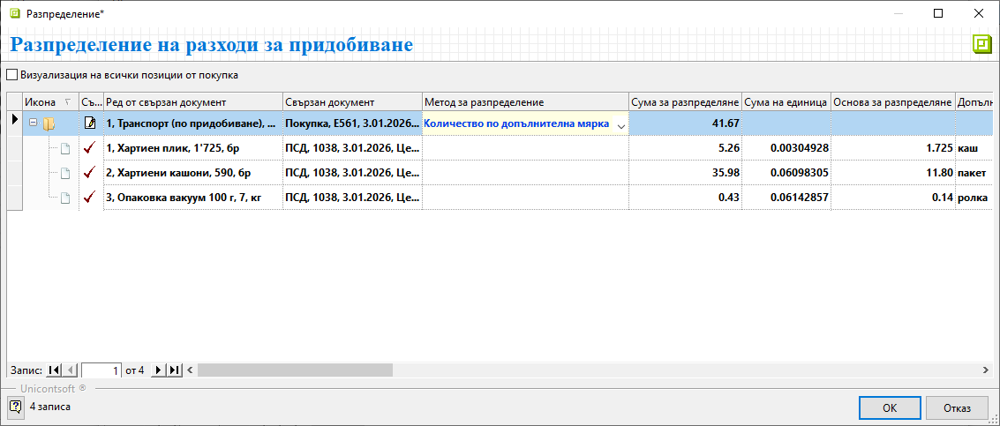{ class=align-center w=15cm }

- **Нето тегло** - При този метод също е нужна предварителна настройка в панел *Допълнителни* във форма за редакция на продукта.  
При разпределението на транспорта системата дава информация с тези настройки в колона *Основа за разпределение на единица* и *Мярка на основата*.

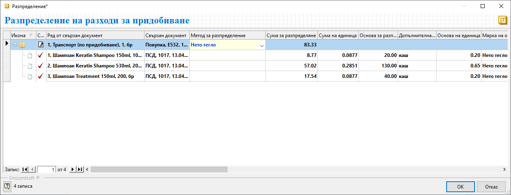{ class=align-center w=15cm }

- **Нето обем** - Методът отново изисква предварителна настройка с нето обем за всеки продукт. Разпределението на разхода ще се извърши на база настроените обеми. Системата визуализира тези настройки в колони *Основа за разпределение на единица* и *Мярка на основата*.

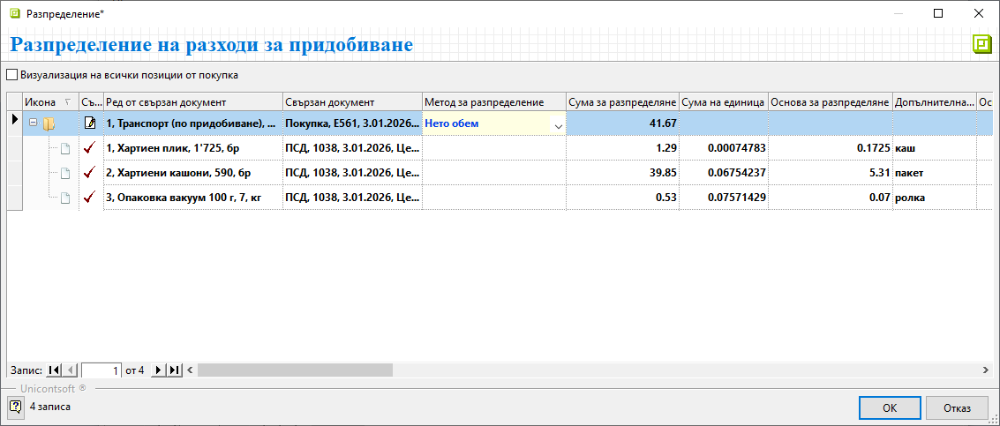{ class=align-center w=15cm }

- **Отчетна цена** - С този метод системата автоматично разпределя общата сума на разхода спрямо единичната цена на продуктите.

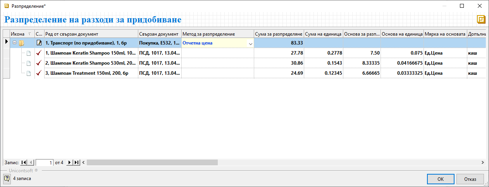{ class=align-center w=15cm }

- **Отчетна стойност** - С този метод системата разпределя общата сума на разхода спрямо стойността на продуктите.  

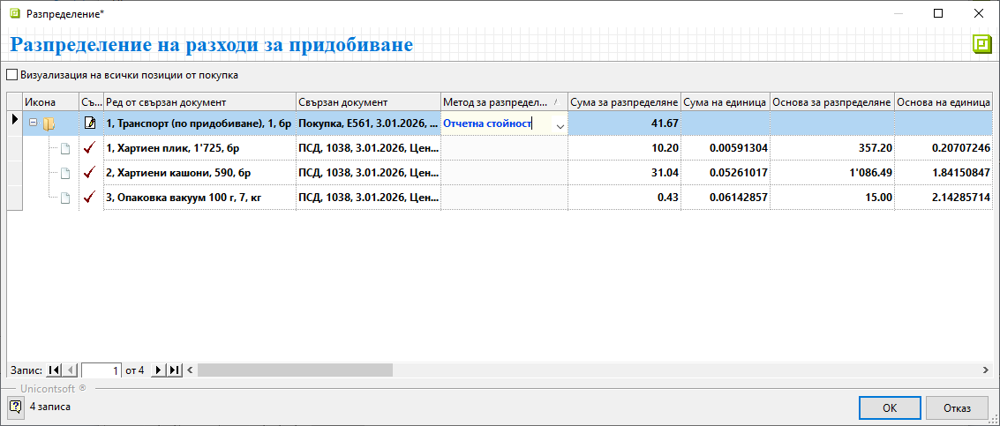{ class=align-center w=15cm }

## **Стоки и разходи за придобиване в отделни документи**

В повечето случаи разходите за придобиване и доставката на стоки идват с отделни документи или от различни контрагенти.  
Може да вземем за пример транспортните разходи. При разпределянето им, когато доставката е извършена от фирма, различна от доставчика на стоките, в системата първо се въвеждат документите за покупка на стоки - **Покупка**-*Документ за покупка* и **ПСД**-*Приходен складов документ*.  

С отделен вътрешнофирмен документ **Покупка** се регистрира разходът за транспортни услуги. В случая трябва да се използва продукт *Транспорт (по придобиване)*.  
От меню **Средства » Разпределение на разходи за придобиване** се отваря формата за избор на свързани документи, с което стартирате разпределението.  

> Опцията *Разпределение на разходи за придобиване* е активна единствено, когато документът е в състояние на редакция.  

Чрез десен бутон на мишката върху реда с разходите стартирате *Добавяне на редове от ПСД*. С това отваряте форма за избор от списъците със складови документи и покупки. Вие решавате с кой от двата списъка ще работите.  

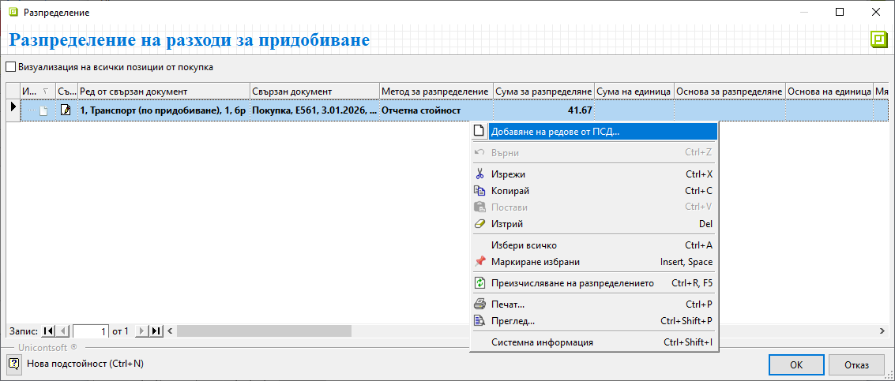{ class=align-center w=15cm }

Ако изберете списък *Складови документи*, трябва да посочите **ПСД** с доставката на стоките, върху които ще разпределяте транспортните разходи.  
Избирайки *Документи за покупка*, ще посочите вътрешнофирмения документ **Покупка**.  

>Да намерите бързо и лесно точния документ зависи от зададените за списъка филтри.  
Може да маркирате едновременно няколко документа, когато разходът за разпределяне е общ за тях.  

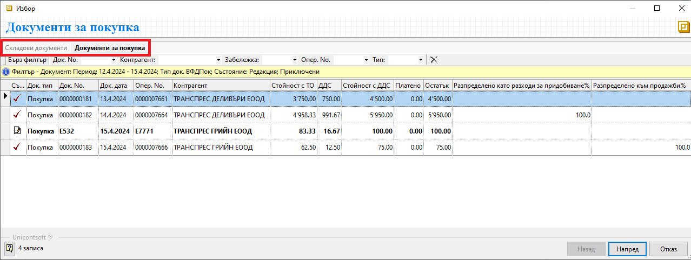{ class=align-center w=15cm }

На следващата стъпка маркирате продуктите, върху които ще разпределите транспортните разходи. Системата добавя всеки един от тях на отделен ред. Поле **Метод за разпределение** е обзаведено по подразбиране. От падащия списък имате възможност да изберете различен метод.    

```{tip}
Общата сума на разходите за разпределяне е винаги без ДДС. 
```

След като потвърдите избора, системата ще преразпредели разхода. Промяната в цените се прилага в складовите документи.   

## **Стоки и разходи за придобиване в общ документ**

Има случаи, в които доставчикът включва допълнителни услуги във фактурата със стоки (напр. транспортни разходи).  
В тази ситуация процесът по разпределяне на разхода има една особеност.  

> Документът за покупка трябва да е бил приключен със свързан **ПСД** към него. След това покупката се връща в състояние на редакция.  

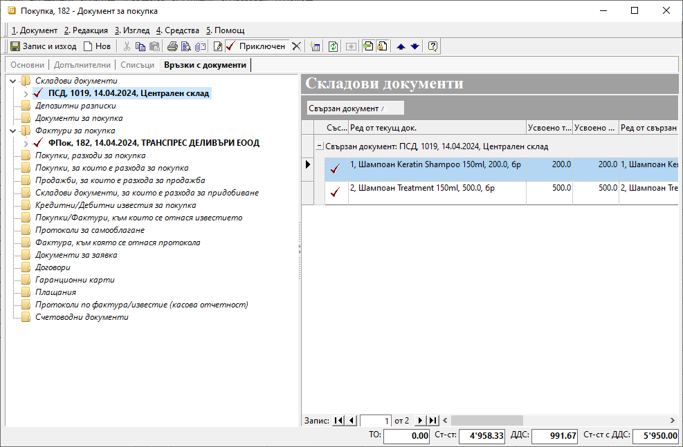{ class=align-center w=15cm }

От формата за редакция на покупката избирате **Средства » Разпределение на разходи за придобиване** и следвате стъпките.

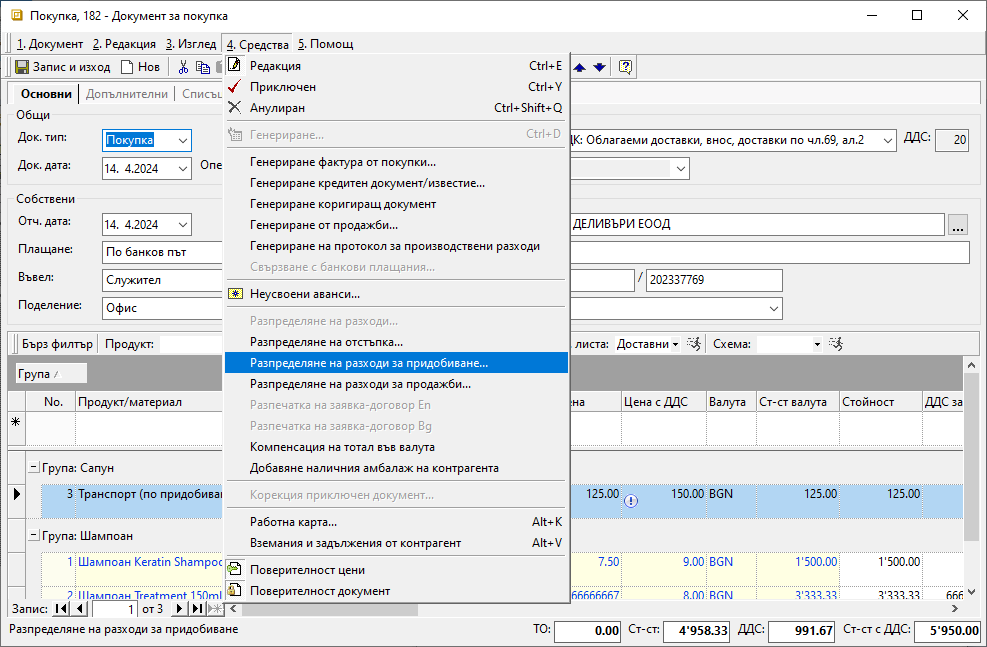{ class=align-center w=15cm }

На стъпката за избор на документа със стока маркирате или текущата покупка, или генерирания към нея ПСД.  

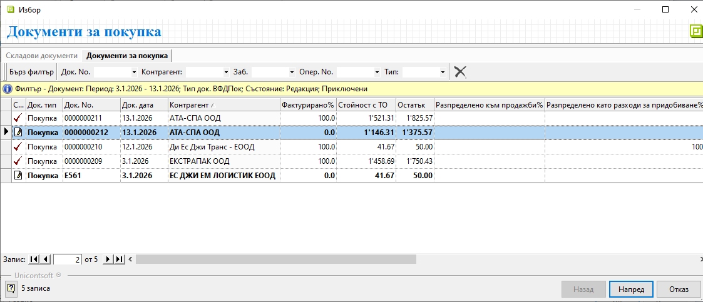{ class=align-center w=15cm }

Продължавате напред с избор на метод за разпределението на разхода. Завършвате процеса с потвърждаване на промените и приключване на покупката.  

## **Справки**

В системата имате възможност да проверите за разпределени разходи по придобиване по няколко начина и в различни справки.  

За сте сигурни, че желаните покупки са разпределени като разходи по придобиване, може да следите колона **Разпределено като разходи за придобиване %**. Тя се намира в списък **Документи за покупка**. Ако не е видима, се извежда чрез [*Изглед на списък*](../../../start/004-column-operations.md#меню-на-колона).

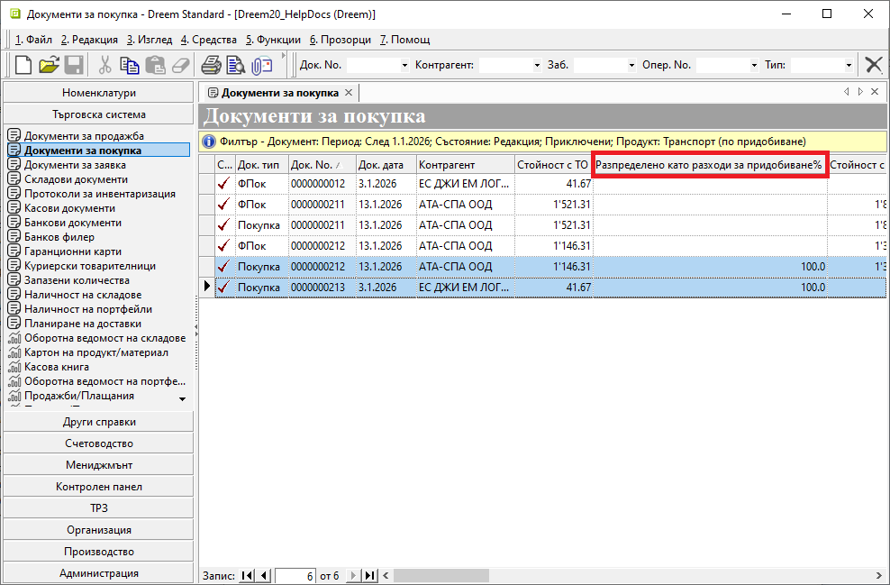{ class=align-center w=15cm }

Информация за разпределени разходи може да видите и в раздел **Свързани документи** на документа с разхода:

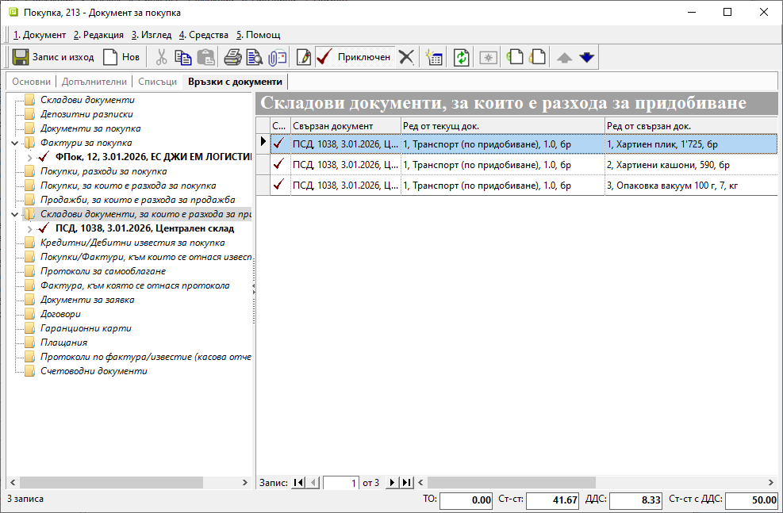{ class=align-center w=15cm }

## **Счетоводни данни**

Най-подходящият начин разпределянето на разходи по придобиване да се отрази счетоводно е чрез използване на транзитна сметка от гр. 30. Обикновено това е с/ка 301.  
Уверете се, че в [**Номенклатури » Сметкоплан**](../001-ref/002-accounting/002-chart-of-acc.md) за тази сметка има поставена отметка в колона *Признак задължителен*. Същото важи и за сметка 304.
Така в генерираните счетоводни записи системата ще цитира отделните продукти. 

> Въведените през списък *Продукти и материали* номенклатури се визуализират в **Счетоводство** като списък *Признаци*.

Следващите задължителни настройки са в [**Счетоводство » Автоматичен осчетоводител**](../001-ref/002-accounting/003-acc-wizard.md).  

За група **Документи за покупка** трябва да направите настройки в *Кореспонденции*. Както ще видите на примерното изображение, създават се отделни редове за всички типове продукти, които ще се осчетоводяват през транзитната сметка.  
Като резултат, в счетоводните документи към фактурите за покупка стоките и допълнителните разходи се отнасят по с/ка 301.

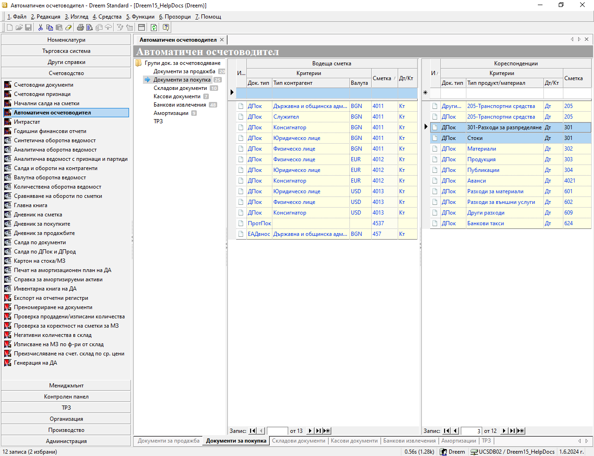{ class=align-center w=15cm }

Необходими са настройки и за група **Складови документи**. Целта тук е в счетоводния документ към ПСД стоките да се прехвърлят по основната с/ка 304.  
Настройте за *Водеща сметка* в документ тип *ПСД* осчетоводяването на транзитната с/ка 301 да е в кредит. В *Кореспонденции* направете настройка за осчетоводяване на приходните документи по дебита на с/ка 304.
Разгледайте маркираните редове на изображението по-долу:

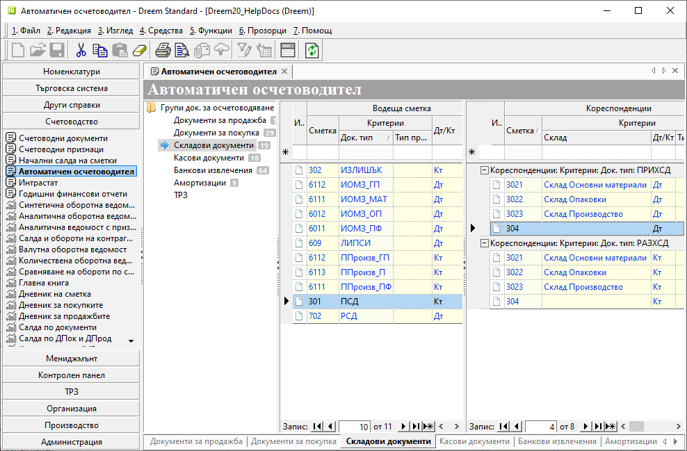{ class=align-center w=15cm }

В счетоводните документи, след като сте изпълнили задължителните условия, ще имате подобни записвания:

- В документа за доставка на стоки счетоводната статия е една. Единствената особеност тук е, че стоките са заприходени чрез избраната за транзитна с/ка 301. 

**ФПок (доставка на стоки)**
```{admonition} Статия
|Д<sup>т</sup> Сметка|К<sup>т</sup> Сметка|Признак|Сума|
|-------------|------------|----------------------|---------|
|301          |            |Хартиен плик          |357.20   |
|301          |            |Хартиени кашони       |1086.49  |
|301          |            |Опаковка вакуум 100 г |15.00    |
|4531         |            |                      |291.74   |  
|             |4011        |                      |1750.43  |
```

- При осчетоводяването на фактурата за транспорт, като разход за разпределение, отново участва транзитната сметка.  
Сумата от нея - 41.67 евро, ще бъде разпределена към доставната стойност на продуктите.

**ФПок (разходи за разпределение)**
```{admonition} Статия
|Д<sup>т</sup> Сметка|К<sup>т</sup> Сметка|Признак|Сума|
|-------------|------------|----------|-------|
|301          |            |Транспорт |41.67  |
|4531         |            |          |8.33   |  
|             |4011        |          |50.00  |
```

- Същинското разпределение на разходи става в *ПСД*. В този счетоводен документ за всеки продукт се генерира отделна статия.  
В следващия пример виждате как доставната цена и разпределените разходи от с/ка 301 формират новата себестойност на продукта в с/ка 304. 

 **ПСД (доставка на стоки)**
```{admonition} Статия 1
|Д<sup>т</sup> Сметка|К<sup>т</sup> Сметка|Признак|Сума|
|-------------|------------|---------------|--------|
|304          |            |Хартиен плик   |377.60  |
|             |301         |Хартиен плик   |367.40  |  
|             |301         |Транспорт      |10.20   |
```

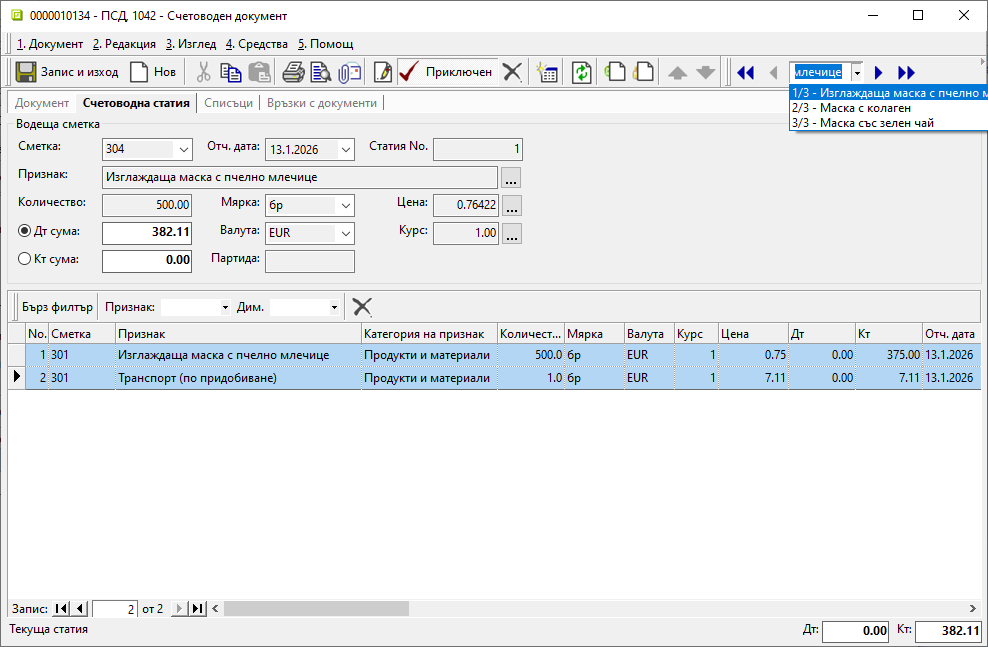{ class=align-center w=15cm }

> За да разпределим разходи по придобиване, трябва покупката на стоките да е валидирана с приключен приходен складов документ към нея.  
> Документът за покупка, съдържащ разходите за разпределяне, трябва да е в състояние на редакция.  
> Върху един *Документ за покупка* може да разпределим един или няколко разхода.  
> Може да разпределим един разход както върху една, така и върху няколко *Документа за покупка*.  
> Може също да разпределим разход, когато с покупката на стоки са получени в общ документ.  