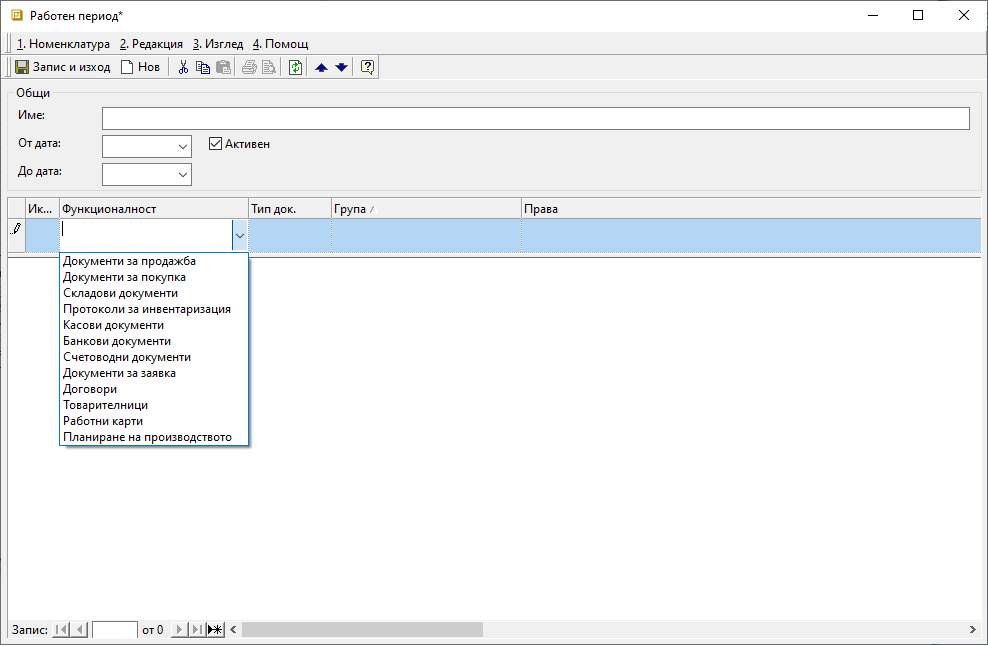
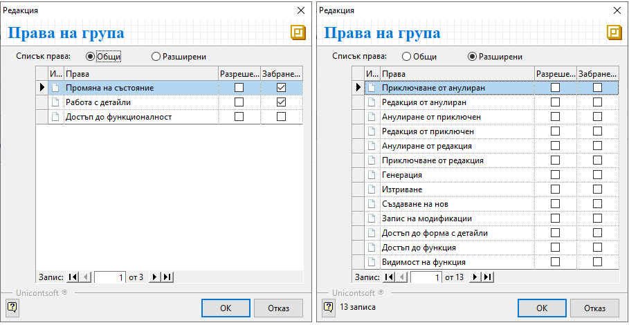
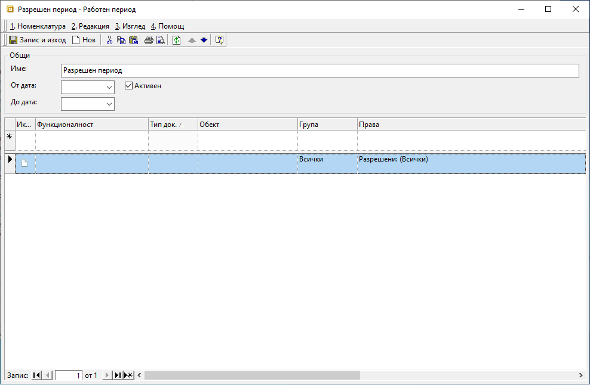
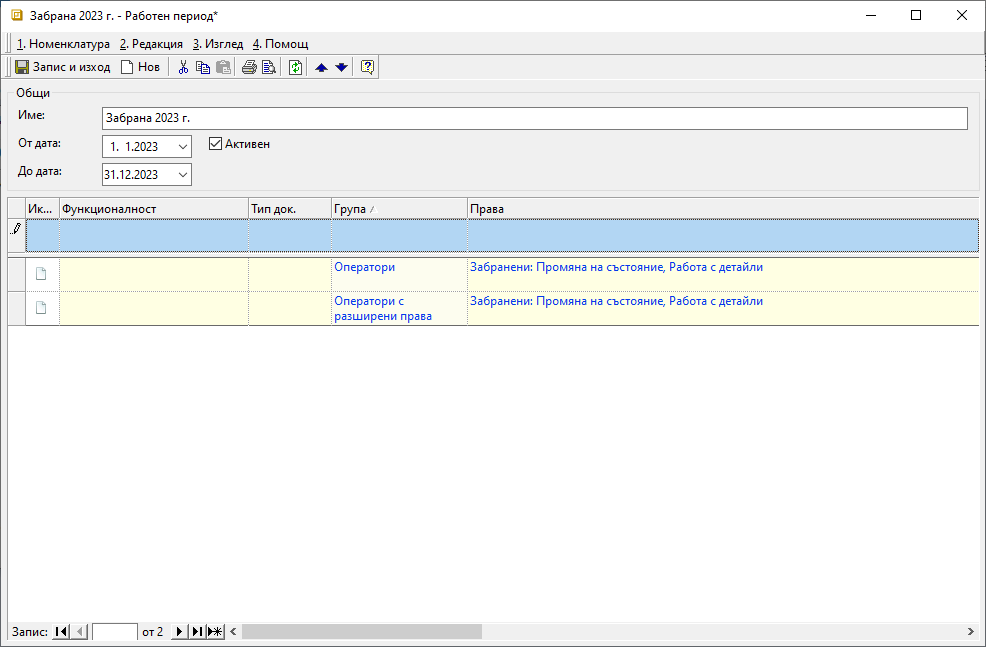
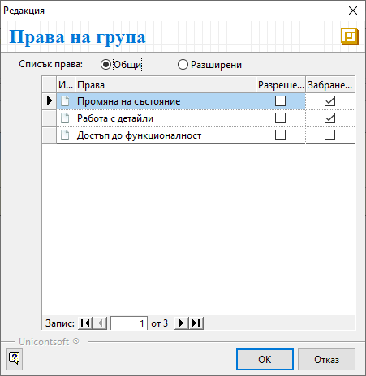
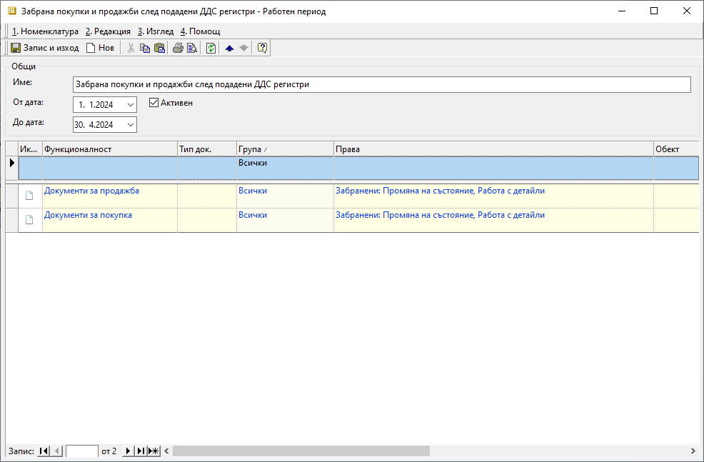
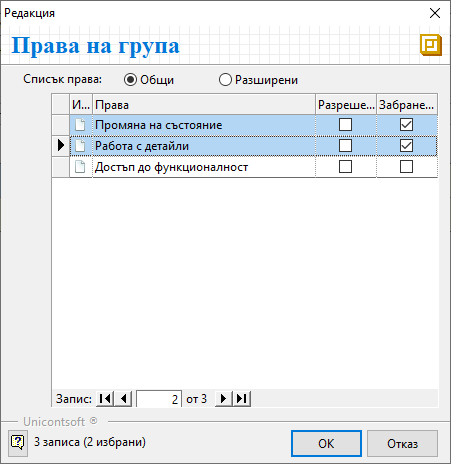

```{only} html
[Нагоре](000-index)
```

# **Работа с Работни периоди**  

- [Въведение](#въведение)  
- [Разрешителен работен период](#разрешителен-работен-период)  
- [Настройка на забранителен период след годишно счетоводно приключване](#настройка-на-забранителен-период-след-годишно-счетоводно-приключване)    
- [Настройка на забранителен период след подадени месечни отчети по ЗДДС](#настройка-на-забранителен-период-след-подадени-месечни-отчети-по-зддс)  

## **Въведение**

Има ситуации, когато създаването или редактирането на документи в минал/бъдещ период би довело до съществени грешки. В тези случаи е от полза избрани действия да бъдат ограничавани за документи, попадащи в определени времеви интервали.
С функционалност [**Работни периоди**](../001-ref/004-settings/003-working-periods.md), която ще откриете в **Администрация**, системата предоставя именно такава възможност.    

> Работните периоди предоставят опции за настройка, с която документите от избрани периоди могат да останат видими, но недостъпни за определени действия.  

Процесът при всички случаи е еднакъв и започва със задължителното създаване на разрешителен работен период. Ако е необходимо, допълнително се създават работни периоди със забранителни настройки.  

Нова настройка **Работен период** се създава с бутон *Нов* - от лентата с инструменти или с десен бутон на мишката.  
Във формата за редакция разполагате с всички необходими реквизити за детайлна настройка:

- **Име** - Когато попълвате наименование, е удобно да посочите и дали работният период е разрешаващ или забраняващ. Името може да бъде редактирано по всяко време.   
- **От дата** и **До дата** - С тях, разбира се, контролирате продължителността на работния период.  
- **Активен** - Както навсякъде в системата, поставената отметка потвърждава, че настройката е в сила. С махане на отметката ще деактивирате работния период.   

{ class=align-center w=15cm }

- **Функционалност** - В тази колона може да посочите функционалност на системата, за която ще се отнасят настройките от реда. Ако настройките касаят всички функционалности, оставете полето празно. В противен случай всяка от тях се настройва на отделен ред.  
- **Тип док.** - Системата позволява тук да правите по-детайлни настройки по тип на документа. Използвайте тази колона, когато настройките не се отнасят за цяла функционалност, а само за избрани типове документи от нея.  
- **Група** - Ако настройките на реда ще се отнасят еднакво за всяка група потребители, в полето изберете *Всички*. Когато конфигурацията на ограниченията е различна за отделните групи, се изисква всяка от тях да бъде на отделен ред.  Групите и разпределянето на потребителите в тях се настройват предварително от [**Администрация || Потребители и групи**](../001-ref/004-settings/001-users.md).  
- **Права** - В полето от тази колона отваряте форма за редакция *Права на групи*. Имате два изгледа на опциите, участващите в списъка - *Общи* и *Разширени*. 
Именно тук, маркирайки с *Разрешени* или *Забранени**, конфигурирате ограниченията.
За прецизна настройка на действията, които ще се разрешават/забраняват, използвайте изглед *Разширени*.  
Ако настройвате разрешаващ работен период, в *Разрешени* отбележете само позволените опции. И обратното - при забраняващ работен период е достатъчно да поставите отметки единствено в *Забранени*. 

{ class=align-center w=15cm }

<ins>Забранителните настройки имат по-голяма тежест от разрешителните и определят параметрите на ограниченията.</ins>  

Това е основно правило при конфигурирането на работните периоди. Ще покажем как на тази база лесно да организирате настройките с един разрешителен и няколко забранителни периоди.  

В темата ще разгледаме два от най-честите примери, когато са удачни забранителни настройки - след годишно счетоводно приключване и след подадени месечни отчети по ЗДДС.   

## **Разрешителен работен период** 

Още при стартиране на работа със системата задължително е настроен разрешителен работен период. Най-удачно е той да бъде настроен общо за всички групи потребители като безсрочен.   
При това положение на реда за нов запис ще са обзаведени единствено колона **Групи** с *Всички* и колона **Права** - *Разрешени: (Всички)*.  
За да е безсрочен разрешителният период, полета **От дата** и **До дата** остават празни.  

{ class=align-center w=15cm }

```{tip}
Ако по някаква причина решите да посочите начална дата, създаване/редакция на документ с предходна дата няма да е позволено.  
Аналогично, при настроена крайна дата, създаване/редакция на документи с последваща дата не е възможно.   
```

## **Настройка на забранителен период след годишно счетоводно приключване** 

След счетоводното приключване на отчетен период и подадени ГФО, ГДД, статистически форми към НСИ, е най-добре да се "заключи" цялата отминала година.  
Достъпът до документите може да остане разрешен. Забраняват се, обаче, всяка промяна на състоянието им, създаване на нов, генерация, редакции или изтриване.

В следващия пример ще покажем как може да "заключите" всички типове документи за период, обхващащ цялата отминала година.  
Въведените забрани ще се отнасят само за две от предварително настроените в системата групи.  

Създайте нов работен период и изберете подходящо име, така че след това лесно да се ориентирате в списъка с всички работни периоди.  

{ class=align-center w=15cm }
 
В полетата **От дата** и **До дата** въведете съответно началната (1. януари) и крайната дата (31. декември).  
Тъй като настройките ще се отнасят за всички документи, на реда за нов запис оставете празни полетата в колони **Функционалност** и **Тип док.**.  
Продължете с колона **Група**, където посочвате първата група потребители, за която ще има ограничения. А конкретните права на групи трябва да настроите във формата за избор от колона **Права**. Списъкът с права има два изгледа - *Общи* и *Разширени* настройки.  

{ class=align-center }

За целите на текущия пример раздел *Общи* е по-удобен. Достатъчно е да маркирате първите две опции - *Промяна на състояние* и *Работа с детайли*, след което потвърдете настройките.  
Продължете по същия начин, добавяйки отделен ред за всяка следваща група потребители.  
Групите, които не участват в работен период *Забрана 2023 г.*, ще продължат да имат настроените в разрешителния работен период права.

```{tip}
Ако решите да направите забранителни настройки, валидни за всички потребители, създайте само един ред с колона **Група: Всички**. Конкретните ограничения отново настройте в колона **Права**.  
Завършвайте настройките винаги със *Запис* на направените промени.   
```

## **Настройка на забранителен период след подадени месечни отчети по ЗДДС**

При фирмите, ежемесечно подаващи справка-декларация и отчетни регистри от ЗДДС, е желателно да се "заключат" някои документи от отминалите месеци в текущата година.  
Това са документите за покупка и продажба, данни от които се декларират в НАП. И тъй като всякакво разминаване в информацията е нежелателно, системата предлага инструмент да го избегнете напълно.  
За целта може да създадете **Работен период**, обхващащ всички отминали месеци от януари т.г. до последния месец с подаден ДДС. Идеята е да използвате този един запис, който ще редактирате всеки месец, променяйки крайната дата на периода.  

Вече сте запознати с принципите и стъпките при създаване на настройка **Работен период**. Тук ще дадем идея с примерна настройка, която да създадете в подобен порядък.  
На новодобавения работен период ще дадем наименование **Забрана покупки и продажби след подадени ДДС регистри**. Използвайте такова име за периода, което да отговаря най-добре на Вашите нужди.  
За начална дата изберете 01. януари, като тази дата след това не се променя. Крайната дата на периода, обаче, трябва да актуализирате всеки месец. Така, ако сте подали ДДС регистрите за месец април, в **До дата** посочвате последния ден от 04. месец. Веднага щом подадете данните за 05. месец, редактирайте **До дата** с 31. май и т.н.  

{ class=align-center w=15cm }

Тези настройки имат смисъл, ако за всички потребители се "заключат" всички типове документи за покупка и продажба.  
Такава настройка се постига, когато на реда за нов запис във **Функционалност** посочите *Документи за продажба*. Не трябва да цитирате отделните видове в колона **Док. тип** - тя остава празна.  
Остава да посочите за кои потребители ще важи забраната. Когато тя ще се отнася еднакво за всички, в колона **Група** изберете *Всички*.  
Избраните ограничения за промяна на състояние и работа с детайли в продажби посочвате в колоната **Права**. Във формата за редакция, която ще отворите от полето, маркирайте съответните опции със *Забранени*.  

{ class=align-center }

Така направените настройки за продажбите трябва да повторите и за покупки. Това означава да добавите отделен ред с **Функционалност** - *Документи за покупка*. Останалите настройки на реда са аналогични с тези при продажби.


---  
- Задължително е да има настроен разрешаващ работен период, докато забранителните са пожелателни.   
- Документите, попадащи в забранителните работни периоди, могат да остават видими, но недостъпни за корекции.  
- Забранителните настройки имат по-голяма тежест от разрешителните.  
- **Работни периоди** могат да се настройват както общо за всички потребители, така и за предварително определени групи.  
- Всеки един работен период може да бъде деактивиран и активиран повторно по всяко време.
