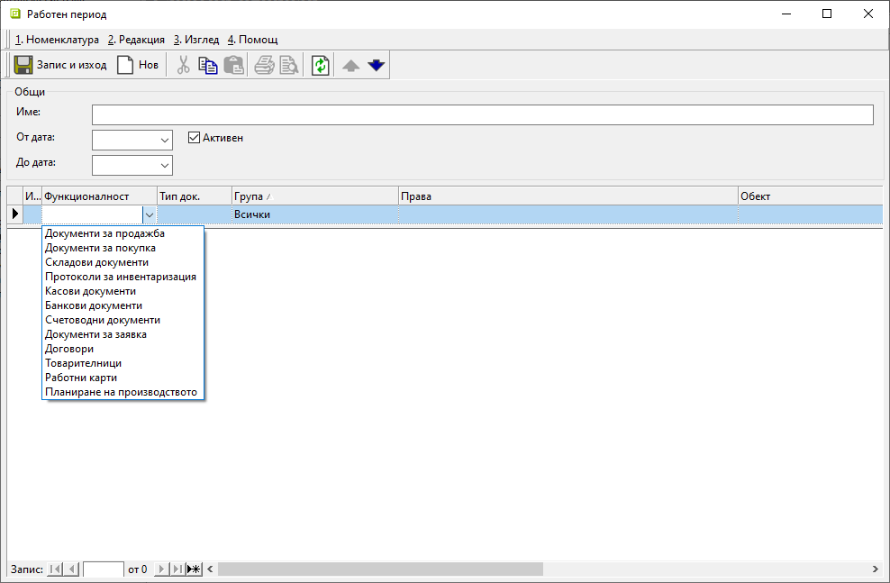
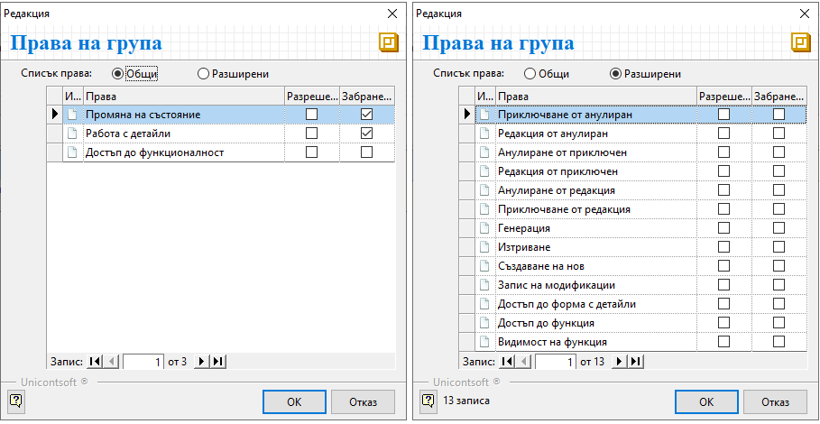
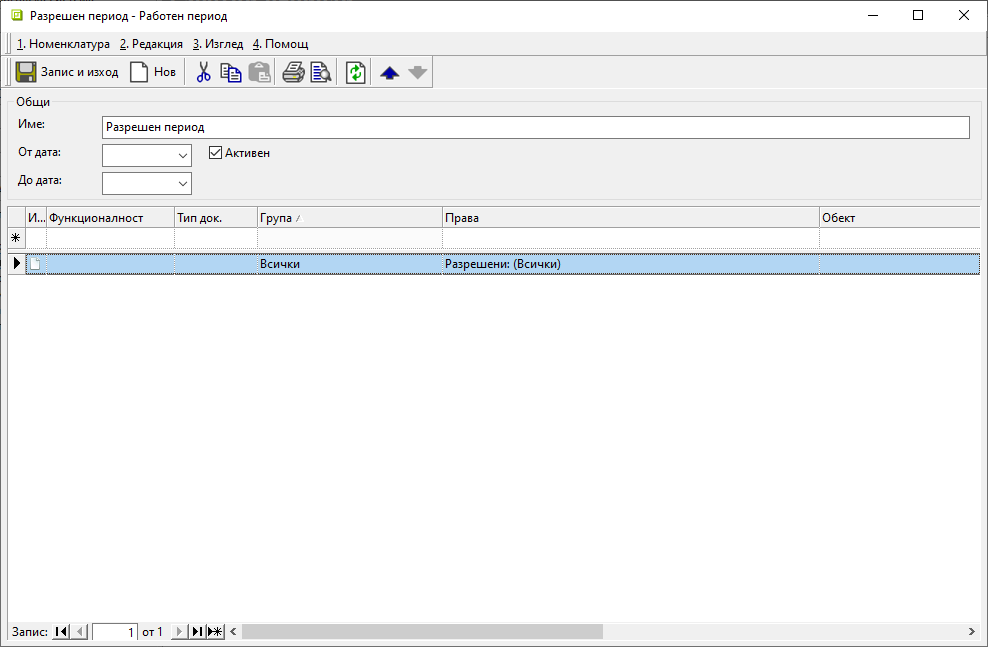
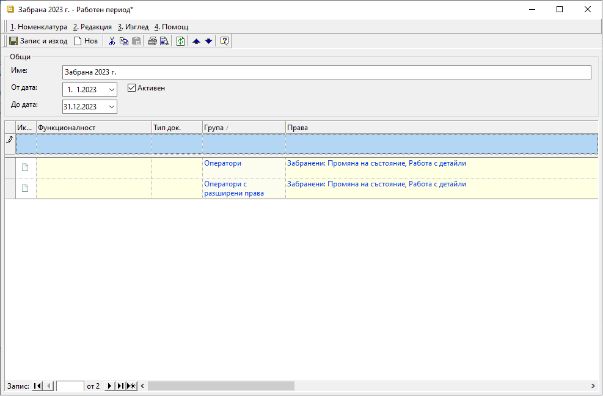
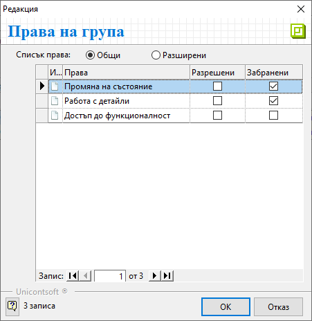
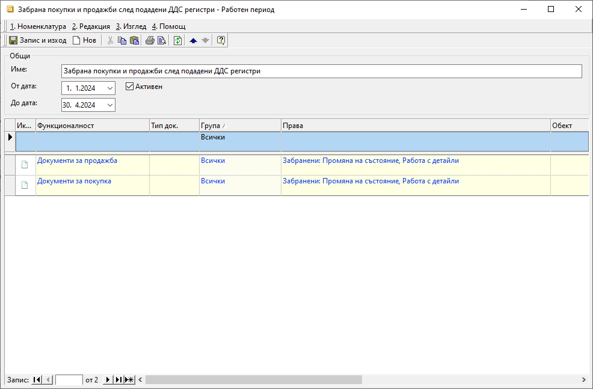

```{only} html
[Нагоре](000-index)
```

# **Работа с работни периоди**  

- [Въведение](#въведение)  
- [Разрешителен работен период](#разрешителен-работен-период)  
- [Настройка на забранителен период след годишно счетоводно приключване](#забранителен-период-след-годишно-счетоводно-приключване)    
- [Настройка на забранителен период след подадени месечни отчети по ЗДДС](#забранителен-период-след-подадени-месечни-отчети-по-зддс)  

## **Въведение**

Има ситуации, когато създаването или редактирането на документи в минал/бъдещ период би довело до съществени грешки. В тези случаи е от полза избрани действия да бъдат ограничавани за документи от определени времеви интервали.
Функционалност **Работни периоди** предоставя именно такава възможност.    

> Настройката позволява документите от избрани периоди да останат видими, но недостъпни за определени действия.  

Задължителна част от настройката на **Работни периоди** е въвеждането на разрешителен период. Допълнително се създават работните периоди със забранителни настройки.  
Когато за даден период има едновременно разрешителни и забранителни настройки, за системата забраните са с по-голяма тежест. На тази база може лесно да организирате настройките с един разрешителен и няколко забранителни периоди.  
В темата ще разгледаме примери със ситуации, когато са удачни забранителни настройки: след годишно счетоводно приключване и след подадени месечни отчети по ЗДДС.   

При [създаването на работен период](../001-ref/004-settings/003-working-periods.md#нов-работен-период) може да определите детайлите:

- **Име** - Като част от наименованието е удобно да посочите дали работният период е разрешаващ или забраняващ. Името може да бъде редактирано по всяко време.   
- **От дата** и **До дата** - Чрез попълването на тези реквизити контролирате продължителността на работния период.  
- **Активен** - Както навсякъде в системата, поставената отметка потвърждава, че настройката е в сила. С махане на отметката деактивирате работния период.   

{ class=align-center w=15cm }

От реда за добавяне на нов запис може да дефинирате следните:  

- **Функционалност** - Полето позволява да посочите функционалност на системата, за която ще се отнасят настройките от реда. Ако настройките касаят всички функционалности, оставете полето празно. В противен случай всяка от тях се настройва с отделен ред.  
- **Тип док.** - Чрез полето може да направите по-детайлни настройки по типове документи. Използвайте, когато настройките не се отнасят за цяла функционалност, а само за избрани типове документи от нея.  
- **Група** - Ако настройките на реда ще се отнасят еднакво за всяка група потребители, в полето изберете *Всички*. Когато конфигурацията на ограниченията е различна за отделните групи, се изисква всяка от тях да бъде на отделен ред.  
Групите и разпределянето на потребителите в тях се настройват предварително от [**Администрация » Потребители и групи**](../001-ref/004-settings/001-users.md).  
- **Права** - От полето отваряте форма за редакция *Права на групи*. Има два изгледа на опциите, участващи в списъка - *Общи* и *Разширени*. Именно тук конфигурирате ограниченията.
За прецизна настройка на действията, които ще се разрешават/забраняват, използвайте изглед *Разширени*.  
Ако настройвате разрешаващ работен период, в *Разрешени* отбележете само позволените опции. И обратното - при забраняващ работен период е достатъчно да поставите отметки единствено в *Забранени*. 

{ class=align-center w=15cm }

> <ins>Забранителните права имат по-голяма тежест от разрешителните и определят параметрите на ограниченията.</ins>  

## **Разрешителен работен период** 

Още при стартиране на работа със системата задължително е създаден разрешителен период.  
Най-удачно е настройката да бъде безсрочна и обща за всички групи потребители. При това положение на реда за нов запис ще са обзаведени единствено колона **Групи** с *Всички* и колона **Права** - *Разрешени: (Всички)*. Полета **От дата** и **До дата** остават празни.  

{ class=align-center w=15cm }

```{tip}
Ако по някаква причина решите да посочите начална дата, няма да е позволено създаването/редакцията на документ с предходна дата.  
Аналогично е при настроена крайна дата - създаване/редакция на документи с последваща дата не е възможно.   
```

## **Забранителен период след годишно счетоводно приключване** 

След счетоводното приключване на отчетен период (подадени ГФО, ГДД, статистически форми към НСИ) е най-добре да се "заключи" цялата отминала година. Достъпът до документите може да остане разрешен. Същевременно може да бъде забранена всяка промяна на състоянието им, създаване на нов, генерация, редакция или изтриване.  

Пример:  
Ще разгледаме как може да "заключите" всички типове документи за период, обхващащ цялата отминала година. Въведените забрани ще се отнасят за две от настроените в системата групи потребители.  

Създайте нов работен период. Изберете подходящо име, чрез което лесно да се ориентирате в списъка с работни периоди.  
В полетата **От дата** и **До дата** въведете съответно началната (1. януари) и крайната дата (31. декември).  

{ class=align-center w=15cm }

Тъй като настройките ще се отнасят за всички документи, на реда за нов запис оставете празни полета **Тип док.** и **Функционалност**. Продължете с поле **Група**, като посочите първата група потребители с ограничения.  

От поле **Права** може да определите ефективните права за избраната група потребители. В него се отваря формата **Права на група** с два изгледа - *Общи*  и *Разширени*.  
За целите на текущия пример изглед *Общи* е по-удобен. Достатъчно е да маркирате първите две опции - *Промяна на състояние* и *Работа с детайли*, след което да потвърдите избора.  

{ class=align-center }

Продължете по същия начин и добавете отделен ред за всяка следваща група потребители. Промените влизат в сила, след като бъдат записани.   

> За групите, които не участват в работен период *Забрана 2025 г.*, ще важат настроените права от разрешителния период.  

```{tip}
Ако решите да направите забранителни настройки, валидни за всички потребители, създайте само един ред с **Група: Всички**. Конкретните ограничения отново настройте в полето **Права**.  
```

## **Забранителен период след подадени месечни отчети по ЗДДС**

При фирмите, ежемесечно подаващи справка-декларация и отчетни регистри от ЗДДС, е желателно да се "заключат" някои документи в отминали месеци. Това са документите за покупка и продажба, данните от които се декларират в НАП.  
Всякакво разминаване в информацията е нежелателно. С помощта на **Работни периоди** може да го избегнете напълно.  

За целта може да създадете работен период, който да редактирате всеки месец, променяйки крайната му дата. Периодът ще обхваща всички отминали месеци от януари т.г. до последния месец с подаден ДДС. Използвайте такова име за периода, което да отговаря най-добре на Вашите нужди.   

Пример:  
За работния период може да изберете наименование като **Забрана покупки и продажби след подадени ДДС регистри**. В начална дата изберете 1 януари. Тази дата не се променя. Крайната дата на периода трябва да актуализирате всеки месец. Например, ако сте подали ДДС регистри за месец април, в **До дата** посочвате последния ден от месеца - 30 април. Веднага щом подадете данните за следващия месец, редактирайте крайната дата с 31 май и т.н.  

{ class=align-center w=15cm }

Настройката има смисъл, когато всички покупки и продажби се "заключат" и важи за всички потребители.  

Такава настройка се постига с добавяне на отделни редове за **Функционалност: Документи за продажба** и за **Функционалност: Документи за покупка**. Полетата с **Док. тип** остават празни. Тоест настройката важи за всички типове документи от избраната на реда функционалност.  

Остава да посочите за кои потребители ще важи забраната. За да укажете, че тя се отнася еднакво за всички, попълвате **Група: Всички**.  
Ограниченията за промяна на състояние и работа с детайли в продажби посочвате от поле **Права**.    

---  
- Задължително е да има настроен разрешаващ работен период, докато забранителните са пожелателни.   
- Документите, попадащи в забранителните работни периоди, могат да остават видими, но недостъпни за корекции.  
- Забранителните настройки имат по-голяма тежест от разрешителните.  
- **Работни периоди** могат да се настройват както общо за всички потребители, така и за предварително определени групи.  
- Всеки един работен период може да бъде деактивиран и активиран повторно по всяко време.
