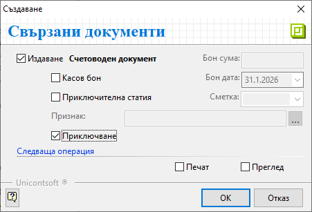
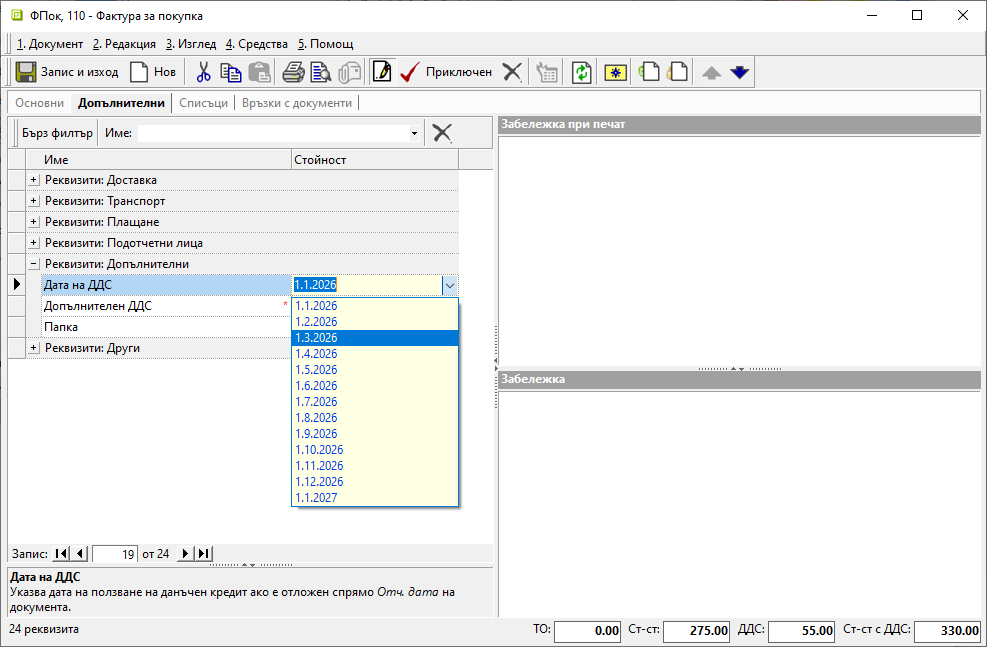

```{only} html
[Нагоре](000-index)
```

# **ДДС по покупки: Отложено използване на данъчен кредит**  

- [Въведение и задължителни настройки](#въведение-и-настройки)   
- [Покупка с отложен ДДС](#покупка-с-отложен-ддс)  
- [Въвеждане на фактура за покупка, получена със закъснение](#фактура-получена-със-закъснение)  

## **Въведение и настройки**

[Законът за ДДС](https://dv.parliament.bg/DVWeb/showMaterialDV.jsp?idMat=201969) дава право на регистрираните по него лица да използват данъчния кредит при покупките в рамките на следващите 12 месеца. Системата предлага автоматизация на процеса по отложено начисляване на ДДС. За целта се изисква предварително да настроим транзитна сметка за отложен ДДС.  

Настройката е еднократна и се намира в [**Администрация » Настройки » Счетоводни настройки**](../001-ref/002-accounting/004-acc-admin-settings.md). След като се навигираме до реда със **Сметка разсрочен ДДС за покупки**, в колона *Стойност* избираме сметка за отложен ДДС, която предварително сме настроили в [**Сметкоплан**](../001-ref/002-accounting/002-chart-of-acc.md). Направените промени трябва да бъдат записани.  

{ class=align-center w=15cm }

```{tip}
При работа с документи, засягащи минали или бъдещи данъчни периоди, е задължително настройките в **Администрация » Работни периоди** да бъдат съобразени. При липсващ разрешителен период системата не позволява приключване на документи или редактиране на дати.
```

## **Покупка с отложен ДДС**

След като сте изпълнили горните изисквания, документът с покупката може да бъде въведен и осчетоводен коректно.  
В крайна сметка ще имате следните две счетоводни статии:

**31.01.2026 г.**
```{admonition} Статия
|Д<sup>т</sup> Сметка|К<sup>т</sup> Сметка|Признак|Сума|
|-------------|-------------|--|-----------|
|6023         |             |  |166,67  |
|4533         |             |  |33,33   |  
|             |4011         |  |200,00  |
```
**01.03.2026 г.**  
```{admonition} Статия
|Д<sup>т</sup> Сметка|К<sup>т</sup> Сметка|Признак|Сума|
|-------------|-------------|--|-----------|
|4531         |             |  |33,33   |
|             |4533         |  |33,33   |
```

В следващия пример показваме как за фактура от 31 януари г., получена в срок през февруари, ще отложим използването на данъчния кредит за месец март.
За дата на документа посочваме датата на издаване - 31.01.2026 г. и обзавеждаме останалите реквизити без особености. 

{ class=align-center w=15cm }

Важното при схемата за отлагане на ДДС по покупки е в панел **Допълнителни**, поле **Дата на ДДС** да изберем месец март. Именно това ще определи отчетната дата, на която ДДС ще се отрази по дебита на сметка 4531.  

{ class=align-center w=15cm }

```{tip}
Системата ограничава избора на дата в рамките на 12 месеца от датата на фактурата.
```  
Приключваме фактурата за покупка и генерираме счетоводно записване.
  
{ class=align-center }
  
С това системата генерира едновременно два счетоводни документа:  

{ class=align-center w=15cm }

1. Основен счетоводен документ с датата на фактурата (31.01.2026 г.), където сумата на ДДС се отразява в Дт на настроената разчетна сметка:
  
{ class=align-center w=15cm }
  
2. Свързан, наречен *Скачен счетоводен документ*, който е с отчетна дата през месец март. В него сумата на ДДС се прехвърля от разчетна с/ка 4533 като ДДС за внасяне в дебита на с/ка 4531:
  
{ class=align-center w=15cm }

## **Фактура, получена със закъснение**

> Предлагаме да използвате тази схема за автоматично осчетоводяване, когато въвеждате също и получени със закъснение фактури за покупка.

Пример: В месец март получавате фактура, която е била издадена на 01.01.2026.  
Фактурата се въвежда с датата на издаване, т.е. *Док.дата* е 01.01.2026.
За да се отрази правилно ДДС на документа през месец март, трябва от панел **Допълнителни** да посочим това в реквизит **Дата на ДДС**. 

{ class=align-center w=15cm }
  
Приключваме фактурата за покупка стандартно и генерираме счетоводно записване, при което системата създава едновременно две счетоводни записвания: основен и скачен документ.
В основния счетоводен документ (отчетна дата 01.01.2026 г.) сумата на ДДС се отразява в Дт на настроената разчетна сметка, а в скачения счетоводен документ същата сума се закрива в с/ка 4533 през месец март.

> За отложено използване на данъчен кредит е нужно:  
> - Настройка на **Сметка разсрочен ДДС за покупки** в **Администрация » Настройки » Група: Счетоводни настройки**  
> - Избор на **Дата на ДДС**  в панел **Допълнителни** на документа (фактурата) за покупка  
> - Генериране на счетоводни документи към фактурата за покупка