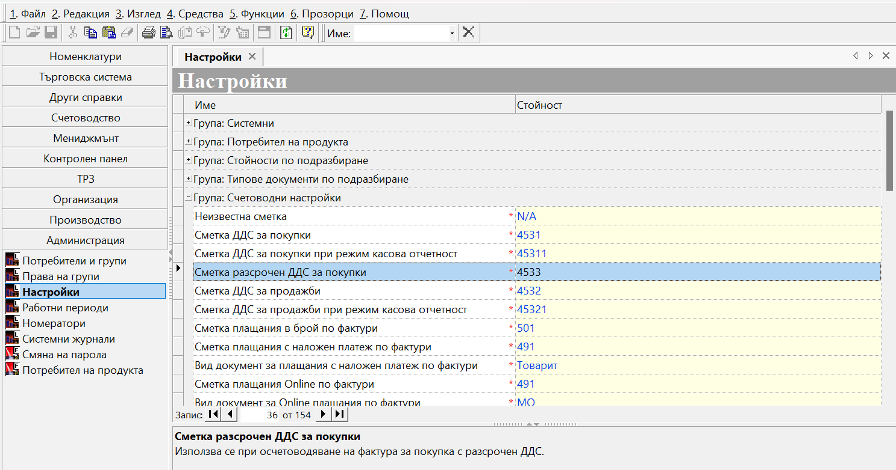
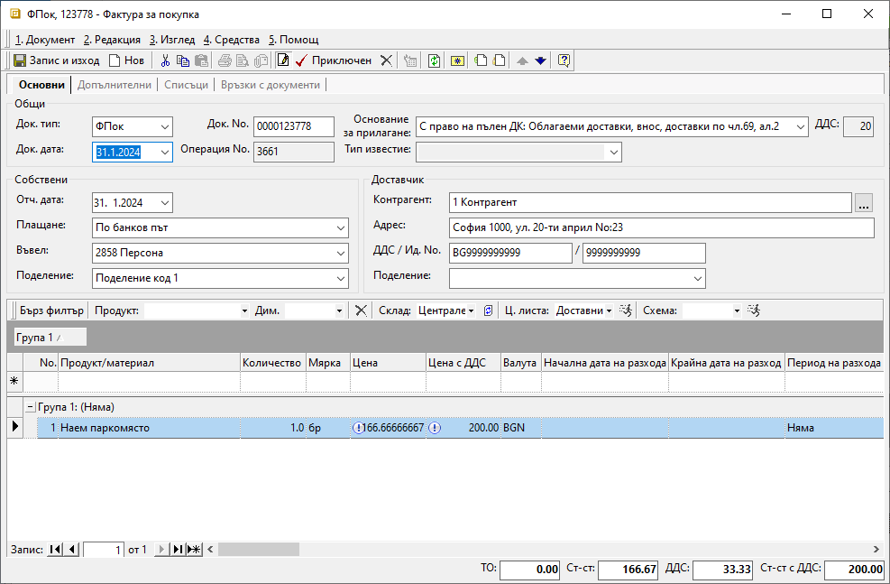
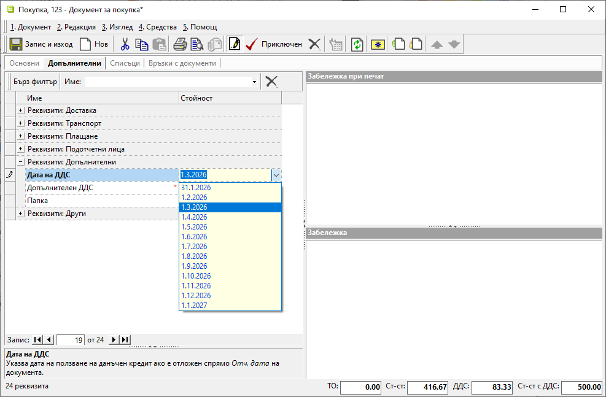
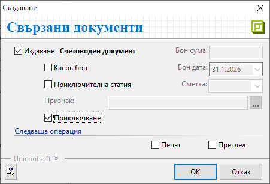
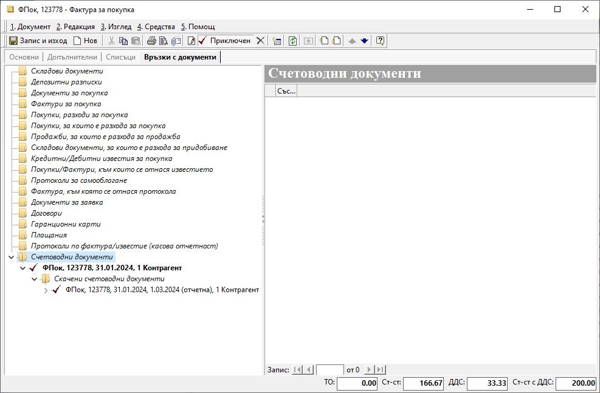
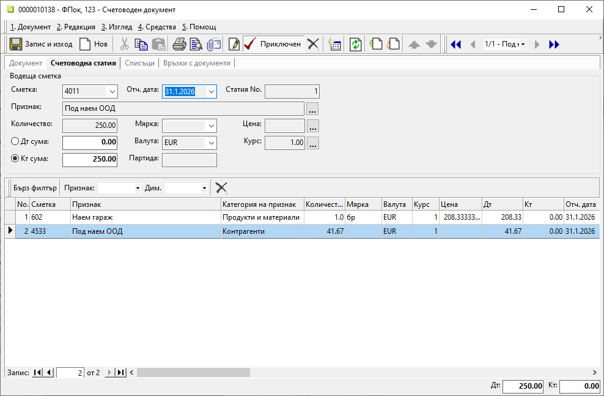
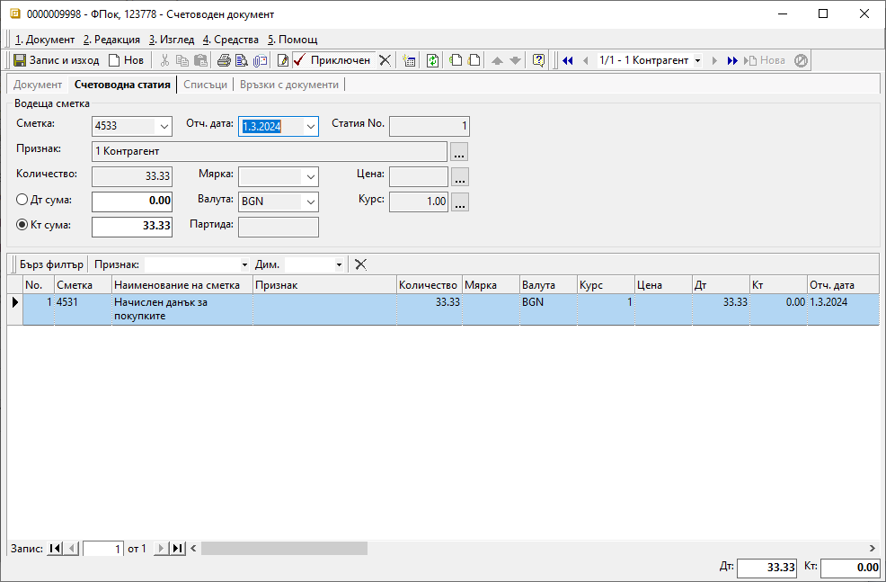
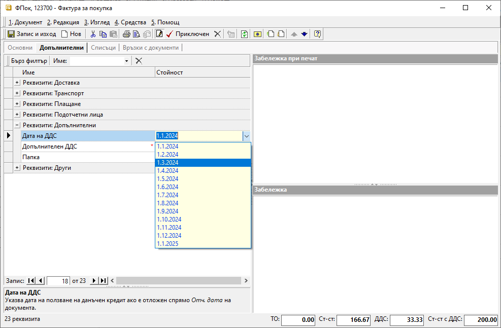

```{only} html
[Нагоре](000-index)
```

# **Отложено използване на данъчен кредит при покупки**  

- [Въведение и задължителни настройки](#въведение-и-настройки)   
- [Покупка с разсрочен ДДС](#покупка-с-разсрочен-ддс)  
- [Въвеждане на фактура за покупка, получена със закъснение](#фактура-получена-със-закъснение)  

## **Въведение и настройки**

[Законът за ДДС](https://dv.parliament.bg/DVWeb/showMaterialDV.jsp?idMat=201969) дава право на регистрираните по него лица да използват данъчния кредит при покупките в рамките на следващите 12 месеца. Системата предлага автоматизация на процеса по отложено начисляване на ДДС. За целта се изисква предварително да има дефинирана транзитна сметка за отложен ДДС.  

Настройката е еднократна и е достъпна от [**Администрация » Настройки » Счетоводни настройки**](../001-ref/002-accounting/004-acc-admin-settings.md). На реда със **Сметка разсрочен ДДС за покупки** в колона *Стойност* се избира сметка за разсрочен ДДС. Тя трябва да бъде създадена предварително в [**Сметкоплан**](../001-ref/002-accounting/002-chart-of-acc.md).  
Направените промени трябва да бъдат записани.  

{ class=align-center w=15cm }

```{tip}
При работа с документи, засягащи минали или бъдещи данъчни периоди, е задължително настройките в **Администрация » Работни периоди** да бъдат съобразени. При липсващ разрешителен период системата не позволява приключване на документи или редактиране на дати.
```

## **Покупка с разсрочен ДДС**

След като сте изпълнили горните изисквания, документът с покупката може да бъде въведен и осчетоводен коректно.  
В крайна сметка ще имате следните две счетоводни статии:

**31.01.2026 г.**
```{admonition} Статия
|Д<sup>т</sup> Сметка|К<sup>т</sup> Сметка|Признак|Сума|
|-------------|-------------|--|-----------|
|602          |             |  |208,33  |
|4533         |             |  |41,67   |  
|             |4011         |  |250,00  |
```
**01.03.2026 г.**  
```{admonition} Статия
|Д<sup>т</sup> Сметка|К<sup>т</sup> Сметка|Признак|Сума|
|-------------|-------------|--|-----------|
|4531         |             |  |41,67   |
|             |4533         |  |41,67   |
```

Пример:  
За фактура от 31 януари 2026 г., получена в срок през февруари, ще отложим използването на данъчния кредит за месец март.  

В дата на документа попълвате датата на издаване - 31.01.2026 г. и обзавеждате останалите реквизити без особености. 

{ class=align-center w=15cm }

> Важно при схемата за разсрочване на ДДС по покупки е в раздел **Допълнителни** да обзаведете коректно поле **Дата на ДДС**.  

За целите на примера в полето трябва да се въведе месец март - *1.3.2026*. Именно това ще определи отчетната дата, на която ДДС ще се отрази по дебита на сметка 4531.  

{ class=align-center w=15cm }

```{tip}
Системата ограничава избора на дата в рамките на 12 месеца спрямо датата на фактурата.
```  
Фактурата за покупка се приключва със счетоводно записване.
  
{ class=align-center }
  
С това системата генерира едновременно два свързани счетоводни документа:  

{ class=align-center w=15cm }

1) Основен счетоводен документ с датата на фактурата (31.01.2026 г.). В него сумата на ДДС се отразява в Дт на настроената разчетна сметка:  
  
{ class=align-center w=15cm }
  
2) Свързан, наречен *Скачен счетоводен документ*, който е с отчетна дата през месец март. В него сумата на ДДС се прехвърля от разчетна с/ка 4533 в дебита на с/ка 4531 като ДДС за внасяне:  
  
{ class=align-center w=15cm }

## **Фактура, получена със закъснение**

> Предлагаме да използвате тази схема за автоматично осчетоводяване, когато въвеждате също и получени със закъснение фактури за покупка.  

Пример:  
В месец март получавате фактура, издадена на 01.01.2026.  
Фактурата се въвежда с датата на издаване - **Док.дата** е 01.01.2026. За да се отрази правилно ДДС на документа през месец март, в раздел **Допълнителни** трябва да укажете това чрез реквизит **Дата на ДДС**. 

{ class=align-center w=15cm }
  
Фактурата за покупка се приключва стандартно с генериране на счетоводно записване. С това системата създава едновременно две счетоводни записвания: основен и скачен документ.  
В основния счетоводен документ (отчетна дата 01.01.2026 г.) сумата на ДДС се отразява в Дт на настроената разчетна сметка.  
В скачения счетоводен документ същата сума се закрива в с/ка 4533 през месец март.  

> Накратко, за отложено използване на данъчен кредит е нужно:  
> - Настройка на **Сметка разсрочен ДДС за покупки** в **Администрация » Настройки » Група: Счетоводни настройки**  
> - Избор на **Дата на ДДС**  в панел **Допълнителни** на документа (фактурата) за покупка  
> - Генериране на счетоводни документи към фактурата за покупка