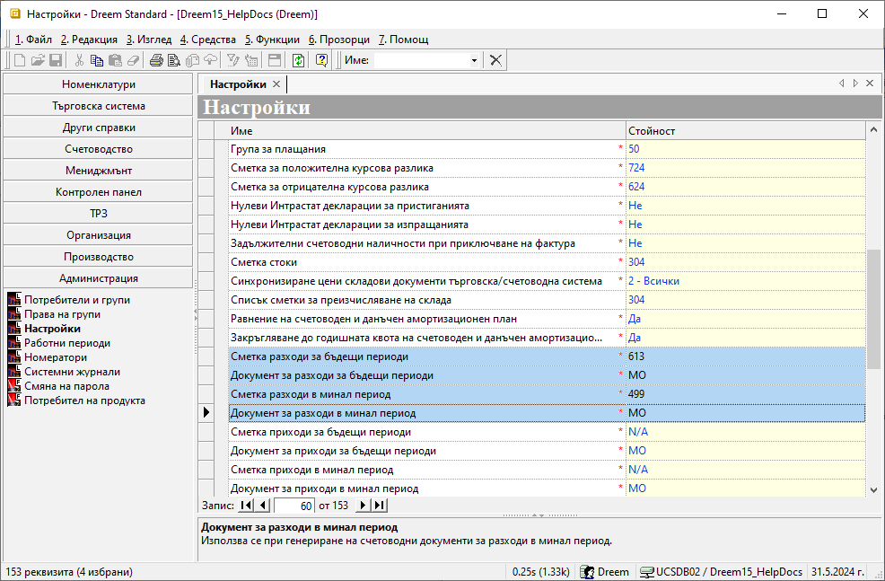
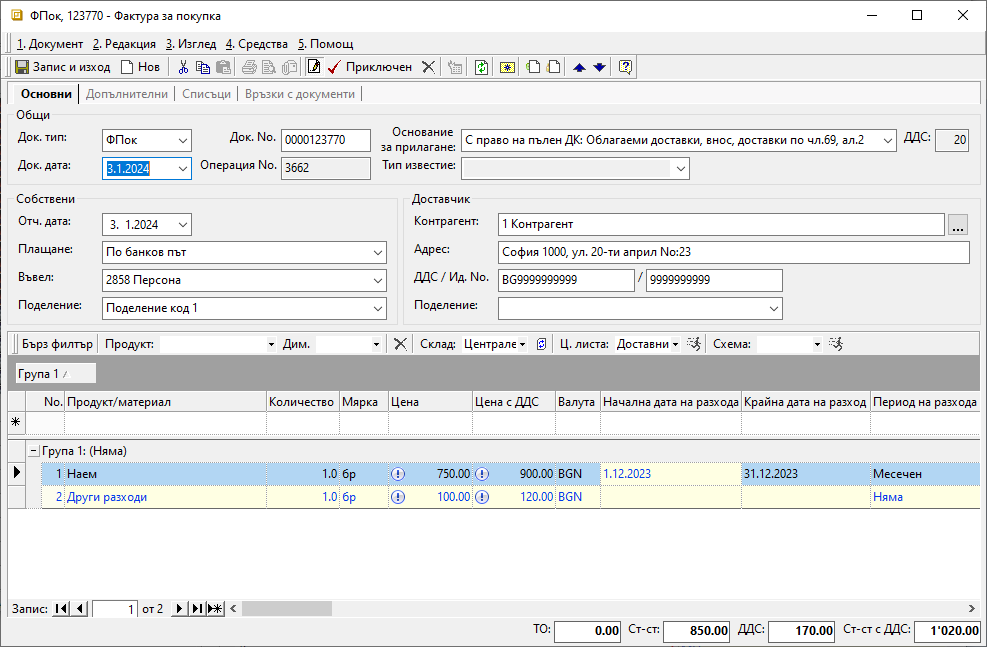
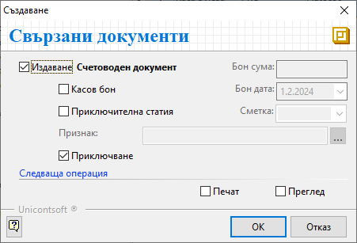
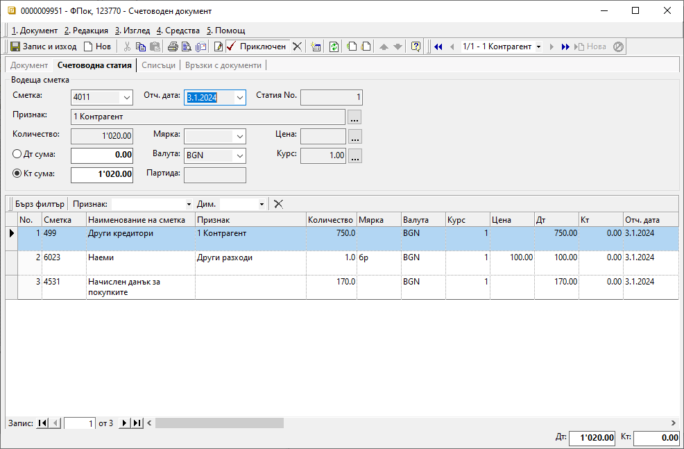
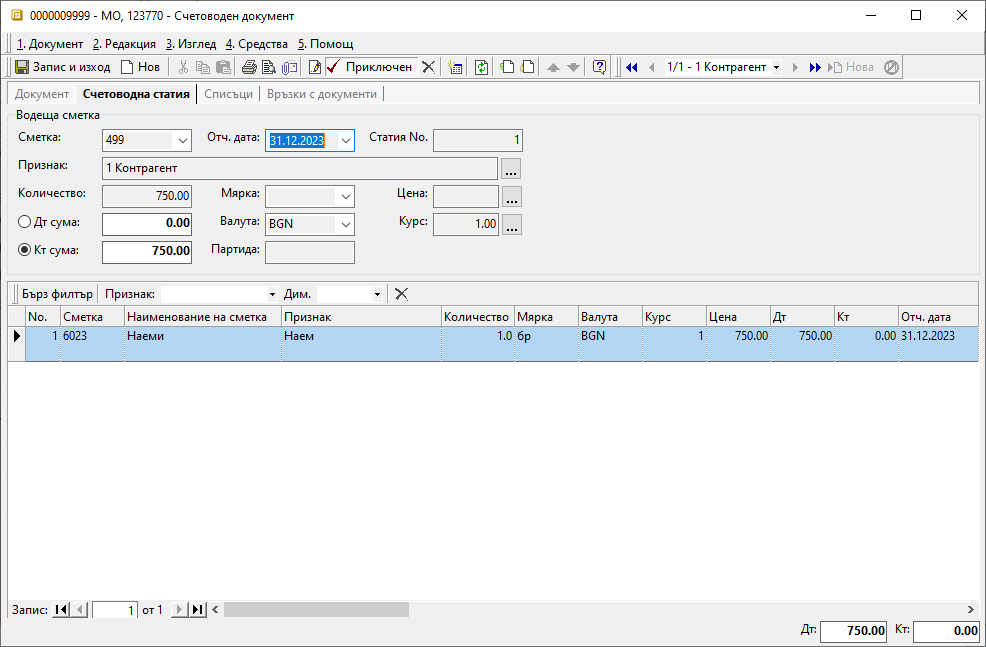
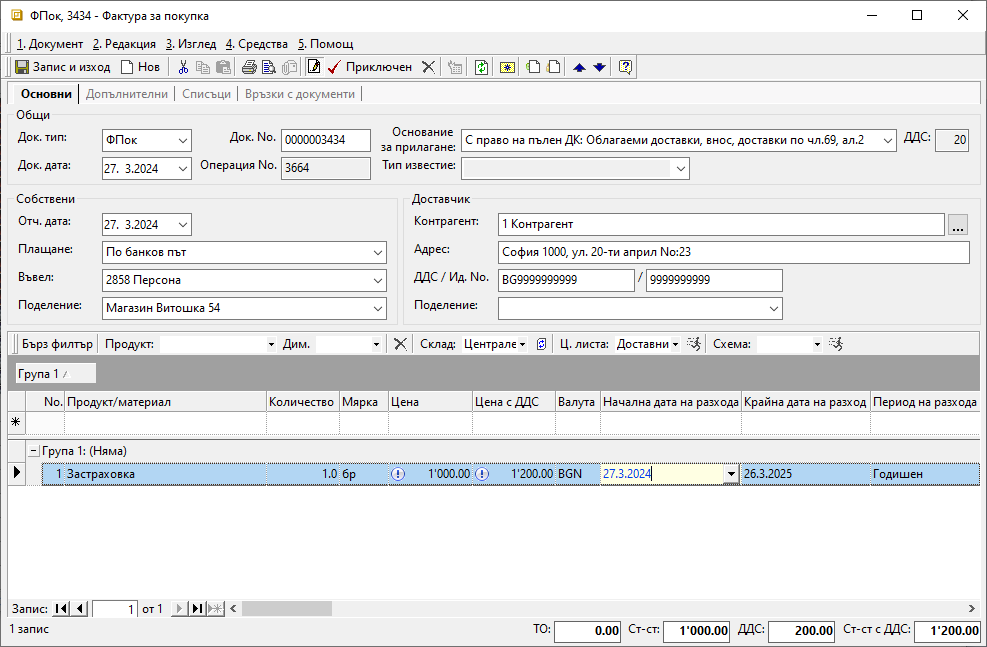
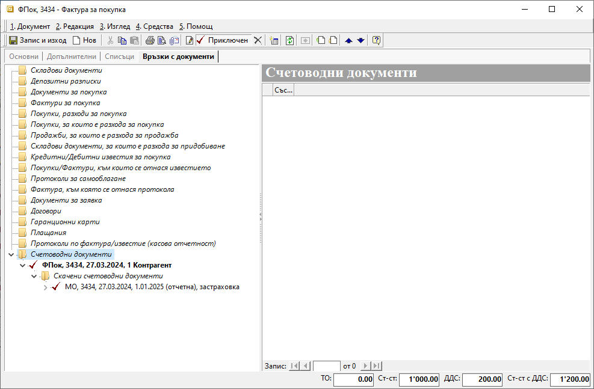
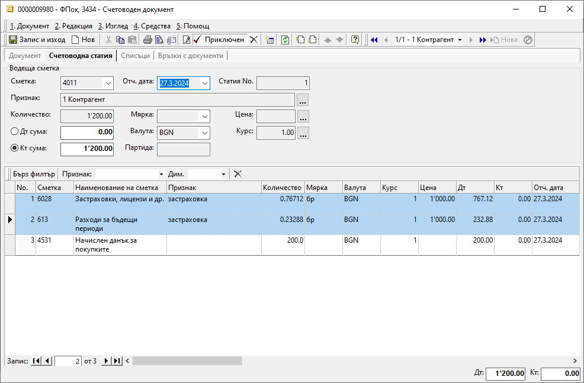
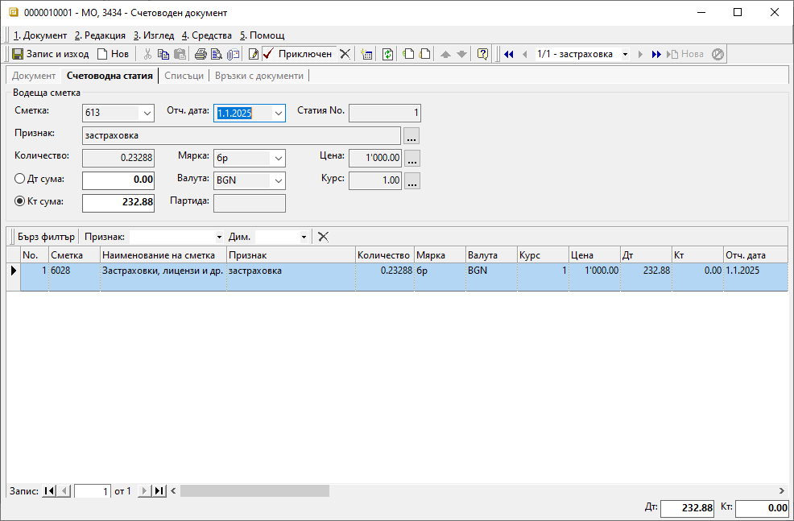

```{only} html
[Нагоре](000-index)
```
 
# **Разходи за минали и бъдещи периоди**  

- [Въведение и настройки](#въведение-и-настройки)  
- [Разходи за минали периоди](#разходи-за-минали-периоди)  
- [Разходи за бъдещи периоди](#разходи-за-бъдещи-периоди)  

## **Въведение и настройки**

В редица случаи се налага въвеждане на документ, издаден в текущия данъчен период (календарна година), но отнасящ се за минал такъв. Това са, например, кредитните известия с обща отстъпка като бонус оборот, фактури  от януари за покупки в декември и други.  
Подобни случаи отработваме в системата, използвайки схема за отразяване на разхода за избран период още с въвеждането на документа. Този метод може да се прилага при работа с разходи за минали и бъдещи периоди.

> За да работи тази схема, предварително в **Администрация » Настройки** трябва да имате посочени и счетоводни сметки, и типове счетоводни документи, в които системата да създаде счетоводните записвания. Ако тази настройка липсва, в редовете на документите/фактурите за покупка ще бъдат заключени колоните **Начална дата на разхода**, **Крайна дата на разхода** и **Период на разхода**.

{ class=align-center w=15cm }

<ins>При работа с документи за минали или бъдещи периоди е задължително настройките на [**Работни периоди**](../001-ref/004-settings/003-working-periods.md) да бъдат съобразени.</ins> При липсващ разрешителен период системата не позволява приключване на документи или редактиране на дати.

Системата дава избор как да бъде раделен разходът - *Месечен*, *Месечен с равни суми*, *Годишен* и *Годишен с равни суми*.
При месечното разделяне системата ще създаде по един документ за всеки от участващите месеци, като сумата в него ще е съобразена или с броя календарни дни(*Месечен*), или ще е еднаква за всеки от месеците (*Месечен с развни суми*). При отнасянето на разхода на годишна база, ще имаме по един документ за всяка от участващите години. И тук сумите могат да бъдат съобразени с броя участващи дни (*Годишен*) или да се използва еднаква сума за всяка година (*Годишен с равни суми*). 

## **Разходи за минали периоди**

С пример ще покажем как би изглеждало въвеждането на документ, включващ разход за минал период.  
В месец февруари 2024 г. получавате фактура с наем за декември 2023 г., в която са включени и други разходи за обекта за януари. Документът е бил издаден на 03.01.2024 г.  

При въвеждане на фактурата в *Док.дата* записвате 03.01.2024. Другите разходи, участващи във фактурата, са в текущата календарна година, затова въвеждате без особености. 
 
{ class=align-center w=15cm }

Наемът, обаче, се отнася за минала календарна година. Коректно е да бъде отразен като разход за минал период. Затова за продукт *Наем* записвате съответните дати в колони **Начална дата на разхода** и **Крайна дата на разхода**, които обхващат периода, за който се отнася разходът. В случая това са 01. - 31.12.2023 г. Разходът е за един месец и в **Период на разхода** избирате тип *Месечен*.  
Ако колоните не са видими, могат да бъдат изведени от *Изглед на списък*. Той се достъпва с десен бутон на мишката върху реда с имена на колоните.  

Приключвате фактурата за покупка и генерирате счетоводно записване:

{ class=align-center }

Така системата създава едновременно следните счетоводни записвания:

{ class=align-center w=15cm }

1. Основният счетоводен документ е с отчетна дата 03.01.2024 г. В него сумата на наема от декември е отразена в настроената за *Сметка за разходи в минал период* с/ка 499. Другите разходи са в текуща календарна година, затова се осчетоводяват в гр. 60 според настроения [**Сметкоплан**](../001-ref/002-accounting/002-chart-of-acc.md).
  
{ class=align-center w=15cm }

2. Скаченият документ **МО** съдържа отнасянето на сумата на наема по дебита в гр. 60 с отчетна дата 31.12.2023 г. 

{ class=align-center w=15cm }

Салдото, което остава по кредита на с/ка 499, ще се закрие в 2024 г. с основния счетоводен документ на фактурата.

## **Разходи за бъдещи периоди**

Един от най-често срещаните случаи на разходи за бъдещи периоди са застраховките. Ще въведем примерен документ за годишна застраховка от 27.03.2024 г. За целта, както посочихме, трябва да бъдат направени съответните настройки в меню **Администрация**, за да са достъпни колоните  **Начална дата на разхода**, **Крайна дата на разхода** и **Период на разхода**. В тях посочвате срока на застраховката и избирате тип на разхода. Нека изберем **Годишен**, като така системата ще разпредели сумите на база брой дни от всяка участваща година.

{ class=align-center w=15cm }

Документът за покупка трябва да се приключи със счетоводно записване. Така системата генерира два свързани счетоводни документа - **ФПок** и **МО**.

{ class=align-center w=15cm }

В основния счетоводен документ **ФПок** отчетната дата е 27.03.2024 г. Тук, спрямо избрания тип на разхода **Годишен**, системата е осчетоводила автоматично сумата за 2024 г. в настроената от гр.60 сметка в [**Сметкоплан**](../001-ref/002-accounting/002-chart-of-acc.md). Оставащата за 2025 г. сума отива по сметката *Разходи за бъдещи периоди*, настроена в **Администрация**.

{ class=align-center w=15cm }

В скачения счетоводен документ **МО** сумата на застраховката за 2025 г. се прехвърля от сметката за разходи за бъдещи периоди в настроената сметка за застраховки от гр.60.
Отчетната дата е първият ден в 2025 г.

{ class=align-center w=15cm }

> За да въведем разходи за минал или бъдещ период, е нужно:  
> - Настройка на съответните счетоводни сметки и типове документи в **Администрация » Настройки » Група: > Счетоводни настройки**  
> - Избор на **Начална дата на разхода**, **Крайна дата на разхода** и **Период на разхода** в документа (фактурата) за покупка  
> - Генериране на счетоводно записване към фактурата за покупка