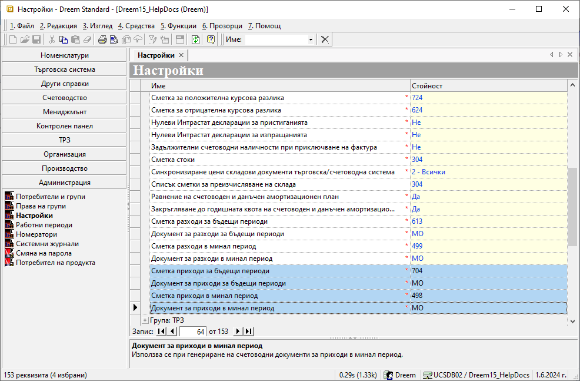
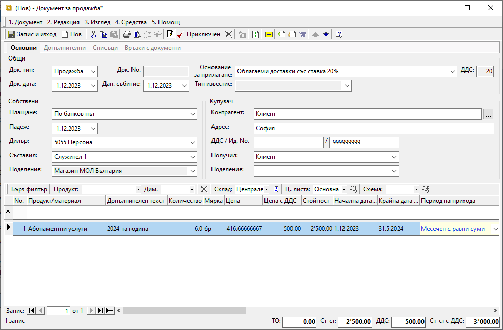
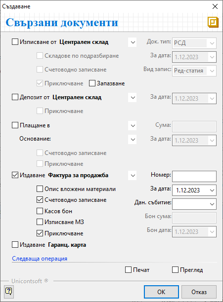
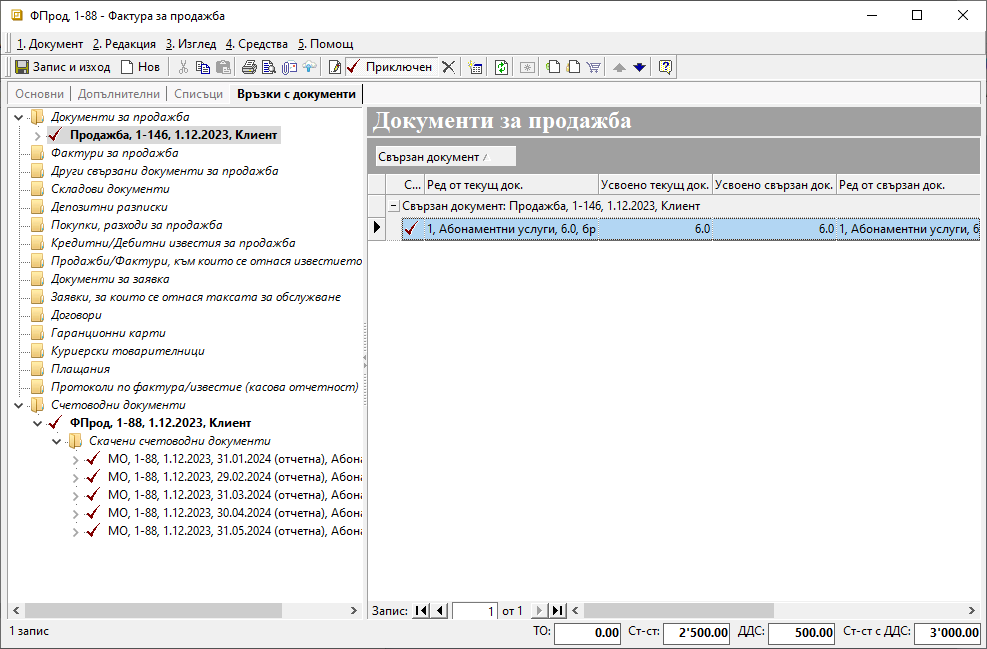
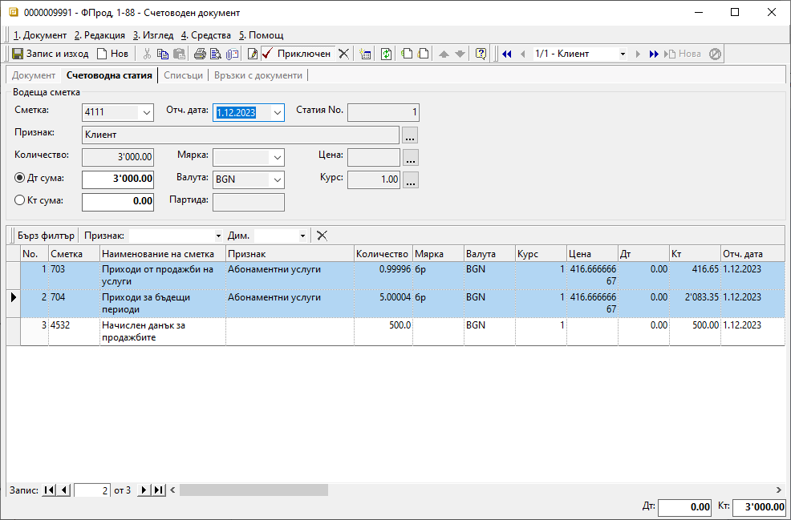
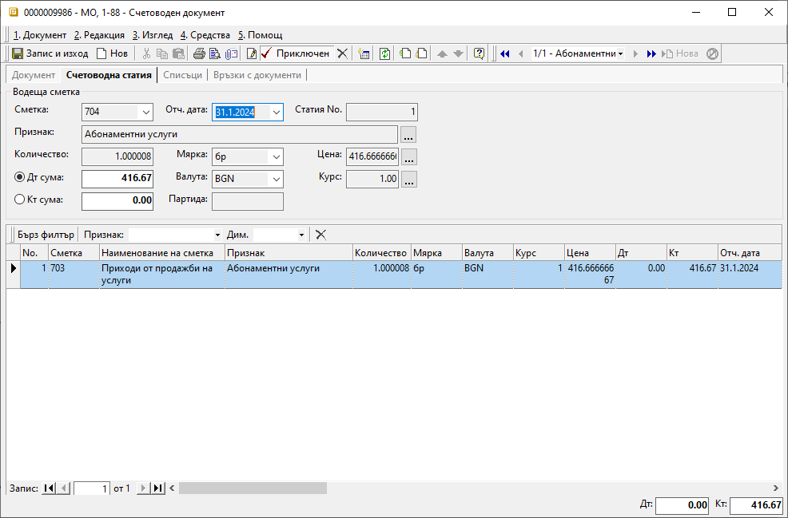

```{only} html
[Нагоре](000-index)
```
 

# Приходи за бъдещи и минали периоди  

- [Въведение и настройки](https://docs.unicontsoft.com/guide/erp/005-how-to/009-deferred-and-future-incomes.html#id2)
- [Отразяване на приходите за бъдещи и минали периоди](https://docs.unicontsoft.com/guide/erp/005-how-to/009-deferred-and-future-incomes.html#id3)

## **Въведение и настройки**

Документите за продажба участват в генериране на приходите в системата. Затова отработваме случаите с приходи за бъдещи и минали периоди, използвайки схема за отразяването им още със създаването на документа. Ако все още се запознавате със системата, разгледайте стъпка по стъпка принципа за работа с продажби в [Как да създадем Документ за продажба](https://www.unicontsoft.com/cms/node/26).

За да използвате възможността, която системата дава, за отразяване на приходи за бъдещи и минали периоди, са необходими няколко предварителни настройки.  

> В меню **Администрация || Настройки** трябва да имате посочени и счетоводни сметки, и типове счетоводни документи, в които системата да създаде счетоводните записвания. Ако тази настройка липсва, в редовете на документите/фактурите за продажба ще бъдат заключени колоните **Начална дата на прихода**, **Крайна дата на прихода** и **Период на прихода**.

{ class=align-center w=15cm }

<ins>При работа с документи за минали или бъдещи периоди е задължително настройките на [**Работни периоди**](https://docs.unicontsoft.com/blog/20240517-working-periods.html) в **Администрация** да бъдат съобразени.</ins> При липсващ разрешителен период, системата не позволява приключване на документи или редактиране на дати.

В документа за продажба ще имате избор как да се раздели прихода - *Месечен*, *Месечен с равни суми*, *Годишен* и *Годишен с равни суми*.  
При месечното разделяне системата ще създаде по един документ за всеки от участващите месеци, като сумата в него ще е съобразена или с броя календарни дни(*Месечен*), или ще е еднаква за всеки от месеците (*Месечен с развни суми*). При отнасянето на прихода на годишна база, ще имаме по един документ за всяка от участващите години. И тук сумите могат да бъдат съобразени с броя участващи дни (*Годишен*) или да се използва еднаква сума за всяка година (*Годишен с равни суми*). 

## **Отразяване на приходите за бъдещи и минали периоди**

Ще разгледаме с пример създаване на документ за продажба и генериране на фактура за ежемесечна абонаментна услуга. Документът ще бъде от дата 01.12.2023 г. за срок от 6 месеца.  
В новосъздадения документ обзавеждате нужните реквизити. На реда с продукт *Абонамента услуга*, в колони **Начална дата на прихода** и **Крайна дата на прихода**,записвате съответните дати, които обхващат периода, за който се отнася приходът - 01.12.2023 г.-31.05.2024 г. Приходът е за шест месеца, затова в **Период на прихода** избирате тип *Месечен с равни суми*.  
Ако колоните не са видими, могат да бъдат изведени от *Изглед на списък*, който се достъпва с десен бутон на мишката върху реда с имена на колоните.  

{ class=align-center w=15cm }

Приключвате документа за продажба, като задължително генерирате фактура със счетоводно записване:  

{ class=align-center }

Така системата създава едновременно следните счетоводни записвания, свързани с фактурата: 

{ class=align-center w=15cm }

1. Основният счетоводен документ *ФПрод* е с отчетна дата 01.12.2023 г. Той включва начислението на прихода за текущата година със сумата за месец декември по К<sup>т</sup> на настроената за това сметка. Остатъкът от общата фактурирана сума е начислен по К<sup>т</sup> на с/ка 704, която настроихме в **Сметка приходи за бъдещи периоди**.

{ class=align-center w=15cm }

2. Скачени счетоводни документи - *МО*, в които месечната сума за абонамент се начислява  като текущ приход от продажби:  

> **31.01.2024г.**  
> Д<sup>т</sup> 704 - 416.67 лв.  
> К<sup>т</sup> 703 - 416.67 лв.

{ class=align-center w=15cm }

Броят на генерираните *МО* отговаря на броя оставащи месеци в приходи за бъдещи периоди. Така е, защото избрахме типът на разхода да е на месечна база. Всеки *МО* е с дата последен ден от месеца, за който се отнася. 

```{tip}
Ако по някаква причина се налага създаване на документ в текущия данъчен период, приходът от който се отнася за минал такъв, отново може да използвате гореописаната схема.  
```

> За да въведете приходи за минал или бъдещ период, е нужно:  
> - Настройка на съответните счетоводни сметки и типове документи в **Администрация || Настройки || Група: Счетоводни настройки**  
> - Разрешенителни настройки в **Работни периоди** за минал/бъдещ такъв   
> - Избор на **Начална дата на прихода**, **Крайна дата на прихода** и **Период на прихода** в документа (фактурата) за продажба 
> - Генериране на счетоводно записване към фактурата за продажба  
