```{only} html
[Нагоре](000-index)
```

# **Дълготрайни активи**

- [Настройки](#настройки)  
- [Амортизация на ДА](#амортизация-на-да)  
- [Първоначално придобиване на ДА](#първоначално-придобиване-на-да)  
- [Печат на протокол за въвеждане в експлоатация](#печат-на-протокол-за-въвеждане-в-експлоатация)  
- [Консервации на ДА](#консервации-на-да)  
- [Подобрения на ДА](#подобрения-на-да)  

## **Настройки**

**Дълготрайни активи** е номенклатура със специфични настройки. В голяма степен системата я третира аналогично на **Продукти и материали**. Затова те попадат в общ списък и еднакво могат да се използват в документите за покупка и продажба.  

> При въвеждане на ДА през **Номенклатури » Дълготрайни активи** те се визуализират автоматично в списък **Продукти и материали**.  

При [въвеждането на ДА](../001-ref/001-nomenclatures/004-assets.md) системата изисква попълване на някои задължителни реквизити. Те са маркирани с червен символ и включват някои референтни настройки, които трябва да се създадат предиварително. Такива са: счетоводни групи, методи за амортизация, коефициент на преоценка и категории по чл.55 (ЗКПО). Могат да бъдат въведени и редактирани от [**Номенклатури » Референтни номенклатури**](../001-ref/001-nomenclatures/001-ref-nomenclatures.md).   

Пример:  
В системата трябва да се добави нов актив *Лек автомобил*, който попада в *Категория V* с амортизационната норма 25% на година.  
Автомобилът е закупен на 23.04.2024 г. за 19940,38 евро. Въведен е в експлоатация на 01.05.2024 г.  

Тези данни служат за попълване на реквизитите във формата за редакция на ДА в раздел **Основни**. Преди да продължите с настройките е препоръчително да запишете въведеното до момента.  

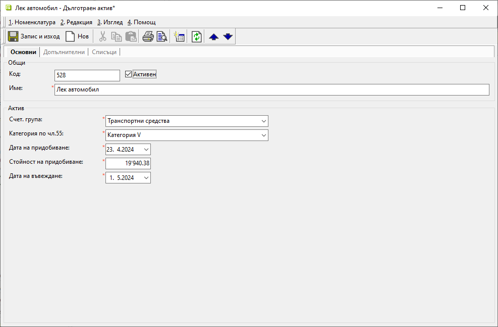{ class=align-center w=15cm }

В раздел **Допълнителни** системата автоматично попълва задължителните полета, свързани с данъчния и със счетоводния амортизационен план. Тук може да добавите също сума за неамортизируема остатъчна стойност на актива.  

```{tip}
За дълготрайните активи могат да се настроят също различни дименсии, както е при Продукти и материали.
```

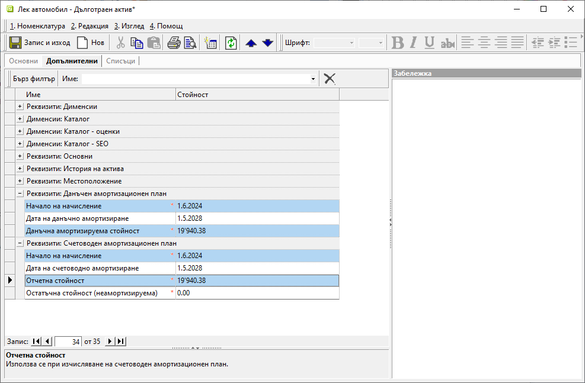{ class=align-center w=15cm }

От раздел **Списъци** са достъпни настройки за подобрения, консервации, амортизационните норми и план на актива.  
Докато първите две са възможни при определени обстоятелства, то амортизацията е неизбежна след пускане в експлоатация на актива. Затова трябва да направите настройки за амортизационни норми и амортизационен план.  

От бутон [**Генериране**] в лентата с инструменти отваряте формата за избор на амортизационна норма (или период на експлоатация) и метод на амортизация.  

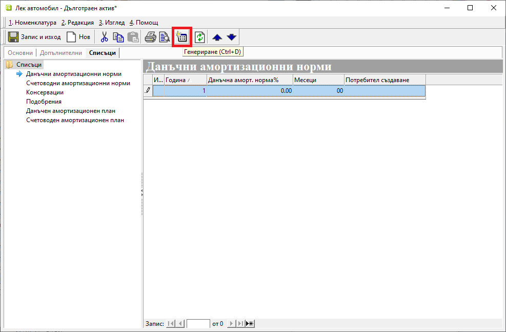{ class=align-center w=15cm }

По подразбиране системата предлага *Линеен метод* на амортизация. При него годишните амортизационни квоти са еднакви за целия амортизационен период.  
Методът може да бъде променен от падащия списък.  

> За генерацията на амортизационен план трябва да попълните едно от двете полета - *Период на експлоатация* или *Амортизационна норма*. 

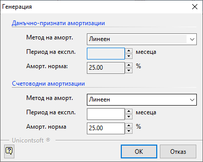{ class=align-center }

Накрая потвърждавате избора и записвате промените.  

Вече може да разгледате генерираните примерни амортизационни планове за актива - данъчен и счетоводен.  

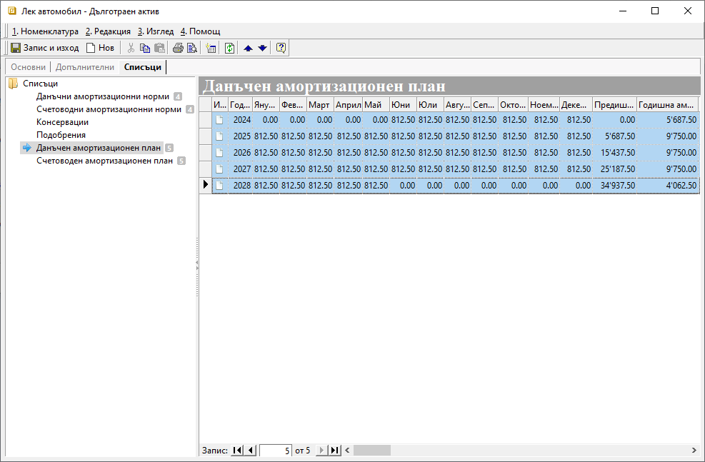{ class=align-center w=15cm }

> Ако желаете да редактирате амортизационните норми в избран ДА, респ. амортизационния му план, може да повторите от [**Генериране**].  

```{tip}
Системата дава възможност за избор от следните методи на амортизация:  
 
- Константно дегресивен метод със снижаващ се остатък.  
- Линеен метод с годишните амортизационни квоти, които са еднакви за целия амортизационен период.  
- Метод на сумата на числата  
- Неравномерно дегресивен метод   
- Прогресивен нелинеен метод   
- Произволен метод  
```

## **Амортизация на ДА**

Генерираните в системата амортизационни планове могат да бъдат видени отделно за всеки актив. Както споменахме, това става във формата за редакция на избрания *ДА*.  
Също така има справка, включваща всички активи. Тя е достъпна от [**Счетоводство » Печат на амортизационен план**](../003-rep/002-accounting/008-asset-depreciation-plan-printing.md). Във филтъра може да изберете вида и типа на амортизационния план, период и други.  

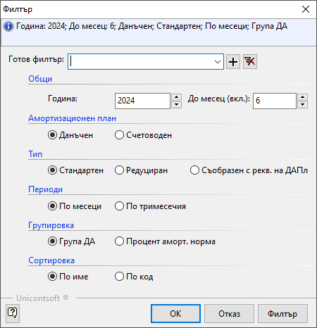{ class=align-center }

Справката, която се зарежда според настроените филтри, включва всички ДА със състояние *Активен*.  

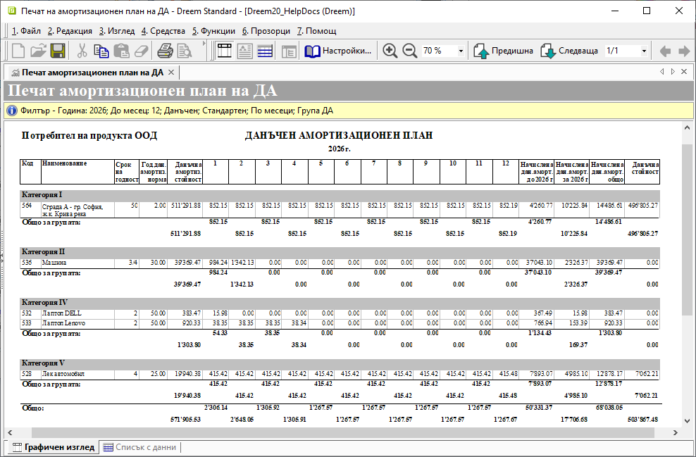{ class=align-center w=15cm }

> Системата разполага с инструмент за автоматична генерация на счетоводни документи с предложените амортизационни квоти. Намира се в меню **Счетоводство » Генерация на ДА**.

За да бъдат създадени счетоводни записвания за всички активни ДА, трябва да потвърдите желания период.  
Ако поставите отметка за *Приключване*, системата ще валидира счетоводните документи. Пропуснете тази настройка, ако предпочитате да проверите съдържанието на документите, след което да ги приключите ръчно.  

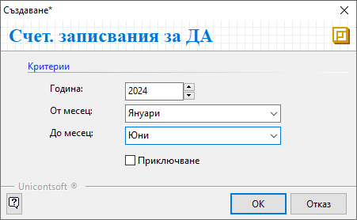{ class=align-center }

По този начин в **Счетоводство » Счетоводни документи** се генерират отделни документи от тип **АмПл** по месеци.  

> Данните от документите ще бъдат видими в счетоводните справки от момента на приключването им.  

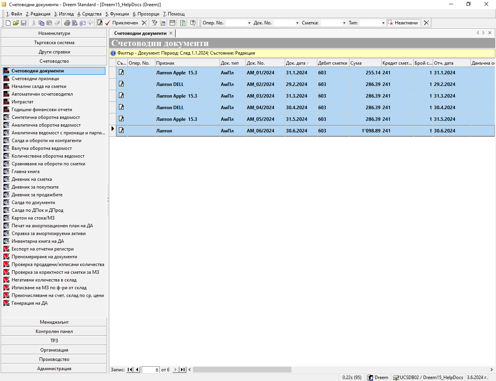{ class=align-center w=15cm }

## **Първоначално придобиване на ДА**

Първоначалното придобиване на ДА се отразява в системата с въвеждане на документ за неговата покупка.  

> Ако не сте създали актива като номенклатура предварително, може да го направите и по време на обработка на покупката.  

Пример:  
Трябва да въведете фактура за придобит нов актив *Лаптоп Lenovo* на стойност 950 евро.    

От **Търговска система » Документи за покупка** създавате [нов документ](../002-docs/002-trade-system/001-orders-sales-purchase-documents/002-create-purchase-documents.md) **Покупка** и попълвате всички данни.    
На реда за нов запис трябва да се избере продукт - актива, който все още не е въведен в системата. Затова в поле **Продукт/материал** отваряте списъка с всички продукти. От него създавате [нов продукт](../../erp/001-ref/001-nomenclatures/003-items.md#създаване-на-нов-продукт) *Лаптоп Lenovo*.  

```{tip}
Имайте предвид, че за да настроите поле Тип, предварително трябва да сте въвели типове продукти в Референтни номенклатури.  
```

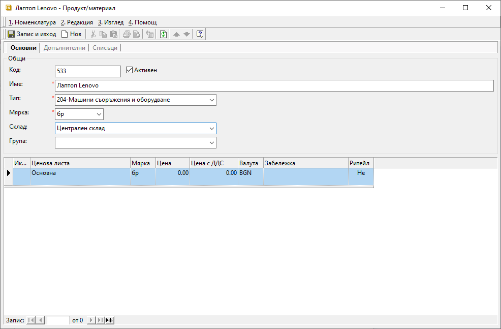{ class=align-center w=15cm }

След запис на номенклатурата тя вече фигурира в списъка с продукти.  
Ще забележите разлика между иконата на *Лаптоп lenovo* и тези на вече въведени активи. Така системата разграничава в списъка номенклатурите, отговарящи на специфичните изисквания и настроени като ДА.  

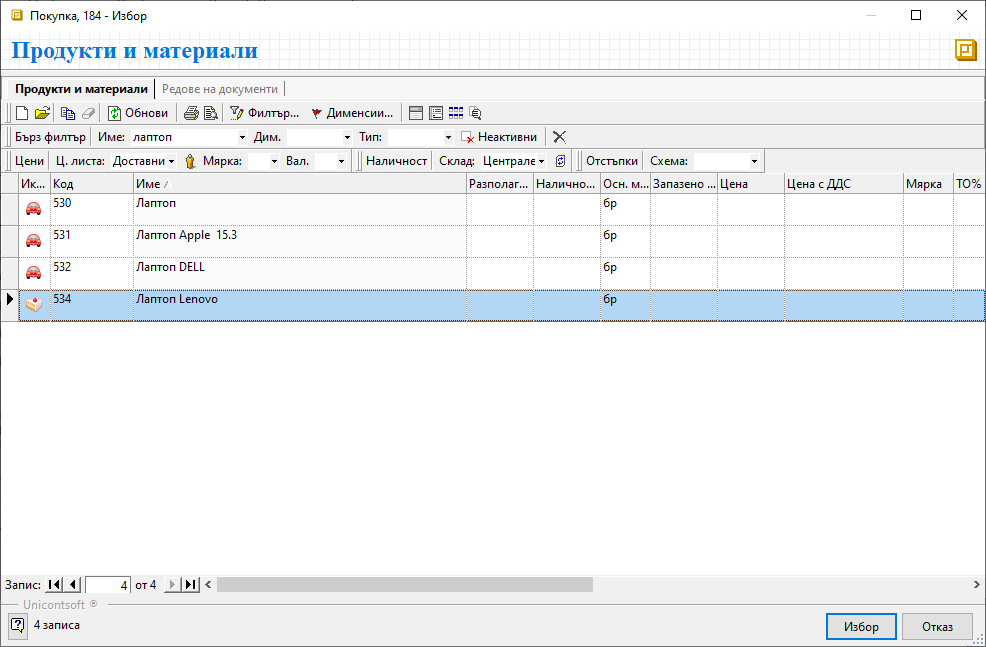{ class=align-center w=15cm }
  
До момента имате въведен *Лаптоп Lenovo* като продукт, което е достатъчно да завършите въвеждането на покупката.  

```{tip}
Според разпределените роли в системата е възможно достъпът до номенклатура Дълготрайни активи да бъде управляван чрез Права на групи. Това позволява необходимите последващи настройки на ДА да бъдат позволени/ограничени за избрани потребители.    
```

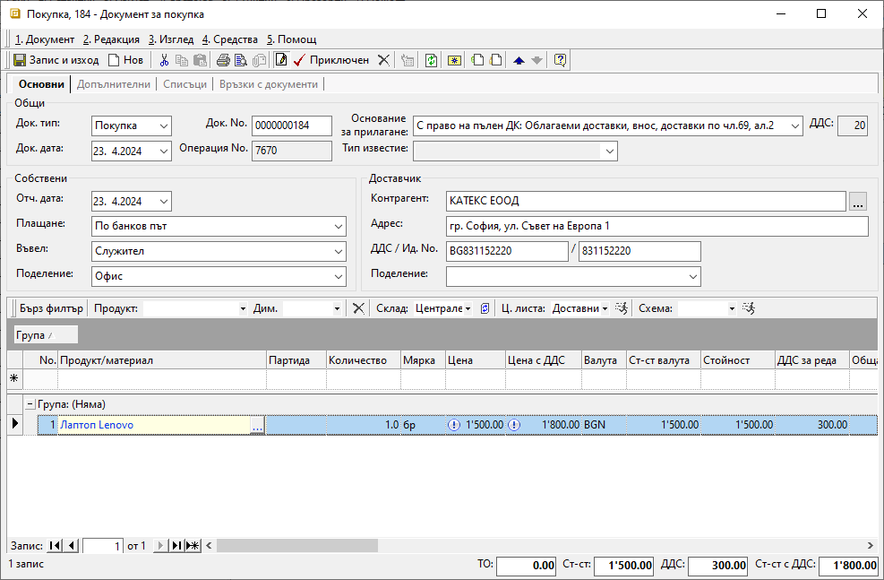{ class=align-center w=15cm }

На следващ етап настройката на продукта *Лаптоп Lenovo* трябва да бъде довършена, така че системата да го третира като дълготраен актив.  
Това става от списък **Продукти и материали** чрез десен бутон на мишката върху продукта и **Други средства » Редакция ДА**.  

С това се отваря форма за редакция на ДА. В нея може да добавите [настройките](#настройки), описани в началото на темата.  

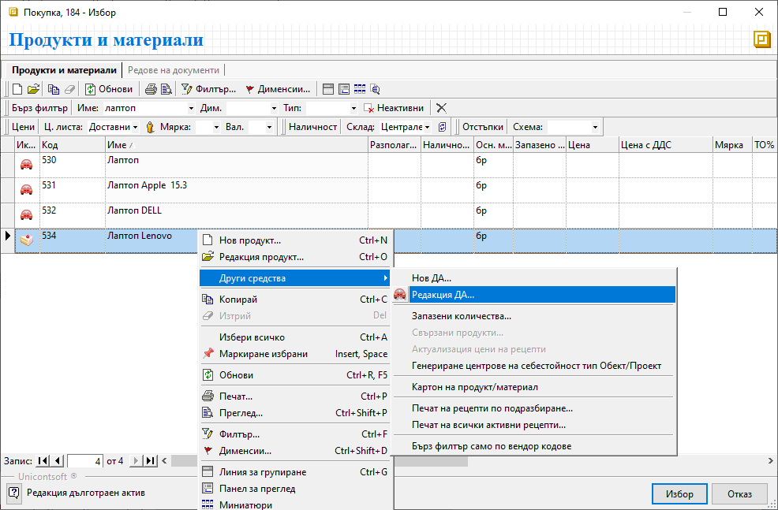{ class=align-center w=15cm }

## **Печат на протокол за въвеждане в експлоатация**  

Системата дава възможност за печат на *Протокол за въвеждане в експлоатация на дълготраен амортизируем актив, съгл. чл. 58 от ЗКПО*. Той е достъпен от картон на ДА - формата за редакция на ДА, чрез бутоните [**Преглед**] или [**Печат**] в лентата с инструменти.  

Реквизитите в протокола се обзавеждат автоматично с настроените данни за ДА.  

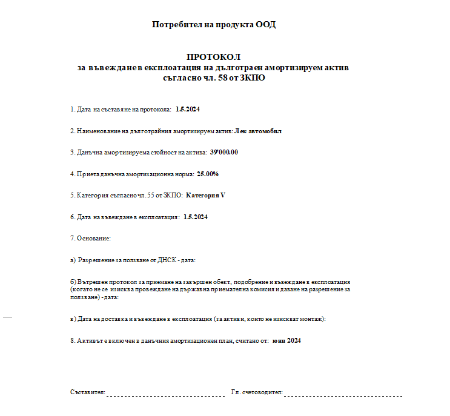{ class=align-center w=15cm }

## **Консервации на ДА**

Когато дълготраен актив е изведен от употреба за минимум дванадесет месеца, без значение от причините, се допуска неговата консервация. След изтичането на периода на консервация се очаква неговото повторно въвеждане в употреба.  

Начисляването на данъчни амортизации се преустановява от месеца, следващ месеца на преустановяване на използване на ДА. Начисляването се възобновява от началото на месеца на връщането на актива в експлоатация. Данъчният амортизируем актив не се отписва от данъчния амортизационен план.  

Период на консервация може да настроите от форма за редакция на ДА в **Списъци » Консервации**. Трябва да посочите началната и крайната дата на извеждането от експлоатация.  
Може да добавите коментар с обстоятелствата, налагащи това.  

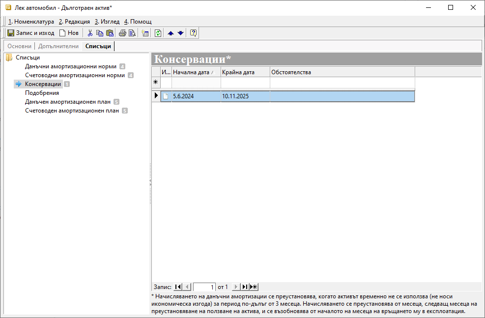{ class=align-center w=15cm }

## **Подобрения на ДА**

Подобрение на ДА е извършването на последващи разходи, свързани с актива, които увеличават неговата икономическа изгода. 
Разходите за извършване на подобрения подлежат на капитализиране - увеличават отчетната стойност на актива.

В системата сумата на извършените разходи се посочва в поле *Стойност*. Попълва се също *Дата на подобрението*.  Настройките ще откриете в картон на ДА, панел **Списъци » Подобрения**.  

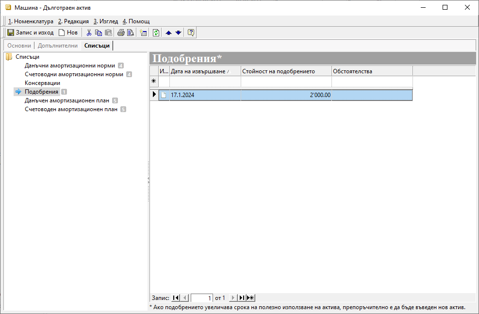{ class=align-center w=15cm }

> Данъчната амортизируема стойност се увеличава от началото на месеца, през който са завършени последващите разходи (чл. 63 от ЗКПО).  

След записване на промените системата актуализира данните в данъчния и в счетоводния амортизационен план.  

> Ако подобрението увеличава срока на полезно ползване на ДА, препоръчително е да се въведе нов актив.  

  