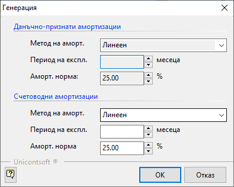
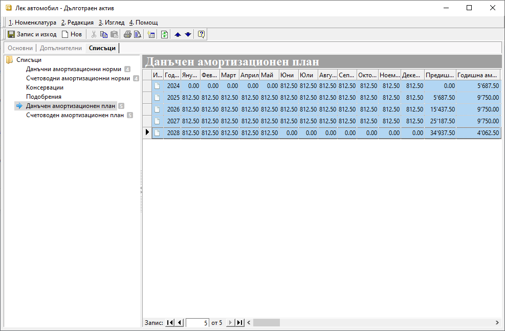
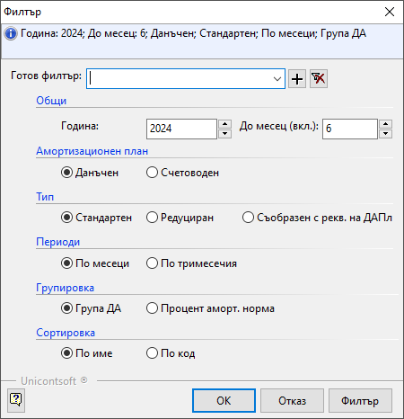
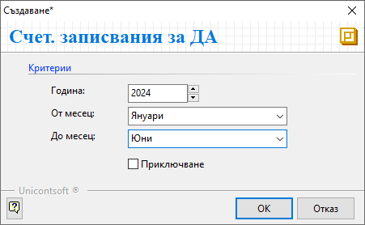
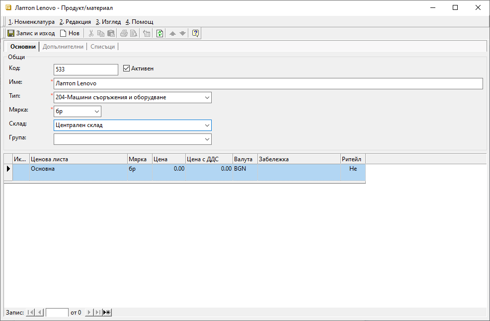
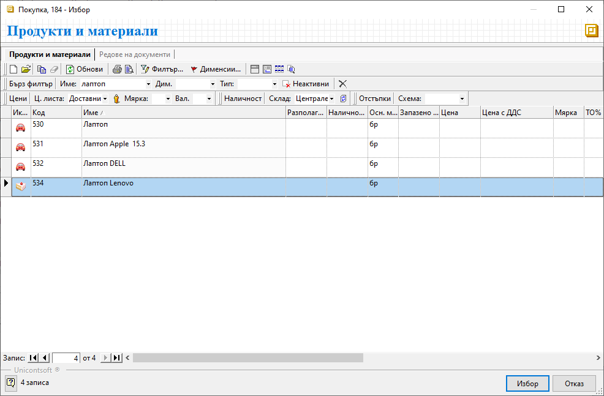
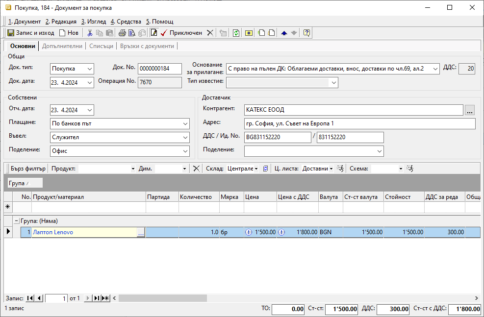
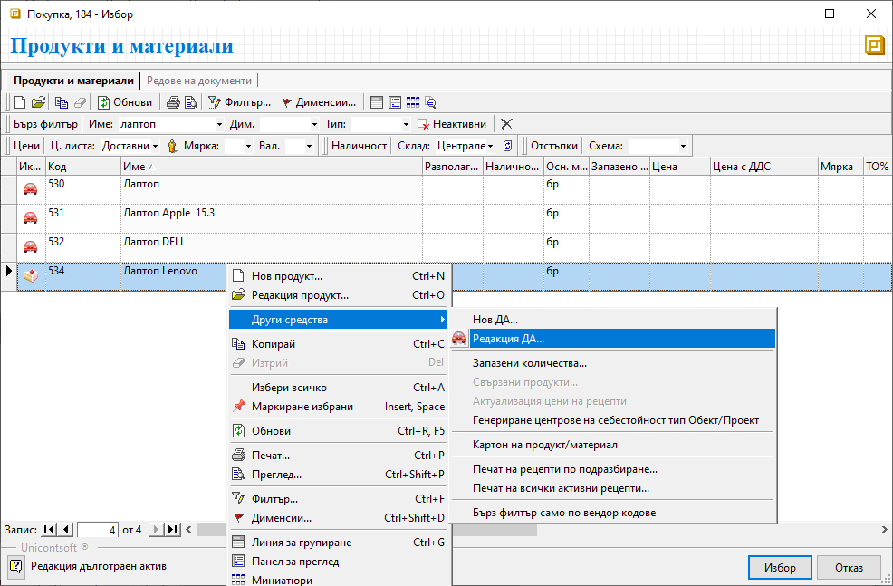
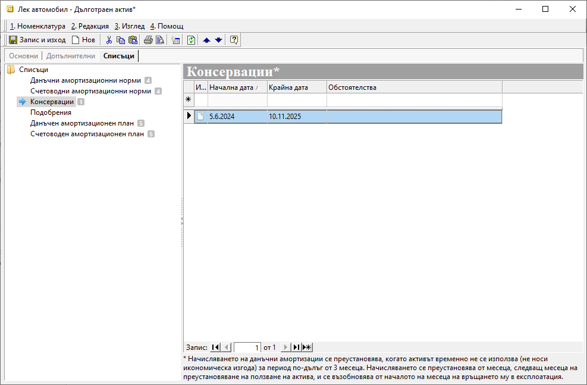

```{only} html
[Нагоре](000-index)
```

# **Дълготрайни активи**

- [Настройки](#настройки)  
- [Амортизация на ДА](#амортизация-на-да)  
- [Първоначално придобиване на ДА](#първоначално-придобиване-на-да)  
- [Печат на протокол за въвеждане в експлоатация](#печат-на-протокол-за-въвеждане-в-експлоатация)  
- [Консервации на ДА](#консервации-на-да)  
- [Подобрения на ДА](#подобрения-на-да)  

## **Настройки**

**Дълготрайни активи** е отделна номенклатура, която системата третира аналогично на **Продукти и материали** и затова попадат в общ списък. Така, въпреки специфичните си настройки, активите може да се използват в документите за покупка и продажба.  
При [въвеждането на ДА](../001-ref/001-nomenclatures/004-assets.md) системата изисква някои задължителни реквизити, отбелязани с червен маркер. Такива са наименование на *ДА*, стойност и дата на придобиване, дата на въвеждане в експлоатация, счетоводна група и категория(по чл. 55 от ЗКПО).  

Счетоводни групи, методи за амортизация, коефициент на преоценка и категории по чл.55 (ЗКПО) могат да бъдат въведени и редактирани от **Номенклатури || Референтни номенклатури || Дълготрайни активи**. Тези настрийки са базови за *ДА* и трябва да се направят преди създаването на нов актив.  
Ако все още не сте направили настройките, темата [Как да въведем Групи ДА](https://www.unicontsoft.com/cms/node/152) ще е полезна. По описания в нея начин се въвеждат и останалите базови за *ДА* настройки.  

Нека въведем в системата един примерен актив - *Лек автомобил*, който попада в *Категория V* с амортизационната норма 25% на година.  
Автомобилът е закупен на 23.04.2024 г. за 39'000 лв. и ще бъде въведен в експлоатация на 01.05.2024 г.  

{ class=align-center w=15cm }

> Препоръчително е да запишете въведените до момента данни, преди да продължите с настройките.  

В **Допълнителни** системата е попълнила автоматично задължителните полета, свързани с данъчния и със счетоводния амортизационен план.  
Тук може да добавите също сума за неамортизируема остатъчна стойност на *ДА*.  

```{tip}
За "ДА" могат да се настроят също и различни дименсии, както е при Продукти и материали.
```

{ class=align-center w=15cm }

На третия панел **Списъци** ще откриете настройки за подобрения, консервации и амортизационните норми и план на *ДА*.  
Докато първите две са възможни при определени обстоятелства, то амортизацията е неизбежна след пускане на актива в експлоатация.  
Затова следва да направите нужните настройки за амортизационни норми и амортизационен план.  

Използвайки бутона [**Генериране**] в лентата с инструменти ще изберете амортизационна норма (или период на експлоатация) и метод на амортизация. 

{ class=align-center w=15cm }

Системата предлага по подразбиране *Линеен метод* на амортизация. При него годишните амортизационни квоти са еднакви за целия амортизационен период.  
За генерацията на амортизационен план трябва да попълните или поле *Период на експлоатация*, или *Амортизационна норма*. След което потвърждавате избора и записвате промените.

{ class=align-center }
 
Вече може да разгледате генерираните примерни амортизационни планове за този *ДА* - данъчен и счетоводен.

{ class=align-center w=15cm }

```{tip}
Ако пожелаете да редактирате амортизационните норми в избран *ДА*, респ. амортизационния му план, може да повторите описаната вече генерация.
```

Системата дава възможност за избор от следните методи на амортизация:  
 
- *Константно дегресивен метод* със снижаващ се остатък.  
- *Линеен метод* с годишните амортизационни квоти, които са еднакви за целия амортизационен период.  
- *Метод на сумата на числата*  
- *Неравномерно дегресивен метод*  
- *Прогресивен нелинеен метод*  
- *Произволен метод*  

## **Амортизация на ДА**

Генерираните в системата амортизационни планове могат да бъдат видени отделно за всеки актив. Както споменахме, това става във формата за редакция на избрания *ДА*.  
Също така има справка, включваща всички активи, достъпна в [**Счетоводство || Печат на амортизационен план**](../003-rep/002-accounting/008-asset-depreciation-plan-printing.md).  
Във филтъра може да изберете вида и типа на амортизационния план, период и други.  

{ class=align-center }

Справката, която се зарежда според настроените филтри, включва всички *ДА* със състояние *Активен*.  


> Системата разполага с инструмент за автоматична генерация на счетоводни документи с предложените амортизационни квоти. Намира се в меню **Счетоводство || Генерация на ДА**.

За да бъдат създадени счетоводни записвания за всички активни *ДА*, трябва да потвърдите желания период.  
Ако поставите отметка за *Приключване*, системата ще валидира счетоводните документи. Пропуснете тази настройка, ако предпочитате да приключите документите ръчно, след като сте проверили тяхното съдържание.  

{ class=align-center }

По този начин в меню **Счетоводство || Счетоводни документи** са генерирани по месеци документи от тип **АмПл**.  
От момента на приключването им, данните в тях ще бъдат видими в счетоводните справки.  

## **Първоначално придобиване на ДА**

Първоначалното придобиване на *ДА* се отразява в системата с въвеждане на документа за неговата покупка. Ако предварително не сте създали актива като номенклатура, може да го направите и по време на обработка на покупката.  
Ще покажем такова въвеждане на *ДА* с примерна фактура за покупка на лаптоп Lenovo на стойност 1800 лв.    
За целта в **Търговска система || Документи за покупка** създавате [нов документ](../002-docs/002-trade-system/001-orders-sales-purchase-documents/002-create-purchase-documents.md).

> В този случай отново важи правилото, когато работите с вътрешнофирмени документи, да започнете с документ тип **Покупка**.  

За да въведете *ДА*, на реда за нов запис отваряте списъка с продукти. Създавате нов продукт *Лаптоп Lenovo* от бутона в лентата с инструменти или с десен бутон на мишката - **Нов продукт**.  
Обзавеждате нужните реквизити, след което записвате настройката.  
Имайте предвид, че за да настроите поле *Тип*, предварително трябва да сте въвели [типове продукти](https://www.unicontsoft.com/cms/node/9).  

{ class=align-center w=15cm }

В списъка с продукти вече фигурира *Лаптоп lenovo*, като ще забележите разлика между неговата икона и тези на вече въведени *ДА*. Така системата разграничава номенклатурите, отговарящи на специфичните изисквания и настроени като *ДА*.  

> Въведените *ДА* през **Номенклатури || Дълготрайни активи** се визуализират и в списък **Продукти и материали**.  
> Обратното не е валидно.  

{ class=align-center w=15cm }

Според разпределените роли и правата в системата е възможно номенклатурата **Дълготрайни активи** да не е достъпна за всеки.  
Именно затова, до момента имате въведен *Лаптоп Lenovo* като продукт, което е достатъчно да завършите въвеждането на покупката.  

{ class=align-center w=15cm }

На следващ етап настройката на продукта *Лаптоп Lenovo* трябва да бъде довършена, така че системата да го третира като дълготраен актив.  
Това става от списък **Продукти и материали**. С десен бутон на мишката върху продукта избирате **Други средства || Редакция ДА**.  

{ class=align-center w=15cm }

В отворената форма за редакция добавяте настройките, показани в началото на темата.  

## **Печат на протокол за въвеждане в експлоатация**  

Системата дава възможност за печат на Протокол за въвеждане в експлоатация на дълготраен амортизируем актив, съгл. чл. 58 от ЗКПО.  
За целта, от картон на ДА (форма за редакция на ДА) използвайте бутоните *Преглед* или *Печат* от лентата с инструменти. Автоматично в протокола се обзавеждат нужните полета според настроените в ДА данни.  

{ class=align-center w=15cm }

## **Консервации на ДА**

Когато дълготраен актив е изведен от употреба за минимум дванадесет месеца, без значение от причините, се допуска неговата консервация. След изтичането на периода на консервация се очаква неговото повторно въвеждане в употреба.  
Начисляването на данъчни амортизации се преустановява от месеца, следващ месеца на преустановяване на използване на ДА. Начисляването се възобновява от началото на месеца на връщането на актива в експлоатация. Данъчният амортизируем актив не се отписва от данъчния амортизационен план.  

Период на консервация може да настроите от форма за редакция на ДА в **Списъци || Консервации**. Тук посочете началната и крайната дата на извеждане от експлоатация, като може да добавите коментар с обстоятелствата, налагащи това.  

{ class=align-center w=15cm }

## **Подобрения на ДА**

Подобрение на ДА е извършването на последващи разходи, свързани с актива, които увеличават неговата икономическа изгода. 
Разходите за извършване на подобрения подлежат на капитализиране - увеличават отчетната стойност на актива.

В системата сумата на извършените разходи се посочва в поле *Стойност*, избира се и *Дата на подобрението*. Настройките ще откриете в картон на ДА, панел **Списъци || Подобрения**.  

{ class=align-center w=15cm }

В чл. 63 от ЗКПО е посочено, че данъчната амортизируема стойност се увеличава от началото на месеца, през който са завършени последващите разходи.  

{ class=align-center w=15cm }

След записване на промените системата актуализира данните в данъчния и в счетоводния амортизационен план.

> Ако подобрението увеличава срока на полезно ползване на ДА, препоръчително е да се въведе нов актив.  

---  

- Въведените *ДА* през **Номенклатури || Дълготрайни активи** се визуализират и в списък **Продукти и материали**. Тоест, *ДА* могат да участват в търговски документи, както участват продуктите.  
- Задължителни са настройките за амортизационни норми и амортизационен план на *ДА*. 
- Всички настроени *ДА* участват в справката **Печат на амортизационен план*.   
- Системата разполага с инструмент за автоматична генерация на счетоводни документи с предложените амортизационни квоти.  
- Възможност за печат на Протокол за въвеждане в експлоатация на дълготраен амортизируем актив, съгл. чл. 58 от ЗКПО
  