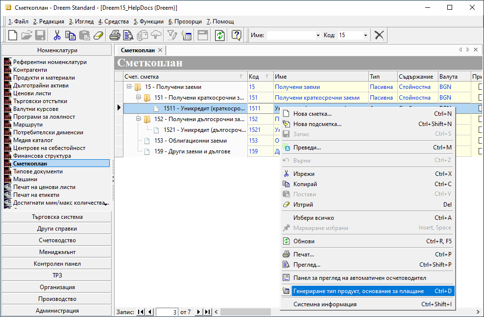
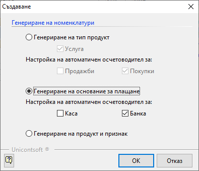
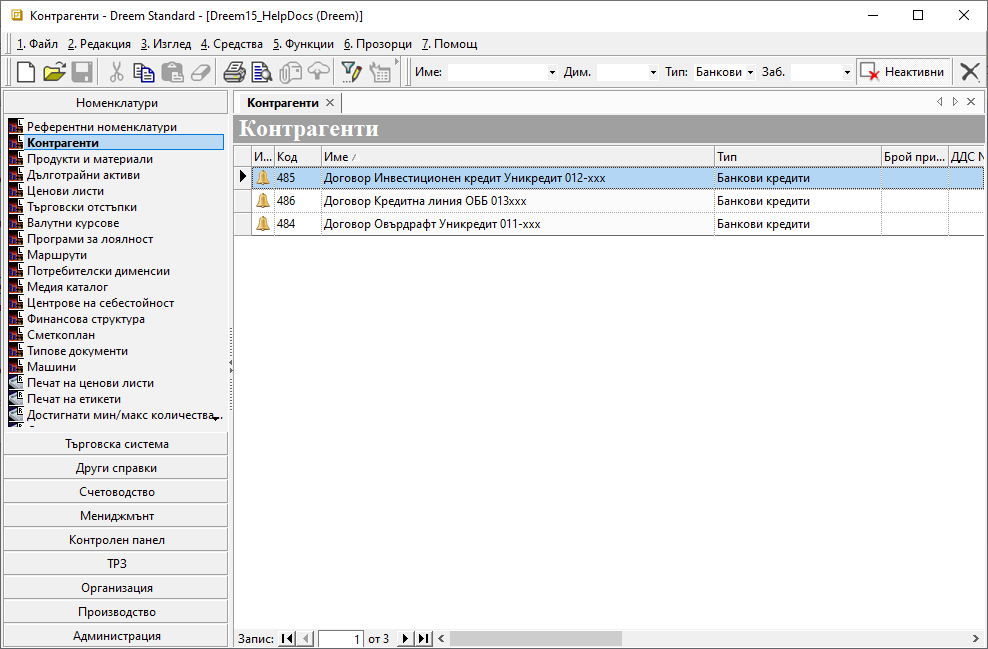
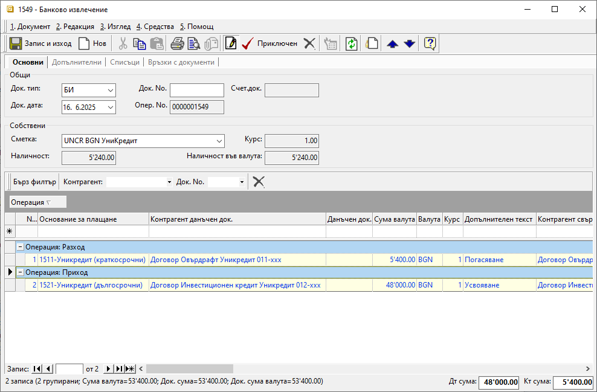
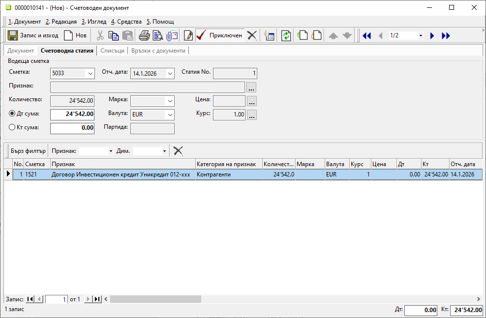

```{only} html
[Нагоре](000-index)
```
 
# Получени банкови заеми  

- [Въведение](https://docs.unicontsoft.com/guide/erp/005-how-to/011-bank-loans.html#)  
- [Настройки](https://docs.unicontsoft.com/guide/erp/005-how-to/011-bank-loans.html#id2)  
- [Усвояване и погасяване на получен заем](https://docs.unicontsoft.com/guide/erp/005-how-to/011-bank-loans.html#id3)  
- [Счетоводни документи](https://docs.unicontsoft.com/guide/erp/005-how-to/011-bank-loans.html#id4)  

Получените краткосрочни и дългосрочни заеми се регистрират в системата чрез банкови документи. Те могат да бъдат отчитани отделно по договори, като се осчетоводяват автоматично. В тази връзка е необходимо да се дефинират някои настройки.   

В индивидуалния сметкоплан е удобно да се добавят отделни подсметки по банки в **група 15 - Получени заеми**. Чрез вграден инструмент на системата от тях могат да се настройват свързаните автоматични осчетоводявания и основания за плащане.  

Удобна възможност за детайлно отчитане по отделни договори за заем е използването на счетоводни признаци. За целта се създава настройка отделно за всеки договор посредством номенклатура **Контрагенти**.  

## Настройки

1) **Сметкоплан**  —  Настройките на индивидуалния сметкоплан са достъпни в **Номенклатури || Сметкоплан**. Създават се отделни счетоводни подсметки за краткосрочни и за дългосрочни заеми по банки. Процесът по създаване на сметка/подсметка е показан стъпка по стъпка в [Как да настроим Сметкоплан](https://docs.unicontsoft.com/guide/erp/001-ref/002-accounting/001-chart-of-acc.html).  

2) **Свързани настройки**  —  От новосъздадените подсметки могат да бъдат дефинирани автоматично свързаните с тях настройки - типове продукти, основания за плащане, автоматично осчетоводяване.  
Опцията **Генериране тип продукт, основание за плащане** е достъпна с десен бутон на мишката върху реда с избраната счетоводна сметка. Това отваря формата за генериране на номенклатури.  

{ class=align-center w=15cm }

3) **Генериране на номенклатури**  —  От формата за създаване се маркират **Генериране на основание за плащане** и **Настройка на автоматичен осчетоводител: Банка (и/или Каса)**. По този начин едновременно се създават ново основание за плащане и настройка за автоматично осчетоводяване с избраната подсметка (1511, 1521 и т.н.).   

В последствие основанието за плащане се използва в банкови/касови документи, които се осчетоводяват на база настройките в **Автоматичен осчетоводител**.  

{ class=align-center }

След маркиране на избраните опции, изпълнението им се потвърждава с бутона [**Ок**].  

4) **Контрагенти**  —  Настройката се прави във връзка с отчитането по счетоводни признаци.  
Тя е достъпна в **Номенклатури || Референтни номенклатури**, където се създава нов тип в **Типове контрагенти** (напр. Банкови кредити). Настройката е еднократна.  

Следва [добавяне на нов контрагент](https://docs.unicontsoft.com/guide/erp/001-ref/001-nomenclatures/002-contragents.html) с номер на договора за заем. При него задължително в реквизит **Тип на контрагента** се използва новосъздаденият тип *Банкови кредити*.  

{ class=align-center w=15cm }

## Усвояване и погасяване на получен заем

Усвояването на получен банков заем и погасяване по главницата се отразяват при въвеждане на банково извлечение. Това се извършва от **Търговска система || Банкови документи**.  
В извлечението се попълват някои задължителни полета, като се използват специално създадените основания за плащания за получени заеми.  

- **Контрагент данъчен док./Контрагент свързан док.**  —  В тези колони се избира контрагент, който отговаря на договора, за който се регистрира усвояване/погасяване на банков заем.  

{ class=align-center w=15cm }

- **Сума Валута**  — В тези полета се попълва сумата на прихода/разхода.  

- **Операция**  —  Чрез избор на операция се определя посоката на плащането.  
Когато реализираното плащане е усвояване на банков заем, се избира операция *Приход*. И обратното - при погасяване се избира операция *Разход*.  

_ **Приключен** — Чрез бутона в лентата с инструменти документът се валидира за системата. На този етап може да се генерира автоматично счетоводното записване. При него системата прилага текущите настройки на **Автоматичен осчетоводител**.  
 
## Счетоводни документи

Когато към БИ има генериран счетоводен запис, той е достъпен за преглед от панел **Връзки с документи**.  

Усвояването на получен заем е отразено в приходната счетоводна статия, докато погасяването е в отделна счетоводна статия.  

{ class=align-center w=15cm }

