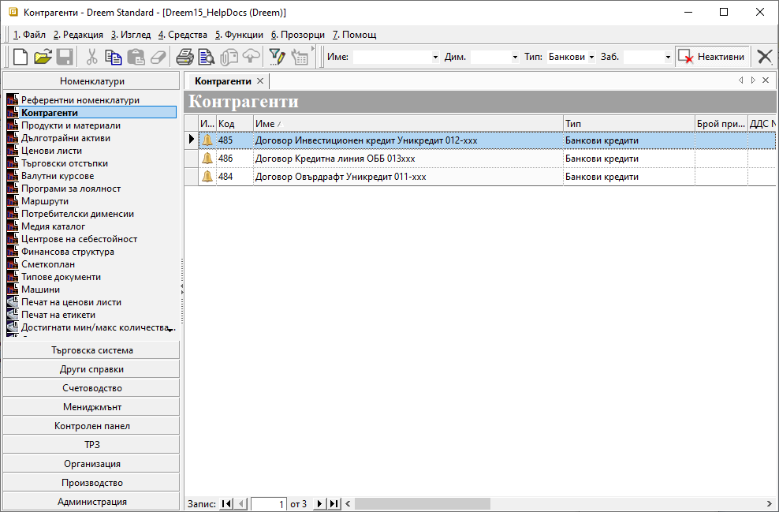

```{only} html
[Нагоре](000-index)
```
 
# **Отчитане на разходи за лихви по банкови заеми**  

- [Въведение](#въведение)  
- [Настройки](#настройки)  
- [Въвеждане на документи с разходи за лихви](#въвеждане-на-документи-с-разходи-за-лихви)  
- [Счетоводни документи](#счетоводни-документи)  


## **Въведение**  

Дължимите лихви по банкови заеми се регистрират като разход в системата чрез документи за покупка. Това позволява отчитане по центрове на себестойност. В тази връзка е необходимо да се дефинират някои настройки.  

В индивидуалния сметкоплан е удобно да се добавят отделни подсметки за различните разходи за лихви в **група 62 - Финансови разходи**. С помощта на вграден инструмент на системата чрез тях могат да се настройват автоматични осчетоводявания и настройки на свързаните номенклатури.  

Удобна възможност за детайлно отчитане на разходите за лихви по договори за заем е използването на счетоводни признаци. За целта се създава настройка отделно за всеки договор от номенклатура Контрагенти.  

## **Настройки**

1) **Сметкоплан**  —  От меню **Номенклатури || Сметкоплан** се създават отделни счетоводни подсметки по видове разходи за лихви (напр. *62101 - Разходи за лихви - по краткосрочни заеми в лева*, *62102 - Разходи за лихви - по дългосрочни заеми в лева*).  
Процесът по създаване на сметка/подсметка е показан в темата [**Сметкоплан**](../001-ref/002-accounting/002-chart-of-acc.md).  

2) **Свързани настройки**  —  От новосъздадените подсметки могат да бъдат дефинирани автоматично свързаните с тях настройки - типове продукти, основания за плащане, автоматично осчетоводяване.  
Опцията **Генериране тип продукт, основание за плащане** е достъпна с десен бутон на мишката върху реда с избраната счетоводна сметка. Това отваря формата за генериране на номенклатури.  

{ class=align-center }

3) **Генериране на номенклатури**  —  от формата за създаване се маркират **Генериране на основание за плащане** и **Настройка на автоматичен осчетоводител: Банка (и/или Каса)**. По този начин едновременно се създават ново основание за плащане и настройка за автоматично осчетоводяване с избраната подсметка.  
След като избраните опции са маркирани, изпълнението им се потвърждава с бутон [**Ок**].  
По същия начин се генерират номенклатури и за всички подсметки.  

В последствие основанието за плащане се използва в банкови/касови документи, които се осчетоводяват на база настройките в [**Автоматичен осчетоводител**](../001-ref/002-accounting/003-acc-wizard.md).  

4) **Продукти**  —  Отделно за всеки вид лихва е необходимо да се създаде нов продукт, чийто тип е услуга - напр. *Лихва дългосрочни заеми*, *Лихва краткосрочни заеми* и подобни.  
Настройката е достъпна от [**Номенклатури || Продукти и материали**](../001-ref/001-nomenclatures/003-items.md).  

{ class=align-center w=15cm }

5) **Контрагенти**   —  Настройката се прави във връзка с отчитането по счетоводни признаци.  
Достъпна е от **Номенклатури || Референтни номенклатури**, където се създава нов тип в *Типове контрагенти* (напр. Банкови кредити). Настройката е еднократна.  
Следва да се добави нов контрагент с номер на договора за заем. Задължително в реквизит **Тип** на контрагента се използва новосъздаденият *Банкови кредити*.  

{ class=align-center w=15cm }

6) **Шаблон покупки**  —  Настройката е необходима за автоматичната генерация на покупки, с които се отчитат разходите за лихви по центрове на себестойност. Тя е достъпна от [**Търговска система || Документи за покупка**](../002-docs/002-trade-system/001-orders-sales-purchase-documents/002-create-purchase-documents.md).  
Създава се отделна покупка-шаблон за всеки от вече настроените продукти -  *Лихва дългосрочни заеми*, *Лихва краткосрочни заеми*. Използва се стара дата (напр. 01.01.1900 г.) и основание за прилагане **Не участва в дневниците**.  

От реда за нов запис се избира един от продуктите за разходи за лихви. За колона **Количество** се попълва 1 брой. Документът за покупка остава с нулева стойност и се валидира (приключва).  

Настройките, свързани с центрове на себестойност, са достъпни в панел **Списъци**.  

{ class=align-center w=15cm }

7) **Настройки за генерация от шаблон**  —  За автоматичната генерация на покупки с разходи за лихви е необходимо всички въведени шаблони да бъдат свързани със съответстващото им **Основание за плащане**.   Настройката е достъпна в **Номенклатури || Референтни номенклатури || Основания за плащане** в колона **Шаблон за генериране на покупка**.  
Така напр. ред с основание *62101 - Разходи за лихви по краткосрочни заеми* се свързва с документ-шаблон, съдържащ продукт *Лихви по краткосрочни заеми*.  

{ class=align-center w=15cm }

## **Въвеждане на документи с разходи за лихви**

Разходите за лихви по банкови заеми се отчитат с въвеждане на банкови документи. В тях задължително се използват специално настроените основания за плащане.  

- **Контрагент данъчен док./Контрагент свързан док.** —  В тези колони задължително се избира контрагент, който отговаря на договора, за който се регистрира разход за лихви. Системата ще използва контрагента в последващата генерация на покупка с разхода за лихви.  

{ class=align-center w=15cm }

- **Сума Валута**  — В полето се попълва сумата на разхода за лихви.  

- **Операция**  —  Чрез избор на операция в това поле се определя посоката на плащането. В случая се избира операция *Разход*.  

- **Генериране на разходен документ от шаблон**  — При коректно попълнени полета в банковия документ опцията **Генериране на разходен документ от шаблон** се активира чрез десен бутон върху съответния ред.  

{ class=align-center }

При тази генерация системата създава нова покупка за продукта, обвързан с избраното на реда в БИ основание за плащане.  
Документът за покупка се генерира на база настроения шаблон и избраните в него центрове на себестойност.  
Новосъздадената покупка е достъпна в колона **Свързан док** или от **Търговска система || Документи за покупка**.

- **Приключен**  —  Чрез бутона в лентата с инструменти документът се валидира за системата. На този етап може да се генерира автоматично счетоводното записване. При него системата прилага текущите настройки на [**Автоматичен осчетоводител**](../001-ref/003-accounting/002-acc-wizard.md).  

## **Счетоводни документи**

Когато към БИ има генериран счетоводен запис, той е достъпен за преглед от панел **Връзки с документи**.  

{ class=align-center w=15cm }
