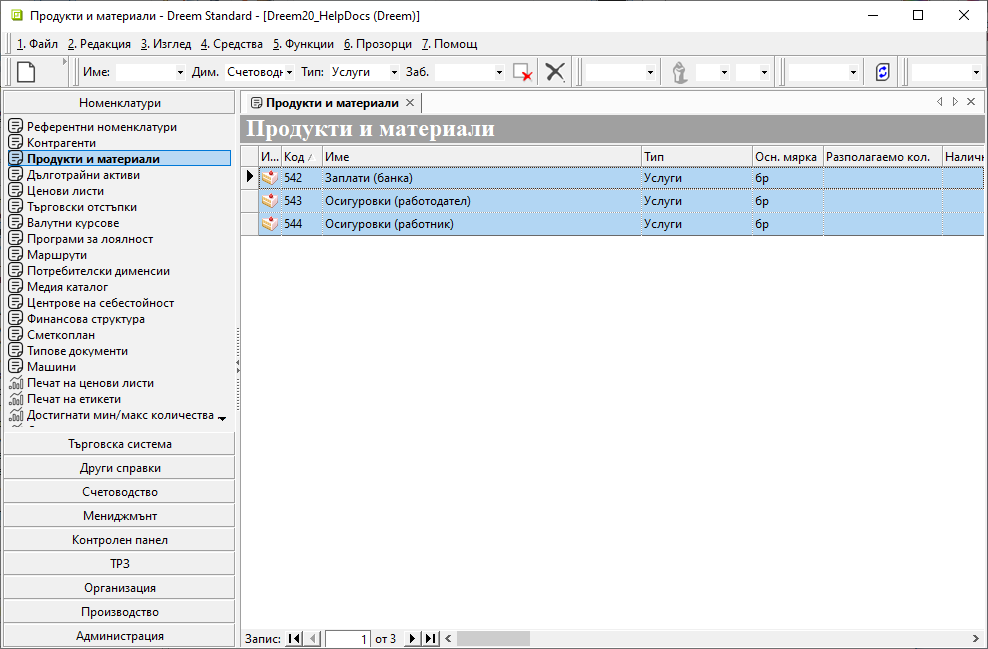
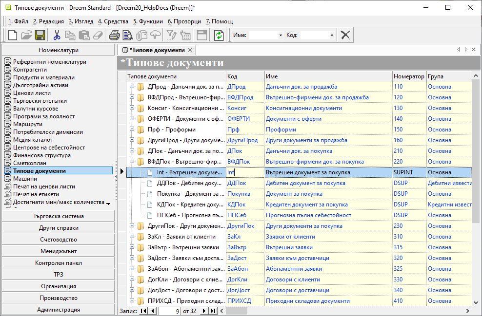
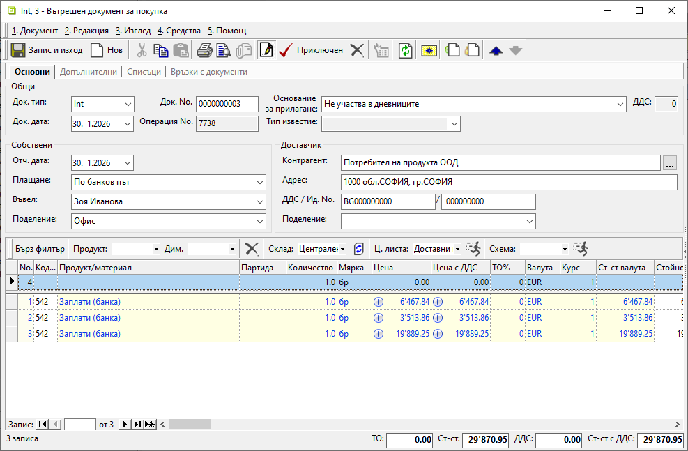
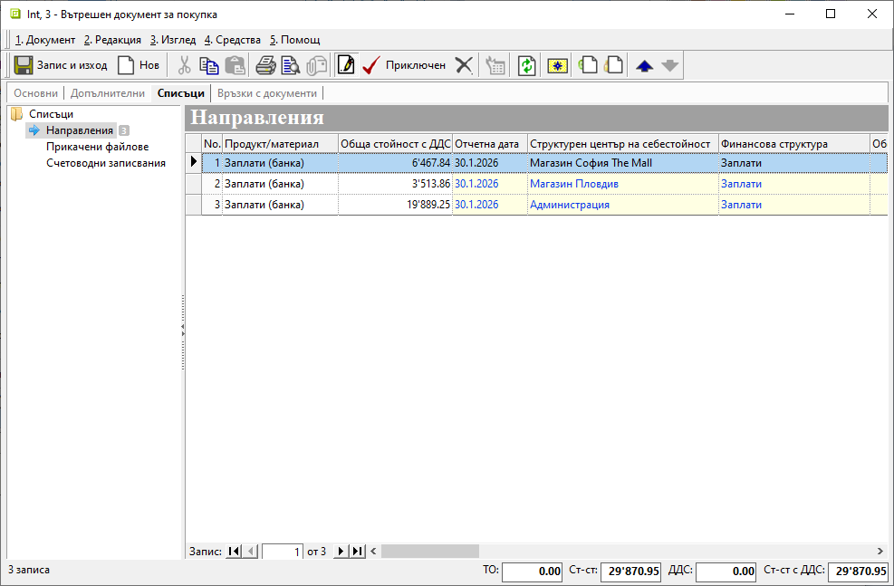
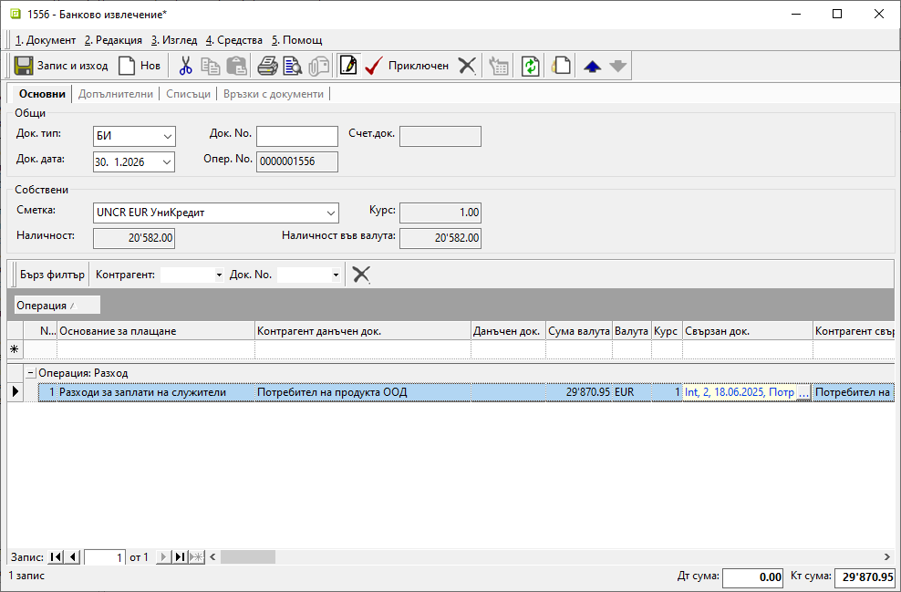
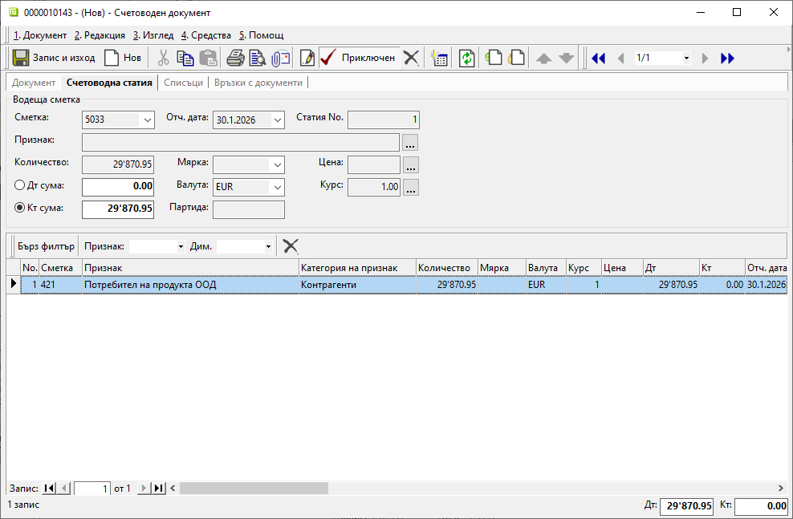
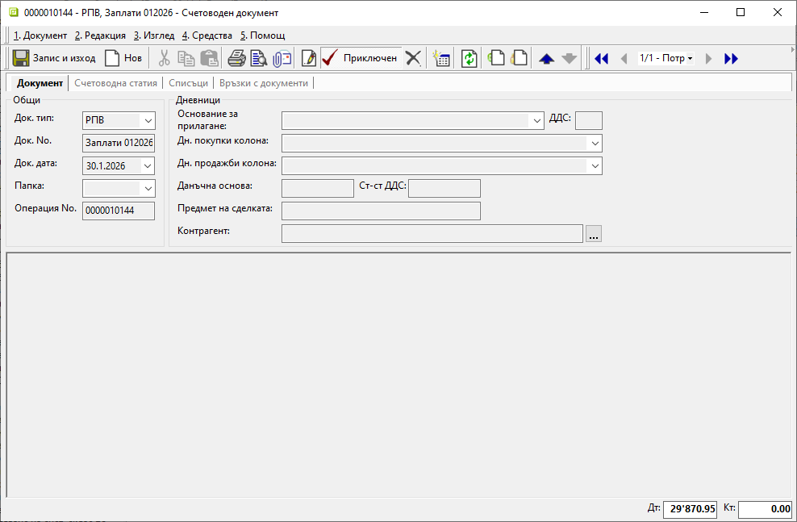
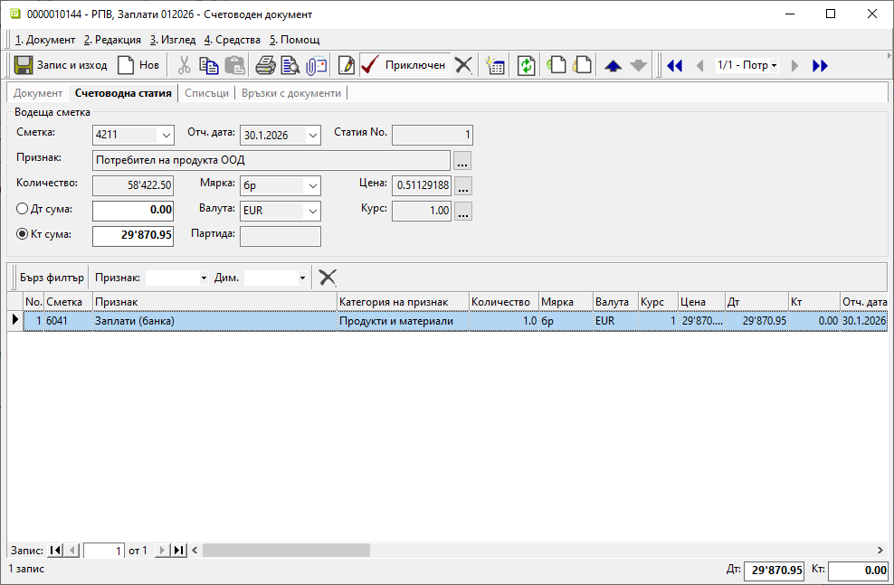

```{only} html
[Нагоре](000-index)
```
 
# **Отчитане на разходи за заплати по кост центрове** 

- [Въведение](#въведение)
- [Настройки](#настройки)  
- [Въвеждане на документи в Търговска система](#Документи-в-търговска-система)  
- [Счетоводни документи](#счетоводни-документи)  

## **Въведение**

Темата представя вариант за отчитане на разходите за заплати и осигуровки, разпределени по кост центрове. Това позволява управление и анализ на бюджетите по центрове на себестойност.   

В тази връзка предварително се дефинират определени настройки.  

## **Настройки**

1) **Продукти**  

Необходимо е да се създадат отделни продукти от тип услуга за заплати и осигуровки - напр. *Заплати (банка)*, *Осигуровки (работодател)*, *Осигуровки (работник)*. Може да направите това от меню **Номенклатури » Продукти и материали**.    

{ class=align-center w=15cm }

2) **Центрове на себестойност**  

[Кост центровете](../001-ref/001-nomenclatures/012-cost-centers.md) служат за аналитично проследяване на приходи и разходи за отделни единици в рамките на организацията.  
Номенклатурата трябва да бъде предварително дефинирана. В последствие настройките се прилагат в документите за покупка и са достъпни в справки.  

3) **Типове документи**  

> Тази настройка се прилага във връзка с потребителски права за достъп до документи. Когато няма да се прилагат ограничения на достъпа, създаването на нов тип документ не е необходимо. Може да се използва стандартен документ **Покупка**.  

[Нов тип документ](../001-ref/001-nomenclatures/014-doc-types.md#настройка-на-типове-документи) може да създадете от **Номенклатури » Типове документи**.  

Пример:  
Добавете нов тип вътрешнофирмен документ **Int**-*Вътрешен документ за покупка*. На реда за въвеждане се обзавеждат колони **Код**: *Int*, **Име**: *Вътрешен документ за покупка*, **Номератор**: *SUPINT*,**Посока**: *Приходен*.  

{ class=align-center w=15cm }

## **Документи в Търговска система**

1) **Документи за покупка**  

Отчитането на разходи за заплати става чрез въвеждане на вътрешнофирмени [документи за покупка](../002-docs/002-trade-system/001-orders-sales-purchase-documents/002-create-purchase-documents.md). В **Търговска система » Документи за покупка** се въвеждат отделни документи за работни заплати и за осигуровки.  

Реквизити в покупките, на които задължително трябва да обърнете внимание:   
    - **Док. тип** - Използва се специално настроеният тип документ **Int**-*Вътрешен документ за покупка*.    
    - **Основание за прилагане** - Задължително се избира такова, за което не се начислява ДДС (напр. *Не участва в дневнниците*).  
    - **Контрагент** - Избира се настроеният с тип **Потребител на продукта** контрагент.   
    - **Продукт/материал** - При въвеждане на сумите за заплати се използва специално създаденият продукт *Заплати (банка)*.  
    Разходите за осигуровки се регистрират в отделен документ, като се използват създадените за целта продукти *Осигуровки (работодател)* и *Осигуровки (работник)*.  

{ class=align-center w=15cm }   

2) **Направления**  

Когато разходите се отчитат по кост центрове, сумите за заплати и осигуровки трябва да се разделят според тях.
Сумата за всеки структурен център се въвежда на отделен ред. Това позволява всеки отделен разход да бъде отнесен към различен разходен център.  

Разпределението по кост центрове може да направите от раздел **Списъци » Направления**

{ class=align-center w=15cm }

> Накрая приключвате всяка покупка без генериране на свързани документи.  

3) **Банкови документи**  

Направените по банков път плащания за заплати и осигуровки се регистрират чрез въвеждане на банкови извлечения. Това се извършва от меню **Търговска система » Банкови документи**.  

На реда за нов запис в нов документ се избира подходящото основание за плащане, свързано с настройките за автоматично осчетоводяване.  
В колона **Свързан док.** задължително се посочва предварително валидираната покупка. Това е документът за покупка, включващ заплатите или осигуровките, за които се изплаща сумата на реда.  

{ class=align-center w=15cm }

Документът се валидира чрез бутон [**Приключен**] в лентата с инструменти. Към него може автоматично да се генерира счетоводно записване спрямо текущите настройки на [**Автоматичен осчетоводител**](../001-ref/002-accounting/003-acc-wizard.md).  

## **Счетоводни документи**

Когато към БИ има генериран счетоводен запис, той е достъпен за преглед от панел **Връзки с документи**.   

{ class=align-center w=15cm }

Допълнително от меню **Счетоводство » Счетоводни документи** трябва да се въведе начислението на заплатите и осигуровките. Това става чрез отделни документи от тип **РПВ** за всяко едно от начисленията.  

Във всеки счетоводен запис от раздел **Документ** задължително се попълват реквизити с тип и дата на документа. В поле **Док. No** за по-добра организация може да се попълни  "заглавие" за документа, например *Заплати 052025*.  

> Всички полета в секция *Дневници* трябва да останат празни.  

{ class=align-center w=15cm }

В раздел **Счетоводна статия** се въвеждат счетоводните операции. 

{ class=align-center w=15cm }

Всички счетоводни документи трябва да бъдат валидирани чрез бутон [**Приключен**] в лентата с инструменти.  
