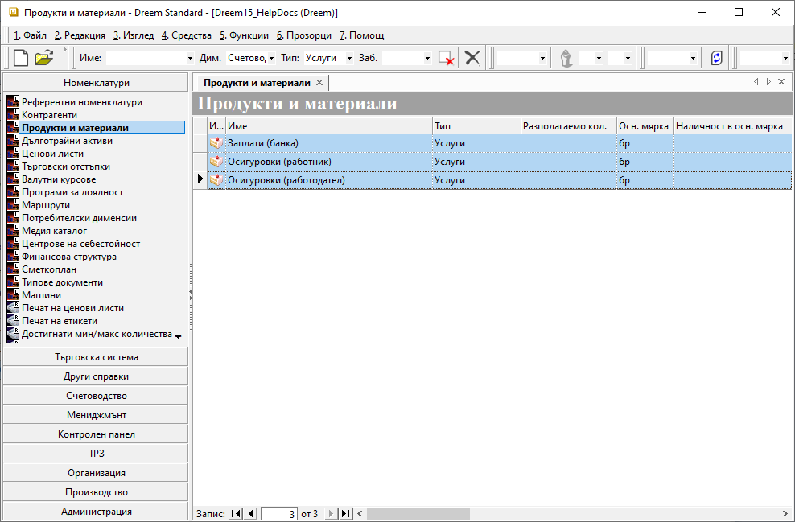
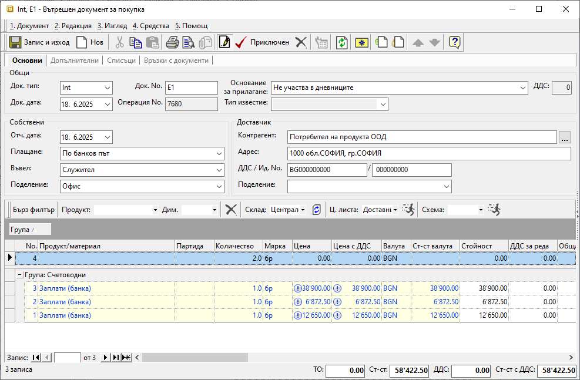
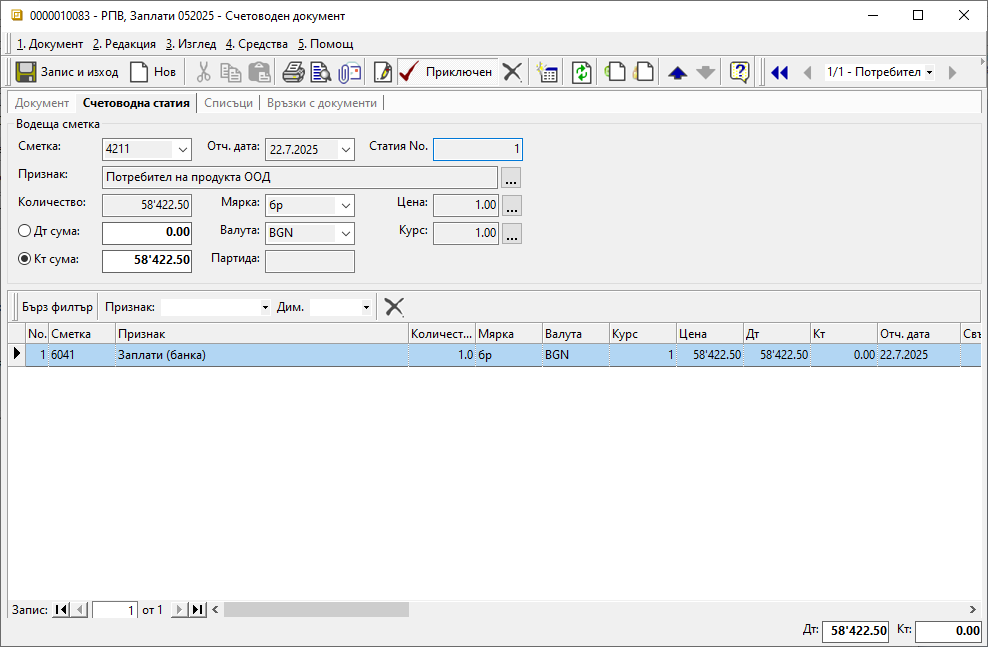

```{only} html
[Нагоре](000-index)
```
 
# Отчитане на разходи за заплати по центрове на себестойност 

- [Настройки](https://docs.unicontsoft.com/guide/erp/005-how-to/013-cost-center-payroll-expenses.html#id2)  
- [Въвеждане на документи в Търговска система](https://docs.unicontsoft.com/guide/erp/005-how-to/013-cost-center-payroll-expenses.html#id3)  
- [Генериране на счетоводни документи](https://docs.unicontsoft.com/guide/erp/005-how-to/013-cost-center-payroll-expenses.html#id4)  

В темата е представен вариант за отчитане на разходите за заплати и осигуровки, включващ опция за разпределянето им по центрове на себестойност. Това става чрез въвеждане на вътрешнофирмен документ за покупка. В тази връзка е необходимо предварително да се дефинират определени настройки.  

## **Настройки**

1) **Продукти**  —  От меню **Номенклатури || Продукти и материали** се създават отделни продукти от тип услуга за заплати и осигуровки - напр. За*плати (банка)*, *Осигуровки (работодател)*, *Осигуровки (работник)* и пр.  

{ class=align-center w=15cm }

2) **Типове документи**  —  Тази настройка се прилага във връзка с потребителски права за достъп до документи. Когато няма да се прилагат ограничения на достъпа, създаването на нов тип документ не е необходимо. Може да се използва стандартен документ **Покупка**.  

Нов тип документ се създава от **Номенклатури || Типове документи**. Например добавя се нов тип вътрешнофирмен документ - **Int - Вътрешен документ за покупка**. Това става с десен бутон върху групата **ВФДПок** и избиране на **Нов подтип документи...**. С това системата добавя отделен ред за въвеждане на нов тип документ. Обзавеждат се колони **Код**: *Int*, **Име**: *Вътрешен документ за покупка*, **Номератор**: *SUPINT*,**Посока**: *Приходен*.  
Направените модификации се запаметяват чрез бутон [**Запис**] в лентата с инструменти.  

{ class=align-center w=15cm }

## **Въвеждане на документи в Търговска система**

3) **Документи за покупка**  —  От меню **Търговска система || Документи за покупка** се въвеждат нови покупки отделно за работни заплати и за осигуровки.  
Това означава, че при въвеждане сума на заплатите в едната покупка, от реда за нов запис се използва специално създадения продукт *Заплати (банка)*.  
При въвеждане на разходите за осигуровки в следваща покупка се използват *Осигуровки (работодател)* и *Осигуровки (работник)* със съответните суми.   
Останалите реквизити, на които задължително трябва да се обърне внимание, са:   
    - **Док. тип** - Използва се специално настроеният тип документ *Int*.    
    - **Основание за прилагане** - За основание се избира задължително такова, за което не се начислява ДДС - *Не участва в дневнниците*.  
    - **Контрагент** - В полето с реквизит за контрагент от секция *Доставчик* се избира **Потребител на продукта**.   

{ class=align-center w=15cm }

4) **Центрове на себестойност**  —  Когато разходите се отчитат по центрове на себестойност, на отделни редове се въвеждат сумите за всеки структурен център. Това дава възможност в раздел **Списъци** всеки ред да бъде отнесен към различен разходен център.  

{ class=align-center w=15cm }

5) **Валидиране** —  Всяка покупка се валидира чрез бутон [**Приключен**] от лентата с инструменти, без да се генерират свързани документи.  

6) **Банкови документи**  —  Направените по банков път плащания за заплати и осигуровки се регистрират чрез въвеждане на банкови извлечения. Това се извършва от меню **Търговска система || Банкови документи**.  

На реда за нов запис в нов документ се избира подходящото основание за плащане, свързано с настройките за автоматично осчетоводяване.  
В колона **Свързан док.** задължително се посочва предварително валидираната покупка. Това е документът за покупка, включващ заплатите или осигуровките, за които се изплаща сумата на реда.  

{ class=align-center w=15cm }

7) **Валидиране** — Чрез бутон [**Приключен**] в лентата с инструменти документът се валидира. Към него може автоматично да се генерира счетоводно записване спрямо текущите настройки на **Автоматичен осчетоводител**.  

## **Счетоводни документи**

Когато към БИ има генериран счетоводен запис, той е достъпен за преглед от панел **Връзки с документи**.   

{ class=align-center w=15cm }

Допълнително от меню **Счетоводство || Счетоводни документи** трябва да се въведе начислението на заплатите и осигуровките. Това става чрез отделни документи от тип **РПВ** за всяко едно от начисленията.  

Във всеки счетоводен запис от раздел **Документ** задължително се попълват реквизити с тип и дата на документа. В поле **Док. No** за по-добра организация може да се попълни  "заглавие" за документа, например *Заплати 052025*.  

> Всички полета в секция *Дневници* трябва да останат празни.  

{ class=align-center w=15cm }

В раздел **Счетоводна статия** се въвеждат счетоводните операции. 

{ class=align-center w=15cm }

Всички счетоводни документи трябва да бъдат валидирани чрез бутон [**Приключен**] в лентата с инструменти.  
