```{only} html
[Нагоре](000-index)
```

# **Комплектуване и разкомплектуване**

- [Въведение](#въведение)
- [Настройки](#настройки)  
- [Комплектуване](#комплектуване)  
- [Разкомплектуване](#разкомплектуване)  

## **Въведение**

Системата разполага с механизъм за комплектуване (обединяване на компоненти в единна стокова единица) и разкомплектуване на продукт на съставните му части. Връзките между документите в тези процеси осигуряват пълна проследимост. На тази база се гарантира и коректността на цените - единичните по компоненти и общата за компелкт.  
Комплектуването и разкомплектуването се осъществяват на база настроени рецепти.  

## **Настройки**

За да функционира успешно генерацията на документи за комплектуване и разкомплектуване, са необходими отделни складови документи за тези операции. Настройката е достъпна от [**Номенклатури » Типове документи**](../001-ref/001-nomenclatures/014-doc-types.md).   

За комплектуване се използват специално настроените складови документи **ППРК**-*Приходен протокол за комплектуване* и **РПРК**-*Разходен протокол за комплектуване*. Те трябва да бъдат със задължително дефинирана настройка в колона **Група: Комплектуване**.  

При разкомплектуване се използват настроените складови документи **ППР**-*Приходен протокол за разкомплектуване* и **РПР**-*Разходен протокол за разкомплектуване*. Те трябва да бъдат със задължително дефинирана настройка за **Група: Разкомплектуване**.  

> И за четирите типа документи е препоръчително поставяне на отметка в колона **Изисква контрагент Потребител на продукта**. Това автоматично ще обзаведе реквизит **Контрагент** в приходните и разходните протоколи за комплектуване и разкомплектуване.  

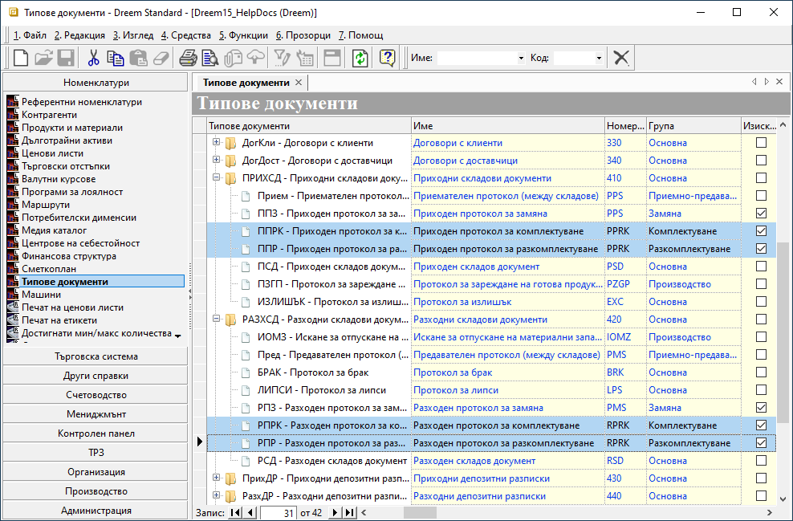{ class=align-center w=15cm }

Следващата задължителна нстройка е добавяне на **Рецепта** за продукта, който ще обединява компоненти. Системата позволява въвеждане на няколко рецепти за продукт.  

Настройката е достъпна във форма за редакция на [**Продукт/материал**](../001-ref/001-nomenclatures/003-items.md) от раздел **Списъци**. С десен бутон на мишката върху опция *Нова рецепта* се отваря форма за редакция **Производство и придобиване**. В поле **Име** може да се въведе наименование за рецептата и да се определи за какво количество в основна мярка на продукта се отнася.  

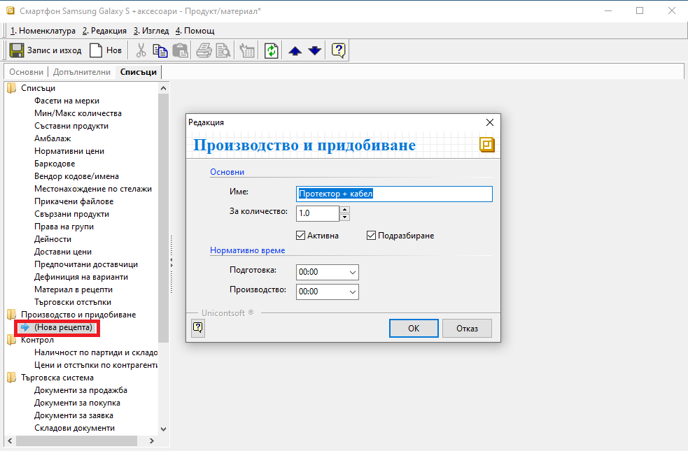{ class=align-center w=15cm }

Изборът се потвърждава с бутон [**OK**]. С системата активира празен ред за добавяне на нов запис. Чрез него се въвежда списък на съставните компоненти с мерни единици и количества.  

> Ако сред компонентите има основен продукт, който формира голяма част от стойността на комплекта, той задължително се въвежда на **1-ви ред** с **нулева цена**.    

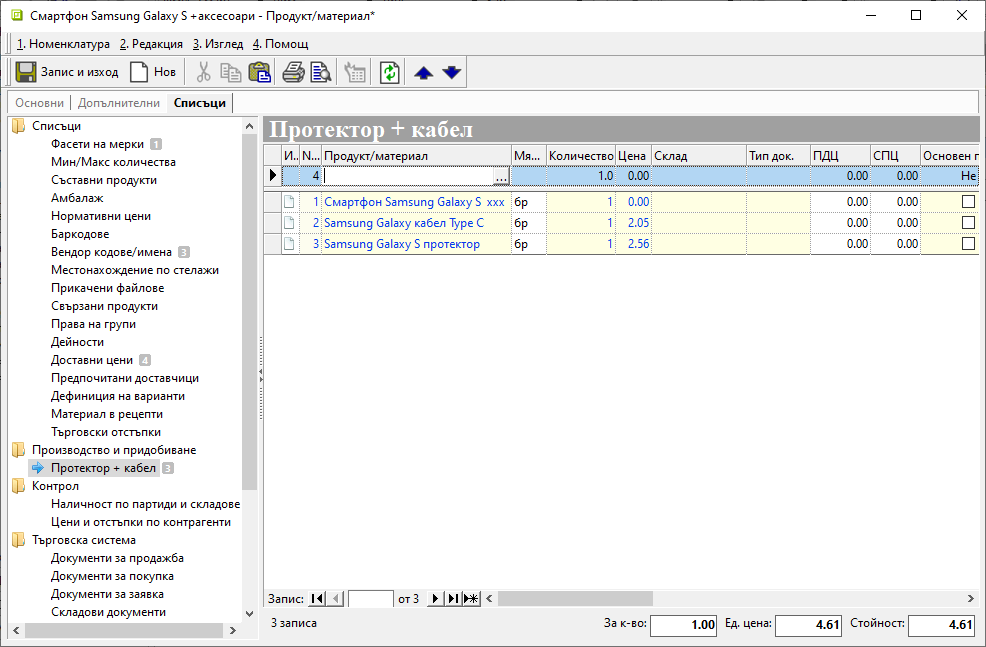{ class=align-center w=15cm }

За останалите компоненти в колона **Цена** могат да бъдат попълнени единичните цени без ДДС, които системата да предлага в **ППР**-*Приходен протокол за разкомплектуване*.  
Когато в рецептата липсва настройка за цени, колона **Цена** в **ППР** се попълва ръчно.  

## **Комплектуване**

За комплектуване е необходимо да създадете *Приходен протокол за комплектуване*. В документа избирате продукта с настроена рецепта, който ще обединява компоненти.  
Чрез вграден инструмент системата ще генерира свързан *Разходен протокол за комплектуване* и автоматично ще попълни настроените компоненти.  

1) **Приходен протокол за комплектуване**  

От **Търговска система » Складови документи** създавате [**Нов документ**](../002-docs/002-trade-system/002-warehouse-documents/001-warehouse.md). Във формата за въвеждане на складов документ обърнете внимание на следните реквизити в раздел **Основни**:  

- **Док. тип** – избира се тип на документа **ППРК** - *Приходен протокол за комплектуване*;    
- **Док. дата** – поле за избор на дата, за която се извършва складовата операция;  
- **Склад** – поле за избор на склад, в който комплектът се заприходява;     
- **Контрагент** – в полето се избира **Потребител на продукта**;  
При коректно направени настройки в **Типове документи** полето се обзавежда автоматично.   
- **Продукт/материал** – въвежда се продукт, за който се отнася комплектуването;   
- **Партида** - в тази колона могат да се избират партиди на продукти;  
Ако се регистрират няколко партиди от един продукт, всяка от тях се въвежда на отделен ред.  
- **Количество** – в колоната се въвеждат количествата по продукти;   
- **Мярка** - колоната трябва да съдържа основните мерни единици за всеки един продукт;   
- **Цена** - полето остава празно;  
    
> След приключването на документа системата автоматично ще обзаведе цена и обща стойност. Те ще се формират спрямо стойностите на свързания разходен складов документ (РПРК).  

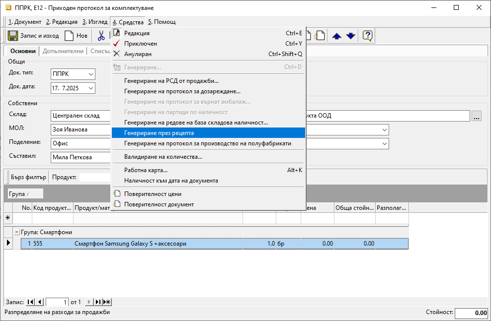{ class=align-center w=15cm }

От меню **Средства** във формата за редакция на документ изберете опция **Генериране през рецепта**. Чрез нея активирате помощник за генерация на свързания разходен складов документ **РПРК**. В него автоматично ще се обзаведат всички съставни части на комплекта.  

Помощникът стартира с информативно съобщение. На следващите стъпки се показват полета с възможни опции на генерацията.  

> Системата обзавежда полетата в помощника с данни по подразбиране, които могат бъдат променени.

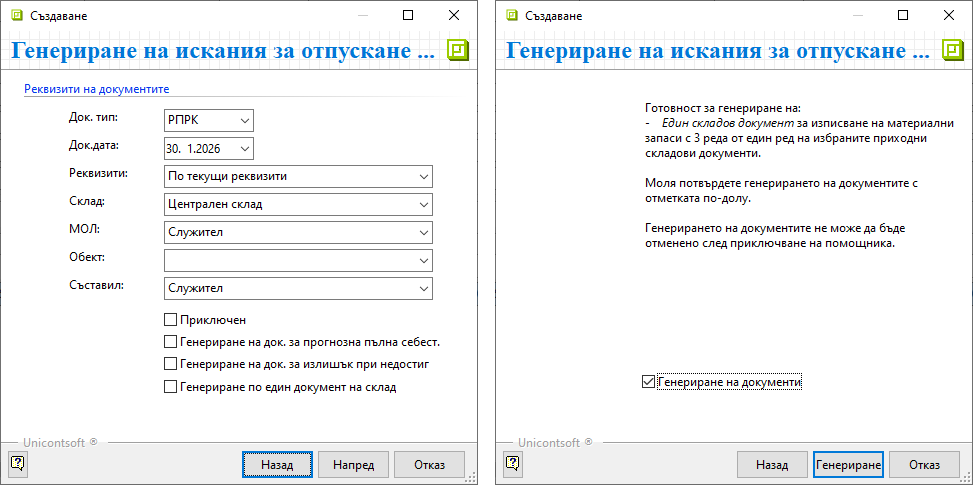{ class=align-center w=15cm }  

Използвайте опция **Приключен**, за да укажете дали системата да генерира **РПРК** в състояние на редакция или с директно приключване.  

На последна стъпка може да изберете дали системата да създаде свързан *Разходен протокол за комплектуване*. За целта поставете отметка при *Генериране на документи* и потвърдете действието с бутон [**Генериране**].  

Системата уведомява как е протекъл процесът.  
Може да затворите помощника с [**Изход**].   

2) **Разходен протокол за комплектуване**  

Генерираният **РПРК**-*Разходен протокол за комплектуване* е достъпен от раздел **Връзки с документи** в **ППРК**.  
Протоколът може да бъде отворен за преглед с двоен клик или с опция *Отваряне свързан документ*. Той съдържа списък със съставни части и количества за избрания в **ППРК** комплект.  

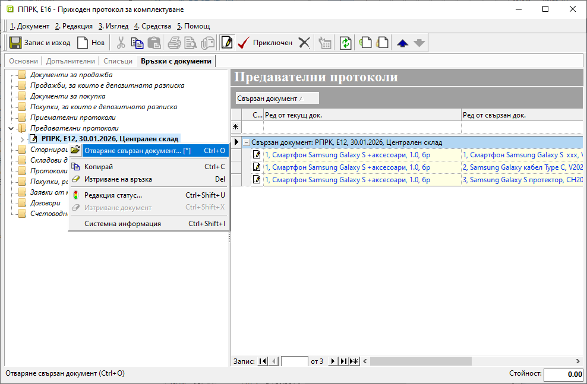{ class=align-center w=15cm }

Когато **РПРК** не е бил генериран с директно приключване, може да го направите допълнително чрез бутон [**Приключен**] в лентата с инструмент. Системата дава възможност за генерация на счетоводно записване към протокола.  
Потвърждавате избраните опции с бутон [**ОК**] и валидирате данните в документа.  

> Системата обзавежда среднопретеглени цени за всеки от компонентите и калкулира обща стойност в тотал на документа. Наличностите в текущия склад се актуализират - количествата по компоненти са намалени.  

Формата за редакция на **РПРК** се затваря с бутон [**Запис и изход**] или с [**x**].   

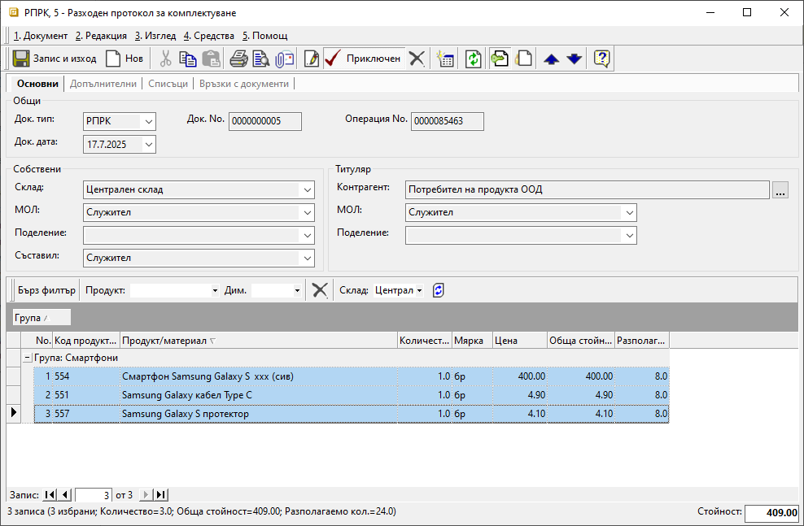{ class=align-center w=15cm }

Комплектуването трябва да се финализира с валидиране на приходния протокол. Това става обратно в **ППРК** и бутон [**Приключен**]. С това може да генерирате и счетоводно записване за протокола.  

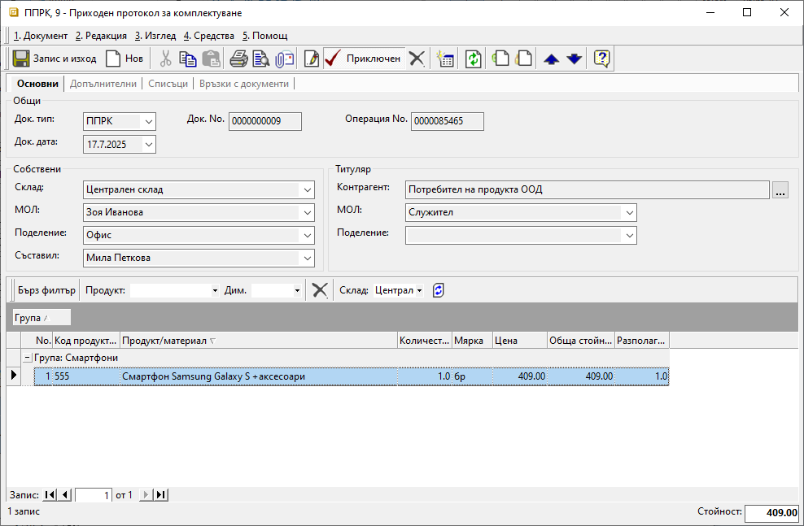{ class=align-center w=15cm }

> **Цена** за единица комплект и **Стойност** на документа се обзавеждат според калкулираните стойности в свързания **РПРК**.  
Наличността в текущия склад се актуализира, с което количеството за комплекта е увеличено.  

## **Разкомплектуване**

При разкомплектуване се създава складов документ **РПР**-*Разходен протокол за разкомплектуване*. В него се избира продуктът, който ще се разделя на съставни елементи. Системата използва същия вграден инструмент за генерация през рецепти, както при комплектуване. Чрез него се създава свързан приходен складов документ **ППР**-*Приходен протокол за разкомплектуване*.    

Процесът по разкомплектуване включва въвеждане на следните складови документи:  

1) **Разходен протокол за разкомплектуване**  

От **Търговска система » Складови документи** създавате **Нов документ**, което отваря празна форма за въвеждане на данни.  
В раздел **Основни** попълнете необходимите реквизити за **РПР** в секции *Общи*, *Собствени* и *Титуляр*.  

От реда за нов запис въведете данните с продукта за разкомплектуване:  
    - **Продукт/материал** – въвежда се продукт, за който се отнася разкомплектуването;   
    - **Партида** - в тази колона могат да се избират партиди на продукти;  
    Ако се регистрират няколко партиди от един продукт, всяка от тях се въвежда на отделен ред.  
    - **Количество** – в колоната се въвеждат количествата по продукти;   
    - **Мярка** - колоната трябва да съдържа мерната единица, в която е бил заприходен комплекта;   
    - **Цена** - полето остава празно;  
    При валидиране на документа системата автоматично ще обзаведе цена и обща стойност.   

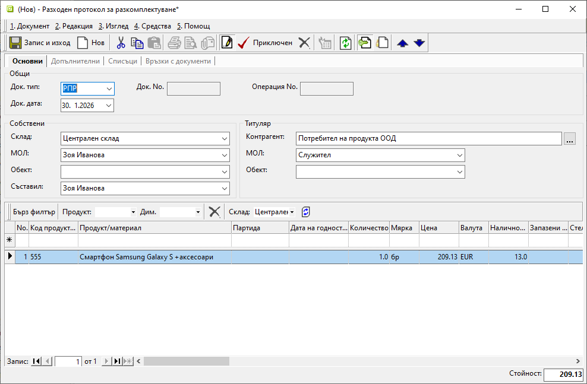{ class=align-center w=15cm }

Стартирайте помощника за генерация на свързан приходен складов документ **ППР** от меню **Средства » Генериране през рецепта**. Системата обзавежда възможните опции на генерацията с данни по подразбиране, които може да промените при необходимост.  

Може да потвърдите създаването на свързан **ППР** с отметка при *Генериране на документи* на последната стъпка. Потвърдете действието с бутон [**Генериране**].  
Системата уведомява как е протекла генерацията и помощникът се затваря.   

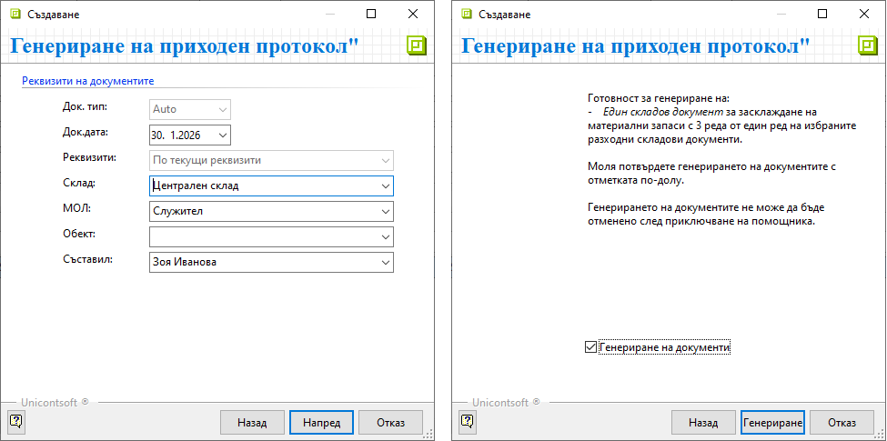{ class=align-center w=15cm }

**РПР** трябва да се приключи, при което може да генерирате автоматично счетоводно записване. В протокола се обзавеждат цена и стойност на документа.  

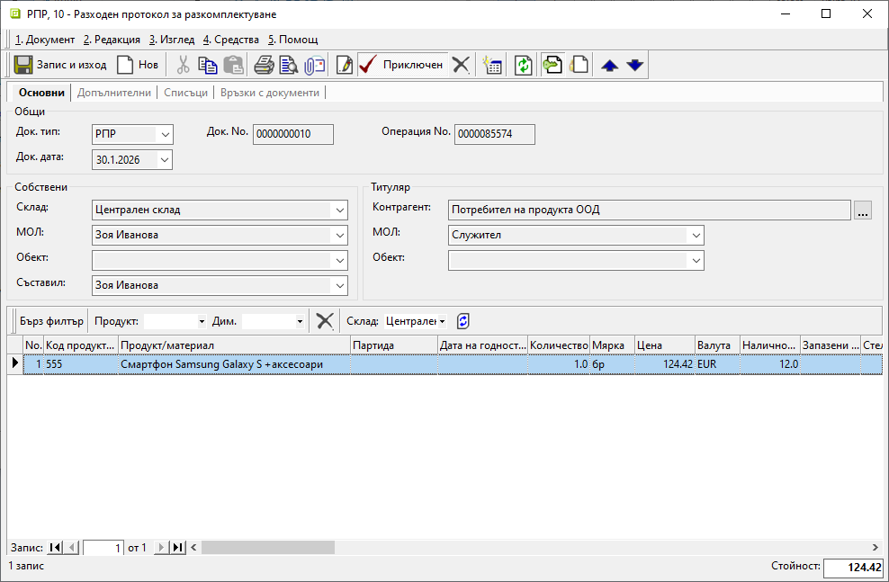{ class=align-center w=15cm }

2) **ППР - Приходен протокол за разкомплектуване**   

Генерираният свързан документ **ППР** е достъпент от раздел **Връзки с документи** на **РПР**.  
Може да отворите за преглед приходния протокол с двоен клик или с десен бутон и опция *Отваряне свързан документ*.  
В документа се обзавежда списък с части на комплекта спрямо настройките по рецепта. Ако в рецептата няма дефинирани цени, системата генерира **ППР** изцяло с нулеви цени. Те трябва да се попълнят ръчно по преценка на потребителя.  
Когато има направени такива настройки, **ППР** се генерира с обзаведени цени за всички второстепенни елементи. 

> Единствено компонентът, дефиниран като основен, винаги остава с нулева цена.  

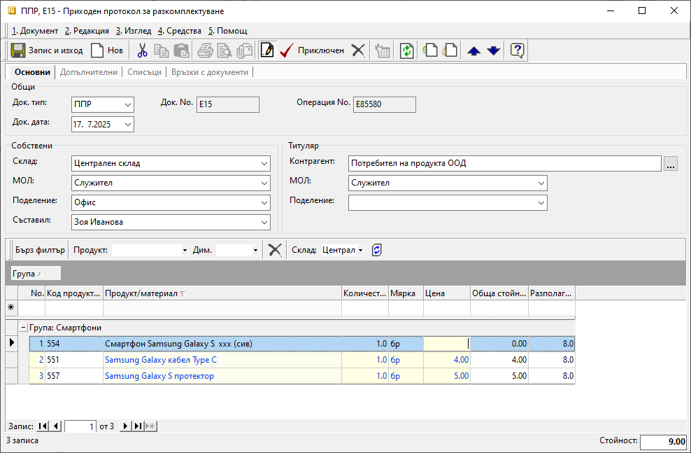{ class=align-center w=15cm }

Задължително финализирате разкомплектуването с приключване на приходния протокол. С това наличността в текущия склад се актуализира и количеството на всеки елемент е увеличено.  

> **Стойност** на документа се обзавежда автоматично. Тя е равна на стойността на свързания **РПР**.  
Системата попълва и поле **Цена** за основния компонент. Това е разликата между крайната стойност на документа и общата стойност на второстепенните компоненти.  

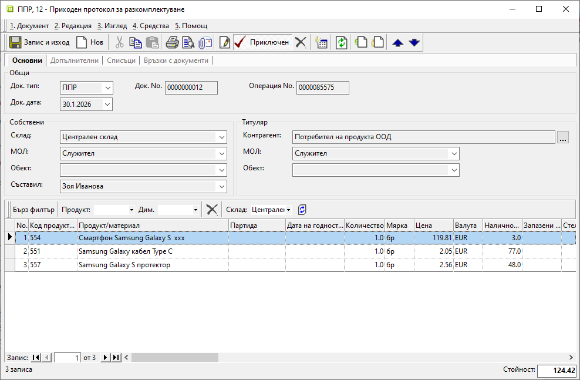{ class=align-center w=15cm }

