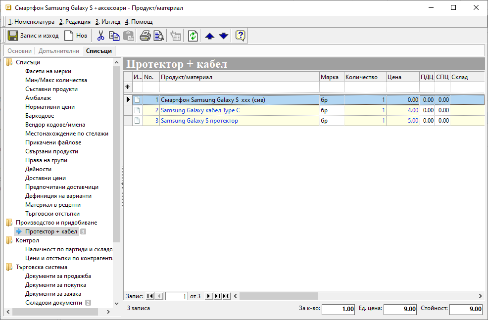
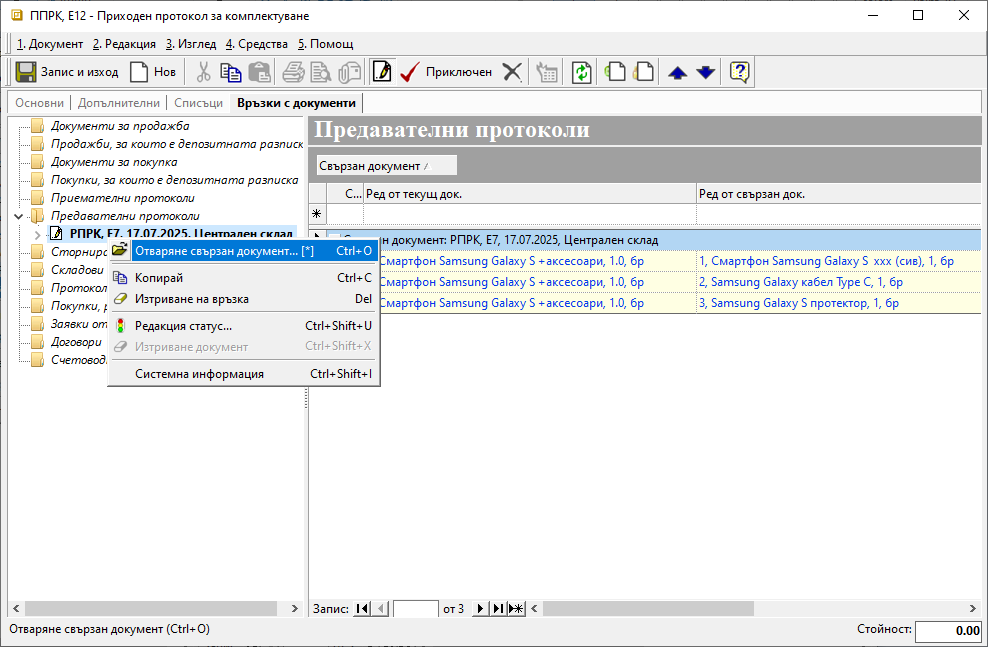
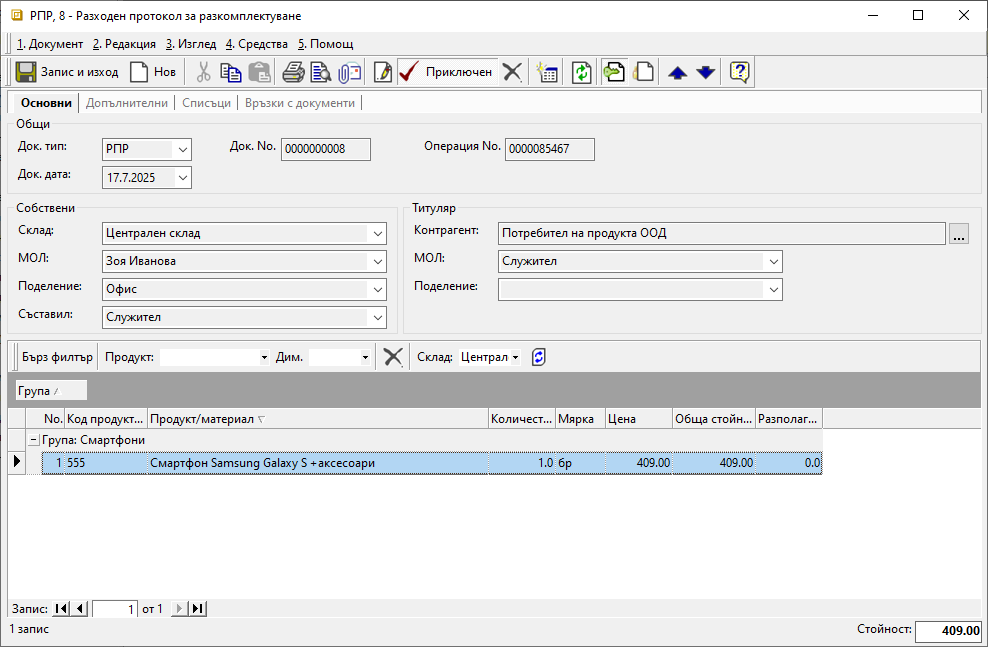
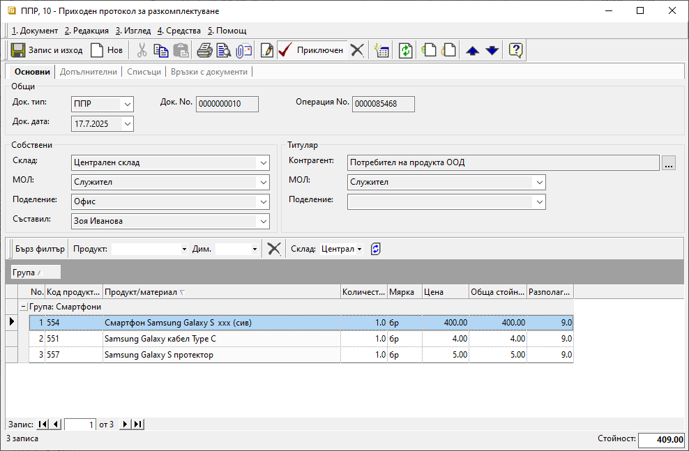

```{only} html
[Нагоре](000-index)
```

# **Комплектуване и разкомплектуване**

- [Въведение](#въведение)
- [Настройки](#настройки)  
- [Комплектуване](#комплектуване)  
- [Разкомплектуване](#разкомплектуване)  

## **Въведение**

Системата разполага с механизъм за комплектуване (обединяване на компоненти в единна стокова единица) и разкомплектуване на продукт на съставните му части. Комплектуването и разкомплектуването се осъществяват на база настроени рецепти.  

## **Настройки**

За да функционира успешно генерацията на документи за комплектуване и разкомплектуване, са необходими отделни складови документи за тези операции. Настройката е достъпна от **Номенклатури » Типове документи**.   

При комплектуване се използват специално настроените складови документи **ППРК** - *Приходен протокол за комплектуване* и **РПРК** - *Разходен протокол за комплектуване*. Те трябва да бъдат със задължително дефинирана настройка в колона **Група: Комплектуване**.  

При разкомплектуване се използват настроените складови документи **ППР** - *Приходен протокол за разкомплектуване* и **РПР** - *Разходен протокол за разкомплектуване*. Те трябва да бъдат със задължително дефинирана настройка в колона **Група: Разкомплектуване**.  

> И за четирите типа документи е препоръчително поставяне на отметка в колона **Изисква контрагент Потребител на продукта**. Това автоматично ще обзаведе реквизит **Контрагент** в приходните и разходните протоколи за комплектуване и разкомплектуване.  

{ class=align-center w=15cm }

Следващата задължителна нстройка е добавяне на **Рецепта** за продукта, който ще обединява компоненти. Системата позволява въвеждане на няколко рецепти за продукт.  

Настройката е достъпна във форма за редакция на [**Продукт/материал**](../001-ref/001-nomenclatures/003-items.md) от раздел **Списъци**. С десен бутон на мишката върху опция *Нова рецепта* се отваря форма за редакция **Производство и придобиване**. В поле **Име** може да се въведе наименование за рецептата и да се определи за какво количество в основна мярка от продукта се отнася.  

{ class=align-center w=15cm }

След потвърждаване на избора с бутон [**OK**] системата активира празен ред за добавяне на нов запис. Чрез него се въвежда списък на съставните компоненти с мерни единици и количества.  

> Ако сред компонентите има основен продукт, който формира голяма част от стойността на комплекта, той задължително се въвежда на 1. ред с нулева цена.    

{ class=align-center w=15cm }

За всички останали компоненти в колона **Цена** могат да бъдат попълнени единичните цени без ДДС, които системата предлага в **ППР** - *Приходен протокол за разкомплектуване*.  
Когато в рецептата липсва настройка за цени, колона **Цена** в ППР се попълва ръчно.  

## **Комплектуване**

При комплектуване се създава *Приходен протокол за комплектуване*. В документа се избира продукт с настроена рецепта, който ще обединява компоненти.  
Чрез вграден инструмент системата ще генерира свързан *Разходен протокол за комплектуване*. В документа автоматично ще се заредят настроените компоненти.  

Процесът по въвеждане на складови документи за комплектуване е следният:  

1) **Приходен протокол за комплектуване**  

От **Търговска система » Складови документи** чрез десен бутон на мишката се избира [**Нов документ**](../002-docs/002-trade-system/002-warehouse-documents/001-warehouse.md) (клавишна комбинация Ctrl+N). Отваря се празна форма за въвеждане на нов складов документ.  

2)  Въвеждане на реквизити в раздел **Основни**:  

    - **Док. тип** – избира се тип на документа **ППРК** - *Приходен протокол за комплектуване*;    
    - **Док. дата** – поле за избор на дата, за която се извършва складовата операция;  
    - **Док. No** – поле с номер за документа;  
    Ако полето остане празно, системата ще генерира пореден номер за типа документ в текущия склад;  
    - **Склад** – поле за избор на склад, в който комплектът се заприходява;    
    - **МОЛ** – избира се материално отговорното лице за текущия склад;  
    Полето се обзавежда автоматично, ако складът има настроен МОЛ по подразбиране.  
    - **Обект** - в полето може да се посочи обект от предварително настроените в **Потребител на продукта**;  
    - **Съставил** - избира се персона, съставила документа;  
    Полето се обзавежда автоматично с настроените данни за текущия потребител на системата.  
    - **Контрагент** – в полето се избира **Потребител на продукта**;  
    При коректно направени настройки в **Типове документи** полето се обзавежда автоматично.   
    - **Продукт/материал** – въвежда се продукт, за който се отнася комплектуването;   
    - **Партида** - в тази колона могат да се избират партиди на продукти;  
    Ако се регистрират няколко партиди от един продукт, всяка от тях се въвежда на отделен ред.  
    - **Количество** – в колоната се въвеждат количествата по продукти;   
    - **Мярка** - колоната трябва да съдържа основните мерни единици за всеки един продукт;   
    - **Цена** - полето остава празно;  
    При валидиране на документа системата автоматично ще обзаведе цена и обща стойност.  
    Те ще се формират спрямо стойностите на свързания разходен складов документ (РПРК).  

    { class=align-center w=15cm }

3) **Генериране през рецепта**  

Опцията активира помощник за генерация на свързани документи и е достъпна от меню **Средства**.  
Чрез нея системата автоматично създава разходния складов документ **РПРК**. В него автоматично ще се обзаведат всички съставни части на комплекта.  

Помощникът стартира с информативно съобщение. На следващите стъпки се показват полета с възможни опции на генерацията.  

{ class=align-center w=15cm }

Системата обзавежда полетата в помощника с данни по подразбиране, които могат бъдат променени.  

> Ако опция Приключен се потвърди с отметка, системата ще генерира РПРК в състояние Приключен.  

За да се потвърди генерация на свързан *Разходен протокол за комплектуване*, на последна стъпка се поставя отметка при *Генериране на документи*. Бутон [**Генериране**] потвърждава действието.  
Системата уведомява как е протекла генерацията и помощникът се затваря с [**Изход**].   

4) **Разходен протокол за комплектуване**  

От раздел **Връзки с документи** на **ППРК** е достъпен генерираният свързан разходен документ - **РПРК**.  
Разходният протокол се отваря с двоен клик или с опция *Отваряне свързан документ*. Той съдържа списък с настроените по рецепта компоненти от комплекта в **ППРК**.  

{ class=align-center w=15cm }

Когато **РПРК** не е бил генериран с автоматично приключване, това може да стане допълнително чрез бутон [**Приключен**] в лентата с инструмент.  
Системата дава възможност за генерация на счетоводно записване към протокола. Бутон [**ОК**] потвърждава избраните опции и валидира данните в документа.  

Системата обзавежда среднопретеглени цени за всеки от компонентите и калкулира обща стойност в тотал на документа. Наличностите в текущия склад се актуализират - количествата по компоненти са намалени.  

{ class=align-center w=15cm }

Формата за редакция на **РПРК** се затваря с бутон [**Запис и изход**] или с [**x**].  

5) **Заприходяване на комплект**  

Комплектуването трябва да се финализира с валидиране и на приходния протокол. Това става обратно в **ППРК** чрез бутон [**Приключен**] от лентата с инструменти.  
Системата предлага автоматична генерация на счетоводно записване. Бутон [**ОК**] потвърждава избраните опции и валидира данните в документа.  

{ class=align-center w=15cm }

**Цена** за единица комплект и **Стойност** на документа се обзавеждат според калкулираните стойности в свързания **РПРК**.  
Наличността в текущия склад се актуализира, с което количеството за комплекта е увеличено.  

## **Разкомплектуване**

При разкомплектуване се създава складов документ **РПР** - *Разходен протокол за разкомплектуване*. В него се избира продуктът, който ще се разделя на съставни елементи. Системата използва същия вграден инструмент за генерация през рецепти, както при комплектуване. Чрез него се създава свързан приходен протокол - **ППР** - *Приходен протокол за разкомплектуване*.    

Процесът по въвеждане на складови документи за разкомплектуване е следният:  

1) **Разходен протокол за разкомплектуване**  

От **Търговска система » Складови документи** се създава **Нов документ**, което отваря празна форма за въвеждане на данни.  

2)  **Съдържание на РПР**  

В раздел **Основни** се попълват необходимите реквизити в секции *Общи*, *Собствени* и *Титуляр*.  
От реда за нов запис се попълват данните за продукта, който се разкомплектува.  
    - **Продукт/материал** – въвежда се продукт, за който се отнася разкомплектуването;   
    - **Партида** - в тази колона могат да се избират партиди на продукти;  
    Ако се регистрират няколко партиди от един продукт, всяка от тях се въвежда на отделен ред.  
    - **Количество** – в колоната се въвеждат количествата по продукти;   
    - **Мярка** - колоната трябва да съдържа мерната единица, в която е бил заприходен комплекта;   
    - **Цена** - полето остава празно;  
    При валидиране на документа системата автоматично ще обзаведе цена и обща стойност.   

{ class=align-center w=15cm }

3) **Генериране през рецепта**  

Опцията активира помощник за генерация на свързани документи и е достъпна от меню **Средства**. Чрез нея системата създава приходния складов документ **ППР**. В него автоматично ще се обзаведат всички съставни части на комплекта.  

Помощникът стартира с информативно съобщение. На следващите стъпки се показват полета с възможни опции на генерацията.  
Системата обзавежда полетата в помощника с данни по подразбиране, които могат бъдат променени.  
За да се потвърди генерацията, на последна стъпка се поставя отметка при *Генериране на документи*. Бутон [**Генериране**] потвърждава действието.  
Системата уведомява как е протекла генерацията и помощникът се затваря с [**Изход**].   

{ class=align-center w=15cm }

**РПР** трябва да се валидира чрез бутон [**Приключен**]. Системата предлага автоматична генерация на счетоводно записване. С потвърждаване на избора в документа се визуализират цена и стойност.   

{ class=align-center w=15cm }

4) **ППР - Приходен протокол за разкомплектуване**   

От раздел **Връзки с документи** на **РПР** е достъпен генерираният свързан приходен протокол. Свързаният документ **ППР** се отваря с двоен клик или с десен бутон и опция *Отваряне свързан документ*.  

Приходният протокол за разкомплектуване съдържа списък с настроените по рецепта части на комплекта.  

> Ако в рецептата няма настройки за **Цена**, системата генерира **ППР** изцяло с нулеви цени. Те трябва да се попълнят ръчно по преценка на потребителя. С нулева цена остава единствено основният компонент.  

Когато има направени такива настройки, **ППР** се генерира с обзаведени цени за всички второстепенни елементи. С нулева цена отново остава единствено компонентът, дефиниран като основен.  

{ class=align-center w=15cm }

5) **Заприходяване на съставни части**  

Разкомплектуването се финализира с валидирането на приходния протокол от бутон [**Приключен**] в лентата с инструменти. 

{ class=align-center w=15cm }

Автоматично се обзавежда **Стойност** на документа. Тя е равна на стойността на свързания **РПР**. Системата попълва и **Цена** за основния компонент. Това е разликата между крайната стойност на документа и общата стойност на второстепенните компоненти.  

Наличността в текущия склад се актуализира, с което количеството на всеки елемент е увеличено.  

