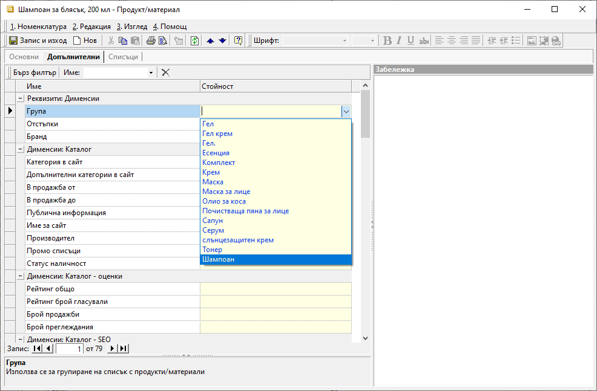
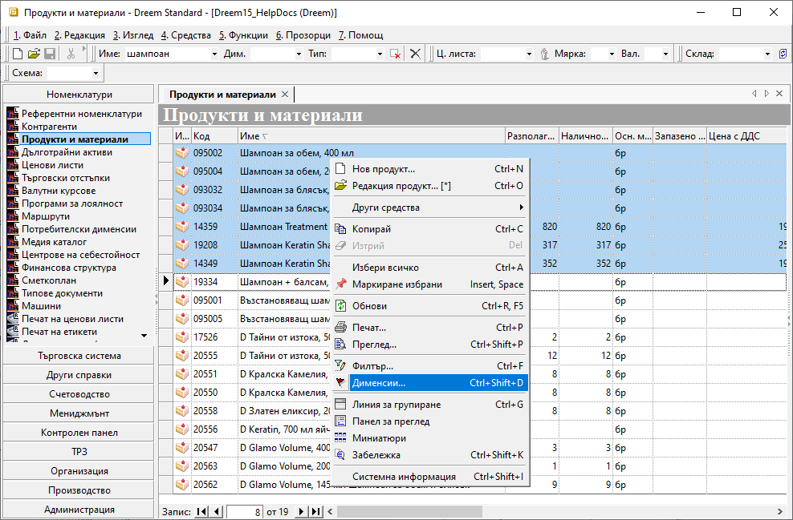
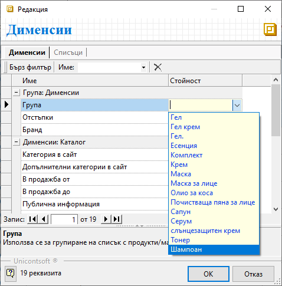

```{only} html
[Нагоре](000-index)
```

# Използване на дименсиите в Продукти и материали

- [Въведение](https://docs.unicontsoft.com/guide/erp/005-how-to/015-custom-dimensions.html#id2)  
- [Използване на дименсиите в Продукти и материали](https://docs.unicontsoft.com/guide/erp/005-how-to/015-custom-dimensions.html#id3)  
- [Свързани статии](https://docs.unicontsoft.com/guide/erp/005-how-to/015-custom-dimensions.html#id4)  

## **Въведение**

Дименсиите в системата служат за категоризиране на данни. Потребителите изграждат персонализирани категории, чрез които данните се групират и анализират детайлно. Системата дава възможност за дефиниране на димеснии по продукти, контрагенти и различни документи - продажби, покупки, складови и други документи.   

Настройките на *Потребителски дименсии* се изграждат в две стъпки - съставяне на описи в *Списъци* и създаване на *Дименсии*.  

Списъците представляват каталог, съдържащ всички групи продукти, контрагенти, договори и пр. За всяка една от тези групировки трябва да укажете как системата да я третира. Това става чрез настройка на *Дименсии*.

```{tip}
Препоръчително е при избор на име на списъците да се добави за коя номенклатура или тип документ се отнася. Това ще помогне за по-лесно и бързо ориентиране в целия набор от списъци.  
```

## **Използване на дименсиите в Продукти и материали**

При създаване на нов, или редактиране само на един продукт, дименсия се добавя по следния начин:

1) Във форма за редакция се отваря панел **Допълнителни || Реквизити: Дименсии**, където са показани всички предварително създадени дименсии, отнасящи се до продукти. В колона **Стойност** като падащ списък се визуализират подкатегории, от който се избира желаната.  
Действието се повтаря за всички дименсии, в които даден продукт ще участва.

{ class=align-center w=15cm }

2) **Запис и изход** - едновременно съхранява промените и излиза от формата.

При редактиране на съществуващи продукти ( един или множество) дименсия се добавя по следния начин:

1) Отваря се списъка в **Номенклатури || Продукти и материали**. 

> При този начин за добавяне/редакция на дименсия системата позволява да се маркират множество продукти и едновременно да се изберат само общите за тях категории.  

2) От списък **Продукти и материали** се маркират един или няколко реда и с десен бутон на мишката от менюто се избира **Дименсии**.

{ class=align-center w=15cm }

3) В отворената форма за редакция *Дименсии* се съдържат всички съхранени в системата категории продукти. За всички дименсии, които ще се настройват за продуктите, се избират съответните стойности от падащите списъци. 
За по-лесно намиране на желаната категория може да се използва бърз филтър по име или част от име.  

{ class=align-center }

4) Промените се записват с бутон [**OK**].  
От този момент продуктите ще участват във всички справки, филтрирани по новонастроените дименсии.

> В системата, както за *Продукти и материали*, така и за *Контрагенти*, трябва да се настрои по една дименсия, която да изпълнява ролята на основна група.  
Това става в **Администрация || Настройки**. Настроената за основна група на Продукти и материали не трябва да е тип *Множество*.  

## **Свързани статии**

[Създаване на Потребителски дименсии](https://docs.unicontsoft.com/guide/erp/001-ref/001-nomenclatures/008-custom-dimensions.html#id1)  