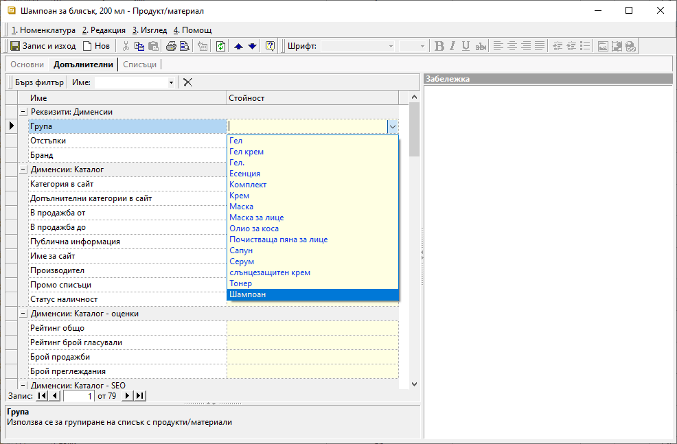
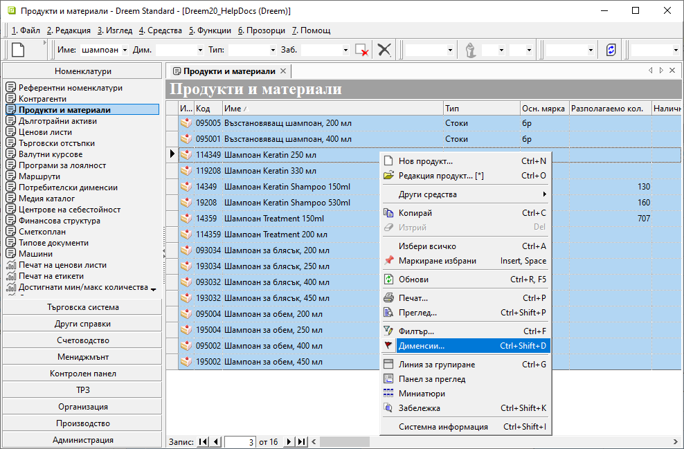
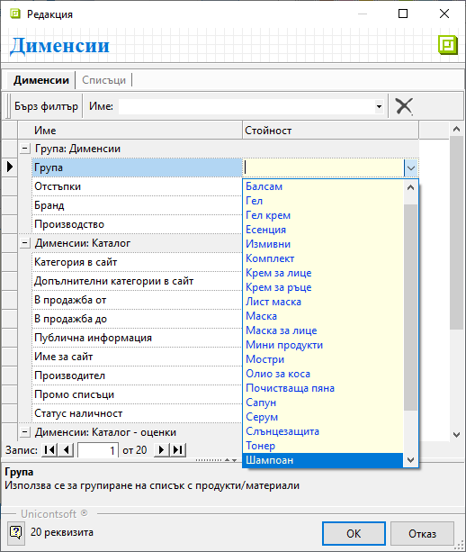

```{only} html
[Нагоре](000-index)
```

# **Използване на дименсиите в продукти**

- [Въведение](#въведение)  
- [Използване на дименсии в Продукти и материали](#използване-в-продукти-и-материали)  

## **Въведение**

Дименсиите в системата служат за категоризиране на данни.  Системата дава възможност за дефиниране на димеснии по продукти, контрагенти и различни документи - продажби, покупки, складови и други.   

> Потребителите изграждат персонализирани категории, чрез които данните могат да се групират и анализират детайлно.  

**Потребителски дименсии** се настройват в две стъпки - съставяне на описи в секция *Списъци* и създаване на *Дименсии*.  

Списъците представляват каталог, съдържащ всички групи продукти, контрагенти, договори и пр. За всяка една от тези групировки трябва да укажете как системата да я третира. Това става чрез настройка на *Дименсии*.

```{tip}
Препоръчително е при избор на име на списъците да се добави за коя номенклатура или тип документ се отнася. Това ще помогне за по-лесно и бързо ориентиране в целия набор от списъци.  
```

> За **Продукти и материали** и за **Контрагенти** трябва да се избере по една дименсия, която да изпълнява ролята на основна група. Това става в **Администрация » Настройки**.  
Настроената основна група за продукти не трябва да е тип *Множество*.  

## **Дефиниране на дименсии**

1) **За нов продукт**  

При създаване на нов продукт може да добавите дименсия от формата за редакция.  
В раздел [**Допълнителни » Реквизити: Дименсии**](../001-ref/001-nomenclatures/010-custom-dimensions.md) са показани всички предварително създадени дименсии, отнасящи се до продукти. От колона **Стойност** може да отворите падащ списък, от който да изберете желаната подкатегория.  
Повторете на всички редове с дименсии, в които продуктът ще участва.  

За да съхраните промените и да излезете от формата, изберете бутон [**Запис и изход**].  

{ class=align-center w=15cm }

2) **За съществуващ продукт**  

> При този начин за добавяне/редакция системата дава възможност да се маркират множество продукти и едновременно да се изберат общите за тях категории.  

За вече съществуващи продукти може да добавяте/редактирате дименсии по няколко начина.  

Първият е отново през формата за редакция на продукт. Той е удачен при настройка на много малък брой продукти.  
Другият вариант е по-удобен за обща настройка на голям брой номенклатури. При него от списъка **Продукти и материали** може да маркирате един или няколко реда и с десен бутон на мишката да изберете **Дименсии**.  

{ class=align-center w=15cm }

Това отваря форма за редакция **Дименсии**. В нея са показани всички съхранени в системата категории продукти.   

> Може да използвате бързия филтър за по-лесно намиране на категория по име или част от име.  

За дефиниране на дименсия се позиционирайте на избрания ред. От поле **Стойност** може да отворите падащ списък, в който избирате дименсия.  

Може да запишете или откажете промените съответно чрез бутон [**OK**] или [**Отказ**].  

{ class=align-center }

От момента на потвърждаване продуктите ще участват при всички филтри и справки за новонастроените дименсии.  
