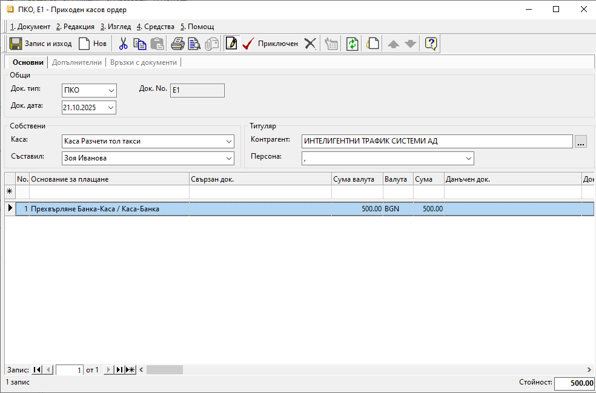

```{only} html
[Нагоре](../000-index)
```

# **Тол такси и услуги**

- [Въведение](#въведение)
- [Настройки](#настройки)  
- [Документи](#документи)  
- [Справки](#справки)  

## **Въведение**

Разходите за тол и други такси, свързани с превозните средства, се регистрират в системата чрез документи за покупка. Това позволява отчитане по автомобили чрез центрове на себестойност.  

В системата е разработен механизъм за отчитане на тези разходи при авансово плащане към доставчика на тол такси и услуги.  
В тази връзка е необходимо да се дефинират някои настройки.

## **Настройки**

1) **Каса** - Създава се отделна каса, която ще се използва за разчети за тол такси (напр. *Каса Разчети тол такси*). Настройката се добавя от [**Номенклатури » Референтни номенклатури**](../001-ref/001-nomenclatures/001-ref-nomenclatures.md).  

2) **Основание за плащане** - В **Референтни номенклатури** трябва да има настроено отделно основание за плащане при трансфер на средства между каса и банкова сметка (напр. *Прехвърляне Банка-Каса / Каса-Банка*).    

3) **Типове продукти** - В **Референтни номенклатури** се създава нов тип продукти (напр. *6099 - Данъци и такси в/у превозните ср-ва*). Той трябва да бъде маркиран като *Услуга*.   
Настройката е водеща за автоматичното осчетоводяване на документи.  

4) **Продукти** - От меню [**Номенклатури » Продукти и материали**](../001-ref/001-nomenclatures/003-items.md) се създават отделни продукти за тол таксите и за свързаните с тях допълнителни услуги. За тези продукти се дефинира *Тип*, като се избира новият *6099 - Данъци и такси в/у превозните ср-ва*.  

5) **Сметкоплан** - В [**Номенклатури » Сметкоплан**](../001-ref/002-accounting/002-chart-of-acc.md) се добавят отделни счетоводни подсметки за таксите за превозни средства (напр. *6099 - Данъци и такси в/у превозните ср-ва*) и за свързаните с тях разчети (напр. *4911 - Разчети тол такси*).   

6) **Автоматичен осчетоводител** - За новите референтни номенклатури е необходимо да се добавят настройки в [**Автоматичен осчетоводител**](../001-ref/002-accounting/003-acc-wizard.md).  

   - Секция **Документи за покупка**:  
   В **Кореспонденции** се добавя настройка за отчитане на новия тип продукти (*6099 - Данъци и такси в/у превозните ср-ва*) по Дт на създадената за целта счетоводна сметка (с-ка 6099).  

   - Секция **Касови документи**:  
   Във **Водеща сметка** се добавят новата каса (*Каса Разчети тол такси*) със счетоводната сметка за разчетите за тол такси (*4911 - Разчети тол такси*).   
   В **Кореспонденции** основанието за плащане при трансфер на средства се настройва по избрана транзитна сметка.  

   - Секция **Банкови документи**:  
   В **Кореспонденции** основанието за плащане при трансфер на средства се настройва по избрана транзитна сметка.  

## **Документи**

1) **Банково извлечение**  

За авансово платената сума на доставчик регистрирате трансфер от избрана банкова сметка, с който да захраните касата за разчети за тол такси.  

За целта създавате нов банков документ [**БИ**-*Банково извлечение*](../002-docs/002-trade-system/003-payments/004-bank.md).  
В поле *Основание за плащане* използвате настроеното за прехвърляне на средства основание. В полетата за въвеждане на  контрагент избирате доставчика на услуги.   

{ class=align-center w=15cm }

Приключвате банковия документ с генериране на счетоводно записване.  
При коректно настроен **Автоматичен осчетоводител** счетоводният запис има подобен вид:     

```{admonition} Статия
|Д<sup>т</sup> Сметка|К<sup>т</sup> Сметка|Признак|Сума|
|-------------|------------|-----------------|---------|
|500          |            |Контрагент       |255      |
|             |503         |                 |255      |
```

2) **Приходен касов документ**  

За получения трансфер от банковата сметка въвеждате **ПКО**-*Приходен касов документ* в новата каса за разчети за тол такси.  

В реквизит *Контрагент* за титуляр на документа избирате доставчик.  
В ордера отново използвате настроеното за прехвърляне на средства основание за плащане.  

{ class=align-center w=15cm }

Приключвате касовия документ с генериране на счетоводно записване.    
При коректно настроен **Автоматичен осчетоводител** за касовия документ ще се генерира счетоводен запис в подобен вид:     

```{admonition} Статия
|Д<sup>т</sup> Сметка|К<sup>т</sup> Сметка|Признак|Сума|
|-------------|------------|-----------------|---------|
|4911         |            |                 |255      |
|             |500         |Контрагент       |255      |
```

3) **Разходи за тол такси без данъчен документ**  

Платените тол такси регистрирате с документ за покупка. В него за всяко превозно средство въвеждате продукт *Тол такси* на отделен ред със съответната сума. Това позволява разпределяне на разходите по центрове на себестойност от раздел **Списъци » Направления**.    

Към покупката трябва да има фактура, която **не участва** в дневниците по ДДС. Затова в *Основание за прилагане* избирате такова, настроено с 0% ДДС ставка (напр. *Не участва в дневник на покупките*). Този документ се създава единствено за целите на вътрешнофирменото отчитане.      

{ class=align-center w=15cm }

Приключвате покупката и генерирате следните свързани документи:  

   - **РКО** - Закривате задължението към доставчика с разходен касов ордер в *Каса Разчети тол такси*.  
   Задължително маркирате и опцията за счетоводен запис.  

```{admonition} Статия
|Д<sup>т</sup> Сметка|К<sup>т</sup> Сметка|Признак|Сума|
|-------------|------------|-----------------|---------|
|4011         |            |                 |156     |
|             |4911        |Контрагент       |156      |
```

   - **ФПок** - Избирате *Издаване Фактура за покупка* и задължително маркирате опцията за счетоводен запис.    

```{admonition} Статия
|Д<sup>т</sup> Сметка|К<sup>т</sup> Сметка|Признак|Сума|
|-------------|-------------|-----------------|---------|
|6099         |             |Тол такси        |52       |
|6099         |             |Тол такси        |104      |
|             |4011         |Контрагент       |156      |
```

4) **Разходи за допълнителни услуги с данъчен документ**  

При платени допълнителни услуги, за които доставчикът е издал данъчен документ - фактура, регистрирате отделен документ за покупка. В него всяка услуга се въвежда с продукт *Данъци и такси върху превозните средства* и съответната сума.  

Към покупката трябва да има фактура, която участва в дневниците по ДДС. За целта в *Основание за прилагане* избирате такова, настроено със съответната ДДС ставка (напр. *С право на пълен ДК: Облагаеми доставки, внос, доставки по чл.69, ал.2*).    

{ class=align-center w=15cm }

С приключване на покупката генерирате следните свързани документи:  

   - **РКО** - Закривате задължението към доставчика с разходен касов ордер в *Каса Разчети тол такси*.  
   Задължително маркирате и опцията за счетоводен запис.  

```{admonition} Статия
|Д<sup>т</sup> Сметка|К<sup>т</sup> Сметка|Признак|Сума|
|-------------|------------|-----------------|----------|
|4011         |            |Контрагент       |4.90      |
|             |4911        |                 |4.90      |
```

   - **ФПок** - Избирате *Издаване Фактура за покупка* и задължително маркирате опцията за счетоводен запис.  

```{admonition} Статия
|Д<sup>т</sup> Сметка|К<sup>т</sup> Сметка|Признак|Сума|
|-------------|-------------|-----------------|----------|
|6099         |             |Данъци и такси...|4.08      |
|4531         |             |                 |0.82      |
|             |4011         |Контрагент       |4.90      |
```

## **Справки**

- **Търговска система**  

Справка **Касова книга** за портфейл *Каса Разчети тол такси* показва детайли за всяко движение на паричните средства при разчети за тол такси и услуги.  

{ class=align-center w=15cm }

- **Счетоводство**  

Справка **Дневник на сметка** за с/ка **4911** показва счетоводни данни за всяко движение на паричните средства, свързани с разчети за тол такси и услуги.  

{ class=align-center w=15cm }

При коректно генерирани счетоводни записи и еднакъв период на справките данните в **Дневник на сметка** и **Касова книга** трябва да съвпадат.  