```{only} html
[Нагоре](../000-index)
```

# **Производство с полуфабрикати и пакетиране**

- [Въведение](#въведение)  
- [Настройки](#настройки)
- [Протоколи за производство](#протоколи-за-производство)  
- [Свързани статии](#свързани-статии)

## **Въведение**

**Dreem ERP** осигурява ефективно управление на производствените процеси с актуални складови наличности и проследимост на вложени суровини и себестойност на всеки от етапите.   

```{Tip}
Системата позволява да реализирате множество междинни етапи до произвеждането на крайния продукт.   
```

Често свързани с процеса на производство са операциите по изготвяне на полуфабрикати и пакетиране на стоките.  

> Отделните операции могат да бъдат регистрирани в различни складове и да бъдат осчетоводени автоматично. За целта в [**Автоматичен осчетоводител**](../001-ref/002-accounting/003-acc-wizard.md) се конфигурират настройки за **Складови документи** по типове продукти, документи и складове.  
  
Чрез вградения инструмент за производство системата попълва автоматично данните в участващите документи. В тази връзка са необходими определени настройки за типове документи и за продуктите, които ще участват в процесите на производство.   

## **Настройки** 

1) **Типове документи**  

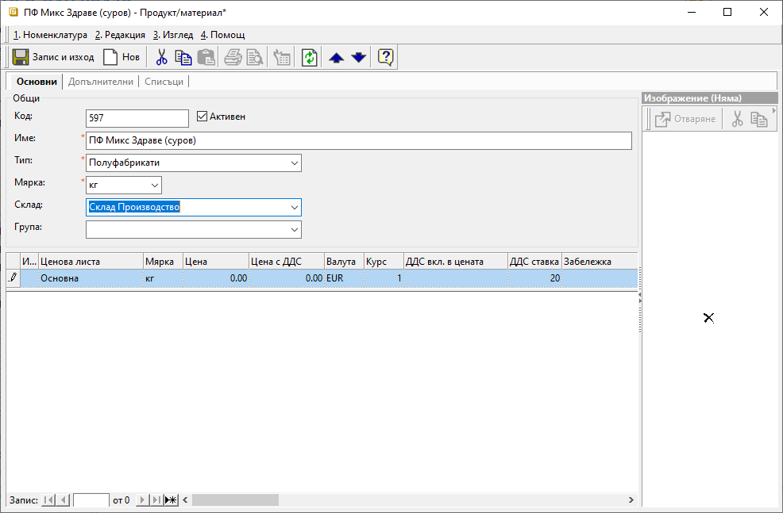{ class=align-center w=15cm } 

2) **Продукти**  

Препоръчително е за всички материали, полуфабрикати и готова продукция да се дефинират тип на продукта и складове по подразбиране. Това включва настройка на реквизити **Тип** и **Склад** в панел **Основни** от формата за редакция на продукт.  

```{Tip}
Дефинирането на Тип за продуктите дава възможност в последствие да направите индивидуални настройки за автоматично осчетоводяване.  
```

Вграденият в системата механизъм за производство изисква настройка на рецепти за продуктите (полуфабрикати и готова продукция). [Нова рецепта](../002-docs/002-trade-system/002-warehouse-documents/005-manufacturing.md#настройки) се добавя от форма за редакция на избрания продукт в раздел **Списъци » Производство и придобиване**.  

> Системата позволява създаване на различни вариации на рецепти за един продукт - напр. в различни мерни единици.  

3) **Автоматичен осчетоводител**  

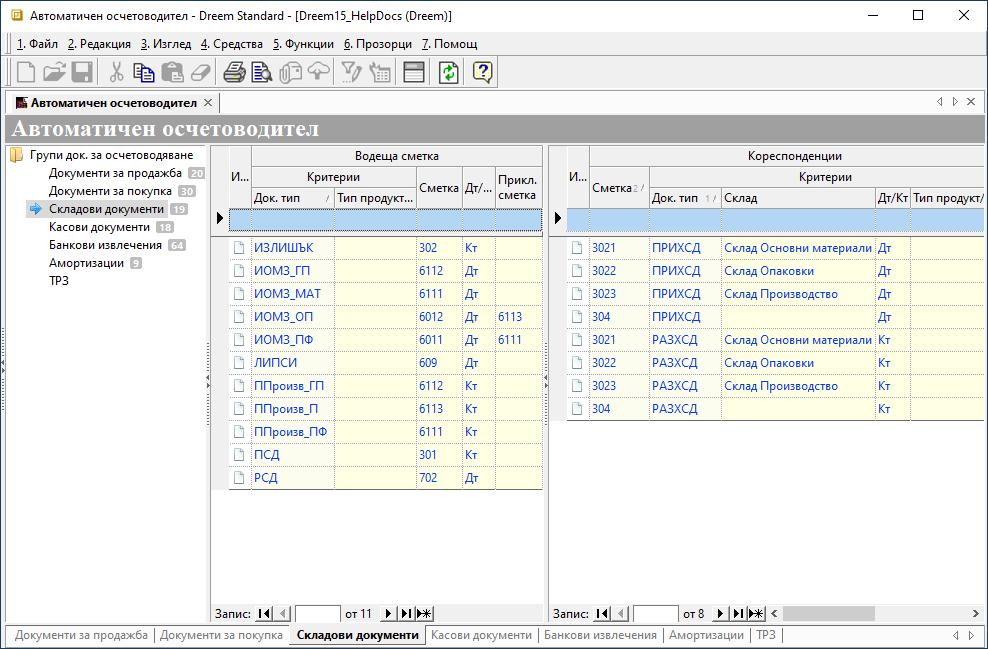{ class=align-center w=15cm } 

## **Протоколи за производство**

С протоколите за производство първоначално отразявате производствените задания, а в последствие финализирате процесите на производство.  

> Полуфабрикатите се използват като входен материал в следващите етапи на производство на готова продукция. Следователно тяхното изготвяне трябва да бъде завършено преди това на готовата продукция.  

### **Полуфабрикати**  

В **Търговска система » Складови документи** [създавате нов документ](../002-docs/002-trade-system/002-warehouse-documents/005-manufacturing.md#създаване-на-протокол-за-производство)  от тип **ППроизв_ПФ**. Във формата избирате полуфабрикатите, които се произвеждат.   

Задължително трябва да посочите какво количество от полуфабриката се произвежда в избраната мерната единица. Спрямо тези данни системата ще приложи настроената рецепта при генерация на **ИОМЗ**.  

> Може да попълните **Партида** и **Срок на годност на партида** по всяко време преди приключването на документа.  

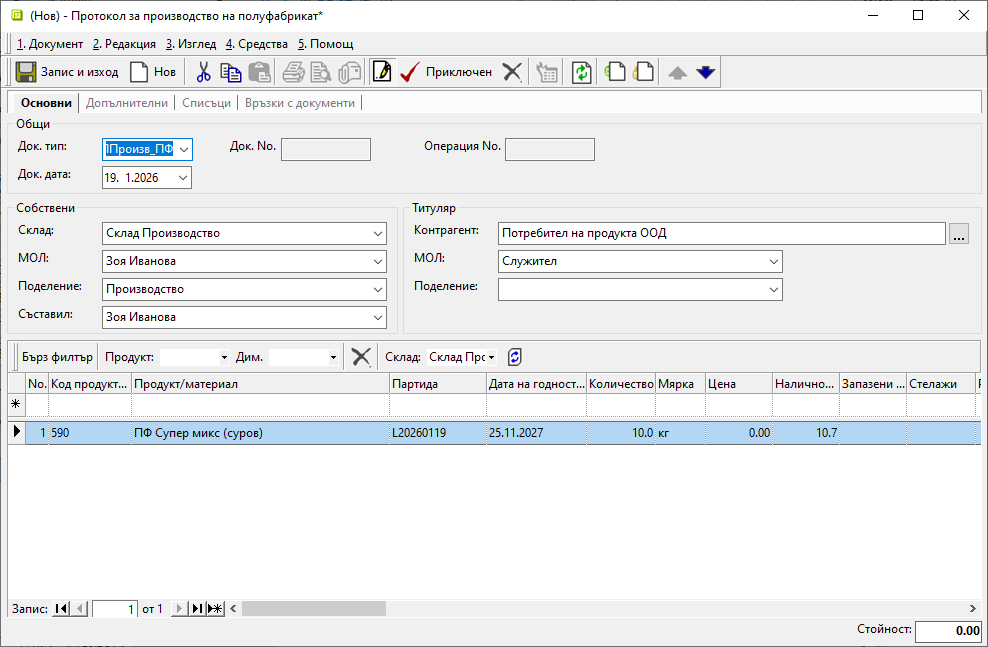{ class=align-center w=15cm } 

Въведените до момента данни може да запишете с [**Ctrl+S**] или от меню **Документ » Запис**.  

> На този етап протоколът за производство не се приключва.  
Трябва да го валидирате след генериране на **ИОМЗ** и потвърждаване на вложените суровини.  

Системата създава автоматично исканията за отпускане на материални запаси чрез вграден инструмент **Генериране през рецепта**. Той е достъпен от формата за генерация на **ППроизв_ПФ** в меню **Средства** или от списък със складови документи чрез десен бутон върху **ППроизв_ПФ** и **Други средства**.  

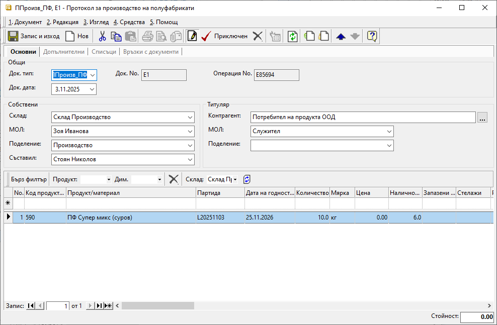{ class=align-center w=15cm }

Със стартирането на помощника за автоматично създаване на **ИОМЗ** управлявате генерацията и обзавеждането на избрани реквизити на документи.  

Имайки предвид направените предварителни настройки, в помощника попълвате следните полета:   
 
- **Док. дата** - Изберете дата, за която ще се генерира разходният складов документ **ИОМЗ_МАТ**.  
- **Реквизити** - Това поле определя вида на генерацията.  
Подходящата опция в случая е *Склад и тип документ от рецепта*. При нея генерацията взема предвид настроените в рецептата на полуфабриката склад на изписване и тип складов документ за всяка суровина.    
- **Приключен** - Изберете дали да поставите отметка, с което **ИОМЗ_МАТ** автоматично ще се приключи. В обратния случай документът остава в редакция и позволява да нанесете корекции.  
- **Генериране на док. за излишък при недостиг** - Може да изберете дали системата автоматично да създаде документ **ИЗЛИШЪК** за суровините в недостиг за изпълнение на рецептата.  
- **Генериране по един документ на склад** - .  

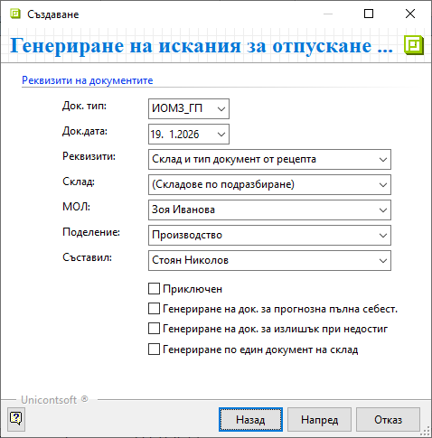{ class=align-center }

На следващия етап от генерацията на ИОМЗ системата информира какви документи е в готовност да създаде. Може да потвърдите действието с отметка при **Генериране на документи** и бутон [**Генериране**]. Имайте предвид, че след тази стъпка не може да откажете генерацията.   

Системата съобщава за успешно генерираните документи.  
Може да се навигирате до новосъздадения **ИОМЗ_МАТ** от раздел **Връзки с документи** на протокола за производство или от списъка със складови документи.  

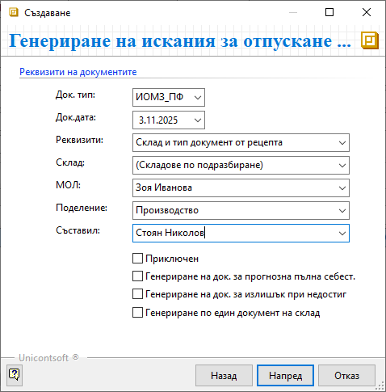{ class=align-center w=15cm }

Реквизитите в **ИОМЗ_МАТ** са обзаведени автоматично. Системата позволява да нанасяте корекции при необходимост.  
Трябва да валидирате документа, като на тази стъпка системата дава възможност да генерирате счетоводно записване.  

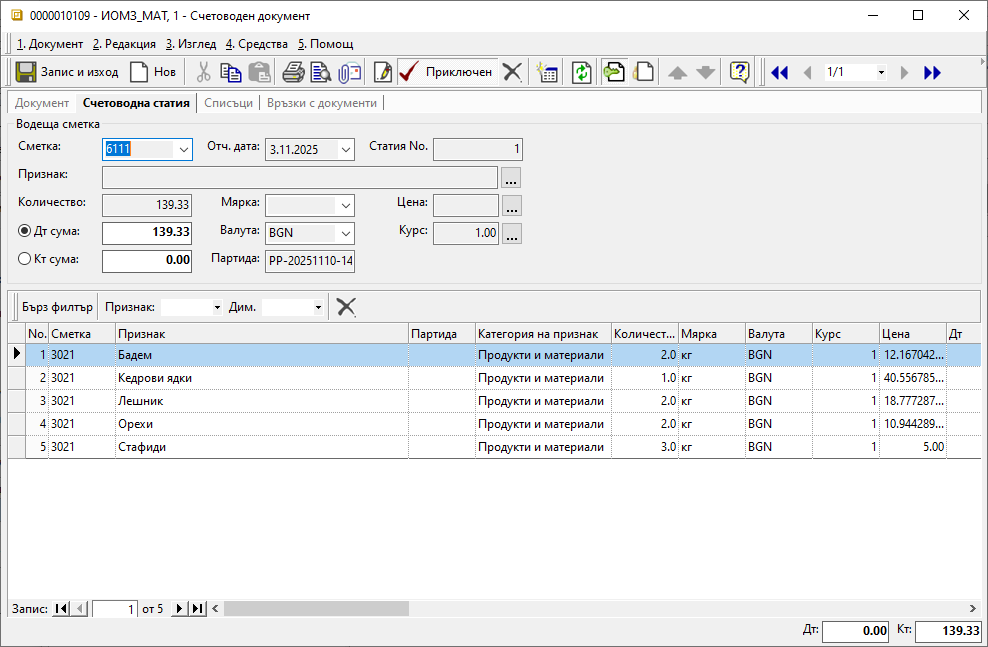{ class=align-center w=15cm }

С това участващите в документа суровини се изписват от съответния склад. Тъй като **ИОМЗ** е разходен тип складов документ, след валидиране автоматично се обзавежда със среднопретеглени цени за склада.  

> Формираната стойност на **ИОМЗ** ще се прехвърли като обща стойност за произведеното количество полуфабрикат.  

Трябва да завършите процеса по производство на полуфабрикат, като се навигирате до **ППроизв_ПФ**. Валидирате документа със счетоводно записване.  

> Валидирането на протокола отразява завършен междинен етап от производството и увеличаване наличността на полуфабриката в склада.  

### **Готова продукция**  

Протоколът за производство на готова продукция е документ, с който реализирате следващия етап на производствената поръчка. С него отразявате движението с приема на готова продукция в склада.  

Създавате и попълвате нов протокол за производство по познатия начин. За тип на документа избирате предварително настроеният за целта **ППроизв_ГП**.  

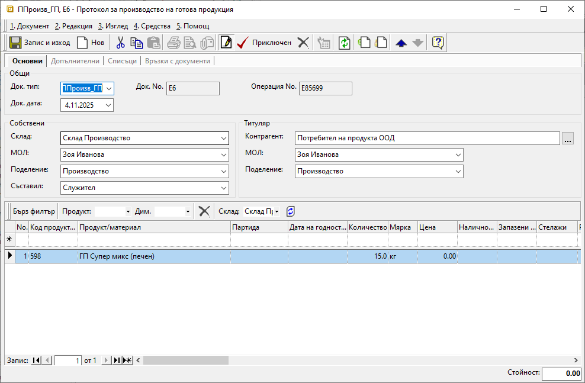{ class=align-center w=15cm }

Чрез помощника **Генериране през рецепта** системата създава един или няколко свързани **ИОМЗ** спрямо настройките в рецептата на произвеждания продукт.   

Документите се приключват в познатия ред. Първо се валидират разходните складови документи със съставките по рецепта.  

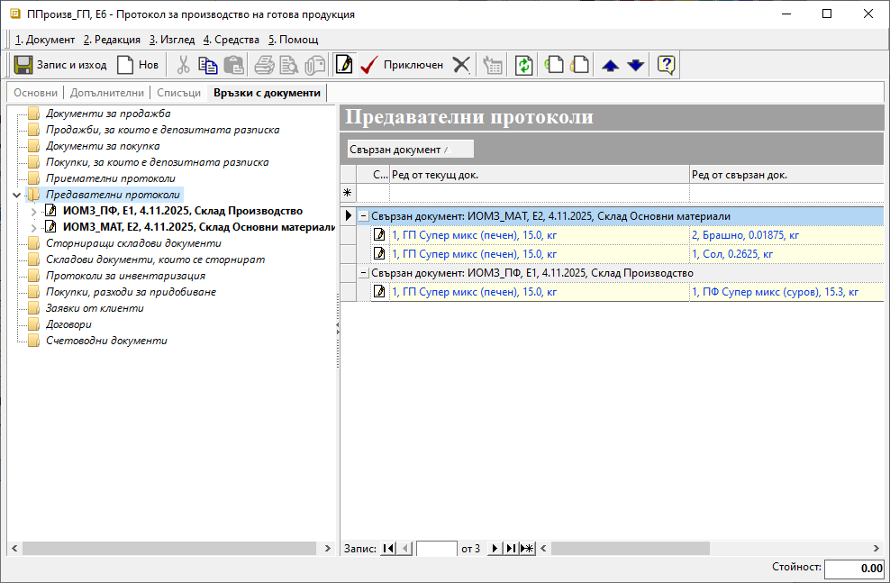{ class=align-center w=15cm }

След валидирането на протокола за производство става ясна себестойността на готовата продукция.   

> **ППроизв** придобива стойност, която е сбор от стойностите на всички свързани **ИОМЗ**.  

### **Пакетиране**

Протоколът за пакетиране на продукция е окончателният документ, с който потвърждавате приключването на производствената поръчка.  

Стъпките за създаване на складовите документи са същите. Различен е отново типът на протокола за пакетиране. Избирате предварително настроеният за целта **ППроизв_П**.  

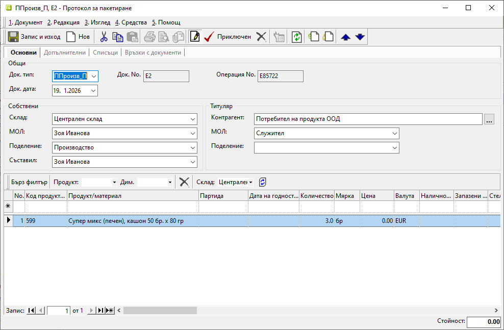{ class=align-center w=15cm }

Преминавате през генерация на искане за отпускане на МЗ.  
Приключвате документите в същата последователност - от разходен към приходен складов документ. Така системата попълва среднопретеглените цени в разходните и прехвърля сумата в стойността на приходните.  

> Уверете се, че сте валидирали всички документи, касаещи производствения процес.  

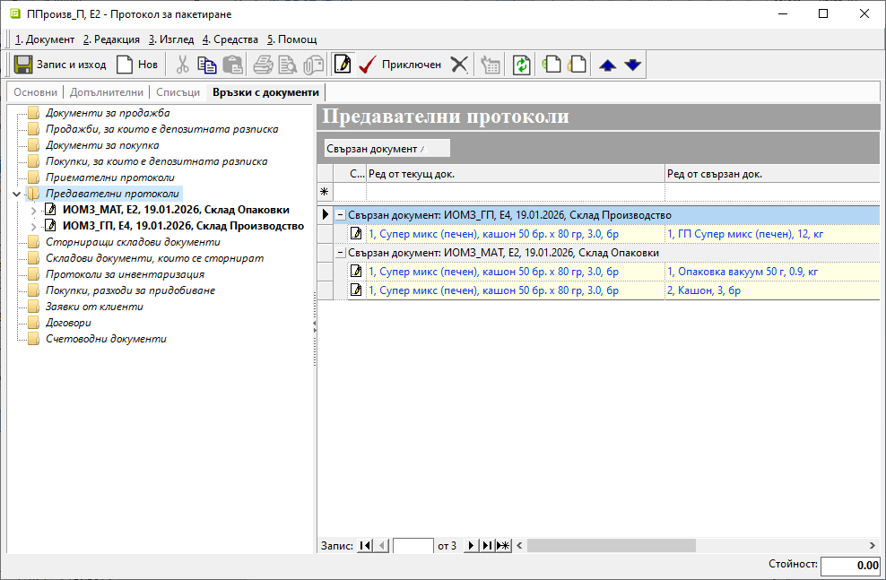{ class=align-center w=15cm }

```{Tip}
Настройки за автоматчино осчетоводяване може да добавяте и редактирате по всяко време.  
Единствено е необходимо след това да генерирате повторно счетоводните записи към складовите документи.  
```

## **Свързани статии**

[Продукти и материали](../001-ref/001-nomenclatures/003-items.md)  
[Типове документи](../001-ref/001-nomenclatures/014-doc-types.md)  
[Автоматичен осчетоводител](../001-ref/002-accounting/003-acc-wizard.md)  
[Производство](../002-docs/002-trade-system/002-warehouse-documents/005-manufacturing.md)  