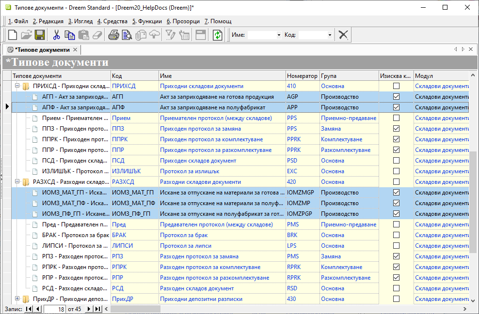
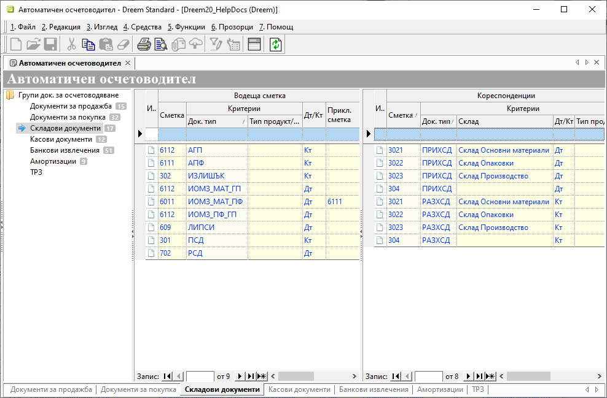
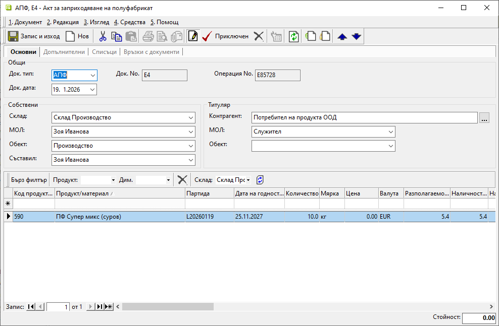
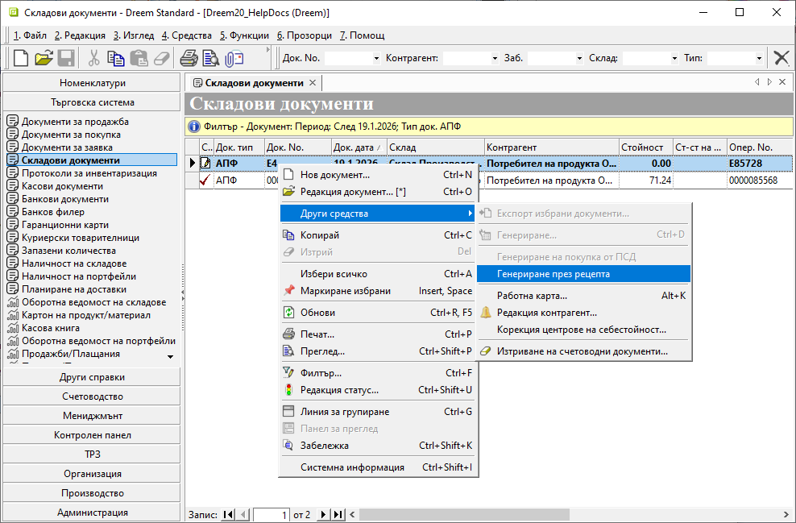
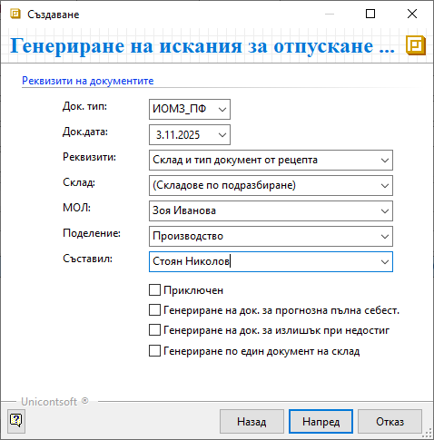
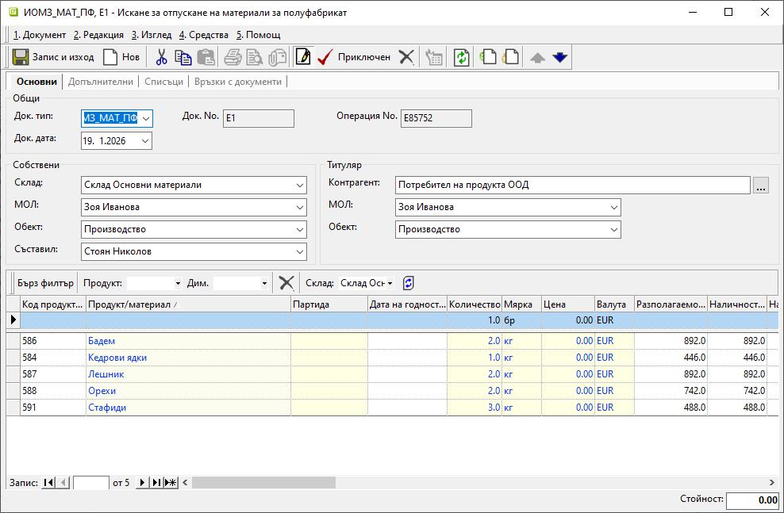
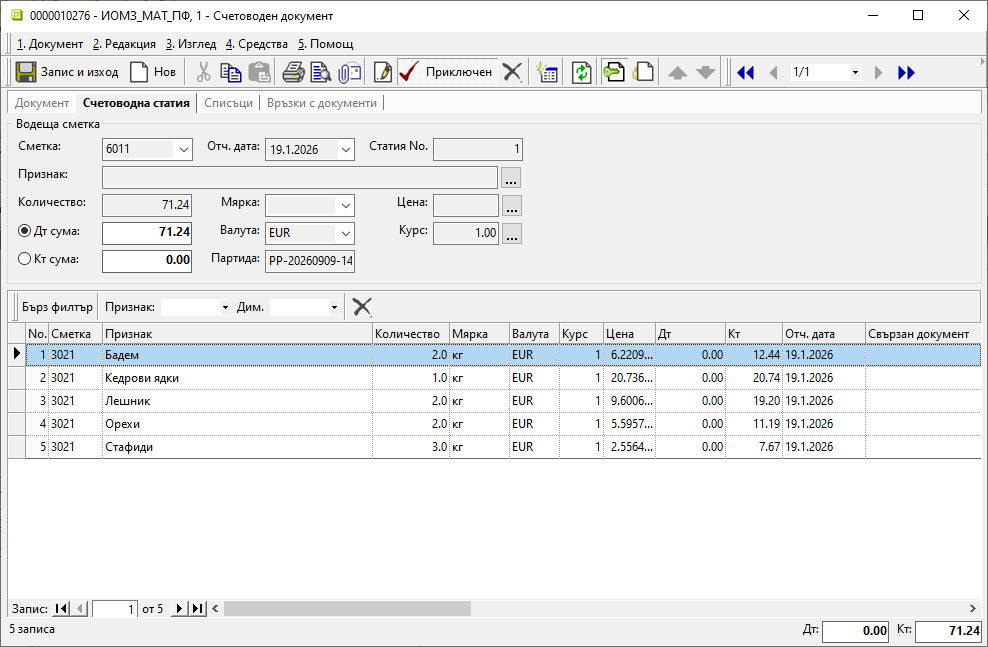
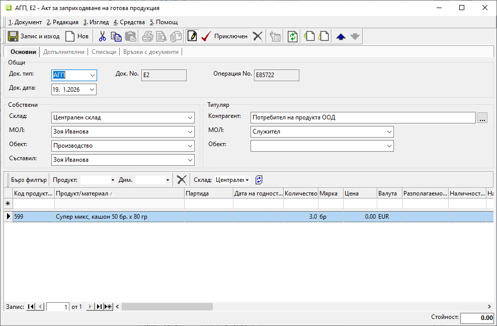
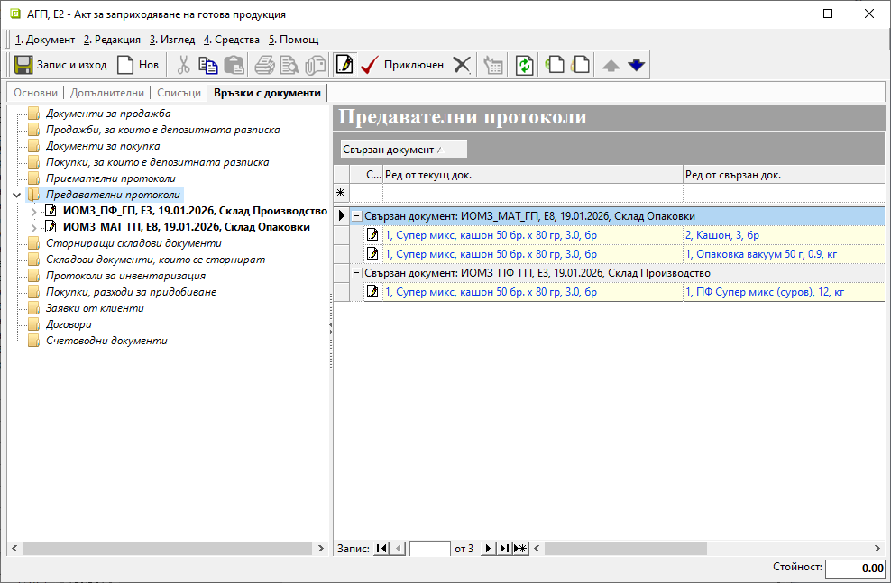

```{only} html
[Нагоре](../000-index)
```

# **Производство с полуфабрикати и пакетиране**

- [Въведение](#въведение)  
- [Настройки](#настройки)
- [Документи за производство](#производство)  
- [Свързани статии](#свързани-статии)

## **Въведение**

**Dreem ERP** осигурява ефективно управление на производствените процеси - актуални складови наличности, проследимост на вложени суровини и себестойност на всеки от етапите.   

Системата дава възможност да реализирате множество междинни фази до получаване на готова продукция. Производството може да включва операции като изготвяне на полуфабрикати, пакетиране и други.  

> Отделните етапи могат да бъдат регистрирани в различни складове и да бъдат осчетоводени автоматично.  

Чрез вградения инструмент за производство системата автоматично попълва данните в участващите документи. В тази връзка са необходими определени настройки. Това включва типове документи и продукти, които ще участват в процесите на производство.   

## **Настройки** 

1) **Типове документи**  

Във връзка с производствените процеси е необходимо да създадете [нови типове](../001-ref/001-nomenclatures/014-doc-types.md) приходни и разходни складови документи.  
Техните наименования могат да бъдат свободно избрани - напр. **АГП**-*Акт за готова продукция* или **ППроизв**-*Протокол за производство* за приходните документи. Към разходните документи може да бъде добавен **ИОМЗ**-*Искане за отпускане на материални запаси*.    

> Системата позволява създаване на множество подтипове приходни и разходни документи.  
Когато дефинирате тези настройки, вземете предвид желаната аналитичност на счетоводно отчитане. За всеки от тях може да бъде настроено автоматично осчетоводяване с отделна счетоводна сметка.   

Настройте всички нови подтипове документи с **Група**: *Производство* и **Модул**: *Складови документи*.  
Поставете отметка в колона **Изисква контрагент Потребител на продукта**. С това системата автоматично ще обзавежда реквизит **Контрагент**: *Потребител на продукта* в избраните документи.  

{ class=align-center w=15cm } 

2) **Продукти**  

Препоръчително е да се дефинират тип на продукта и складове по подразбиране за всички материали, полуфабрикати и готова продукция. Това включва попълване на реквизити **Тип** и **Склад** в раздел **Основни** от формата за редакция на продукт.  

> Дефинирането на **Тип** за продуктите дава възможност в последствие да бъдат добавени индивидуални настройки за автоматично осчетоводяване.  

Механизмът за производство изисква настройка на рецепти за продуктите (полуфабрикати и готова продукция). [Нова рецепта](../002-docs/001-trade-system/002-warehouse-documents/005-manufacturing.md#настройки) се добавя от форма за редакция на избрания продукт в раздел **Списъци » Производство и придобиване**.  

> Системата поддържа вариации на рецепта за един продукт - напр. в различни мерни единици.  

3) **Автоматичен осчетоводител**  

В [**Автоматичен осчетоводител**](../001-ref/002-accounting/003-acc-wizard.md) се конфигурират настройки в секция **Складови документи** по типове продукти, документи и складове.  

```{Tip}
Настройки за автоматично осчетоводяване може да добавяте и редактирате по всяко време. При промяна трябва да съобразите дали е необходима генерация на нови счетоводни записи към складовите документи.  
```

{ class=align-center w=15cm } 

## **Производство**

Първоначално отразявате в системата всяко производствено задание чрез приходен складов документ - акт или протокол за производство. На тази база в последствие ще финализирате всеки от етапите на производство.  

> Полуфабрикатите се използват като входен материал в следващите етапи на производство на готова продукция. Следователно тяхното изготвяне трябва да бъде завършено преди това на готовата продукция.  

### Полуфабрикати  

Нов [документ за производство](../002-docs/001-trade-system/002-warehouse-documents/005-manufacturing.md#създаване-на-протокол-за-производство) може да създадете в **Търговска система » Складови документи**. Той трябва да съдържа полуфабрикатите с количествата, които ще се произвеждат в избраната мерната единица. Спрямо тези данни системата прилага настроената рецепта при генерацията на **ИОМЗ**.  

> Може да попълните **Партида** и **Срок на годност на партида** по всяко време преди приключването на документа.  

{ class=align-center w=15cm } 

Запишете въведените до момента данни (клавишна комбинация **Ctrl+S** или меню **Документ » Запис**).  

> На този етап документът за производство не се приключва.  
Трябва да бъде валидиран след потвърждаване на вложените суровини с приключен документ **ИОМЗ**.  

Системата създава автоматично исканията за отпускане на МЗ чрез вграден инструмент **Генериране през рецепта**.  
Той е достъпен от:  
- формата за редакция на акта/протокола за производство в меню **Средства**;    
- списък **Складови документи** и десен клик върху документа в меню **Други средства**.  

{ class=align-center w=15cm }

Чрез помощника за автоматично създаване на **ИОМЗ** управлявате генерацията и указвате реквизити на документи.  
Предвид направените предварителни настройки при стартиране на помощника попълвате следните полета:   
 
- **Док. дата** - Посочете датата, за която се генерира разходният складов документ **ИОМЗ_МАТ_ПФ**.  
- **Реквизити** - Това поле определя вида на генерацията.  
Подходящата опция в случая е *Склад и тип документ от рецепта*. При нея генерацията взема предвид настройките за тип документ и склад на изписване за суровините от рецептата на полуфабриката.    
- **Приключен** - Чрез отметка указвате **ИОМЗ_МАТ_ПФ** да се генерира и приключи автоматично.  
Оставете празно, ако желаете документът да остане в редакция, за да нанесете корекции.  
- **Генериране на док. за излишък при недостиг** - С опцията указвате дали системата да създаде документ **ИЗЛИШЪК** със суровините в недостиг за изпълнение на рецептата.  
- **Генериране по един документ на склад** - .  

{ class=align-center }

На следващия етап от генерацията системата информира какви документи е в готовност да създаде. Може да потвърдите действието с отметка при **Генериране на документи** и бутон [**Генериране**]. Имайте предвид, че след тази стъпка не може да откажете генерацията.   
Системата съобщава за успешно генерираните документи.  

Новосъздаденият **ИОМЗ_МАТ_ПФ** е добавен в списъка със складови документи. Той е достъпен също от раздел **Връзки с документи** на **АПФ**.  

{ class=align-center w=15cm }

Реквизитите в **ИОМЗ_МАТ_ПФ** са обзаведени автоматично. Системата позволява да нанасяте корекции при необходимост. Накрая трябва да валидирате документа. С това участващите в него суровини се изписват от избрания склад.  

> Всяко **ИОМЗ** е разходен тип складов документ и се обзавежда автоматично със среднопретеглените цени за склада.  
Формираната стойност на **ИОМЗ** се прехвърля като обща стойност и в документа за производство.  

На тази стъпка има възможност да генерирате и счетоводно записване.  

{ class=align-center w=15cm }

Трябва да завършите процеса по производство на полуфабрикат.  
Навигирате се до **АПФ** и приключвате документа със счетоводно записване.  

> Валидирането на **АПФ** отразява завършен междинен етап от производството. Наличността на полуфабриката в склада е увеличена.  

### Готова продукция  

Производствената поръчка ще бъде финализирана с пакетиране и заприходяване на готовата продукция.  

Процесът следва същите стъпки при създаване на документи.  
Регистрирате в редакция приходен складов документ **АГП** за заприходяване на готова продукция.    

{ class=align-center w=15cm }

Стартирате помощника **Генериране през рецепта**.  
Спрямо настройките на произвеждания продукт се създадат един или няколко свързани документа **ИОМЗ**.   

{ class=align-center w=15cm }

Документите се приключват в последователност от разходен към приходен складов документ. Така системата автоматично попълва среднопретеглени цени в разходните и формира стойността на приходните документи.  

В **АГП** себестойността на готовата продукция се формира като сбор от стойностите на свързаните му **ИОМЗ**.  

> Уверете се, че сте валидирали всички документи, касаещи производствения процес.  

## **Свързани статии**

[Продукти и материали](../001-ref/001-nomenclatures/004-items.md)  
[Типове документи](../001-ref/001-nomenclatures/014-doc-types.md)  
[Автоматичен осчетоводител](../001-ref/002-accounting/003-acc-wizard.md)  
[Производство](../002-docs/001-trade-system/002-warehouse-documents/005-manufacturing.md)  