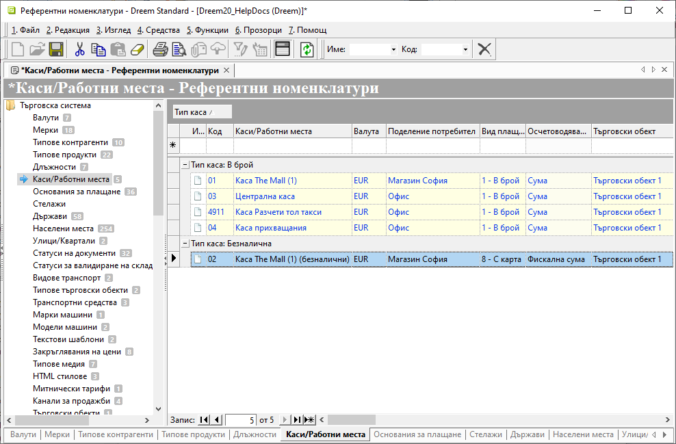
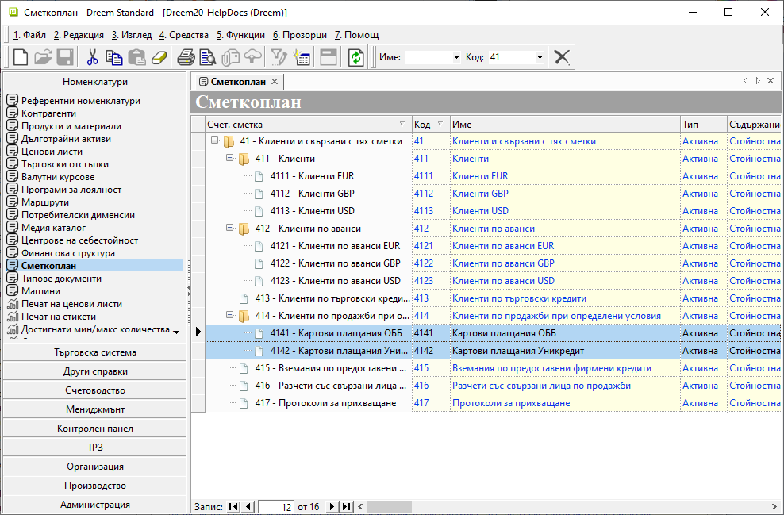
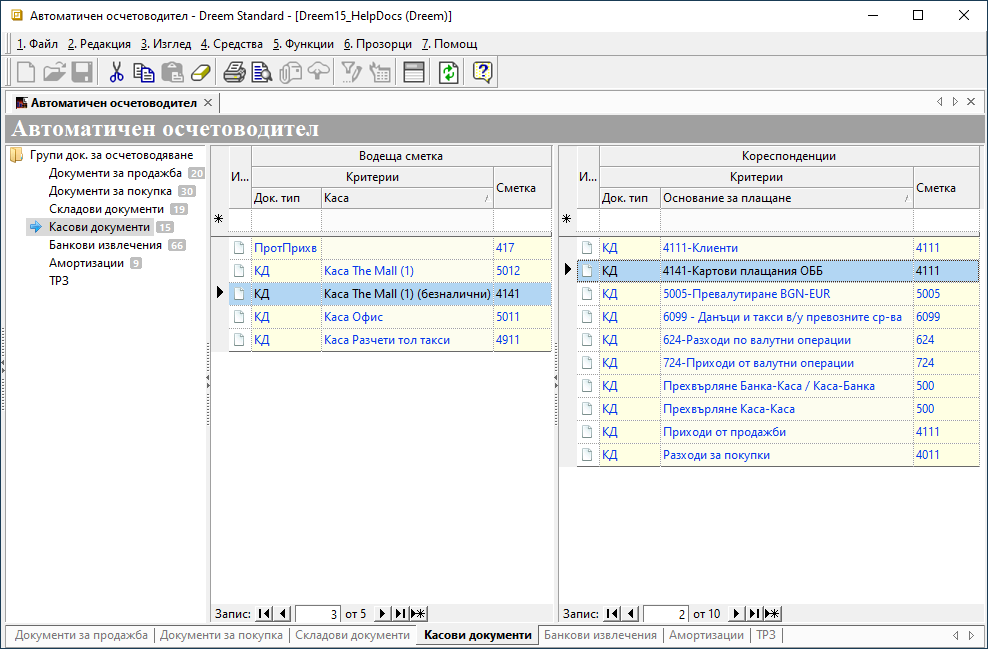

```{only} html
[Нагоре](../000-index)
```

# **Картови плащания**

- [Въведение](#въведение)  
- [Настройки](#настройки)
- [Регистриране на плащания с карта](#регистриране-на-плащания-с-карта)  
- [Свързани статии](#свързани-статии)

## **Въведение**

При картовите плащания няма физическа размяна на парични средства. Затова те се въвеждат в системата в отделна каса със специфични настройки. Регистрират се с отделен вид плащане, като може да бъде създадена аналитичност както за отчитането по счетоводни сметки, така и за справките по портфейли.   

## **Настройки**

1) **Референтни номенклатури**  

- **Каси**  

Създавате отделни каси, които ще използвате за разплащания с карта. За целта в [**Номенклатури » Референтни номенклатури » Каси/Работни места**](../001-ref/001-nomenclatures/001-ref-nomenclatures.md) добавяте нов запис.  
За всяка каса избирате **Валута**, в която ще регистрирате плащанията.  

> Безналичните каси се разграничават от останалите чрез конфигуриране на определени параметри за **Тип каса**, **Вид плащане за фискални бонове** и **Осчетоводяване на касови ордери**.  

Касите за картови плащания настройвате задължително с тип на касата **Безналична**. С това системата третира по различен начин касовите документи за този тип портфейли и не натрупва наличности.   
   
За **Вид плащане на ФУ** настройвате *С карта*.  

Трябва да обзаведете реквизит **Осчетоводяване КО** с *Фискална сума*. При тази настройка системата пренася **Сума фискализиране** от касовия ордер в стойност на счетоводната статия.  

{ class=align-center w=15cm }

В поле **Фискално устройство** се отваря падащ списък със серийните номера на всички касови апарати и фискални принтери, които системата е разпознала. Тук може да изберете устройство, от което ще издавате фискални бонове при валидиране на безналично плащане в текущата каса.   

- **Основания за плащане**  

Основанията за картови плащания създавате в **Номенклатури » Референтни номенклатури » Основания за плащане**. Те са пряко свързани с настройките за автоматично осчетоводяване на касови и банкови документи.  

{ class=align-center w=15cm }
   
Може да създавате множество основания за плащане. Всяко от тях може да отговаря на картови плащания към избрана банкова сметка. Удобно е да отразите това в наименованието на основанието - напр. **4141-Картови плащания ОББ**.  
   
В последствие ще обвържете основанията с избрани счетоводни подсметки в **Автоматичен осчетоводител**, така че може да включите и тази информация в наименованието.  

2) **Сметкоплан**  

Добавете [нови подсметки](../001-ref/002-accounting/002-chart-of-acc.md), които да отговарят на основанията за картови плащания - напр. с/ка **4141 Клиенти картови плащания ОББ**. В нея ще се отчитат разплащанията с карта чрез ПОС терминал на ОББ.  

{ class=align-center w=15cm }

3) **Автоматичен осчетоводител**  

   - **Касови документи**  

В раздела за касови документи от секция **Водеща сметка** добавете настройка за всяка безналична каса. Използвайте счетоводната сметка, която отговаря на ПОС терминала, който ще се използва - напр. с/ка **4141 Клиенти картови плащания ОББ**.  

В секция **Кореспонденции** добавете отделен ред за всяко основание за плащане с карта по сметка **Клиенти** - напр. с/ка **4111**. 

{ class=align-center w=15cm }

   - **Банкови извлечения**  

В раздела за банкови документи от секция **Водеща сметка** трябва да имате настройка за всяка банкова сметка, с която оперирате.  
Когато водите с отделна аналитичност банковите сметки, предварително в **Сметкоплан** се добавят подсметки в гр. 50.  

В секция **Кореспонденции** за всяко основание за плащане с карта се дефинира избраната счетоводна подсметка - напр. основание **4141-Картови плащания ОББ** да се осчетоводява по с/ка **4141**.  


4) **Dreem POS**

За плащанията с карта през **Dreem POS** се дефинират гореописаните настройки в бекофис системата **Dreem ERP**.  

Настройките във фронтофис системата **Dreem POS** се конфигурират от администратор на *Униконт софт* и изглеждат по подобен начин:  


## **Регистриране на плащания с карта**

### Картови плащания в Dreem ERP

### Картови плащания в Dreem POS

## **Свързани статии**

[Референтни номенклатури](../001-ref/001-nomenclatures/001-ref-nomenclatures.md)  
[Сметкоплан](../001-ref/002-accounting/002-chart-of-acc.md)  
[Автоматичен осчетоводител](../001-ref/002-accounting/003-acc-wizard.md)