```{only} html
[Нагоре](../000-index)
```

# **Картови плащания**

- [Въведение](#въведение)  
- [Настройки](#настройки)
- [Регистриране на плащания с карта](#регистриране-на-плащания-с-карта)  
- [Свързани статии](#свързани-статии)

## **Въведение**

При картовите плащания няма физическа размяна на парични средства. Затова те се въвеждат в системата в отделна каса със специфични настройки. Регистрират се с отделен вид плащане, като може да бъде създадена аналитичност както за отчитането по счетоводни сметки, така и за справките по портфейли.   

## **Настройки**

### Референтни номенклатури  

1) **Каси**  

В [**Номенклатури » Референтни номенклатури » Каси/Работни места**](../001-ref/001-nomenclatures/001-ref-nomenclatures.md) се създават отделни каси, които ще използвате за разплащания с карта.  
За всяка каса избирате **Валута**, в която ще регистрирате плащанията.  

> Безналичните каси се разграничават от останалите чрез конфигуриране на определени параметри за **Тип каса**, **Вид плащане за фискални бонове** и **Осчетоводяване на касови ордери**.  

Задължително настройвате касите за картови плащания с тип на касата **Безналична**. Системата третира по различен начин касовите документи за този тип портфейли и не натрупва наличности.   
   
За **Вид плащане на ФУ** изберете *С карта*.  

Реквизит **Осчетоводяване КО** трябва да обзаведете с *Фискална сума*. При тази настройка системата пренася **Сума фискализиране** от касовия ордер в стойност на счетоводната статия.  

В поле **Фискално устройство** се отваря падащ списък със серийните номера на всички касови апарати и фискални принтери, които системата е разпознала. Тук може да изберете устройство, от което ще издавате фискални бонове при валидиране на безналично плащане в текущата каса.   

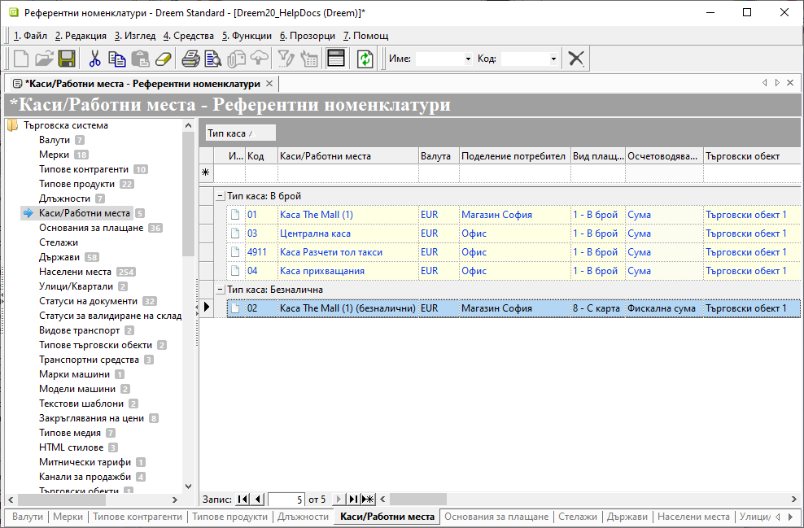{ class=align-center w=15cm }

2) **Основания за плащане**  

Основанията за картови плащания се създават в **Номенклатури » Референтни номенклатури » Основания за плащане**. Те участват при дефиниране на настройки за автоматично осчетоводяване на касови и банкови документи.  
   
> В **Автоматичен осчетоводител** основанията за плащане се обвързват с избраните счетоводни подсметки. Затова е удобно да включите кода на сметката в наименованието им.  
   
Може да създавате множество основания, като всяко отговаря на картови плащания към различна банка. Включете и тази информация в наименованието - напр. **4141-Картови плащания ОББ**.  

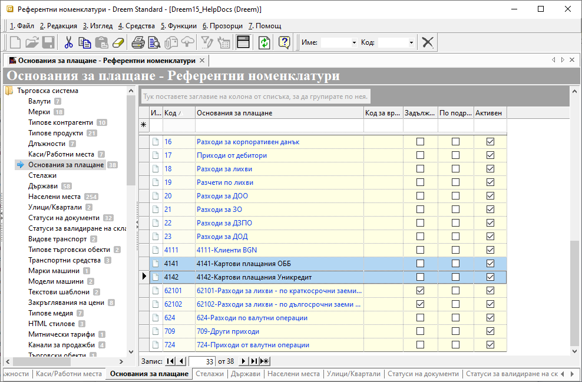{ class=align-center w=15cm }

### Сметкоплан  

Добавете [нови подсметки](../001-ref/002-accounting/002-chart-of-acc.md), които да отговарят на основанията за картови плащания - напр. с/ка **4141 Картови плащания ОББ**. В нея ще се отчитат разплащанията с карта чрез ПОС терминал на ОББ.  

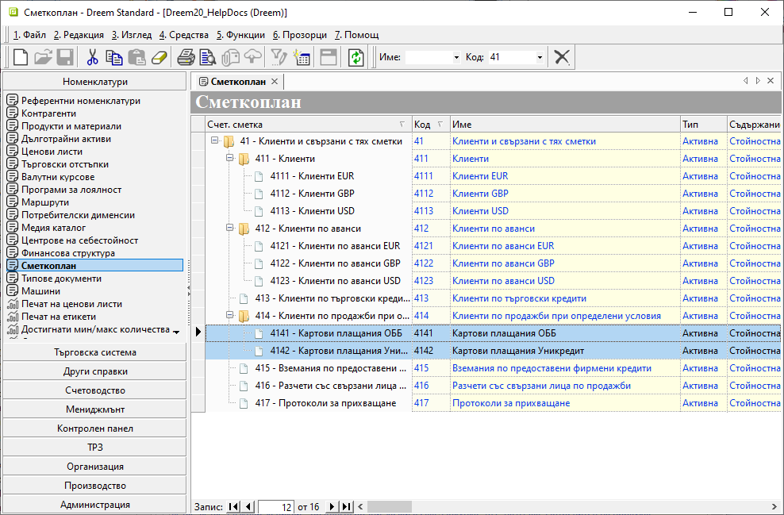{ class=align-center w=15cm }

### Автоматичен осчетоводител  

1) **Касови документи**  

От секция **Касови документи** в списък **Водеща сметка** добавете отделен ред с настройка за всяка безналична каса. Попълнете счетоводната сметка, така че да отговаря на картовия терминал за банката - напр. с/ка **4141 Картови плащания ОББ**.  

В списък **Кореспонденции** добавете отделен ред с всяко от основанията за плащане с карта по сметка **Клиенти** - напр. с/ка **4111**. 

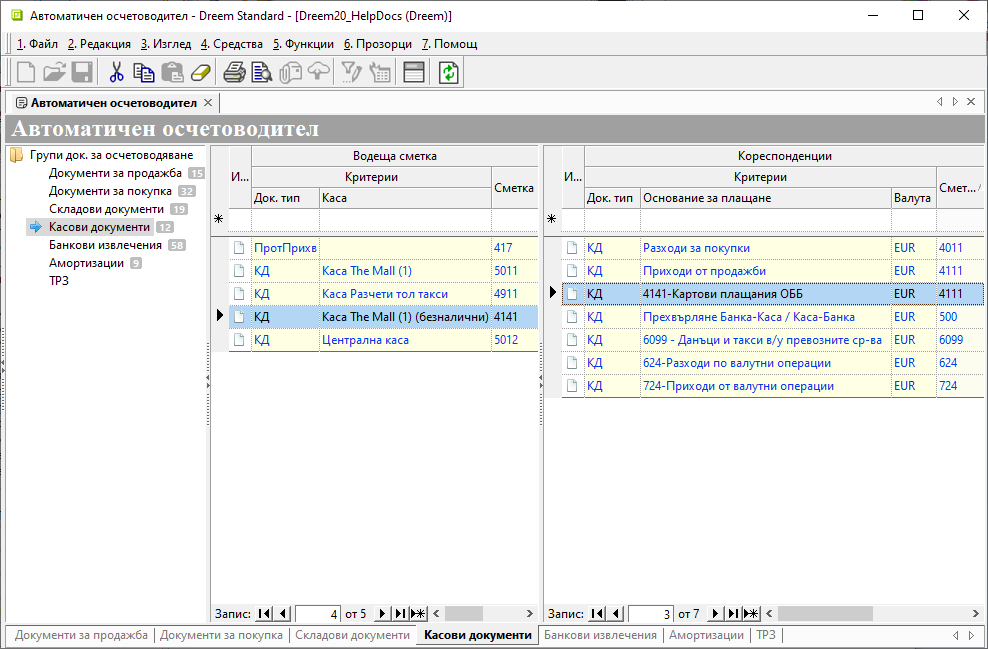{ class=align-center w=15cm }

2) **Банкови извлечения**  

От секция **Банкови документи** в списък **Водеща сметка** трябва да имате настройка за всяка банкова сметка, с която оперирате.  

> Когато водите банковите сметки аналитично, предварително в **Сметкоплан** се добавят подсметки в *гр. 50*.  

В списък **Кореспонденции** се добавят отделни редове с всички основани за картови плащания и се дефинира счетоводна подсметка - напр. основание **4141-Картови плащания ОББ** се осчетоводява по с/ка **4141**.  

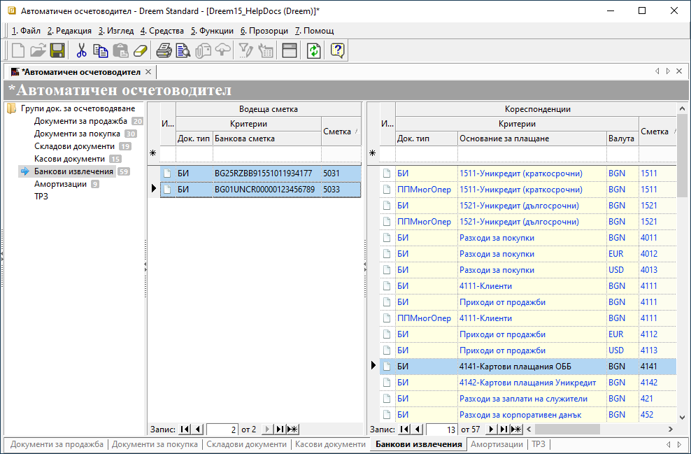{ class=align-center w=15cm }

### Dreem POS

За плащанията с карта през **Dreem POS** също е необходимо да се дефинират гореописаните настройки в бекофис системата **Dreem ERP**.  

> Настройките във фронтофис системата **Dreem POS** се конфигурират от администратор на *Униконт софт*.    

## **Регистриране на плащания с карта**

1. **Продажба**  

Платените с карта продажби се въвеждат в системата със стандартни документи **Продажба**.  
Изберете вид на плащането да бъде *С карта*.     

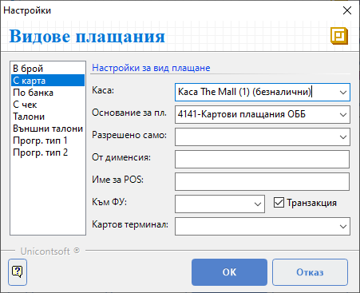{ class=align-center w=15cm }

Приключвате продажбата с генериране на касов документ в избрана безналична каса.  

> В поле **Основание** изберете настроеното за случая основание на плащане **4141-Картови плащания ОББ**.  

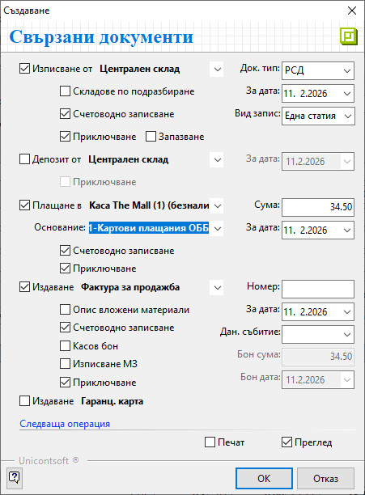{ class=align-center }

> Задължително потвърждавате издаване на данъчен документ от  **Издаване Фактура за продажба / Отчет за продажби**.   

Останалите опции за свързани документи се маркират спрямо ситуацията.  

2. **Касов документ**  

В генерирания **ПКО**-*Приходен касов ордер* има някои особености в следствие направените настройки за касата като безналична.  

   - **Сума** и **Стойност** на документа е **0 (нула)**.  
   - Платената с карта сума е отразена в поле **Сума фискализиране**.  

Така свързаната продажба остава неплатена. Нейният остатък за плащане ще бъде закрит в последствиое. Това става с въвеждането на банково извлечение за постъпилата сума по банкова сметка.  
Същевременно вземането по свързаната в **ПКО** фактура ще се закрие със стойността на **Сума фискализиране**.  

> Вземания по данъчни документи се намаляват със сумите от свързаните счетоводни записи за **с/ка 411**.  

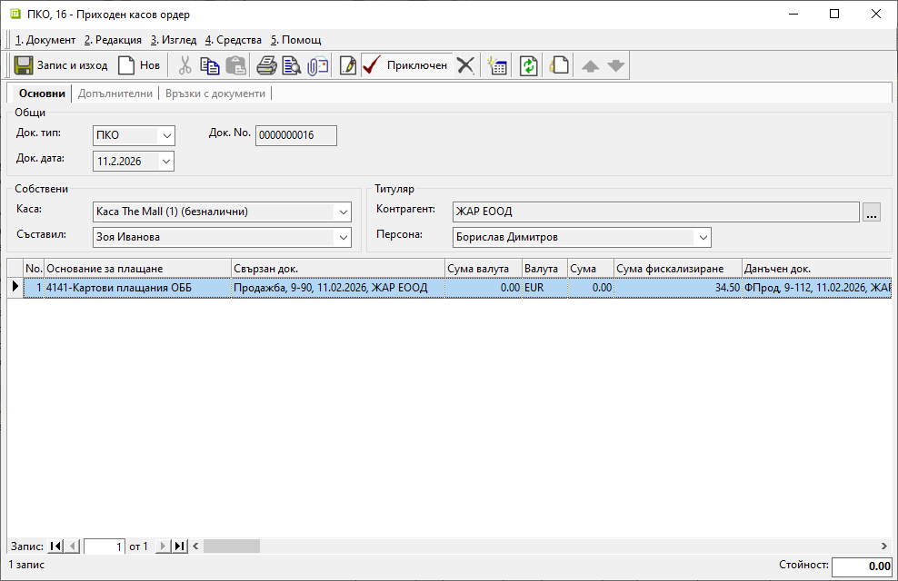{ class=align-center w=15cm }

В счетоводния запис към приходния касов ордер В случая вземането от клиент се прехвърля като салдо по **с/ка 4141**.    

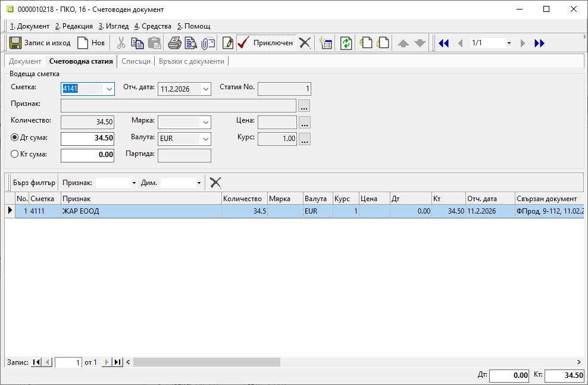{ class=align-center w=15cm }

3. **Банков документ**  

На следващ етап въвеждате в системата банково извлечение с постъпилите картови плащания. В документа използвате основание за плащане **4141-Картови плащания ОББ**. Задължително в поле **Свързан документ** посочвате продажбите, отговарящи на всяка банкова трансакция.  

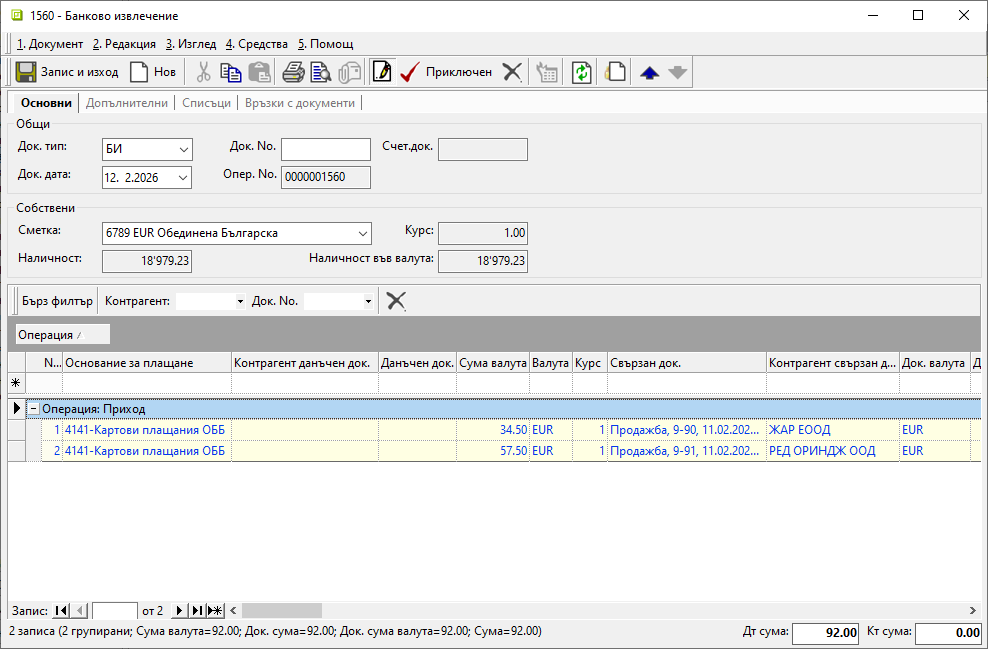{ class=align-center w=15cm }

> В извлечението не се цитират данъчните документи за продажба.  
Техните остатъците за плащане са закрити с осчетоводяването на **ПКО**.  

Приключвате банковия документ с осчетоводяване. С това салдото по **с/ка 4141** се намалява.  
Счетоводната статия има следния вид:  

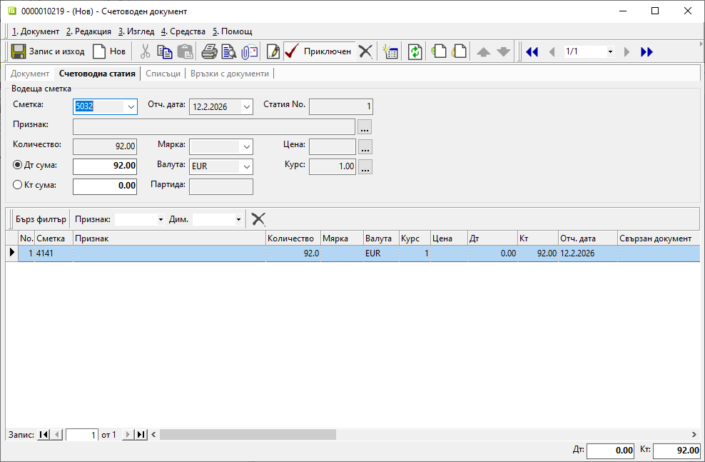{ class=align-center w=15cm }  

## **Свързани статии**

[Референтни номенклатури](../001-ref/001-nomenclatures/001-ref-nomenclatures.md)  
[Сметкоплан](../001-ref/002-accounting/002-chart-of-acc.md)  
[Автоматичен осчетоводител](../001-ref/002-accounting/003-acc-wizard.md)  
[Касови документи](../002-docs/002-trade-system/003-payments/001-cashdesk.md)  
[Банкови документи](../002-docs/002-trade-system/003-payments/004-bank.md)