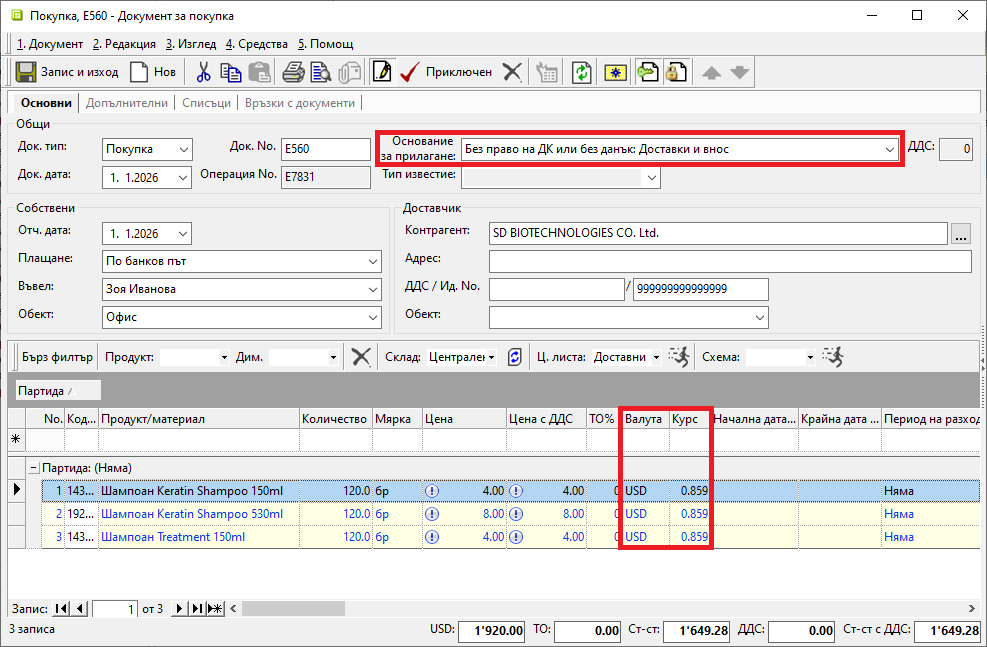
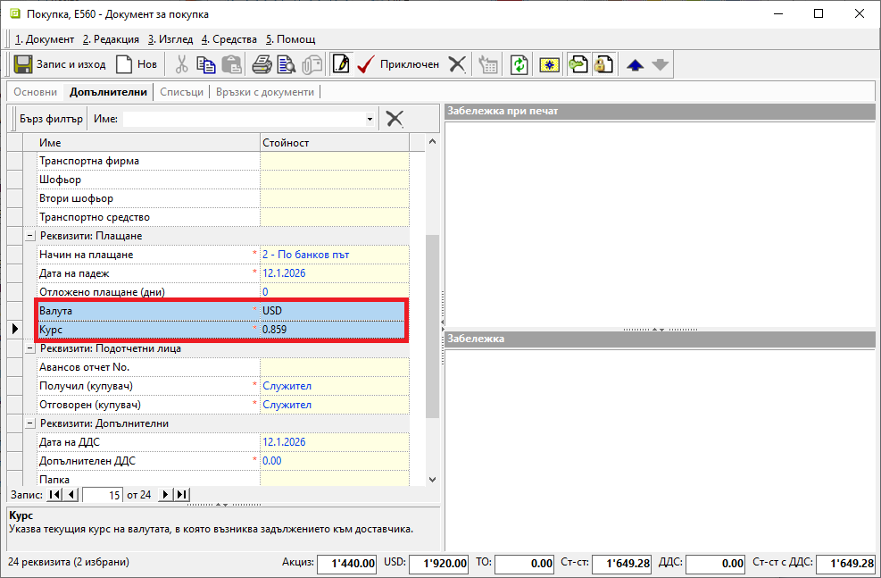
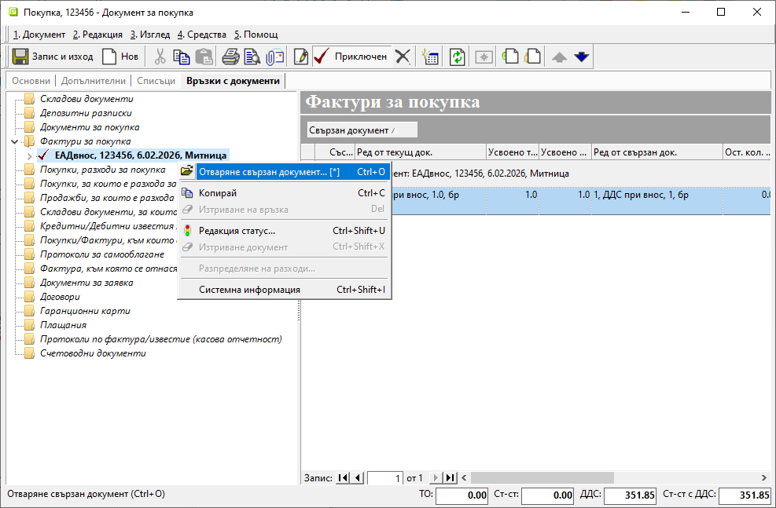

```{only} html
[Нагоре](000-index)
```
 
# **Митническа декларация за внос**  

- [Въведение](#въведение)  
- [Фактура от доставчики](#фактура-от-доставчик)
- [Въвеждане на ЕАДвнос](#въвеждане-на-еадвнос)

## **Въведение**

При внос на стоки от държави извън Европейския съюз се получава фактура от доставчика без включен ДДС. Дължимият данък се начислява допълнително с изготвянето на **Митническа декларация за внос**.  

В системата този случай се отработва с въвеждането на отделни документи:  
- Фактура от доставчик за закупена стока;    
- Документ за начислени ДДС, мита и/или др. налози;      

## **Фактура от доставчик**

Получената фактура за доставка на стоки се въвежда чрез [създаване на нов документ](../002-docs/002-trade-system/001-orders-sales-purchase-documents/002-create-purchase-documents.md) в **Търговска система » Документи за покупка**.  
Валутните сделки се въвеждат в системата като стандартни покупки. Единствените реквизити, които се различават, са:  

- В раздел **Основни** - *Основание за прилагане*, *Валута* и *Курс*;  

{ class=align-center w=15cm }

- В раздел **Допълнителни** - *Валута* и *Курс*;  

{ class=align-center w=15cm }

> Останалата част от обработката на документа се извършва без особености.  
Покупката се валидира от **Приключен** и се избират свързаните документи, които системата да генерира автоматично.   

## **Въвеждане на ЕАДвнос**

Митническа декларация за внос може да бъде въведена от **Търговска система » Документи за покупка**.  
Създава се нов вътрешнофирмен документ тип **Покупка**. В него се попълват дата и номер на митническата декларация - полета **Док. дата** и **Док. No**.  

> Реквизит **Плащане** се обзавежда с **По банков път**.  

В секцията *Доставчик* от поле **Контрагент** се избира **Митница**.  
Този контрагент трябва да бъде[ предварително въведен](../001-ref/001-nomenclatures/002-contragents.md).    

{ class=align-center w=15cm } 

На реда за добавяне на нов запис се избира настроен за случая продукт **ДДС при внос** с количество 1 брой.  
Продуктът трябва да бъде [предварително създаден](../001-ref/001-nomenclatures/003-items.md) като номенклатура от тип услуга.   

> Поле **Цена** остава със стойност 0 (нула).  

В раздел **Допълнителни** поле **Допълнително ДДС** се попълва със сумата, равняваща се на 20% от митническата стойност.     

{ class=align-center w=15cm } 

Документът се приключва. От форма **Свързани документи** се генерира **Митническа декларация за внос** (ЕАДвнос) с **Приключване**. На този етап не се създава счетоводно записване.    

   { class=align-center w=15cm }

> В счетоводното записване към митническата декларация се налага да бъдат нанесени ръчно някои корекции. Затова счетоводният документ се генерира допълнително в състояние на редакция.  

За целта се отваря **ЕАДвнос**-*Митническа декларация за внос*. Документът е лесно достъпен от раздел **Връзки с документи** в покупката.  

{ class=align-center w=15cm }

Счетоводно записване се генерира от форма **Свързани документи**, която се отваря чрез бутони [**Приключен] или [**Генериране**].  
Опцията **Приключване** остава немаркирана. По този начин системата създава счетоводен документ в редакция.   

{ class=align-center w=15cm }

В раздел **Документ** на счетоводния запис се нанасят корекции, така че номер и дата на документа да съвпадат с тези по митническа декларация.  
Основанието за прилагане трябва да бъде **С право на пълен ДК: Облагаеми доставки, внос, доставки по чл.69, ал.2**.  
Полета **Данъчна основа** и **Ст-ст ДДС** се попълват спрямо същите данни по митническа декларация.  

{ class=align-center w=15cm }

От раздел **Счетоводна статия** за водеща сметка трябва да бъде избрана с-ка **457-Разчети с митници**.  
Поле **Признак** се редактира, като се обзавежда с доставчика на стоката.  

Редът с продукт **ДДС при внос** трябва да се премахне от документа.  
Счетоводната статия трябва да има подобен вид:  

{ class=align-center w=15cm }

Счетоводният документ трябва да бъде приключен. С това данните се регистрират в счетоводни справки и **Дневник за покупките**.