```{only} html
[Нагоре](000-index)
```
 
# **Споделяне на документи чрез EDI**  

- [Въведение](#въведение)  
- [Настройки](#настройки)
- [Обмен на документи](#обмен-на-документи)

## **Въведение**

**Dreem ERP** разполага с инструмент за електронен обмен на документи. Преносът на данни се осъществява чрез импорт и експорт на файлове в стандартизиран електронен формат.  

## **Настройки**

За да реализирате трансфер на данни, е необходима предварителна подготовка на системата. Това включва някои бързи настройки.  

> Обърнете внимание, че всяка промяна в настройките трябва да бъде записвана, за да влезе в сила.  

### Номенклатури

- **Референтни номенклатури**  

В списъка с референтни номенклатури **Мерки** се попълват реквизитите в колона **Код по EDI**.  

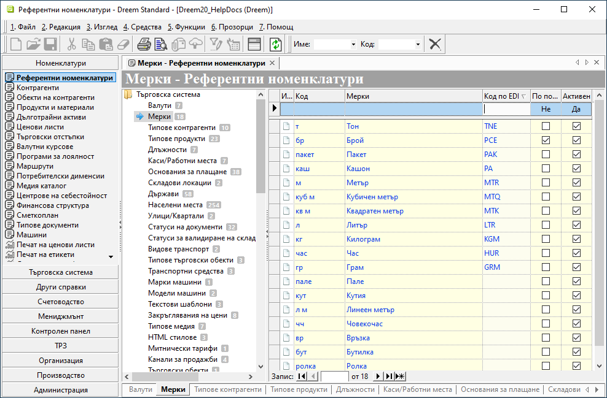{ class=align-center w=15cm }

- **Контрагенти** и **Обекти на контрагенти**  

За контрагентите и обектите задължително се добавя **GLN** (Global Location Number).  
Този код служи за идентифициране на всяка от участващите страни при обмена на данни.   

Реквизит **Номер на локация (GLN)** е достъпен в раздел **Допълнителни** на формите за редакция за номенклатури **Контрагенти** и **Обекти на контрагенти**.  

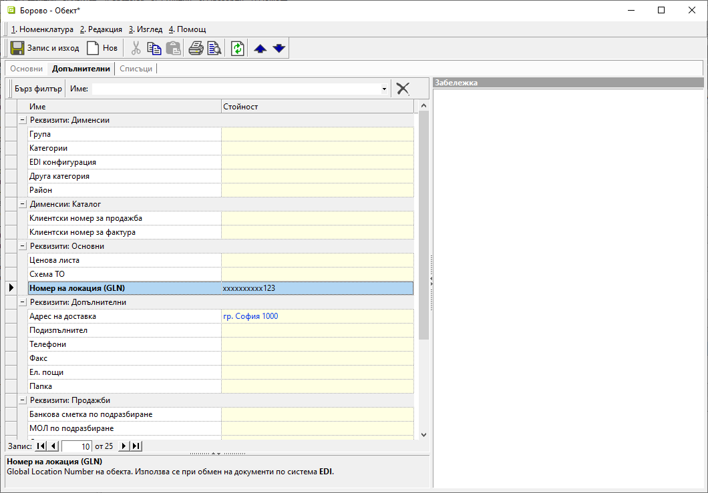{ class=align-center w=15cm }

- **Продукти и материали**  

Задължителните настройки на продуктите включват добавяне на **Баркод** и **Вендор код** за участващите номенклатури.  

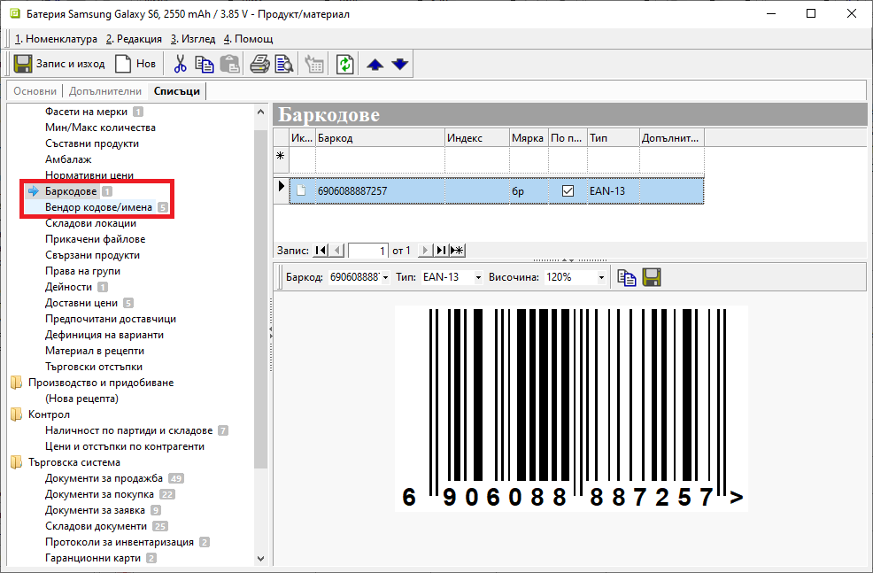{ class=align-center w=15cm }

Също така трябва да бъде създаден нов продукт **Неизвестен продукт (служебен)**. Системата го прилага при импорта за липсващи в базата артикули.  

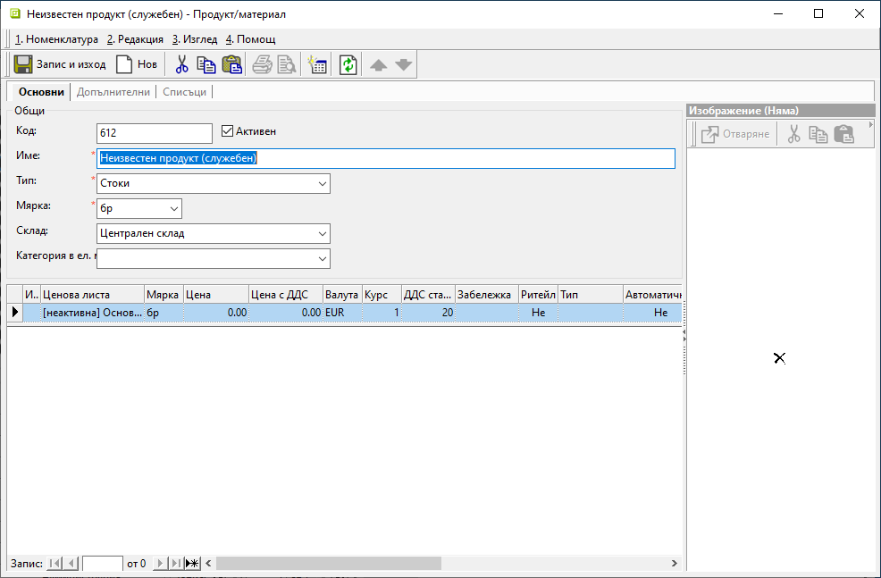{ class=align-center w=15cm }

### Администрация

- **Настройки**  

В секция **Група: Продукти и материали** се дефинира настройка за **Неизвестен продукт/материал**. Чрез нея се указва продуктът, който ще замени неидентифицираните артикули при импорта на документи.  

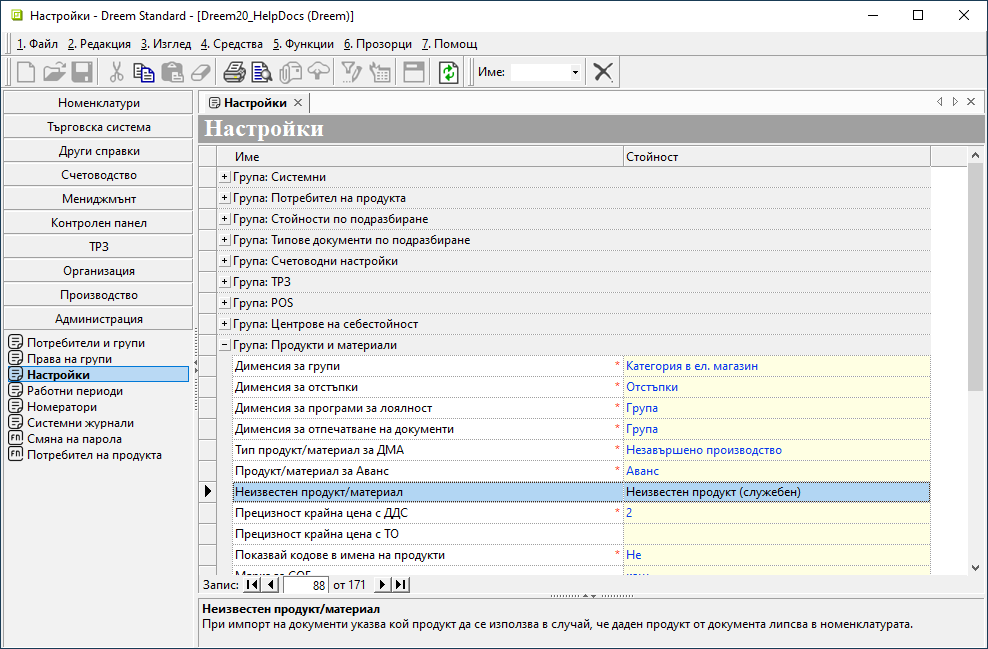{ class=align-center w=15cm }

## **Обмен на документи**

### Импорт EDI документ

В системата може да бъде извършен импорт на документи за покупка и за заявка.  

Създавате нов документ и в празната форма за редакция избирате меню **Документ » Импорт EDI**.  

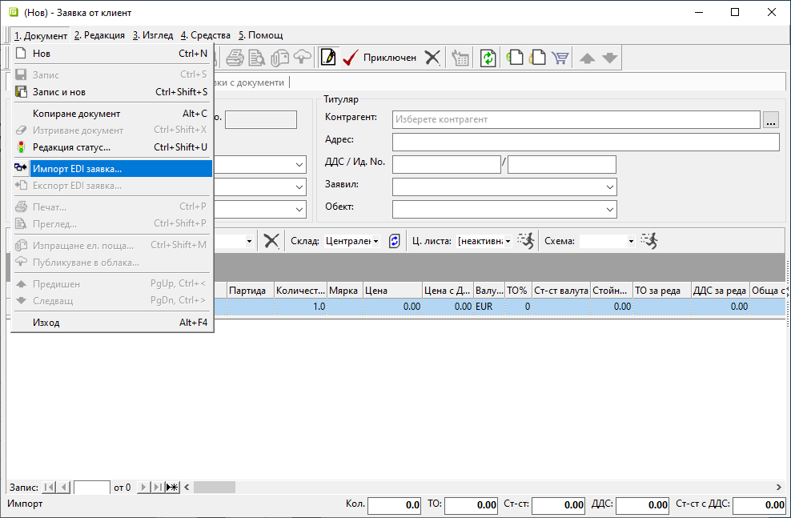{ class=align-center w=15cm }

На следваща стъпка избирате файла с документа за импорт.  

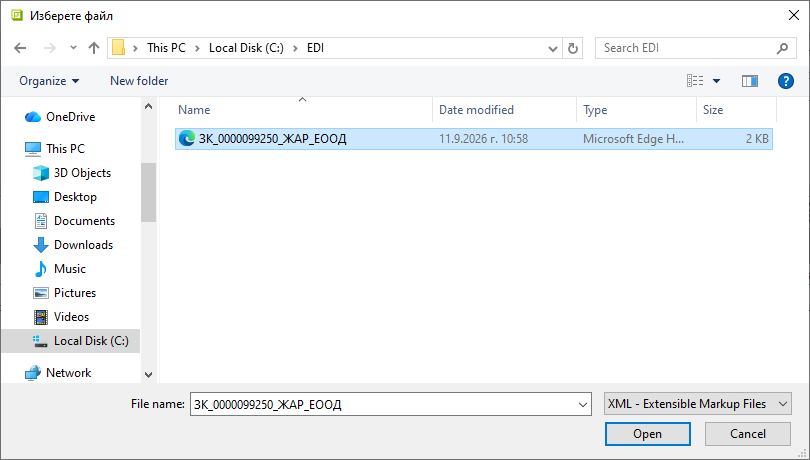{ class=align-center w=15cm }

След потвърждаване на импорта данните от файла се попълват в документа.  
Продължавате с обработката му без особености.  

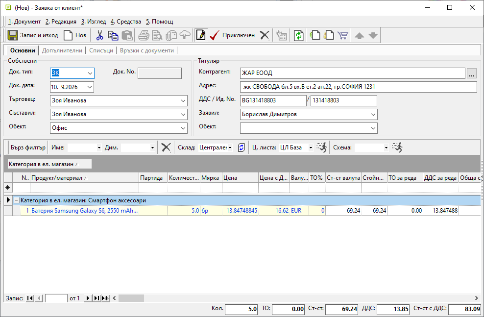{ class=align-center w=15cm }

### Експорт  файл

Експорт чрез EDI може да бъде направен за документите за продажба и заявка.  

Навигирате се до избрания тип документ и го отваряте. В меню **Документ** посочвате опция **Експорт EDI файл**.   

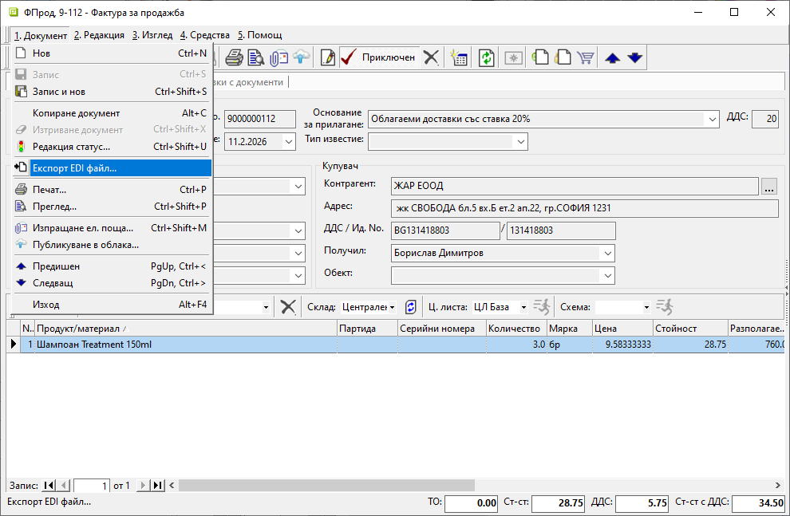{ class=align-center w=15cm }

Отваря се прозорец за избор на папка, в която да запишете XML файлa.  

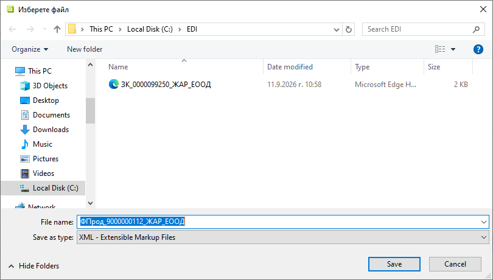{ class=align-center w=15cm }

С потвърждаването на пътя експортът се финализира.  
Системата извежда информативно съобщение с резултата.  

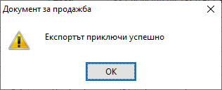{ class=align-center }