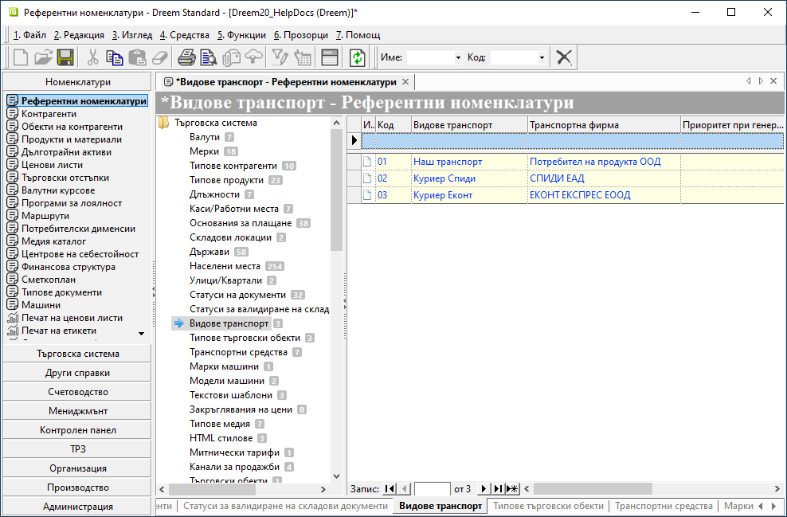
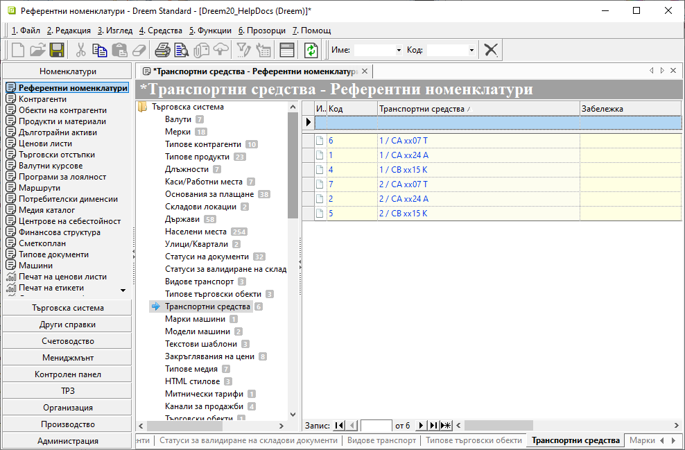
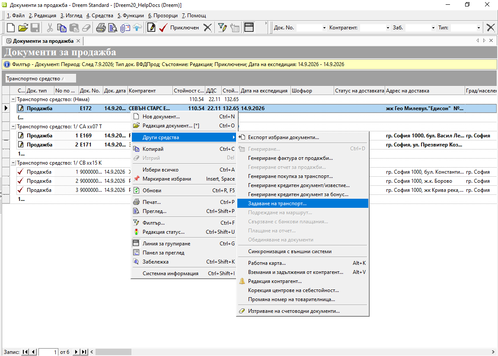
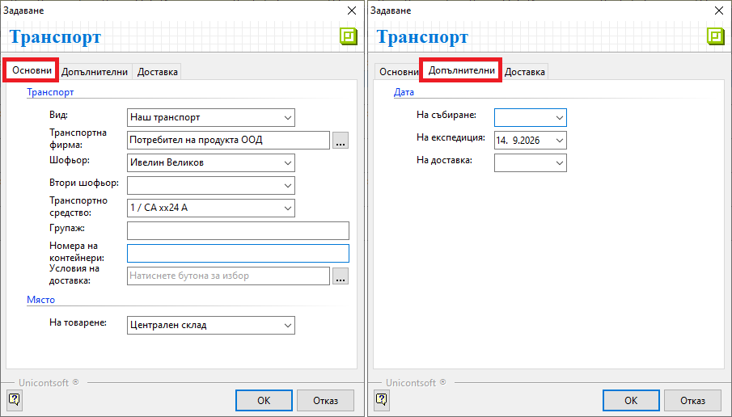
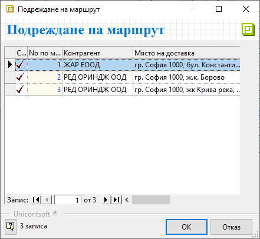

# **Задаване на маршрути за доставка**

Логистиката на доставките за клиенти изисква организирането им по маршрути. Това планиране на превоза включва разпределяне на задачите по транспортни средства, шофьори и други. Може да бъде извършено от диспечер (търговски отдел) през **Dreem ERP** или от оторизиран потребител в **Dreem Mobile**.  

## **Настройки**

Дефинирането на маршрут изисква някои предварителни настройки.  
В последствие на тази база се указват начин на транспортиране на стките, отговорен служител и товарен автомобил.  

### Видове транспорт

В меню **Номенклатури » Референтни номенклатури » Видове транспорт** се попълва списък с използваните методи за транспортиране на поръчки.  
За всеки вид транспорт може да бъде указана транспортна фирма по подразбиране.  

{ class=align-center w=15cm }


### Транспортни средства

От **Номенклатури » Референтни номенклатури » Транспортни средства** се добавя списък с всички транспортни автомобили.  

```{tip}
Често едно транспортно средство изпълнява повече от един курс за деня. При това положение е удобно да се добавят отделни настройки по курсове.  
Например: За автомобил с рег. номер САхх24А, изпълняващ два курса дневно, се настройват 1/САхх24А и 2/САхх24А.  
```

{ class=align-center w=15cm }

### Шофьори

Служителите, отговарящи за доставките до клиенти, трябва да бъдат добавени в списъка с персони на контрагент **Потребител на продукта**.  

## **Дефиниране на маршрут в Dreem ERP**

В бекофис системата маршрутите се конфигурират чрез вградения инструмент **Задаване на транспорт**. Ще го откриете в **Търговска система » Документи за продажба**.  

За удобство предвартелно можете да филтрирате списъка с документи по следния начин:    

- **От дата/До дата**: *период от седмица назад спрямо експедицията*
- **Док. тип**: *ВФДПрод*  
- **Състояние**: *Редакция* и *Приключени*  
- **Дата експ-я от/ до**: *избрана дата (обикновено текуща)*    

{ class=align-center w=15cm }
 
В списъка допълнително извеждате някои колони с водеща информация за реализиране на доставките:  

- **Транспортно средство**  
Съдържа информация за избраното средство за разнос.  
- **No по маршрут**  
Показва избраната последователност за изпълнение на доставките от курса.   
- **Дата на експедиция**  
Показва датата на изпращане към клиента.   
- **Шофьор**  
Показва имената на избрания шофьор, отговорен за доставката.   
- **Статус на доставката**  
Показва степен на изпълнение на доставката: *1-Натоварена*, *2-Доставена* и *3-Върната*.   
- **Адрес на доставка**  
Обзавежда се с дефинирания адрес за доставка на обект/контрагент. Ако липсва, показва адрес на регистрация на обект/контрагент.   

> Съветваме да групирате документите по **Транспортно средство**.  
В последствие това ще послужи и при отчитането по курсове на доставка.  

{ class=align-center w=15cm }

### Задаване на транспорт 

Продажбите се присъединяват към маршрут чрез маркиране с десен клик и опция **Други средства » Задаване на транспорт**.  

{ class=align-center w=15cm }

Във форма **Транспорт** попълвате минимум следните реквизити:  
- **Вид**  
Избирате **Наш транспорт**, при което поле **Транспортна фирма** се обзавежда автоматично с **Потребител на продукта**.  
- **Шофьор**  
Маркирате шофьора, който ще извърши доставката. Тази настройка е асоциирана с потребителския профил на шофьора в **Dreem Mobile**.  
- **Транспортно средство**  
Посочвате товарния автомобил, който изпълнява разноса на стоки.   
- **Дата на експедиция**  
Избирате дата, на която стоките фактически излизат от склада за доставка.  

{ class=align-center w=15cm }

### Подреждане по маршрут

Разполагате с възможност да определите реда на доставка за всяка от продажбите в маршрута.  

Маркирате документ от предварително дефиниран курс. С десен клик избирате опцията **Други средства » Подреждане на маршрут**.  
В колона **No по маршрут** попълвате номер спрямо избраната последователност на доставките.  

{ class=align-center }

## **Нов маршрут в Dreem Mobile**

Маршрут може да бъде генериран чрез създаване на [нов документ](../../mob/002-mob-docs/011-dealer-routes.md) в меню **Маршрути**. В него се избират продажбите за разнос - по номер на документ или чрез сканиране на баркод.  

И тук продажбите могат да бъдат сортирани по реда на доставка.  

> Добавяне на маршрути е достъпно за потребители на **Dreem Mobile**, конфигурирани с настройките за мобилен диспечер (дилър продажби).  

