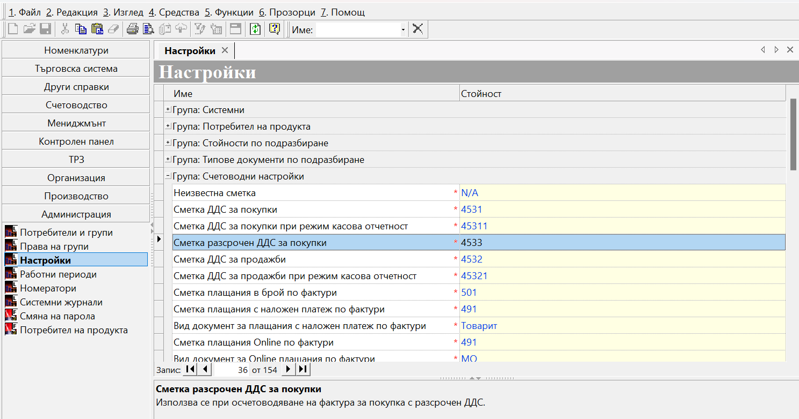

```{only} html
[Нагоре](000-index)
```
 
# ДДС по покупки: Отложено използване на данъчен кредит  

- [Въведение и задължителни настройки]   
- [Покупка с отложен ДДС]  
- [Въвеждане на фактура за покупка, получена със закъснение]  


## Въведение и задължителни настройки

[Законът за ДДС](https://dv.parliament.bg/DVWeb/showMaterialDV.jsp?idMat=201969) дава право на регистрираните по него лица да използват данъчния кредит при покупките в рамките на следващите 12 месеца. Системата предлага автоматизация на процеса по отложено начисляване на ДДС. За целта се изисква предварително да настроим транзитна сметка за отложен ДДС.

Настройката е еднократна и се намира в **Администрация || Настройки || Група: Счетоводни настройки**. След като се навигираме до реда със **Сметка разсрочен ДДС за покупки**, в колона *Стойност* избираме сметка за отложен ДДС, която предварително сме настроили в **Сметкоплан**. Направените промени трябва да бъдат записани.

{ class=align-center }

```{tip}
При работа с документи, засягащи минали или бъдещи данъчни периоди, е задължително настройките в **Администрация || Работни периоди** да бъдат съобразени. При липсващ разрешителен период системата не позволява приключване на документи или редактиране на дати.
```

## Покупка с отложен ДДС

След като сте изпълнили горните изисквания, документът с покупката може да бъде въведен и осчетоводен коректно.  
Така, в крайна сметка, ще имате следните две счетоводни статии:
