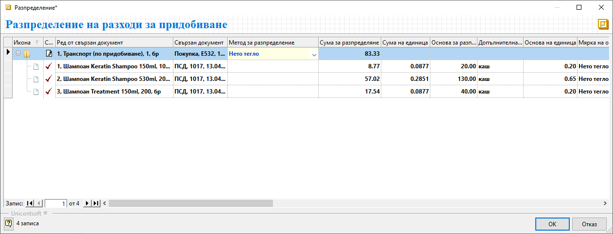

```{only} html
[Нагоре](000-index)
```


# Разпределение на разходи за придобиване

- [Въведение](https://docs.unicontsoft.com/guide/erp/005-how-to/20240411-allocate-acquisition-costs.html#id2)  
- [Методи за разпределение](https://docs.unicontsoft.com/guide/erp/005-how-to/20240411-allocate-acquisition-costs.html#id3)   
- [Разпределение на разходи при общ документ с покупката на стоки](https://docs.unicontsoft.com/guide/erp/005-how-to/20240411-allocate-acquisition-costs.html#id4)    
- [Справки за разпределение на разходите по придобиване](https://docs.unicontsoft.com/guide/erp/005-how-to/20240411-allocate-acquisition-costs.html#id5)  
- [Счетоводни настройки и документи](https://docs.unicontsoft.com/guide/erp/005-how-to/20240411-allocate-acquisition-costs.html#id6)  
## Въведение

Получените от доставчик стоково-материални запаси се отразяват в системата чрез [въвеждането на документи за покупка](https://www.unicontsoft.com/cms/node/23). Към тях се генерират складови документи, с което продуктите се заприходяват по покупна цена(без ДДС).  
Разходите по закупуване, обаче, може да включват също вносни мита и такси, невъзстановими данъци и акцизи, разходи по доставката, товаро-разтоварни операции, монтаж и др.  

> Всички тези разходи, свързани със закупуване, преработка и доставка, формират доставната стойност на стоково-материалните запаси.  

Системата разполага със средство за автоматично разпределяне на разходите по покупки. Като резултат на неговото използване, в справки ще разполагате с реалната себестойност на продукти и материали.  
Схемата е подробно описана в статията [Как да разпределим разходи по покупка](https://www.unicontsoft.com/cms/node/148), с която е добре да се запознаете, ако темата е нова за Вас.   

```{tip}
Препоръчително е за различните разходи, които ще разпределяте (напр. транспорт), да въведете отделни продукти при продажба, при придобиване и като общи разходи. Тоест трябва да имате веднъж продукт *Транспорт (по придобиване)*, втори продукт - *Транспорт (при продажба)* и отделно *Транспорт (общи разходи)*.  
Всички те трябва да бъдат от тип на продукта, настроен като услуга, със съответното осчетоводяване.
```

## Методи за разпределение

Нека направим примерно разпределяне на транспортни разходи, при което доставката е извършена от фирма, различна от доставчика на стоките.  

> Предварително трябва да са въведени и валидирани в системата вътрешнофирмените документи за покупка на стоки - *Документ за покупка* и *Приходен складов документ*.  

Създавате нов вътрешнофирмен документ за покупка, в който е важно да изберете точния продукт за транспортни услуги. В случая това е *Транспорт (по придобиване)*.  
Навигирате се до меню **Средства || Разпределение на разходи за придобиване**, с което отваряте формата за избор на свързани документи:

```{tip}
Опцията *Разпределение на разходи за придобиване* е активна в *Документ за покупка* единствено, когато той е в състояние на редакция.  
```

Чрез десен бутон на мишката върху реда с разходите отваряте за избор списъците с приходни складови документи или покупки. Вие решавате с кой от двата списъка ще работите.  

{ class=align-center w=15cm }


Ако изберете списък *Складови документи*, трябва да посочите ПСД с доставката на стоките, върху които ще разпределяте транспортните разходи. Избирайки *Документи за покупка*, посочвате вътрешнофирмения документ с покупката.  
Да намерите бързо и лесно точния документ зависи от зададените филтри в съответния списък. 

> Може да маркирате едновременно няколко документа, когато разходът за разпределяне е общ за тях.  

{ class=align-center w=15cm }

След като сте избрали желания свързан документ, следва да маркирате един, няколко или всички продукти, върху които ще разпределите транспортните разходи.  
Системата ще добави на отделен ред всеки един от тях, предлагайки сума за разпределяне на база **Отчетна стойност**.

{ class=align-center w=15cm }

```{tip}
Общата сума на разходите за разпределяне е винаги без ДДС. 
```

След като потвърдите избора, системата разпределя разхода на избраната за това база.

Освен предложения по подразбиране метод, системата дава възможност за избор между още няколко:  

- **Ръчно**  - При него системата "отключва" колона *Сума за разпределяне* и имате пълната свобода да разделите общата сума на разхода по продукти.

{ class=align-center w=15cm }

- **Количество по основна мярка** - При този метод системата автоматично разпределя общата сума на разхода спрямо количествата в основна мерна единица.  

{ class=align-center w=15cm }

- **Количество по допълнителна мярка** - За да използвате този метод, трябва предварително да настроите допълнителни мерки на продуктите.  
В примера за всички продукти има добавена допълнителна мярка *Кашон*, съдържащ 10 броя шампоан. Ето как би изглеждало примерното разпределение на разходите:

{ class=align-center w=15cm }

- **Нето тегло** - При този метод също е нужна предварителна настройка в панел *Допълнителни* във форма за редакция на продукта.  
При разпределението на транспорта системата дава информация с тези настройки в колона *Основа за разпределение на единица* и *Мярка на основата*.

{ class=align-center w=15cm }

- **Нето обем** - Методът отново изисква предварителна настройка с нето обем за всеки продукт. Разпределението на разхода ще се извърши на база настроените обеми. Системата визуализира тези настройки в колони *Основа за разпределение на единица* и *Мярка на основата*.

{ class=align-center w=15cm }

- **Отчетна цена** - С този метод системата автоматично разпределя общата сума на разхода спрямо единичната цена на продуктите.

{ class=align-center w=15cm }

## Разпределение на разходи при общ документ с покупката на стоки

Има случаи, когато доставчикът издава фактура, включваща както стоката, така и допълнителни услуги - например, извършва транспортирането ѝ.  
Тук отново може да разпределите разхода, което става по [описания начин](https://www.unicontsoft.com/cms/node/148), но с една особеност.  

> Документът за покупка трябва да е валидиран с приключен ПСД към него. <ins>След което покупката се връща в състояние на редакция.</ins>  

{ class=align-center w=15cm }

Следвате стъпките от меню **Средства || Разпределение на разходи за придобиване**.

{ class=align-center w=15cm }

В колона *Ред от свързан документ* посочвате или текущата покупка, или генерирания към нея ПСД.  

{ class=align-center w=15cm }

Избирате желания метод и завършвате разпределението на разхода за транспорт по гореописания начин.

## Справки за разпределение на разходите по придобиване

В системата имате възможност да проверите дали има разпределени разходи по придобиване по няколко начина и в различни справки.  

За сте сигурни, че желаните покупки са разпределени като разходи по придобиване, може да следите колона **Разпределено като разходи за придобиване %**. Тя се намира в списък **Документи за покупка** и ако не е видима, се извежда с десен бутон върху реда с имена на колони - *Изглед на списък*.

{ class=align-center w=15cm }

Информация за разпределени разходи може да видите и в панел **Свързани документи** на документа за покупка, съдържаща разхода:

{ class=align-center w=15cm }

## Счетоводни настройки и документи

Най-подходящият начин разпределянето на разходи по придобиване да се отрази счетоводно е чрез използване на транзитна сметка от гр. 30. Обикновено това е с/ка 301.  
Уверете се, че в **Номенклатури || Сметкоплан** за тази сметка има поставена отметка в колона *Признак задължителен*. Същото важи и за сметка 304.
Така в генерираните счетоводни записи системата ще цитира отделните продукти. 

> Въведените през списък *Продукти и материали* номенклатури се визуализират в **Счетоводство** като списък *Признаци*.

Следващите задължителни настройки са в **Счетоводство || Автоматичен осчетоводител**.  

За група **Документи за покупка** трябва да направите настройки в *Кореспонденции*. Както ще видите на примерното изображение, създават се отделни редове за всички типове продукти, които ще се осчетоводяват през транзитната сметка.  
Като резултат, в счетоводните документи към фактурите за покупка стоките и допълнителните разходи се отнасят по с/ка 301.

{ class=align-center w=15cm }

Необходими са настройки и за група **Складови документи**. Целта тук е в счетоводния документ към ПСД стоките да се прехвърлят по основната с/ка 304.  
Настройте за *Водеща сметка* в документ тип *ПСД* осчетоводяването на транзитната с/ка 301 да е в кредит. В *Кореспонденции* направете настройка за осчетоводяване на приходните документи по дебита на с/ка 304.
Разгледайте маркираните редове на изображението по-долу:

{ class=align-center w=15cm }

В счетоводните документи, след като сте изпълнили задължителните условия, ще имате подобни записвания:

- В документа за доставка на стоки счетоводната статия е една. Единствената особеност тук е, че стоките са заприходени чрез избраната за транзитна с/ка 301. 

**ФПок (доставка на стоки)**
```{admonition} Статия
|Д<sup>т</sup> Сметка|К<sup>т</sup> Сметка|Признак|Сума|
|-------------|------------|---------------|-------------|
|301          |            |Шампоан 150 мл |750.00 лв.   |
|301          |            |Шампоан 530 мл |1666.67 лв.  |
|301          |            |Шампоан 150 мл |1333.33 лв.  |
|4531         |            |               |750.00 лв.   |  
|             |4011        |               |4500.00 лв.  |
```

- При осчетоводяването на фактурата за транспорт, като разход за разпределение, отново участва транзитната сметка.  
Сумата от нея - 83.33 лв., ще бъде разпределена към доставната стойност на продуктите.

**ФПок (разходи за разпределение)**
```{admonition} Статия
|Д<sup>т</sup> Сметка|К<sup>т</sup> Сметка|Признак|Сума|
|-------------|------------|----------|-----------|
|301          |            |Транспорт |83.33 лв.  |
|4531         |            |          |16.67 лв.  |  
|             |4011        |          |100.00 лв. |
```

- Същинското разпределение на разходи става в *ПСД*. В този счетоводен документ за всеки продукт се генерира отделна статия.  
В следващия пример виждате как доставната цена и разпределените разходи от с/ка 301 формират новата себестойност на продукта в с/ка 304. 

 **ПСД (доставка на стоки)**
```{admonition} Статия 1
|Д<sup>т</sup> Сметка|К<sup>т</sup> Сметка|Признак|Сума|
|-------------|------------|---------------|-----------|
|304          |            |Шампоан 150 мл |766.67 лв. |
|             |301         |Шампоан 150 мл |750.00 лв. |  
|             |301         |Транспорт      |16.67 лв.  |
```

{ class=align-center w=15cm }

> За да разпределим разходи по придобиване, трябва покупката на стоките да е валидирана с приключен приходен складов документ към нея.  
> Документът за покупка, съдържащ разходите за разпределяне, трябва да е в състояние на редакция.  
> Върху един *Документ за покупка* може да разпределим един или няколко разхода.  
> Може да разпределим един разход както върху една, така и върху няколко *Документа за покупка*.  
> Може също да разпределим разход, когато с покупката на стоки са получени в общ документ.  