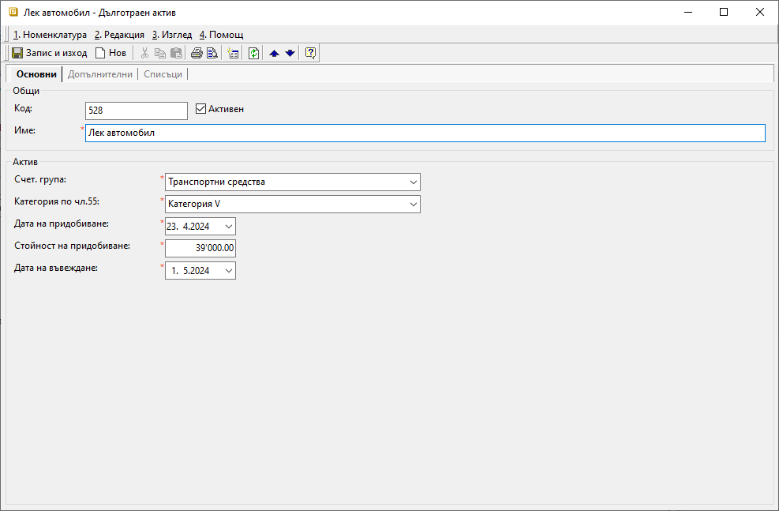
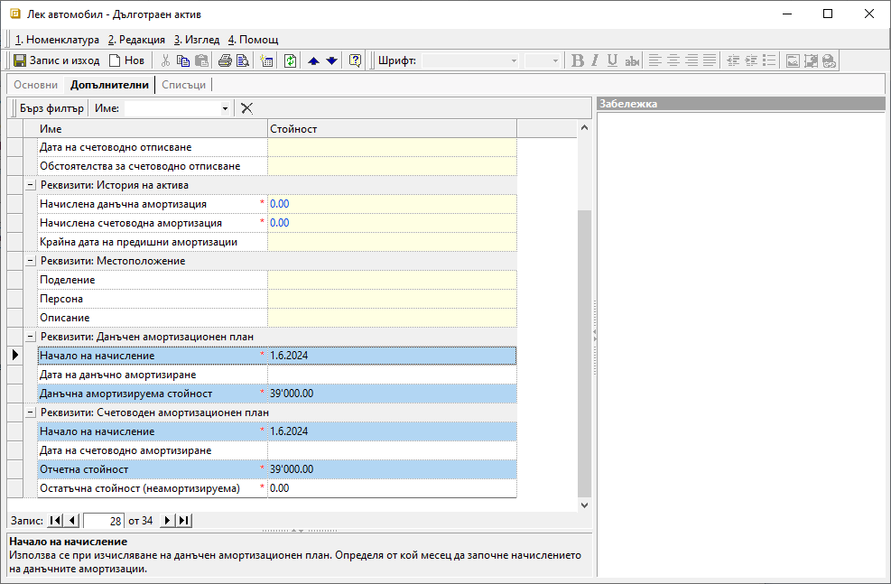
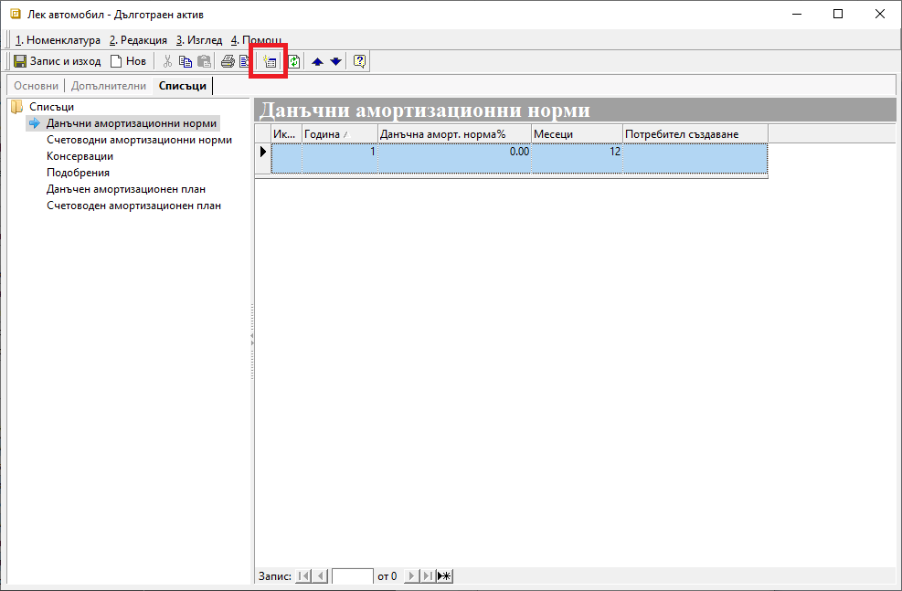
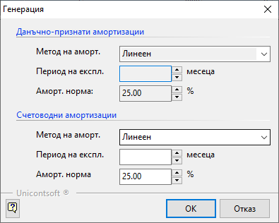
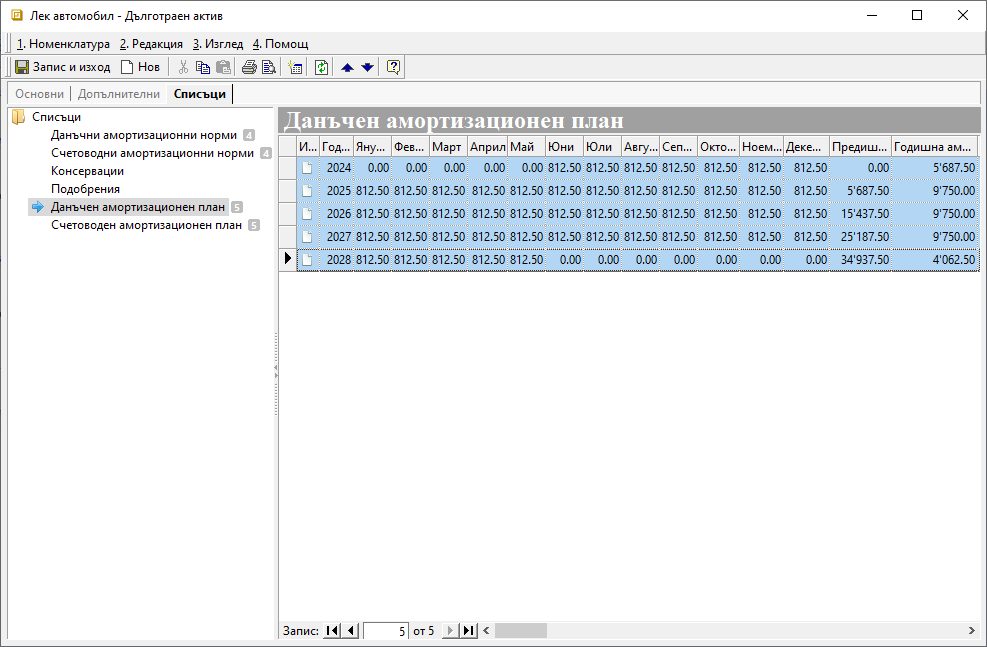
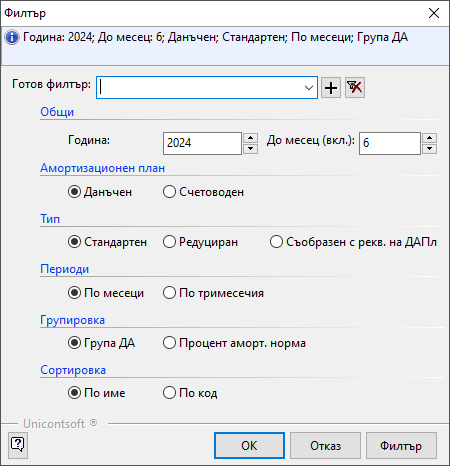
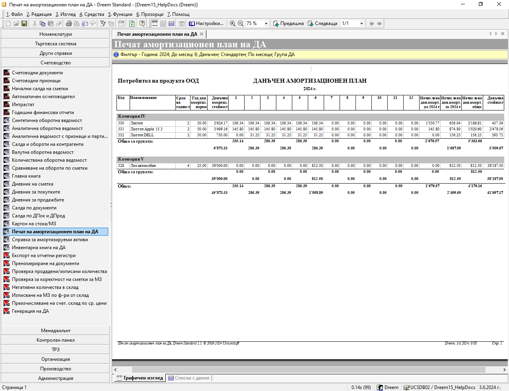

```{only} html
[Нагоре](000-index)
```

# Дълготрайни активи

- [Настройки] 
- [Амортизация на дълготрайни активи]  
- [Първоначално придобиване на ДА]  
- [Печат на протокол за въвеждане в експлоатация]  
- [Консервации на ДА]  
- [Подобрения на ДА]  

## Настройки

**Дълготрайни активи** е отделна номенклатура, която системата третира аналогично на **Продукти и материали** и затова попадат в общ списък. Така, въпреки специфичните си настройки, активите може да се използват в документите за покупка и продажба.  
При [въвеждането на ДА](https://www.unicontsoft.com/cms/node/100) системата изисква някои задължителни реквизити, отбелязани с червен маркер. Такива са наименование на *ДА*, стойност и дата на придобиване, дата на въвеждане в експлоатация, счетоводна група и категория(по чл. 55 от ЗКПО).  

Счетоводни групи, методи за амортизация, коефициент на преоценка и категории по чл.55 (ЗКПО) могат да бъдат въведени и редактирани от **Номенклатури || Референтни номенклатури || Дълготрайни активи**. Тези настрийки са базови за *ДА* и трябва да се направят преди създаването на нов актив.  
Ако все още не сте направили настройките, темата [Как да въведем Групи ДА](https://www.unicontsoft.com/cms/node/152) ще е полезна. По описания в нея начин се въвеждат и останалите базови за *ДА* настройки.  

Нека въведем в системата един примерен актив - *Лек автомобил*, който попада в *Категория V* с амортизационната норма 25% на година.  
Автомобилът е закупен на 23.04.2024 г. за 39'000 лв. и ще бъде въведен в експлоатация на 01.05.2024 г.  

{ class=align-center }

> Препоръчително е да запишете въведените до момента данни, преди да продължите с настройките.  

В **Допълнителни** системата е попълнила автоматично задължителните полета, свързани с данъчния и със счетоводния амортизационен план.  
Тук може да добавите също сума за неамортизируема остатъчна стойност на *ДА*.  

```{tip}
За "ДА" могат да се настроят също и различни дименсии, както е при Продукти и материали.
```

{ class=align-center }

На третия панел **Списъци** ще откриете настройки за подобрения, консервации и амортизационните норми и план на *ДА*.  
Докато първите две са възможни при определени обстоятелства, то амортизацията е неизбежна след пускане на актива в експлоатация.  
Затова следва да направите нужните настройки за амортизационни норми и амортизационен план.  

Използвайки бутона *Генериране* в лентата с инструменти ще изберете амортизационна норма(или период на експлоатация) и метод на амортизация. 

{ class=align-center }

Системата предлага по подразбиране *Линеен метод* на амортизация. При него годишните амортизационни квоти са еднакви за целия амортизационен период.  
За генерацията на амортизационен план трябва да попълните или поле *Период на експлоатация*, или *Амортизационна норма*. След което потвърждавате избора и записвате промените.

{ class=align-center }
 
Вече може да разгледате генерираните примерни амортизационни планове за този *ДА* - данъчен и счетоводен.

{ class=align-center }

```{tip}
Ако пожелаете да редактирате амортизационните норми в избран *ДА*, респ. амортизационния му план, може да повторите описаната вече генерация.
```

Системата дава възможност за избор от следните методи на амортизация:  
 
- *Константно дегресивен метод* със снижаващ се остатък.  
- *Линеен метод* с годишните амортизационни квоти, които са еднакви за целия амортизационен период.  
- *Метод на сумата на числата*  
- *Неравномерно дегресивен метод*  
- *Прогресивен нелинеен метод*  
- *Произволен метод*  

## Амортизация на ДА - справки и генерация на счетоводни документи

Генерираните в системата амортизационни планове могат да бъдат видени отделно за всеки актив. Както споменахме, това става във формата за редакция на избрания *ДА*.  
Също така има справка, включваща всички активи, достъпна в **Счетоводство || Печат на амортизационен план*.  
Във филтъра може да изберете вида и типа на амортизационния план, период и други.

{ class=align-center }

Справката, която се зарежда според настроените филтри, включва всички *ДА* със състояние *Активен*.

{ class=align-center }

