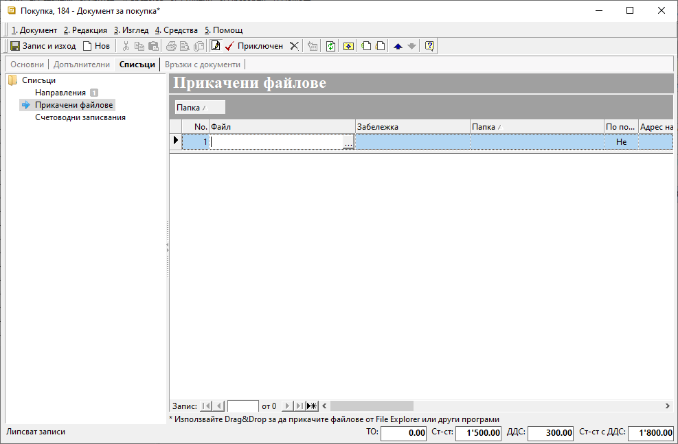

```{only} html
[Нагоре](000-index)
```

# Прикачени файлове
- Въведение  
- [Прикачване на файл за контрагент]  
- [Прикачване на файл към продукт]  
- [Прикачване на файл в документ]  

## Въведение

Прикачените файлове са удобен начин за съхраняване и споделяне на информация. Системата дава възможност да прикачите един или няколко файла, както в някои от номенклатурите, така и в документи от **Търговска система**.  
Това предоставя на отделните потребители бърз достъп до важни детайли от един общ източник. Една от ползите е улесняване на комуникацията и предотвратяване на грешки.  
Данните лесно могат да бъдат добре систематизирани от меню **Номенклатури || Медия каталог**.  

{ class=align-center }

За да се ориентирате бързо сред различните файлове, желателно е да ги организирате в подпапки, използвайки достатъчно ясни имена.  
Така ще избегнете неудобните и безразборни списъци.  
Можете да създавате и редактирате папки чрез бутоните от лентата с инструменти или с десен бутон на мишката.   

> Условието потребителите да виждат прикачените файлове е да имат достъп до съответната локация. 

Процесът на прикачване на файл в системата не се различава особено от прикачването в имейл, чат приложение и т.н.  
Първо маркирате желаната папка от списъка вляво. Може да използвате функцията за влачене и пускане с левия бутон на мишката.  
Ако този начин не е удобен, използвайте десен бутон на мишката върху полето вдясно и изберете опция **Нова медия**.  

{ class=align-center }

Попълвате задължителните реквизити *Име* и *Тип* на файла, а от бутона в края на полето *Източник* посочвате пътя до желания файл.  

{ class=align-center }

При импорта, според типа на файла, системата извежда различно съобщение за потвърждение на избора.  
Промените трябва да бъдат записани, след което файлове ще са достъпни за прикачване в **Контрагенти**, **Продукти и материали**, както и в някои документи.

## Прикачване на файл за контрагент

Всяка информация, касаеща даден контрагент, може да бъде оформена в документ, таблица, изображение или друго и добавена към настройките му.  
Можете да добавяте множество на брой и различен тип файлове. За целта отваряте форма за редакция на избрания контрагент, навигирайки се до панел **Списъци || Прикачени файлове**.  
Ако файлът не е въведен предварително, това може да стане на момента чрез функцията на влачене и пускане (drag&drop).  

Ако файлът е предварително качен, в колона *Файл* на реда за нов запис посочвате пътя му до папката от **Медия каталог**.  

Ето как изглеждат вече прикачени файлове тип *Изображение* и тип *Документ*: 

{ class=align-center }

На реда към всеки от файловете може да добавите и *Забележка*.  
Промените трябва да бъде записани.

```{tip}
Ако настроите по подразбиране прикачен файл тип *Изображение*, той ще се визуализира в колона *Миниатюри* от списъка с контрагенти.  
Същото изображение се показва и в панел **Основни** на формата за редакция на контрагент.
```

{ class=align-center }

В списък **Контрагенти** системата дава информация за общо прикачените файлове за всеки един контрагент. За целта трябва да изведете колона *Брой прикачени файлове*.  

{ class=align-center }

## Прикачване на файл към продукт

Често към продуктите е важно да бъде добавено изображение, галерия, видео с инструкции или други файлове с полезна информация. 
Тези файлове може или да са предварително въведени чрез **Медия каталог**, или да се прикачват на момента.  

Нека добавим примерно изображение от форма за редакция на продукт, панел **Списъци || Прикачени файлове**.  

Ако предварително сте въвели изображението в желаната папка, в колона *Файл* посочвате пътя до него. 

{ class=align-center }

Когато искате да качите файла текущо, използвайте drag&drop функцията. Системата ще предложи към коя папка в **Медия каталог** да добави файла.  

{ class=align-center }

За да бъдат запазени настройките, промените трябва да бъде записани.

```{tip}
Ако настроите по подразбиране прикачен файл тип *Изображение*, той ще се визуализира в колона *Миниатюри* от списъка с продукти.  
Същото изображение се показва и в панел **Основни** на формата за редакция на продукта.
```
{ class=align-center }

## Прикачване на файл в документ

Типовете документи, в които можете да добавите файл, са продажби, покупки, заявки, складови документи и договори. Във всеки един от тях опцията отново е налична в панел **Списъци**.  
И тук прикачването на файлове не е по-различно от вече разгледаните в темата. Файловете може или да са въведени предварително в папките от **Медия каталог**, или да се добавят в момента.  

> Документът, в който ще прикачвате файл, трябва да е в състояние на *Редакция*.  
> Файл може да се прикачи при състояние *Приключен* единствено когато се използва функцията drag&drop.  
 
В **Списъци || Прикачени файлове** от полето *Файл* избирате желания документ, след което покупката трябва да се приключи.

{ class=align-center }

---  
- Прикачените файлове могат да бъдат в различен формат, като имат ограничение от ...MB всеки.  
- За да бъдат файловете видими за всеки, потребителите на системата трябва да имат достъп до местоположението им.  
- Удобно ще е в **Медия каталог** предварително да се създаде организация на папките, в които ще се добавят файловете.   
- Файлове могат да се прикачват в панел **Списъци** от форма за редакция на контрагенти, продукти и документи - продажби, покупки, заявки, складови документи и договори.  
- Когато се прикачва файл в документ, той трябва да е в състояние на *Редакция*, след което отново да се приключи. Файл може да бъде прикачен при състояние *Приключен* единствено с влачене и пускане - функция drag&drop.