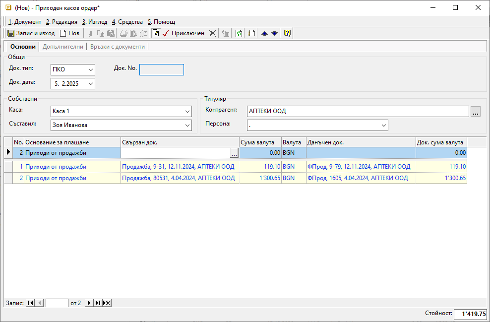

```{only} html
[Нагоре](000-index)
```

# Касово плащане

Приходите и разходите на парични средства в брой се регистрират в системата чрез създаване на документи в **Търговска система || Касови документи**. За да има съответствие между реалната и касовата наличност в системата, всяко движение на парични средства трябва да бъде отразено.  

Касовите документи се създават отделно за всяка каса и са свързани само с един контрагент.  

Процесът по създаване на касов документ е следният:

1) От **Търговска система || Касови документи** чрез десен бутон на мишката върху списъка се избира **Нов документ**. Отваря се нова форма за въвеждане на данни.   

2)  В раздел **Основни** се попълват:

- **Док. Тип** – от падащия списък в това поле се избира тип документ;  
Избира се **ПКО**-*Приходен касов ордер*, когато има постъпили плащания в текущата каса.  
Тип **РКО**-*Разходен касов ордер* се избира, когато има разход на средства от текущата каса.  

- **Док. No** - полето се попълва с номер на документа;  
Системата автоматично попълва пореден номер за избраната каса при приключване на документа.    

- **Док. дата** - в полето се избира дата, за която се отнася приходът/разходът на избраната каса;  

- **Каса** – от падащ списък в това поле се избира текуща каса;  
Списъкът с каси се настройва предварително от **Номенклатури || Референтни номенклатури**.  

- **Съставил** - в полето се отваря падащ списък с предварително настроените служители;  
Данните в полето се попълват автоматично с настройките на текущия потребител.  

- **Контрагент** – в полето се отваря форма за избор **Контрагенти**;  

{ class=align-center }

- **Основание за плащане** – от падащия списък в полето се избира предназначение на плащането;  
Основанията трябва да са предварително дефинирани в **Номенклатури || Референтни номенклатури || Търговска система: Основания за плащане**.  
Избраното основание определя счетоводната операция, която се генерира при приключване на документа. Необходимо е предварително да бъдат направени настроийки за това от **Счетоводство || Автоматичен осчетоводител**.  

- **Свързан док.** - в полето се отваря форма за избор на вътрешнофирмени **Документи за покупка и продажба**;  
От списъка се маркират един или множество записи, по които има извършено плащане. За да се попълнят автоматично и свързаните с тях данъчни документи, се използва бутон **[Напред]**.  
По този начин ще се закрият остатъците за плащане по вътрешнофирмения и по данъчния документ.   

- **Сума валута** и **Док. сума валута** - полета за попълване на сума, отговаряща на извършеното плащане;  
Полетата се обзавеждат автоматично след избор на свързани документи. При частично плащане сумите трябва да се редактират, така че да съответстват на реалното плащане.   

- **Данъчен док.** - в полето се отваря форма за избор **Данъчни документи за покупка и продажба**;  
Полето се попълва автоматично, ако преди това е изпълнена стъпката с обзавеждане на **Свързан док.**.  

3) Чрез бутон **Приключен** от лентата с инструменти се отваря форма за генерация на свързани документи. Системата дава възможност за автоматично създаване на счетоводно записване.  
 
    - **Генериране на Счетоводно записване** - опция за автоматична генерация на свързан счетоводен документ;  
    Когато за тази опция липсва отметка, системата не генерира счетоводен запис към касовия ордер.  
    - **Приключване** - при липса на отметка, системата генерира счетоводния документ в редакция, а при поставена отметка - в състояние *Приключен*;  
    - **OK** - бутонът потвърждава избраните във формата опции;   

> За да се генерира коректен счетоводен запис, трябва предварително да има съответните настройки в **Сметкоплан** и в **Автоматичен счетоводител**.  
___  
Свързани статии:  

[Как да въведем Касов ордер](https://www.unicontsoft.com/cms/node/57)  
[Как да настроим Сметкоплан](https://www.unicontsoft.com/cms/node/36)  
[Как да настроим Автоматичен осчетоводител](https://www.unicontsoft.com/cms/node/257)
