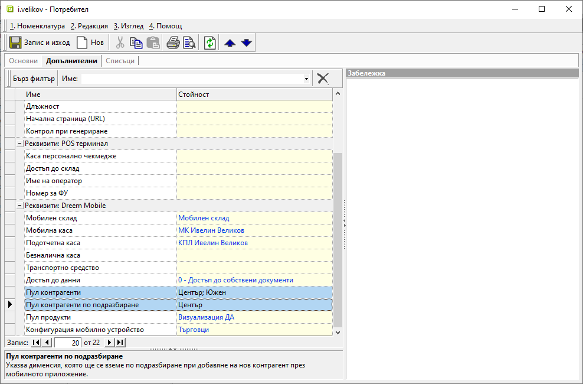

```{only} html
[Нагоре](../000-index)
```

# **Мобилни търговци**

За търговците, които извършват директни продажби на място при клиента, се изискват някои задължителни настройки. Трябва да се дефинират мобилен склад, мобилна и подотчетна каса, пул продукти и контрагенти.  

Конфигурацията за мобилни търговци се извършва в **Администрация » Потребители и групи**.   

{ class=align-center w=15cm }

> Ако някоя от настройките липсва, потребителят ще има ограничения при използване на **Dreem Mobile**.  

## **Склад и каса**

Мобилните склад и каса се дефинират от форма за редакция **Потребител** на избрания търговец. Настройката е достъпна от раздел **Допълнителни » Реквизити: Dreem Mobile**.   

{ class=align-center w=15cm }

Попълват се полета:  

- **Мобилен склад** - Указва склада, от който се изписват стоките при продажби на място при клиента.  
Мобилният склад се зарежда предварително. За целта се валидират приемо-предавателни протоколи за натоварените в автомобила на търговеца количества по продукти.   

> Мобилният търговец винаги има актуална информация за наличностите в този склад.  

- **Мобилна каса** - Указва касата, която служи за портфейл на търговеца. В нея с отделни документи се регистрират всички движения на парични средства, извършени от търговеца.  
При дневен отчет се извършва прехвърляне на парични средства от портфейла на търговеца (каса **МК ...**) към портфейла на подотчетното лице (каса **КПЛ ...**).  

> Мобилната каса е свързана с фискално устройство.  

- **Подотчетна каса** - Използва се за вътрешен отчет към главната каса. За целта се извършва прехвърляне на средства между портфейли.  

> Касата на подотчетното лице не е свързана с фискално устройство.  

## **Групи контрагенти**

Мобилните търговци обикновено обслужват определена група клиенти. Затова е излишно при тях да се визуализира пълният списък с контрагенти. В тази връзка контрагентите могат предварително да бъдат разделени в групи по различни критерии. Групите могат да бъдат настроени спрямо клиенти по район, клиенти по предварително дефиниран маршрут, клиенти от различен тип и големина и т.н.  

Групите се създават предварително в бекофис системата от [**Номенклатури » Потребителски дименсии**](../../erp/001-ref/001-nomenclatures/010-custom-dimensions.md).  
След това са достъпни за настройване в потребителските профили на мобилните търговци за реквизити **Пул контрагенти** и **Пул контрагенти по подразбиране**.  

> В приложението всеки търговец вижда единствено документите и задълженията на контрагенти, до които има разрешен достъп.  

{ class=align-center w=15cm }

## **Групи продукти**

**Dreem Mobile** позволява оптимизиране на списъка с номенклатура **Продукти**. Това позволява за мобилните търговци да се визуализират единствено продуктите от избраната им група.  

За целта продуктите се организират по групи в [**Номенклатури » Потребителски дименсии**](../../erp/001-ref/001-nomenclatures/010-custom-dimensions.md). На следваща стъпка за всеки потребител се указва коя е избраната му група продукти.  

> По този начин могат да се разграничат отделни канали (напр. със специфични стоки) и избрани търговци да обслужват различните канали.  

{ class=align-center w=15cm }

