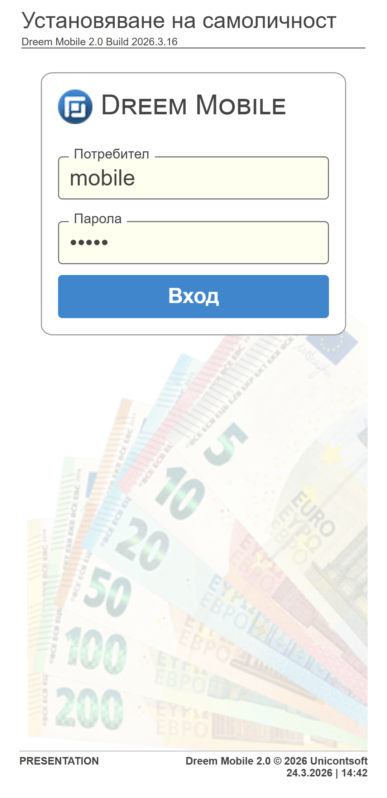
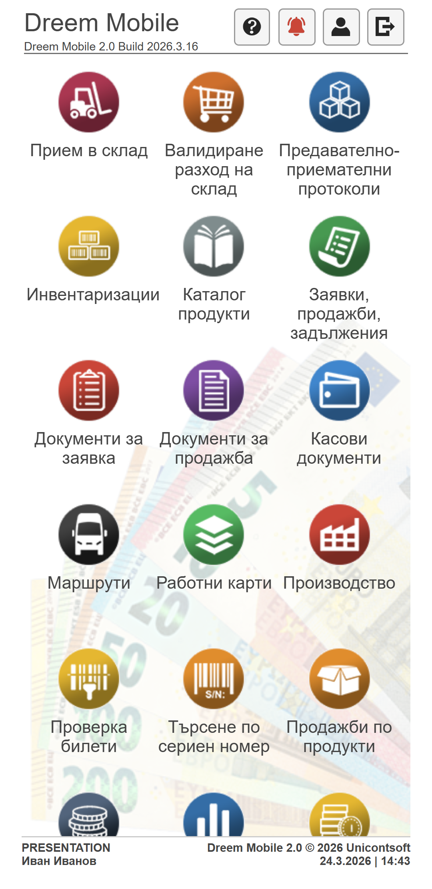

```{only} html
[Нагоре](../000-index)
```

# Документи и процеси

При стартиране на **Dreem Mobile** се отваря форма за достъп **Установяване на самоличност**. Потребителите се идентифицират в системата чрез въвеждане на потребителско име и парола.  

{ class=align-center w=7cm }

> Настройките за потребители трябва да бъдат направени предварително в бекофис системата **Dreem ERP**.  

При успешно стартирана сесия системата отваря [основното меню](001-main-menu.md).  
Чрез него се избира функционалност за регистриране на съответните операции в системата.  

{ class=align-center w=7cm }

```{toctree}
:maxdepth: 1
:glob:

*
```