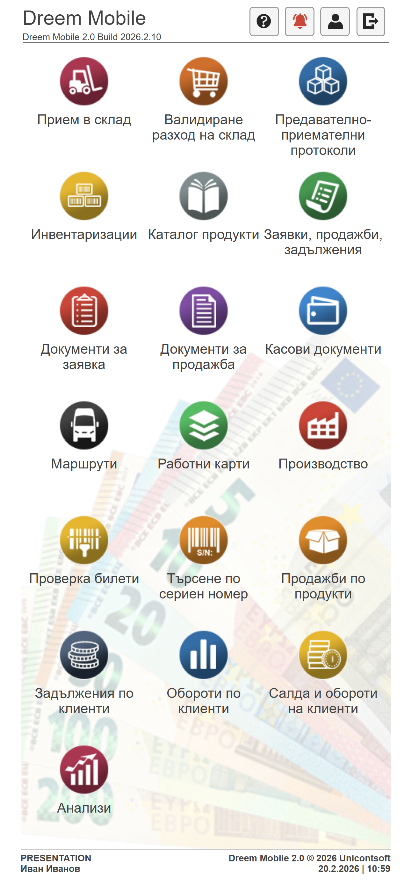

```{only} html
[Нагоре](../000-index)
```

# **Основно меню**

След успешно влизане в системата се отваря основното меню. Чрез него се избира функционалност за реализиране на съответните операции в системата.  

> Видими са единствено функционалностите, до които текущият потребител има разрешен достъп.  

В горната част на екрана се визуализират версията на системата и някои опционални бутони.  
В долнача част е изведена информация за текущите база, потребител, дата и час.  

   { class=align-center w=10cm }

## **Опционални бутони**

- **Помощник**  
Използва се за активиране и деактивиране на помощник с инструкции за работа със системата.  
След активиране на помощната информация на екран се показват кратки обяснения за функционалности и бутони. Системата извежда информацията еднократно при всяка новоизбрана опция.  

- **Какво ново**  
Отваря екран с последно приложените промени в системата.  
При смяна на версията дава информация за всички функционалности, които са засегнати от промените.  

- **Профил**  
Отваря страница с основни данни за оператора и настройки за работа със системата. Дава достъп до настройка на връзката с фискално устройство.  

- **Изход**  
Излиза от сесията на текущия потребител на системата.  

   { class=align-center w=10cm }

## **Функционални бутони**

- **Прием в склад**  
Обработват се документи за проверка на доставените в склада продукти и материали.  

- **Валидиране разход на склад**  
Обработват се разходни складови документи чрез баркод скенер.  
Използва се за проверка, събиране и валидиране на на стоки в склада по клиентска заявка.  

- **Предавателно-приемателни протоколи**  
Въвеждане, проверка и валидиране на документи за предаване и приемане на стоки/материали между складове.  

- **Инвентаризации**  
Обработват се протоколи за инвентаризация на наличности за продукти в текущия склад.  
Автоматично регистриране на липси и излишъци за изравняване на фактическата наличност на склада.  

- **Каталог продукти**  
Визуализира номенклатура с продукти и материали.  
Дава възможност за проверка на количества, корекции на баркодове, фасети и местоположение в склада.  

- **Заявки, продажби, задължения**  
Визуализират се всички заявки, продажби и задълженията на предварително избран контрагент.  
Могат да бъдат въвеждани нови документи и отчитани плащания от клиенти.  

- **Документи за заявка**  
Показва всички заявки за контрагентите, свързани със съответния търговец. Могат да бъдат въвеждани нови и проследени стари заявки от клиент.   

- **Документи за продажба**  
Визуализират се всички продажби за контрагентите, свързани с текущия потребител на системата.  
Дава възможност за регистриране на продажби на място при клиента, вкл. фактура, документ за плащане и други.  

- **Касови документи**  
Функционалност, чрез която се управляват касовите операции.  
Въвеждат се касови ордери, протоколи за прихващане и прехвърляне на средства между каси.  
Следи актуална наличност на текущата каса.  

- **Маршрути**  
Използва се за регистриране на доставки по събрани клиентски заявки.  
Функцията предлага опция за плащане на място по време на доставката и е свързана с касови операции.  

- **Работни карти**  
Използва се за отчитане на дейности по работни карти.  
Дейностите са предварително дефинирани по определен план и направление в бекофис системата.  

- **Производство**  
Регистрират се изпълнените дейности по актове за готова продукция.  

- **Проверка билети**  
Чекиране на предварително издадени от системата билети за посещение на организирани събития.  

- **Търсене по сериен номер**  
Намира продукт по сериен номер и показва справка с хронологията на неговото движение.  

- **Продажби по продукти**  
Дава справка за реализираните продажби в избран период от време.  
Показва продукти, количества и стойности.  

- **Задължения по клиенти**  
Дава справка за неплатените продажби по контрагенти.  
Показва стойност, платена сума, остатък за плащане и дни в просрочие по документи.  

- **Обороти по клиенти**  
Дава справка за обща стойност на продажбите за избран период от време.  
Показва реализиран оборот по контрагенти, обекти и търговци.  

- **Салда и обороти на клиенти**  
Дава справка за обща сума на продажби, плащания и оставащо за плащане в началото и в края на избран период.  

- **Анализи**  
Предоставя анализ на ключови показатели и достигнати цели в продажбите.  