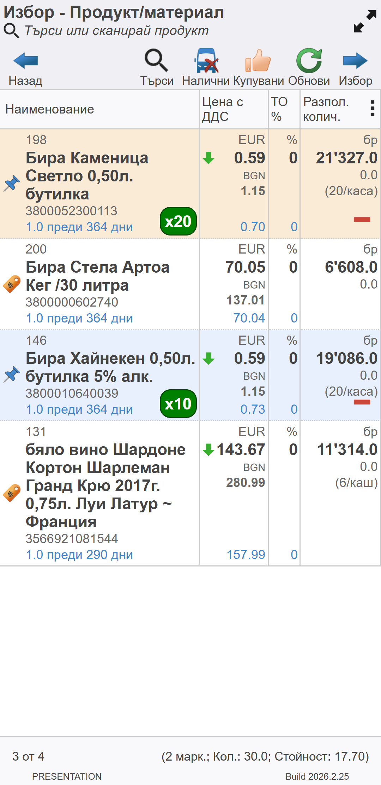
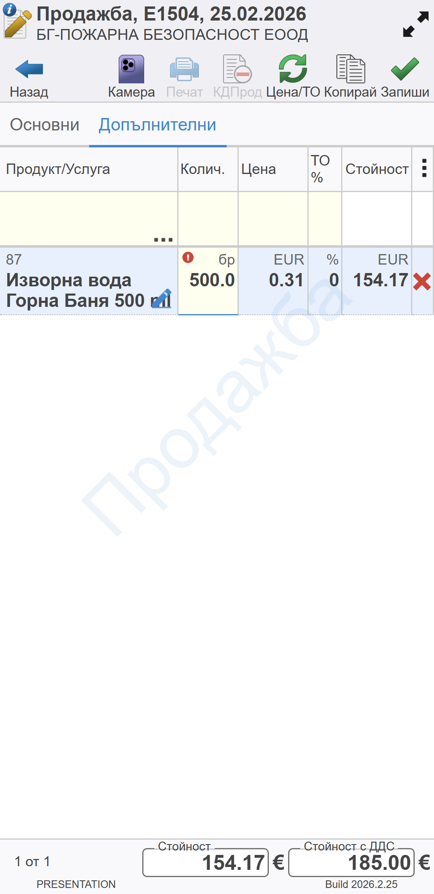
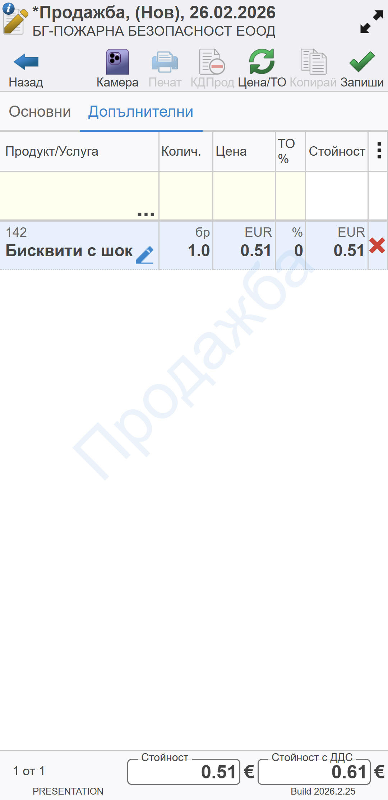

```{only} html
[Нагоре](../000-index)
```

# **Управление на списъци**

**Dreem Mobile** използва номенклатурите с контрагенти, обекти и продукти от бекофис системата **Dreem ERP**. Приложението визуализира единствено номенклатурите, които са включени в правата за достъп на потребителя в системата.  
Друго условие да се визуализира продукт в списъка за избор е за него да има цена по ценовата листа на избрания контрагент.

## Списък контрагенти

Списъкът с контрагенти в **Dreem Mobile** се използва непрекъснато, т.к. всеки документ е свързан с контрагент.  
Най-отгоре във форма **Избор - Контрагент** има поле с опционални бутони:  

   - **Отказ** - Затваря списъка с контрагенти и връща на предходен екран.  
   - **Търси** - Отваря поле с бърз филтър. Използва се за бързо търсене по зададени критерии - част от име, обект, код.  
   - **Обект** - Бутонът показва/скрива обектите на контрагенти в списъка.  
   - **Редакция** - Отваря формата с настройки на избраната номенклатура и позволява коригиране.  
   - **Обнови** - Синхронизира списъка с контрагенти с бекофис системата.  
   - **Избор** - Потвърждава избора на маркирания контрагент и затваря списъка. Връща на предходния екран, като данните за клиента са добавени в текущия документ.   

> Чрез бутона, разположен долу вдясно на екрана, може да бъде добавен нов клиент.  

{ class=align-center w=5cm }

## Списък продукти

Списъкът съдържа единствено продукти с валидна цена, за които потребителят има разрешен достъп.  

Най-отгоре във форма **Избор - Продукт/материал** има поле със следните опционални бутони:  

   - **Отказ** - Затваря списъка с продукти и връща на предходен екран.  
   - **Търси** - Отваря поле с бърз филтър. Използва се за бързо търсене по зададени критерии - част от име, код, баркод.  
   - **Налични** - Филтрира само продуктите с наличност в склада на потребителя в системата.  
   - **Купувани** - Филтрира списъка с продукти според това, дали някога са били купувани от избрания контрагент.  
   - **Обнови** - Синхронизира списъка с продукти с бекофис системата, вкл. наличност.  
   - **Избор** - Потвърждава избора на маркираните един или няколко продукта и затваря списъка. Връща на предходния екран, като данните за продукта са добавени в текущия документ.   

{ class=align-center w=5cm }

## Търсене

В бързия филтър на списъци с продукти и контрагенти е реализирано пълно текстово търсене по име, код, баркод.
При въвеждане на част от име или код системата филтрира списъка с номенклатури, в които те се съдържат. Търсенето работи и по част от две думи, независимо къде са разположени в наименованието на продукта.  

{ class=align-center w=5cm }

Търсенето по баркод се осъществява чрез изписването на целия код или сканирането му чрез баркод скенер.  

## Множествен избор на продукти

В списъка с продукти има опция за множествен избор.  
Тя се активира чрез маркиране с двоен клик на избран продукт от списъка. С това иконата на продукта се променя и се извежда индикатор с избраното количество.  

{ class=align-center w=5cm }

Количеството се увеличава с всеки допълнителен клик върху продукта. Количеството може да се увеличава с единица плавно на всяка секунда чрез задържане върху продукта.  
Количеството се намалява с клик върху червената иконата в края на реда.  

Друга опция за редактиране на количествата е чрез отваряне на форма **Редакция Маркирано количество**. Това става с клик върху зеления индикатор за количество.  

{ class=align-center w=5cm }

Маркировката се запазва, докато записите не бъдат потвърдени чрез бутон **Избор** или формата не бъде затворена.   

> Филтрирането на списъка не влияе върху маркираните продукти.  

В статус лентата най-долу системата показва общо маркирани, количество и стойност на продуктите.  

## Скриване и показване на колони

Опцията за скриване и показване на колони в списъци служи за оптимизиране на списъците спрямо размера на екрана.  
Всяка колона може да бъде скрита/визуализирана отново във всеки един момент от форма **Настройки**. Тя е достъпна чрез бутона с трите вертикални точки.   

{ class=align-center w=5cm }

Направените от потребителя настройки на списъци се запазват от системата.  

## Маркиране чрез баркод

**Dreem Mobile** поддържа работа с баркод скенери, свързани чрез кабел или безжично. Не се изискват допълнителни настройки за това в приложението.  

> Задължително условие е за продуктите да има настроени баркодове от бекофис системата.  
При различни мерни единици за продукта се настройват отделни баркодове в бекофис системата.  

При маркиране и разпознаване на баркод в заявка/продажба системата автоматично добавя намерения продукт.  
Ако продуктът вече е бил добавен в документа, със сканирането системата го идентифицира и увеличава количеството му с единица.   

## Редакция на количества

> Редакцията може да се извърши в документ, когато той е в състояние на редакция.  

За да бъде променено количество, с двоен клик в поле **Колич.** се отваря форма за редакция.  
Направените корекции се потвърждават с бутон [**Ok**].  

{ class=align-center w=5cm }

Ако бъде въведено количество, надвишаващо разполагаемото, системата извежда червен индикатор в колоната за количество.   

{ class=align-center w=5cm }

## Работа с партиди 

Партида на продукт може да се избере ръчно с клик върху синия маркер в полето с продукт.  

> При разхода на склада **Dreem Mobile** може да прилага дефинирани в бекофис системата настройки за автоматично изписване на партиди (FIFO, FEFO, LIFO или др.).   

{ class=align-center w=5cm }

С това системата отваря форма **Избор - Партида**.  
По подразбиране за текущия потребител се показват партидите с наличност в свързания му склад.  

## Редакция на цена и отстъпка

Редакциите на цена и отстъпка могат да бъдат извършени в самият документ само ако той е в състояние на редакция. Трябва да маркираме съответната клетка на желания ред веднъж и след това втори път. Системата ще изведе диалог за редакция на избраното поле.  


{ class=align-center w=5cm }

Ако в документа присъстват цени или търговски отстъпки, които се различават от тези по Ценова листа и схема с ТО на контрагента, системата извежда индикатори в съответните полета.  

Всички разлики по цените и търговските отстъпки спрямо ценовата листа и схемата с ТО на клиента могат да бъдат изравнени чрез бутона Цени и ТО от лентата с бутони на документа. При избирането му, системата ще приложи цените и търговските отстъпки от свързаните с контрагента.
Редакциите на цени и търговски отстъпки се определят от правата на текущият потребител в Dreem Mobile. При недостатъчни права за текущата операция, самите клетки са заключени от системата и не могат да бъдат редактирани.  

## Визуализация на наличности


## Визуализация на промоции

В колона **Цена с ДДС/Цена** от списъка с продукти системата сигнализира за активна промоция, като показва индикатор зелена стрелка.  


За тези продукти може да се настрои забрана за прилагане на търговска отстъпка. Настройката е в бекофис системата и **Dreem Mobile** се съобразява с нея, като автоматично нулира отстъпка на клиента за тези продукти.  

## Визуализация на предходни количества

В списък с продукти се визуализират предходно заявени или продадени количества на избрания клиент.  
Под името на продукта се показва информация за последно количество и преди колко на брой дни е било заявено/продадено.  

{ class=align-center w=5cm }

Селекторът на продукти се използва при заявки и продажби. Системата съобразява това, като показва количествата спрямо предходни заявки или спрямо предходни продажби.  
