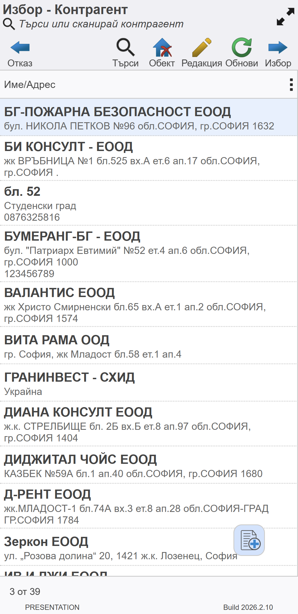
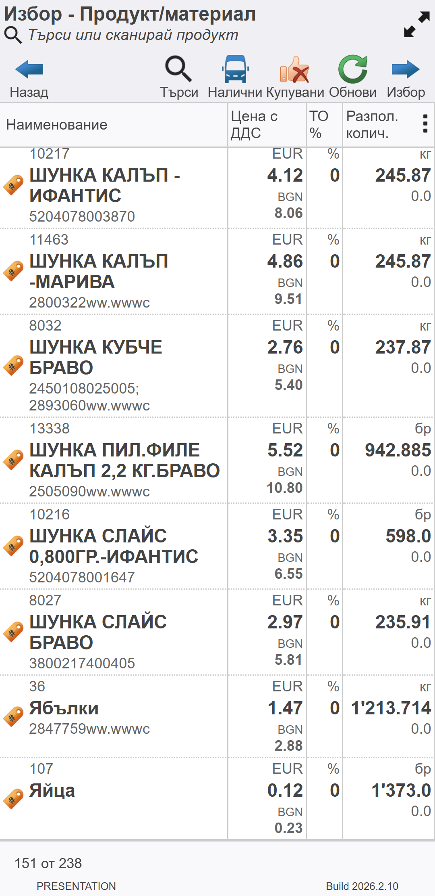

```{only} html
[Нагоре](../000-index)
```

# **Управление на списъци**

**Dreem Mobile** използва номенклатурите с контрагенти, обекти и продукти от бекофис системата **Dreem ERP**.  
Приложението визуализира единствено номенклатурите, които са включени в правата за достъп на потребителя в системата.  

Друго условие да се визуализира продукт в списъка за избор е за него да има цена по ценовата листа на избрания контрагент.

## **Работа със списък контрагенти**

Списъкът с контрагенти в **Dreem Mobile** се използва непрекъснато, т.к. всеки документ е свързан с контрагент.  
Най-отгоре във форма **Избор - Контрагент** има поле с опционални бутони:  

   - **Отказ** - Затваря списъка с контрагенти и връща на предходен екран.  
   - **Търси** - Отваря поле с бърз филтър. Използва се за бързо търсене по зададени критерии - част от име, обект, код.  
   - **Обект** - Бутонът показва/скрива обектите на контрагенти в списъка.  
   - **Редакция** - Отваря формата с настройки на избраната номенклатура и позволява коригиране.  
   - **Обнови** - Синхронизира списъка с контрагенти с бекофис системата.  
   - **Избор** - Потвърждава избора на маркирания контрагент и затваря списъка. Връща на предходния екран, като данните за клиента са добавени в текущия документ.   

> Чрез бутона, разположен долу вдясно на екрана, може да бъде добавен нов клиент.  

{ class=align-center w=5cm }

## **Работа със списък продукти**

Списъкът съдържа единствено продукти с валидна цена, за които потребителят има разрешен достъп.  

Най-отгоре във форма **Избор - Продукт/материал** има поле със следните опционални бутони:  

   - **Отказ** - Затваря списъка с продукти и връща на предходен екран.  
   - **Търси** - Отваря поле с бърз филтър. Използва се за бързо търсене по зададени критерии - част от име, код, баркод.  
   - **Налични** - Филтрира само продуктите с наличност в склада на потребителя в системата.  
   - **Купувани** - Филтрира списъка с продукти според това, дали някога са били купувани от избрания контрагент.  
   - **Обнови** - Синхронизира списъка с продукти с бекофис системата, вкл. наличност.  
   - **Избор** - Потвърждава избора на маркираните един или няколко продукта и затваря списъка. Връща на предходния екран, като данните за продукта са добавени в текущия документ.   

{ class=align-center w=5cm }

## **Търсене по име, код или баркод**

В бързия филтър е реализирано пълно текстово търсене по име, код и баркод на продуктите.
При въвеждане на част от име или част от код на продукт, системата филтрира списъка, като в него остават само тези продукти, които съдържат критериите на търсенето. Търсенето работи и по част от две думи, независимо къде са разположени в наименованието на продукта.
Търсенето по баркод се осъществява чрез изписването на целия код или сканирането му чрез баркод скенер.  

## **Множествен избор на продукти от списък**


## **Скриване и показване на колони**


## **Маркиране на стоки чрез баркод**


## **Редакция на количества**


## **Работа с партиди на продукти**


## **Редакция на цена и отстъпка в документ**


## **Визуализация на наличности**


## **Визуализация на промоции**


## **Визуализация на предходни количества**

