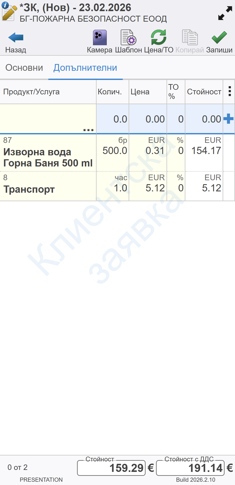

```{only} html
[Нагоре](../000-index)
```

# **Клиентски заявки**

Една от основните функции на **Dreem Mobile** е събирането на заявки на място при клиента. Въведените заявки се записват на момента в базата данни и обработката им може да бъде стартирана веднага.  

В заявките автоматично се прилагат цените от предварително зададена клиентска ценова листа за избрания контрагент. Системата ще вземе предвид активни промоции и отстъпки, ако има настроени такива.  

С цел планиране на логистиката и документацията при изпълнението на заявките системата изисква определени параметри при въвеждането им:  
   - *Място на доставка*   
   - *Дата на доставка*  
   - *Начин на плащане*  
   - *Издаване на фактура* и др.  
    
> Повечето от тези данни са свързани с клиента и могат да бъдат настроени предварително, така че да се попълват автоматично.    

## **Създаване на нова заявка**

Създаването на нова заявка може да бъде извършено през функционалност **Документи за заявка** или през **Заявки, продажби, задължения**.  

1. **От Документи за заявка** 

Избира се функция **Документи за заявка**, което отваря списък с всички заявки за текущия ден.  
Над списъка се визуализират опционални бутони:  

   - **Назад** - Затваря списъка със заявки и връща на екрана с основно меню.  
   - **Обнови** - Служи за опресняване на списъка с документи за заявка.  
   - **Филтър** - Отваря форма за избор на различни критерии (дати, статус, контрагент, състояние), по които списъкът се променя.  
   - **Редакция** - Отваря формата за редакция на предварително маркираната заявка и позволява промяна.  
   - **Нов** - Създава нов документ за заявка.   

   { class=align-center w=7cm }

За създаване на заявка се избира бутон [**Нов**].  
Това отваря празна форма с полета за въвеждане на данни за клиента.  

> Маркираните с червен символ полета са задължителни.  

{ class=align-center w=7cm }

2. **От Заявки, продажби, задължения**

При избор на функция **Заявки, продажби, задължения** системата отваря списък за избор от контрагенти. 
Над списъка се визуализират опционални бутони:  

   - **Назад** - Затваря списъка и връща на екрана с основно меню. .   
   - **Търси** - Активира полето на бързия филтър за търсене на контрагент.  
   - **Редакция** - Отваря формата за редакция на предварително маркираната заявка и позволява промяна.  
   - **Обнови** - Служи за опресняване на списъка с документи за заявка.  
   - **Напред** - Отваря следващия екран с всички заявки, продажби и задължения на контрагента.   

   { class=align-center w=7cm }

Чрез бързия филтър или ръчно се намира и маркира желаният клиент.  
С бутона [**Напред**] се преминава към следваща стъпка от създаването на заявка.   

Системата отваря списъци с документите за клиента, разделени по тип в три отделни списъка (панела): **Заявки**, **Продажби** и **Задължения**.
На всеки панел се визуализират опционални бутони:  

   - **Назад** - Връща към предходен екран и списък с контрагенти.   
   - **(Всички)** - Отваря падащ списък с обекти на контрагента. Чрез него документите могат да бъдат филтрирани за избран обект.  
   - **Редакция** - Отваря формата за редакция на предварително маркираната заявка и позволява промяна.  
   - **Нов** - Създава нов документ за заявка.    

{ class=align-center w=7cm }

Заявка се въвежда от панел **Заявки** и бутон [**Нов**].  
Системата попълва автоматично всички полета, за които има данни в настройките на контрагента.  

## **Въвеждане на заявка**

Независимо през коя функционалност е била създадена заявката, системата отваря същата бланка за въвеждане на данни. Тя е разделена на два панела - **Основни** и **Допълнителни**.  

1. **Основни**  

В панел **Основни** се въвеждат необходимите данни за клиента в полета:  
   - *Док. дата* - Автоматично е попълнена текуща дата.  
   - *Док. тип* - Автоматично е избран тип на документа *Заявка от клиент*.  
   - *Контрагент* - Отваря форма за избор от списък с клиенти. Желаният контрагент се маркира и потвърждава с бутон [**Избор**].  
   - *Обект* - Отваря падащ списък с обектите на избрания контрагент.  
   - *Заявил* - Попълва се персоната, направила заявката.  
   - *Адрес за доставка* - Полето съдържа адрес, на който ще се изпълни доставката на стоки.  
   - *Желае фактура* - Отваря опционално меню за избор от: *Да* - клиентът иска издаване на фактура; *Не* - клиентът не желае издаване на фактура.  
   - *Дата на доставка* - Указва се дата, на която да се извърши доставката.  
   - *Вид транспорт* - Отваря падащ списък за избор на начина на доставка.  
   - *Час на доставка* - Отваря списък за избор от часовете за доставка.  
   - *Начин на плащане* - От падащия списък в полето се избира методът на плащане.  
   - *Падеж* - Поле с крайна дата за плащане.  
   - *Забележка* - Празно поле за въвеждане на допълнителни бележки към заявката.    

> При създадена заявка от функционалност **Заявки, продажби, задължения** полетата в панел **Основни** се попълват автоматично.  

{ class=align-center w=7cm }

2. **Допълнителни**  

От панел **Допълнителни** се добавят заявените от клиента продукти. Това става от реда за нови записи, разположен в горната част на екрана.  

{ class=align-center w=7cm }

Чрез двоен клик в полето **Продукт/Услуга** се отваря форма **Избор - Продукт/материал**. Тя съдържа списък на продуктите и информация за разполагаеми количества, цени и търговски отстъпки.    

{ class=align-center w=7cm }

> Цените и отстъпките се предлагат автоматично от системата спрямо настройките на избрания контрагент.  
Възможностите за редактиране на цените и търговските отстъпки зависят от правата на съответния мобилен търговец.  

Системата автоматично калкулира общата стойност на документа с и без ДДС. 

{ class=align-center w=7cm }