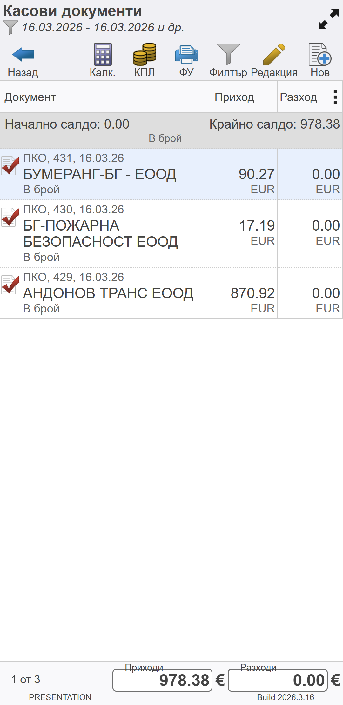
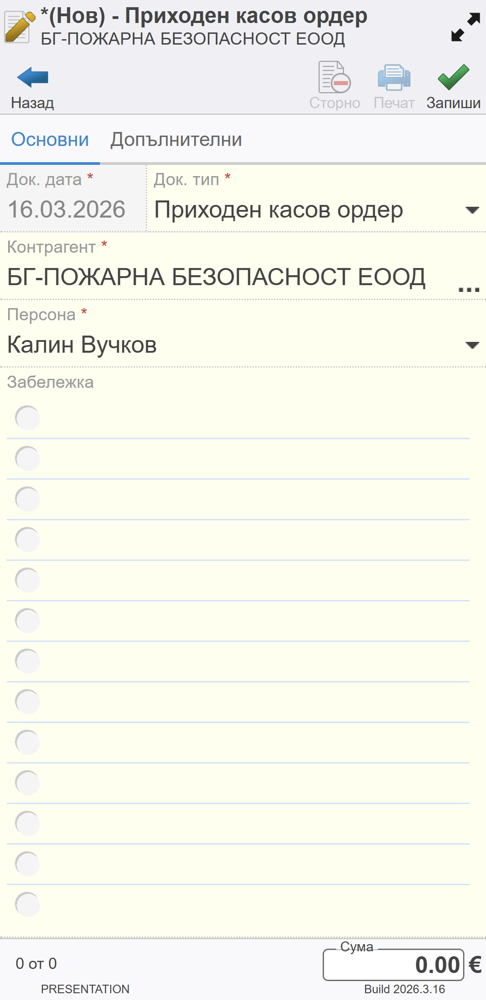
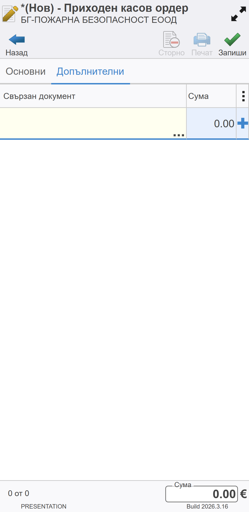
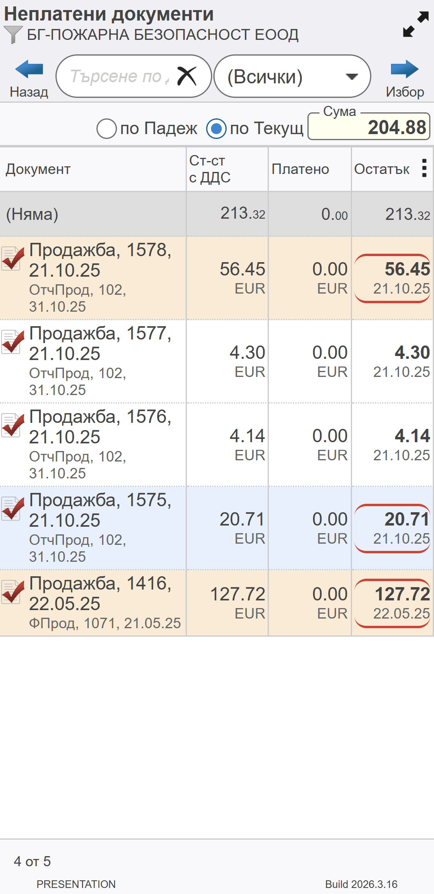
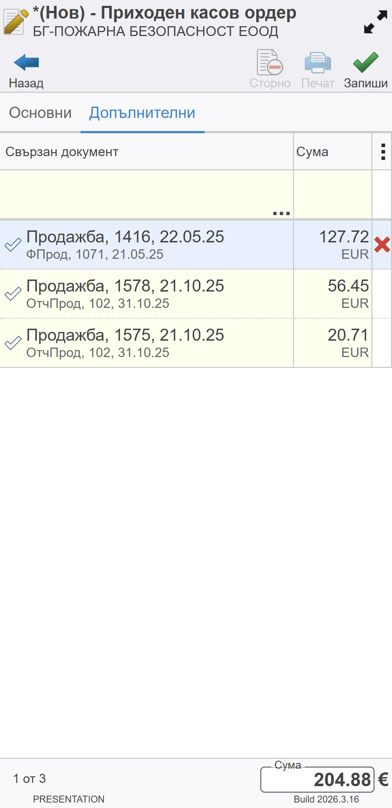
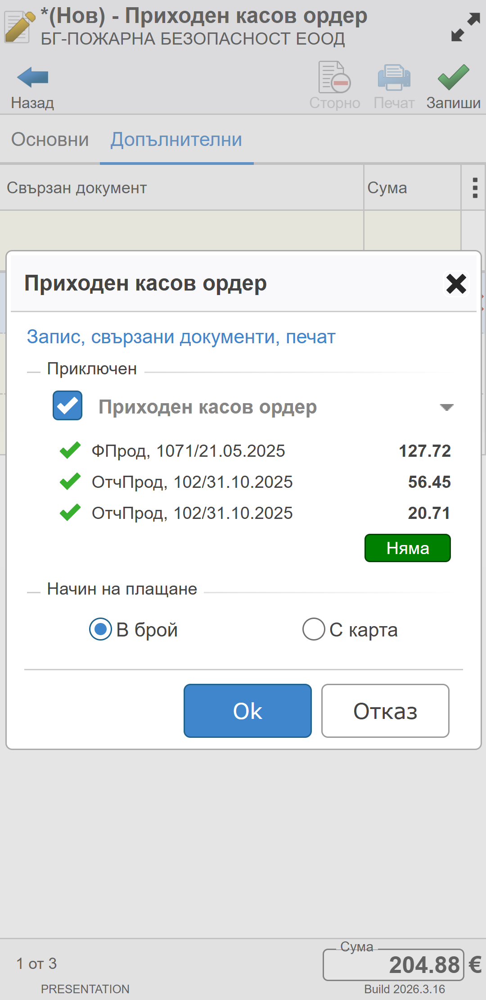
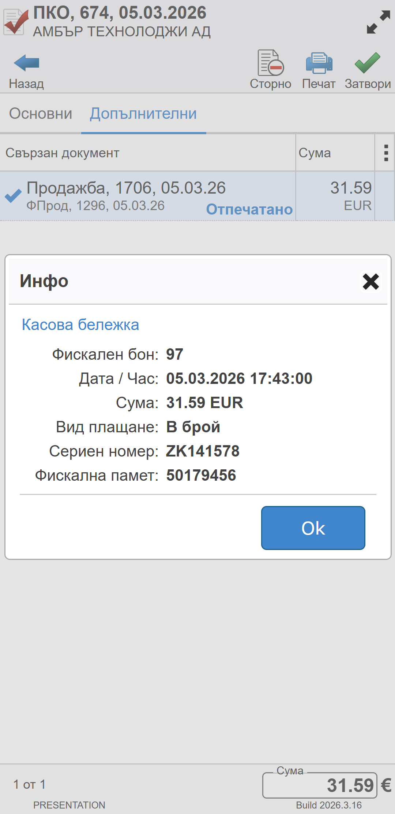

```{only} html
[Нагоре](../000-index)
```

# **Касови документи**
 
Касовите операции се отразяват в настроената за мобилния търговец каса - **МК Търговец**. Тя е свързана с фискално устройство и операциите в нея се регистрират във фискалната памет (КЛЕН).  

> Оборотите и наличностите в мобилната каса на търговеца винаги трябва да са равни на тези в КЛЕН.  

Движенията на парични средства от/в **МК Търговец** се регистрират в системата от функционалност **Касови документи**. Тя е достъпна от основното меню.  

С избор на функция **Касови документи** се отваря списък с всички записи от текущия ден. Списъкът може да се променя чрез опционалните бутони, които се визуализират над него:  

   - **Назад** - Затваря списъка със касови документи и връща на екрана с основно меню.  
   - **Калкулатор** - Отваря помощник при разплащания.  
   - **КПЛ** - Отваря форма с текуща наличност на касата на подотчетното лице.  
   - **ФУ** - Отваря форма за управление на фискално устройство.  
   - **Филтър** - Отваря форма за избор на различни критерии (дати, документ тип, контрагент, състояние), по които списъкът се променя.  
   - **Редакция** - Отваря формата за редакция на предварително маркирания документ и позволява промяна.  
   - **Нов** - Създава нов касов документ.   

{ class=align-center w=7cm }

## **Създаване на нов касов документ**

За създаване на касов документ се избира бутон [**Нов**].  
Това отваря празна форма за въвеждане на данни. Тя се състои от два панела: **Основни** и **Допълнителни**.   

> Маркираните с червен символ полета са задължителни.  

{ class=align-center w=7cm }

1. **Основни**  

В панел **Основни** се въвеждат необходимите данни за клиента в полета:  
   - *Док. дата* - Автоматично е попълнена текуща дата.  
   - *Док. тип* - За получено в брой плащане се създава **ПКО**-*Приходен касов ордер*.  
   - *Контрагент* - Отваря форма за избор от списък с клиенти. Желаният контрагент се маркира и потвърждава с бутон [**Избор**].  
   - *Персона* - Обзавежда се с персона от списъка с настроените за избрания контрагент.  
   - *Забележка* - Празно поле за въвеждане на допълнителни бележки към документа.    

2. **Допълнителни**  

От панел **Допълнителни** се добавят документите, за които се регистрира текущото плащане. Това става от реда за нови записи, разположен в горната част на екрана.  

{ class=align-center w=7cm }

В поле **Свързан документ** се отваря списък **Неплатени документи**.  

> Списъкът съдържа единствено документи с остатък за плащане за избрания контрагент. Системата автоматично маркира тези, на които падежът за плащане е настъпил.  

В полета **Остатък** се маркират един или няколко документа, за които постъпва плащане. Системата натрупва дължимото в поле **Сума**.  

Свързаните документи се потвърждават с бутон [**Избор**].  

> Ако клиентът не плаща по конкретни документи, в поле **Сума** свободно може да бъде въведена стойност, без да бъдат избрани свързани документи. Системата ще закрие хронологично остатъци за плащане по документи.   

{ class=align-center w=7cm }

Системата затваря списъка с неплатени документи и добавя избраните записи в касовия документ.  
На този етап стойностите в поле **Сума** могат да бъдат коригирани, така че общата сума да отговаря на фактически получената.  

{ class=align-center w=7cm }

## Запис и приключване

След като всички данни са въведени, документът трябва да бъде записан.  
За целта се използва бутон [**Запиши**]. С това системата извежда форма за потвърждение. В нея има различни опции за приключване и генериране на свързани документи, разделени по секции.  

{ class=align-center w=7cm }

1. **Приключен**  

Приключването на документа означава, че сумата по него се добавя към наличността в касата. Това може да стане като се маркира опцията за **Приключен**. С това касовият документ става валиден за системата.  

Документът може да остане в редакция. За целта опцията за приключване остава немаркирана. С това системата позволява да бъде редактиран и завършен на по-късен етап.   

2. **Начин на плащане**  

Полученото от клиента плащане се регистрира според метода, като се избира *В брой* или *С карта*.  

> При тази операция системата изисква да бъде издаден фискален касов бон. За тази цел задължително трябва да има свързано фискално устройство.   

С бутон [**Ok**] избраните опции се потвърждават. Системата валидира движението на парични средства в касата и отпечатва касова бележка на ФУ.  

## **Преглед на данни от касова бележка**

Отпечатаните на ФУ касови бележки се записват в системата с всичките им реквизити. Те са достъпни от редовете на свързаните касови документи.  

> Когато има отпечатана касова бележка, по редовете в касовия ордер се визуализира текст *Отпечатано*.  

Чрез маркиране на текста *Отпечатано* се отваря форма с данни за касовата бележка:  
   - Номер на фискална бележка  
   - Дата и час на отпечатване  
   - Сума   
   - Вид на плащането
   - Сериен номер на фискално устройство  
   - Номер на фискална памет   

{ class=align-center w=7cm }
