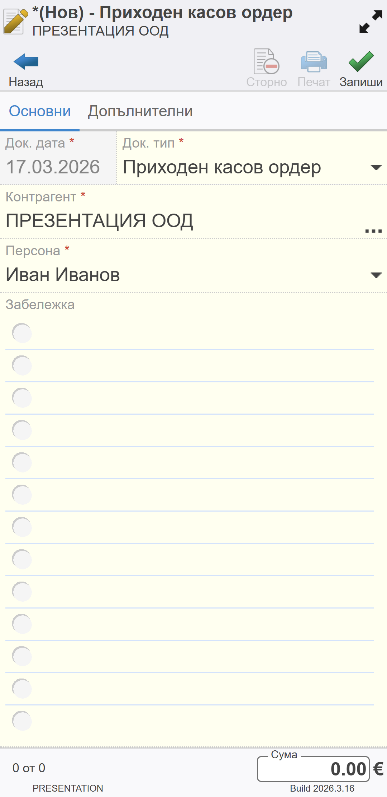
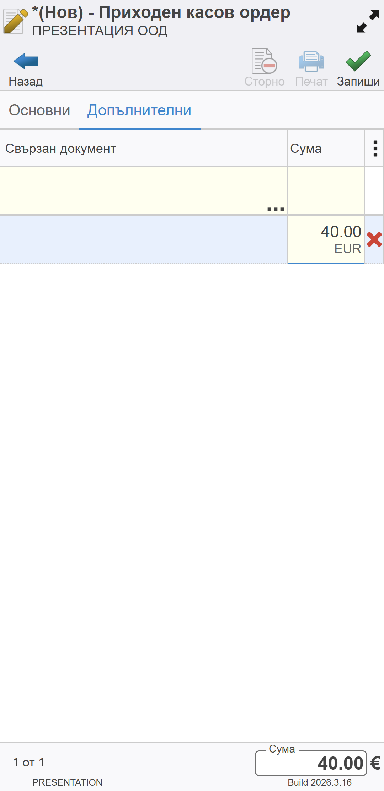
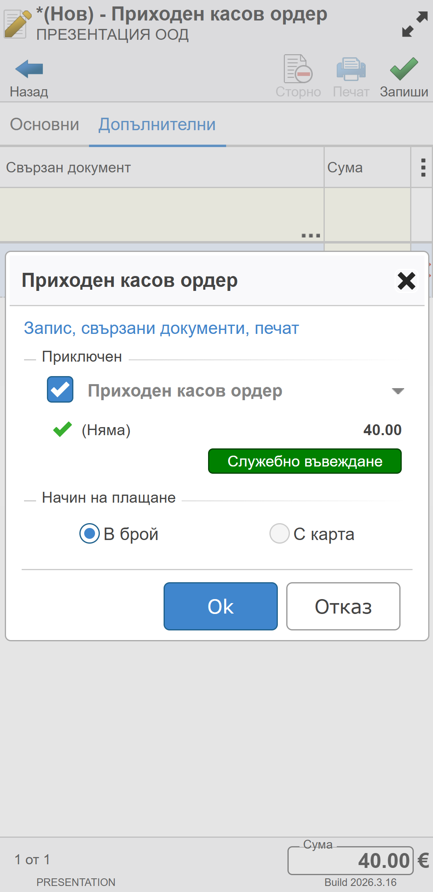

```{only} html
[Нагоре](../000-index)
```

# **Служебно въвеждане/извеждане**
 
Всяко служебно въвеждане и извеждане на суми се регистрира в касата на търговеца. Тя е свързана с фискално устройство и операциите в нея се отразяват във фискалната памет (КЛЕН).  

> Оборотите и наличностите в мобилната каса на търговеца винаги трябва да са съвпадат с тези в КЛЕН.  

Служебно въведени/изведени суми се отразяват в системата като прехвърляне на средства между портфейли. За целта се въвеждат документи в системата от функционалност **Касови документи**. Тя е достъпна от основното меню.  

> Служебното въвеждане прехвърля сума от каса **КПЛ Търговец** към каса **МК Търговец**. Служебното извеждане прави обратното.  

За създаване на касов документ се избира бутон [**Нов**].  
Това отваря празна форма за въвеждане на данни. Тя се състои от два панела: **Основни** и **Допълнителни**.   

1. **Основни**  

В панел **Основни** се попълват данни в следните полета:  

   - *Док. дата* - Автоматично е попълнена текуща дата.  
   - *Док. тип* - За служебно въвеждане се създава **ПКО**-*Приходен касов ордер*.  
   За служебно извеждане - **РКО**-*Разходен касов ордер*.    
   - *Контрагент* - Отваря форма за избор от списък **Контрагенти**.  
   Задължително се маркира контрагент-потребител на продукта.  
   - *Персона* - Обзавежда се с персона, свързана със служебното въвеждане/извеждане.  
   - *Забележка* - Празно поле за въвеждане на допълнителни бележки към документа.    

{ class=align-center w=7cm }

2. **Допълнителни**  

От панел **Допълнителни** се въвежда сумата, за която се регистрира текущата операция. Това става от поле **Сума** на реда за нови записи, разположен в горната част на екрана.  

> Поле **Свързан документ** се оставя празно.   

{ class=align-center w=7cm }

След като всички данни са въведени, документът трябва да бъде записан от бутон [**Запиши**]. С това системата извежда форма за потвърждение. В нея има различни опции за приключване и генериране на свързани документи, разделени по секции.  

Приключването на документа означава, че сумата по него се добавя към наличността в касата. Това може да стане като се маркира опцията за **Приключен**.  

{ class=align-center w=7cm }

С бутон [**Ok**] избраните опции се потвърждават. Системата валидира движението на парични средства в касата и отпечатва касова бележка на ФУ.  