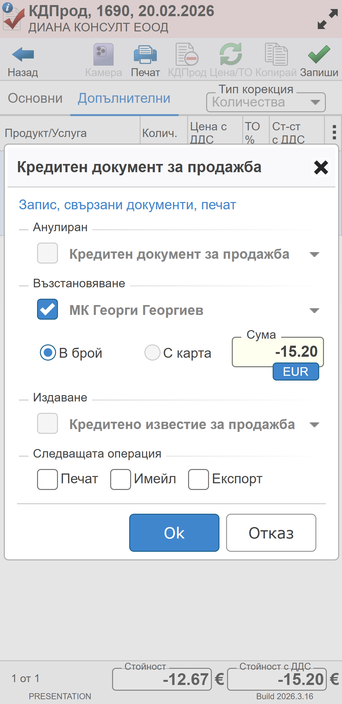
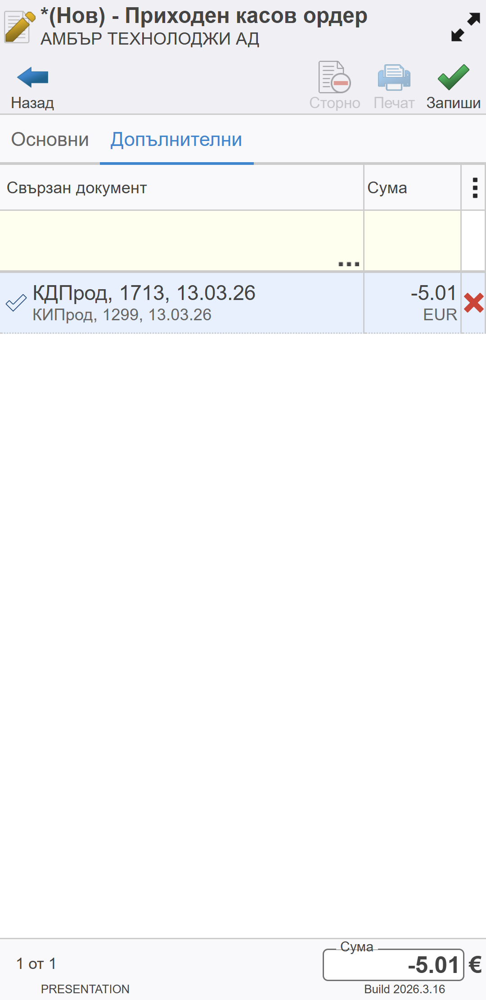
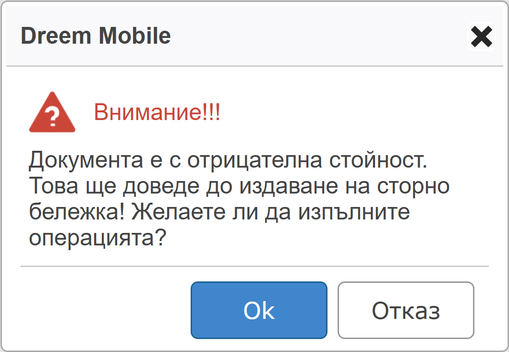
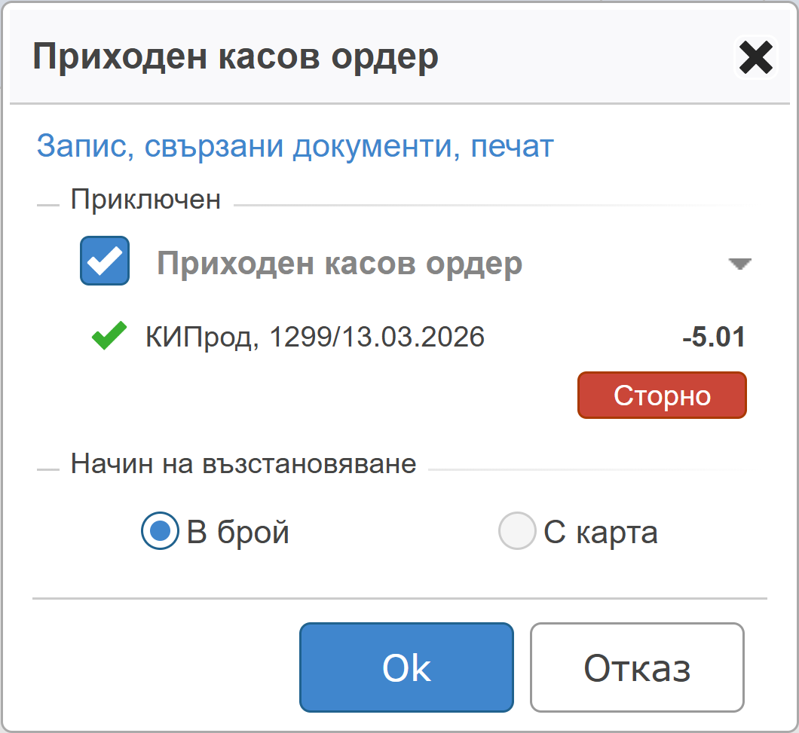

```{only} html
[Нагоре](../000-index)
```

# **Сторно операции**
 
Сторно операциите отразяват възстановяването на суми на клиенти по платени документи. Сумата се намалява от касовата наличност и се връща на клиент.  

> За всяка операция се издава сторно касов бон. 

Сторно може да бъде направено по документ за продажба или по кредитен документ.  
В първия случай се сторнира единствено плащането по продажба, която е приключена и платена. Във втория случай се създава кредитен документ за корекции по продажба и се сторнира плащането към нея.  

> Сторно операциите се регистрират в системата чрез **ПКО**-*Приходен касов ордер* с **отрицателен знак**.  

Сторно бон може да бъде издаден през кредитния документ от  функионалност **Документи за продажба** или с нов ордер през **Касови документи**.  

> Всеки кредитен документ е свързан с продажба.  
За издаване на сторно бон по кредитен документ свързаната продажба трябва да е платена с отпечатан фискален бон.  

## **Сторно през Документи за продажба**

От основното меню се избира функционалност **Документи за продажба** и системата отваря списък със записи.  
Сторно бон може да бъде издаден към предварително приключен КДПрод или към текущо генериран.  

- **Сторно бон към нов КДПрод**  

Създава се [нов кредитен документ](006-returns.md). При неговото приключване от формата за генерация на свързани документи се маркира мобилната каса на оператора в секция **Възстановяване**. Системата автоматично предлага сумата на КДПрод в поле **Сума**.  

При потвърждаване с бутон [**Ok**] с тази стойност се издаване сторно бон от ФУ.  

- **Сторно бон към приключен КДПрод**  

От списъка с документи се намира КДПрод, за който се отнася сторно операцията. С бутон [**Запиши**] се отваря форма с различни опции за приключване и генериране на свързани документи. В секция **Възстановяване** се маркира мобилната каса на оператора. Полето **Сума** е автоматично обзаведено със стойносттана избрания КДПрод.  

Избраните опции се потвърждават с бутон [**Ok**] и системата издава сторно бон от ФУ.  

{ class=align-center w=7cm }

## **Сторно през Касови документи**

Създава се касов документ от бутон [**Нов**]. Това отваря форма за въвеждане на данни.  
В панел **Основни** се попълват данни за клиента.  
От панел **Допълнителни** на реда за нов запис се избира кредитен документ, за който се възстановява сума.     

{ class=align-center w=7cm }

След като всички данни са въведени, документът се приключва чрез бутон [**Запиши**]. С това системата извежда съобщение и изисква потвърждаване издаването на документ с отрицателна стойност.  

{ class=align-center w=7cm }

Преминава се напред към валидиране на сторно операцията. Това може да стане като се маркира опцията за **Приключен**.  

> Приключването на документа означава, че сумата по него се изважда от наличността на касата.  

{ class=align-center w=7cm }

С бутон [**Ok**] избраните опции се потвърждават. Системата валидира и записва касовия ордер в базата. Успоредно с това се отпечатва сторно бон на ФУ.  
