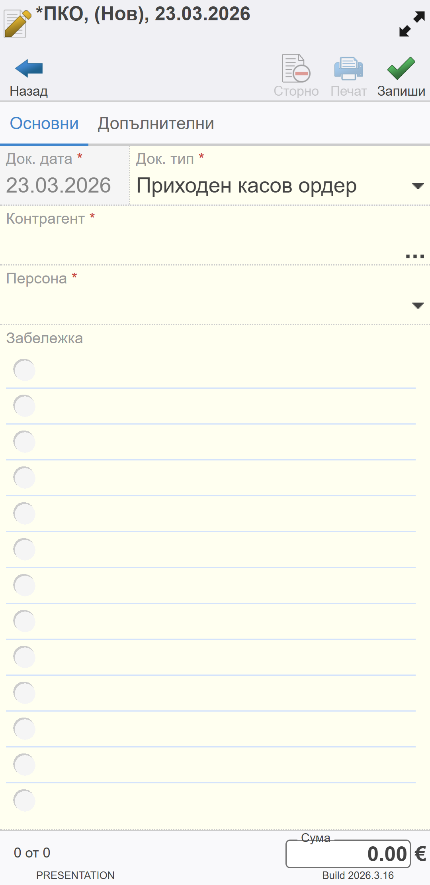
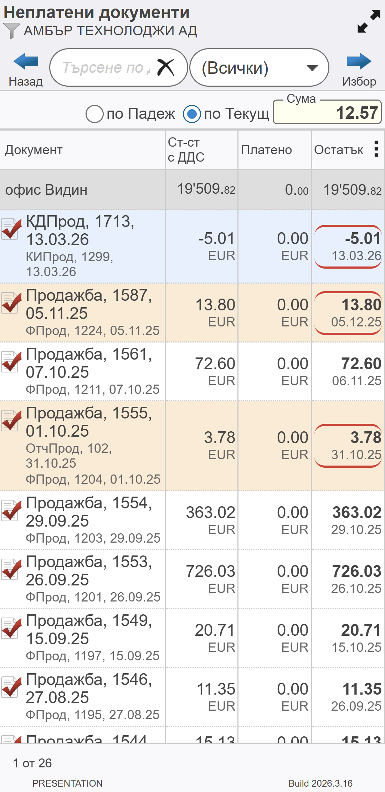
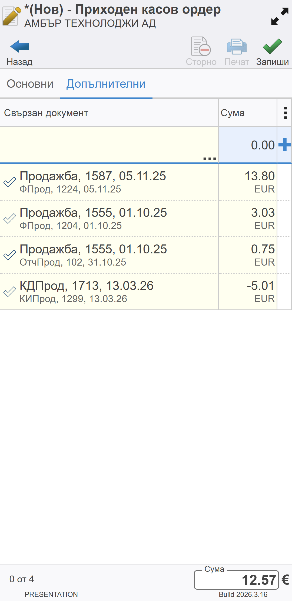
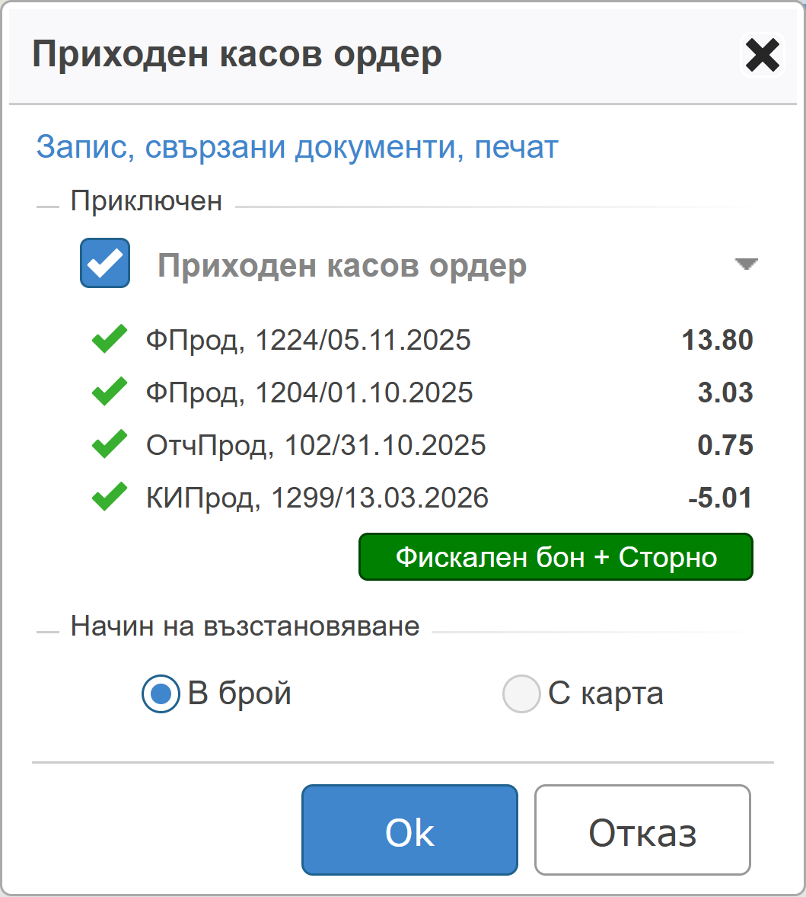

```{only} html
[Нагоре](../000-index)
```

# **Плащане с прихващане**
 
**Dreem  Mobile** дава възможност за прихващания между продажби и кредитни документи. За целта в касов ордер трябва да участват документи с положителен и отрицателен знак, за които системата да създаде протокол за прихващане.  

> Продажбите и кредитните документи се прихващат до размера на по-малката от двете суми.  

При наличие на остатъчни суми (по един или повече документи) след прихващането системата може автоматично да създаде касов ордер за тях. С това при запис на документа за прихващане се създават едновременно протокол със стойност 0.00 евро и **ПКО** за остатъка. За последното системата ще отпечата фискален бон.  

Документите за прихващане се регистрират чрез ордери от функционалност **Касови документи**. Тя е достъпна от основното меню.  

## **Създаване на нов документ за прихващане**

За създаване на протокол за прихващане се избира бутон [**Нов**].  
Това отваря празна форма за въвеждане на данни. Тя се състои от два панела: **Основни** и **Допълнителни**.   

{ class=align-center w=7cm }

1. **Основни**  

В панел **Основни** се въвеждат необходимите данни за клиента в полета:  
   - *Док. дата* - Автоматично е попълнена текуща дата.  
   - *Док. тип* - За регистриране на прихващане се създава **ПКО**-*Приходен касов ордер*.  
   - *Контрагент* - Отваря форма за избор от списък с клиенти. Желаният контрагент се маркира и потвърждава с бутон [**Избор**].  
   - *Персона* - Обзавежда се с персона от списъка с настроените за избрания контрагент.  
   - *Забележка* - Празно поле за въвеждане на допълнителни бележки към документа.    

2. **Допълнителни**  

От панел **Допълнителни** се добавят документите, за които се регистрира прихващане. Това става от реда за нови записи, разположен в горната част на екрана.  

В поле **Свързан документ** се отваря списък с документи за избрания контрагент, които имат остатък за плащане.  

В полета **Остатък** се маркират един или няколко документа, за които постъпва плащане. Системата калкулира дължимото в поле **Сума**.  

{ class=align-center w=7cm }

Свързаните документи се потвърждават с бутон [**Избор**].  
Системата затваря списъка с неплатени документи и добавя маркираните записи в ордера.  

## Запис и приключване

След като всички данни са въведени, документът трябва да бъде потвърден от бутон [**Запиши**].  

> Стойността в поле **Сума** е остатъкът за доплащане от клиента. Сумата ще се добави автоматично към наличността в касата.  

{ class=align-center w=7cm }

С това системата извежда форма с различни опции.  

1. **Приключен**  

Приключването на документа означава, че сумите в него се прихващат и той става валиден за системата. Това може да стане като се маркира опцията за **Приключен**.  

2. **Начин на плащане**  

Получено плащане от клиента се регистрира чрез избор на метод *В брой* или *С карта*.  

> При тази операция системата изисква да бъде издаден фискален касов бон. За тази цел задължително трябва да има свързано фискално устройство.   

{ class=align-center w=7cm }

С бутон [**Ok**] избраните опции се потвърждават. Системата валидира ордера и отпечатва касова бележка.  
