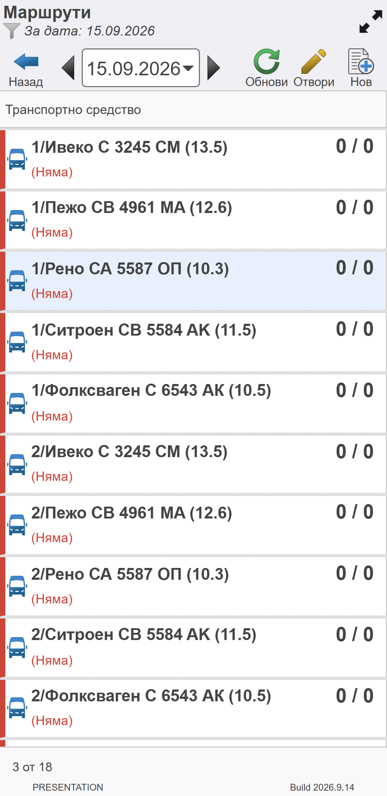
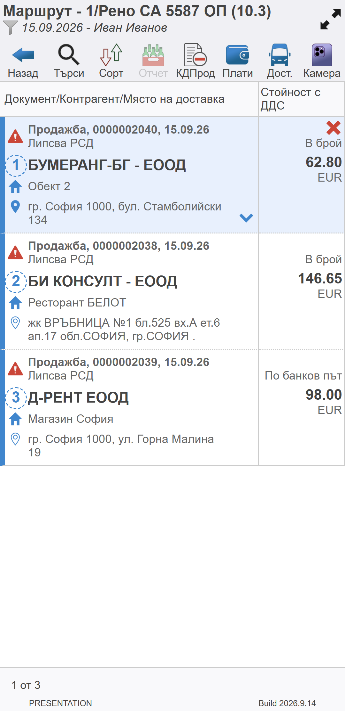
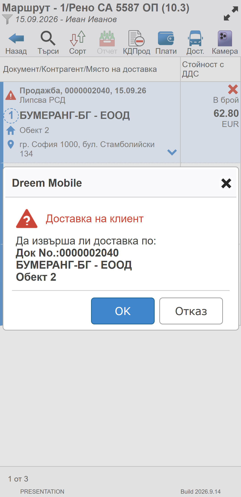

```{only} html
[Нагоре](../000-index)
```

# **Нов маршрут**

Добавяне на нов маршрут е разрешено за потребители на **Dreem Mobile** с определени настройки (мобилен диспечер).  

## Създаване и попълване

Маршрут се създава през функционалност **Маршрути**. Тя е достъпна от основното меню.  

Чрез бутон [**Нов**] се отваря списък с транспортни средства. Трябва да бъде маркиран точният ред с номер на курса, който ще се изпълнява.  

С бутон [**Отвори**] се потвърждава транспортното средство.  

{ class=align-center w=7cm }

Системата отваря празна форма за добавяне на продажби към курса.  
Документите могат да бъдат намерени чрез сканиране на баркод или чрез търсене по номер.  

> При търсене на продажба с номер в редакция (**E**0000000123) търсете с **.** (точка) в началото (.123).  

{ class=align-center w=7cm }

По-нататъшната работа в маршрута продължава с реализиране на доставките по продажби.  
Доставка също се потвърждава чрез баркод сканиране или търсене по номер на документа.   

{ class=align-center w=7cm }
