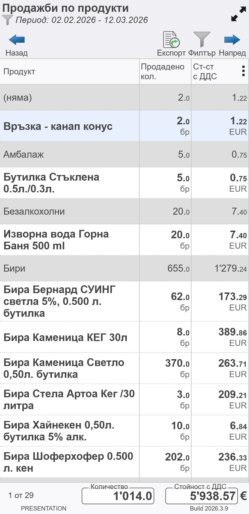
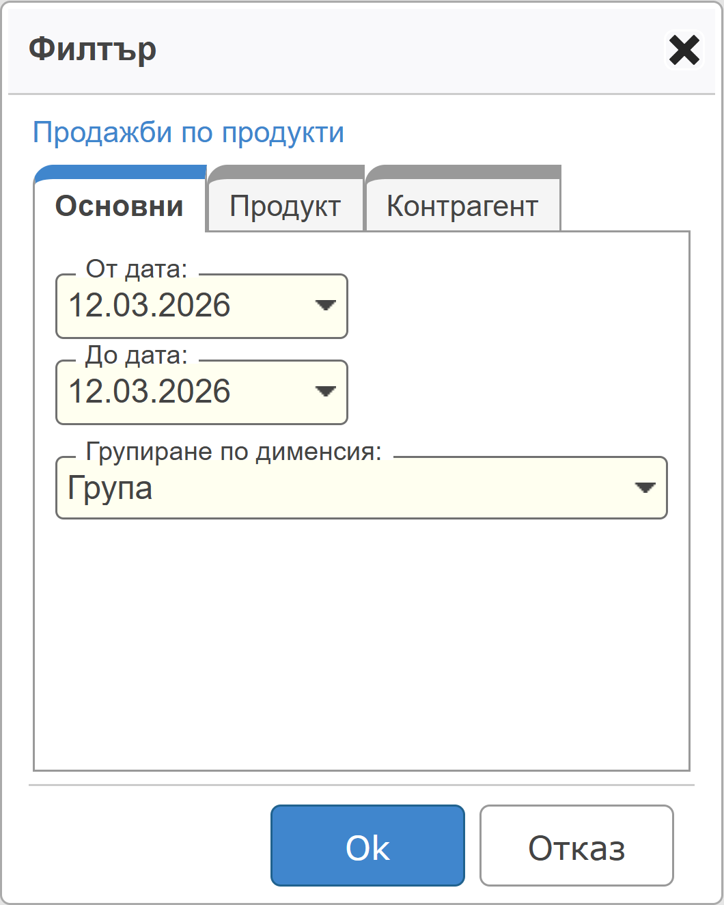
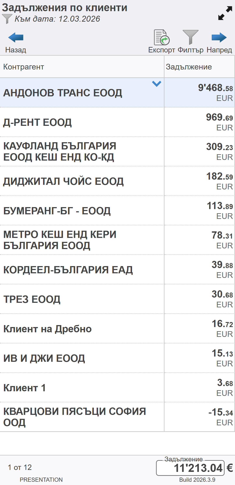
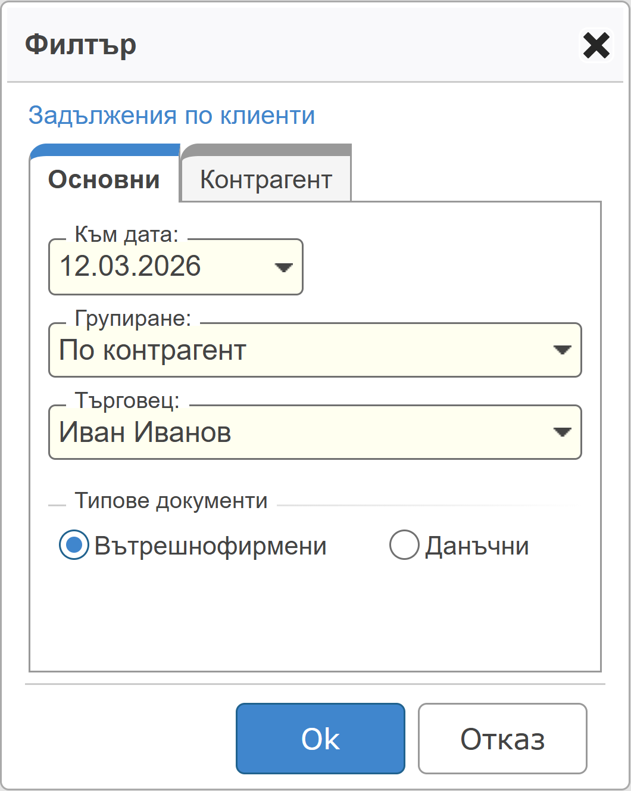
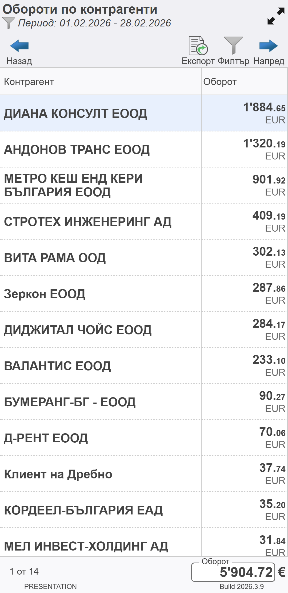
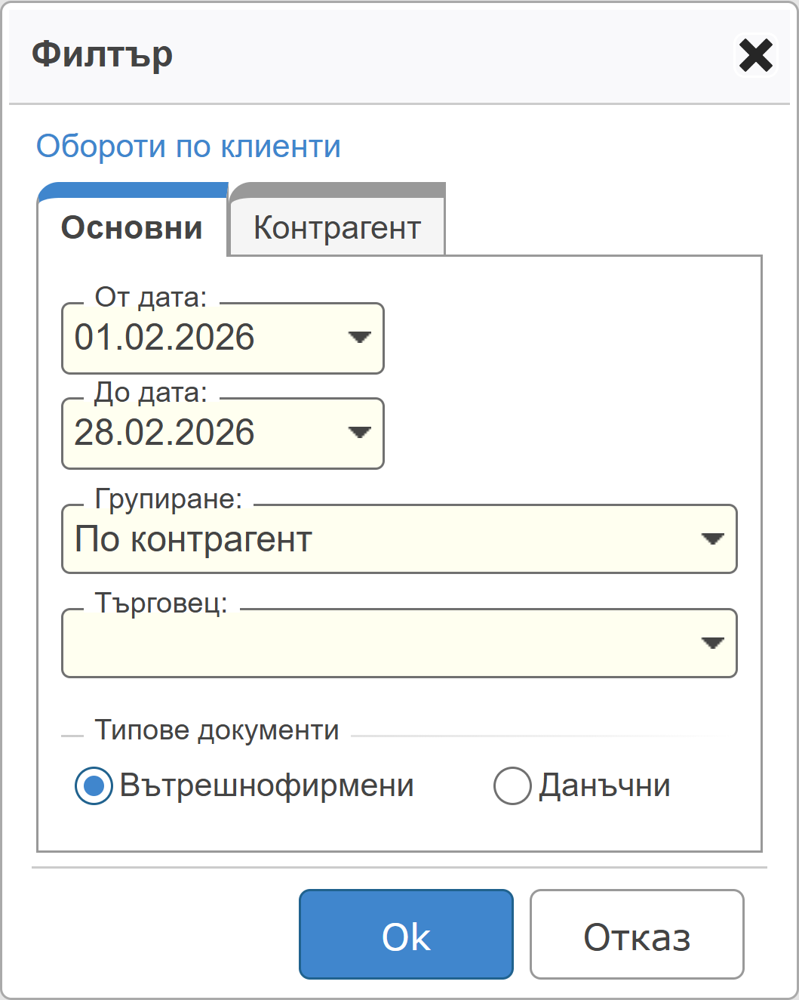
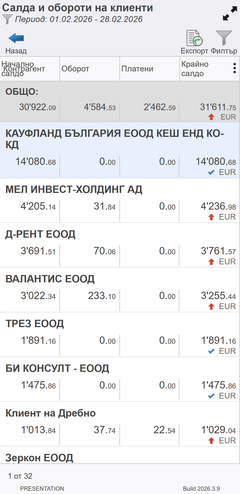
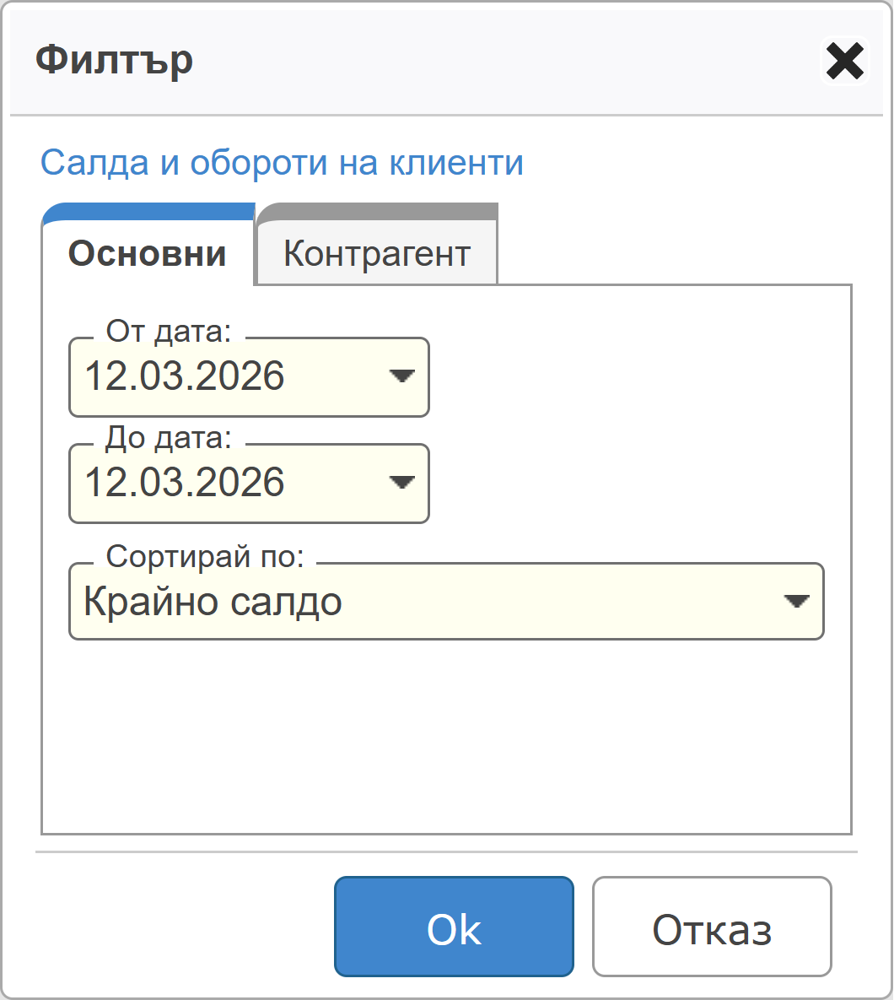
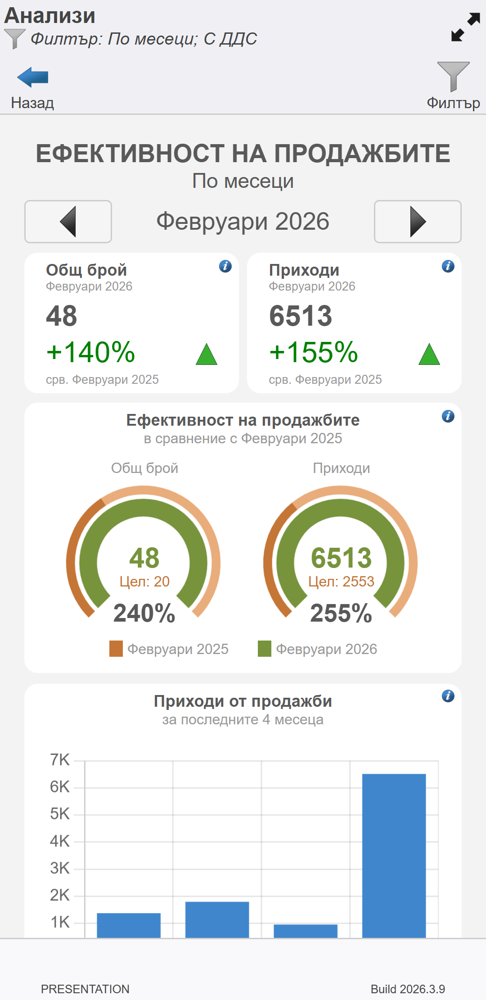
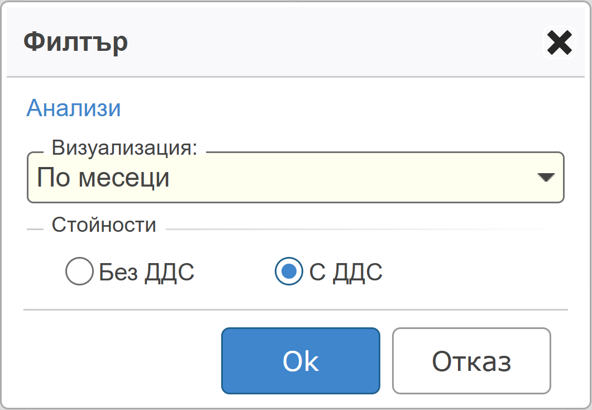

```{only} html
[Нагоре](../000-index)
```

# **Търговски справки**

Всички справки, които **Dreem Mobile** осигурява, са достъпни от основното меню.  
При всички справки от бутон [**Филтър**] се отваря форма за избор на критерии, по които да се филтрират данните.  

> Данните в справките варират спрямо приложените филтри.  
Показаните резултати се базират единствено на данни от документи, до които потребителят има достъп.     

Справките могат да бъдат записани във файл чрез бутон [**Експорт**] .  

## **Продажби по продукти**

Справката показва информация с реализираните продажби за избран период от време.  

{ class=align-center w=7cm }

Системата позволява филтриране на данните по продукти, дименсии, контрагенти и/или обекти.  

{ class=align-center w=7cm }

## **Задължения по клиенти**

Справката показва натрупани задължения на клиенти към избрана дата.  

{ class=align-center w=7cm }

Системата позволява филтриране на данните по типове документи, контрагенти, дименсии и/или обекти.  

{ class=align-center w=7cm }

## **Обороти по клиенти**

Справката показва реализиран оборот по клиенти, обекти и търговец, както и обща стойност на продажбите за периода.  

{ class=align-center w=7cm }

Системата позволява филтриране на данните за период по типове документи, контрагенти, дименсии и/или обекти.  

{ class=align-center w=7cm }

## **Салда и обороти на клиенти**

Справката показва дължими суми в началото на избран период, обороти, платено и салдо в края на периода по контрагенти.  

Данните могат да бъдат сортирани по: крайно салдо, оборот, платени или начално салдо.  

{ class=align-center w=7cm }

Системата позволява филтриране на данните за период по контрагенти и дименсии.    

{ class=align-center w=7cm }

## **Анализи**

Справката показва анализ на общте приходи от продажби.  
Данните се визуализират по месеци.  

{ class=align-center w=7cm }

Системата позволява филтриране на данните с или без ДДС по месеци.    

{ class=align-center w=7cm }

```{toctree}
:maxdepth: 1
:glob:

*
```
