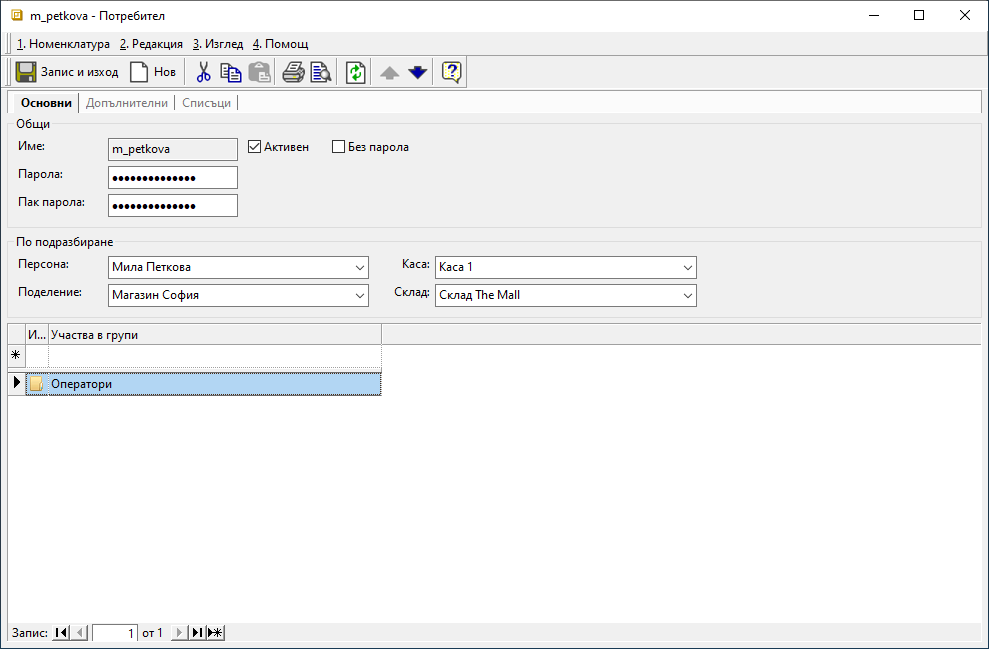

```{only} html
[Нагоре](../000-index)
```

# **Настройки в бекофис системата**

Регистрирането на продажби на крайни клиенти чрез **Dreem POS** е възможно след конфигуриране на определени параметри в бекофис системата **Dreem ERP**. Те служат за коректното обзавеждане на задължителните реквизити в документите, които системата създава автоматично.  

След като операторът потвърди плащането от клиента, продажбата в **Dreem POS** се приключва. С това системата автоматично регистрира набор от документи, достъпни в **Dreem ERP**:  

   - **Продажба** - вътрешнофирмен документ, който регистрира реализираната продажба на клиент на дребно;  
   - **РСД** - складов документ, с който продадените стоки се изписват от склада на обекта;  
   - **ПКО** - отделни касови документи, с които получените плащания в брой, с карта и пр. се регистрират по съответните каси на обекта;  
   - **Фактура** - данъчен документ, който е свързан с дадена **Продажба**;  
   Данъчните документи се издават единствено по желание на клиента. За останалите продажби без фактури в последствие се генерират отчети за продажба в бекофис системата.  

## **Поделение**

Въвеждането на отделни обекти за **Потребител на продукта** служи за коректното отчитане на продажби и издаване на фактури. [Списък с поделения (обекти)](../../erp/001-ref/001-nomenclatures/002-contragents.md) се настройва в раздел **Списъци** от форма за редакция на контрагента.  
Всяко поделение може да се настрои с отделен [**Номератор**](../../erp/001-ref/004-settings/004-counters.md) за вътрешнофирмени и за данъчни документи.  

## **Каса**

За различните видове плащания (в брой, с карта и т.н.) **Dreem POS** регистрира касови документи в различни каси. За целта всяко работно място в обекта трябва да има създадени отделни каси - напр. *Каса Магазин София (1)*, *Каса Магазин София (2)* за плащанията в брой, *Каса Магазин София (1) (безналични)*, *Каса Магазин София (2) (безналични)* за картови разплащания.  

Касите се настройват от [**Номенклатури || Референтни номенклатури**](../../erp/001-ref/001-nomenclatures/001-ref-nomenclatures.md).  

## **Склад**

Всеки от настроените обекти на **Потребител на продукта** може да оперира с отделен склад. Складовете се създават предварително в [**Номенклатури || Контрагенти**](../../erp/001-ref/001-nomenclatures/002-contragents.md). В последствие всеки обект се обвързва със собствен склад от форма за редакция на **Потребител на продукта** в раздел **Списъци || Поделения**.  

## **Ценови листи**

Отделните обекти могат да работят с обща или с различни ценови листи (ЦЛ) за клиенти на дребно.  
Ценовите листи се дефинират от [**Номенклатури || Ценови листи**](../../erp/001-ref/001-nomenclatures/005-price-lists.md).    
Всички ценови листи за крайни клиенти се настройват като *Ритейл*. При тях системата прилага закръгление на цената с ДДС до втори знак.   

В бекофис системата има възможност за настройка и на [промоционални ценови листи](../../../start/006-price-lists-and-discount-schemes.md). За всяка от тях се настройва определен период на валидност и приоритет за определяне на водеща ЦЛ при съвпадение на артикули в няколко.  

## **Контрагенти**

Необходимо условие за правилното функциониране на **Dreem POS** е [създаването на контрагент](../../erp/001-ref/001-nomenclatures/002-contragents.md), който се прилага общо за клиенти на дребно. В последствие този контрагент се прилага в *Локални настройки* на фронтофис системата.  

> За тези контрагенти реквизитът "Код" трябва да съдържа думата "Клиент", изписана на кирилица.  

{ class=align-center w=15cm }

Друга задължителна настройка за контрагента е свързване с ценовата листа за клиенти на дребно.  
Настройката е достъпна от форма за редакция на контрагента в раздел **Допълнителни || Ценова листа**.  

{ class=align-center w=15cm }

## **Потребители**

За установяване на самоличност в **Dreem POS** са необходими оторизирани потребители. Затова те трябва да бъдат предварително създадени в бекофис системата.   

1) Нов потребител се създава от [**Администрация || Потребители и групи**](../../erp/001-ref/004-settings/001-users.md). От менюто избираме опция Потребители. Чрез десен щрак с мишката върху списъка се избира **Нов потребител**. Отваря се форма **Потребител** за въвеждане на данни.  

2) В раздел **Основни** е желателно да се попълнят всички реквизити. Когато всеки потребител се обвърже с поделение, каса и склад, системата автоматично прилага тези реквизити при създаване на документ.  

{ class=align-center w=15cm }

От поле **Име** се въвежда потребителско име за текущия потребител.  

Реквизитите *По подразбиране* се попълват чрез избор от предварително настроени списъци с номенклатури:  
    - **Персона** - В това поле се отваря падащ списък за избор на служител. Те се настройват като *Персони* в [**Потребител на продукта**](../../../start/001-product-owner.md).  
    - **Поделение** - Реквизитът се обзавежда, като се избира обект от настроените за **Потребител на продукта**.  
    - **Каса** - В полето се избира касата, с която текущият потребител ще работи.    
    - **Склад** - От падащия списък се избира склад, в който текущият потребител създава документи за изписване/връщане на стоки.   

3) В раздел **Допълнителни** от **Реквизити: POS терминал** могат да се дефинират:  
 - **Каса персонално чекмедже** - Когато операторът се отчита от собствена каса-чекмедже, се избира настроена за целта каса в **Dreem ERP**.  
 - **Достъп до склад** - Настройка на склад, свързан с POS терминала, до който текущият потребител има достъп.  
 Ако полето остане празно, операторът има достъп до всички POS терминали.  
 - **Име на оператор** - Име на оператор, което ще се отпечатва при издаване на фискални бонове.  
 - **Номер за ФУ** - Номер на оператор, който ще се отпечатва при издаване на фискални бонове.  

 { class=align-center w=15cm }

 4) С бутон [**Запис и изход**] направените настройки се записват и формата се затваря.  