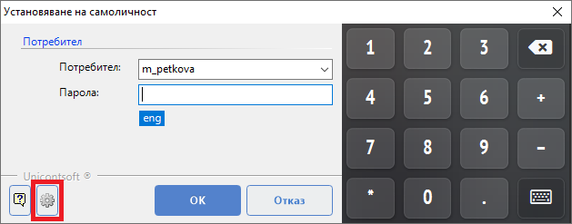
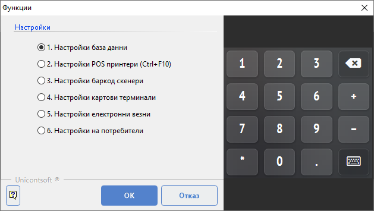
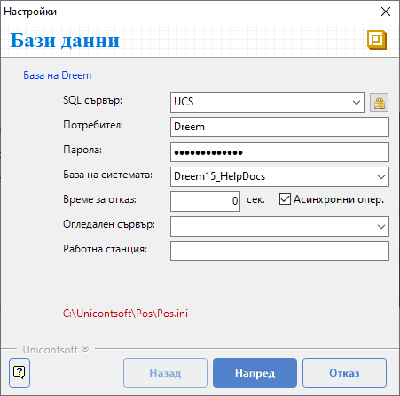
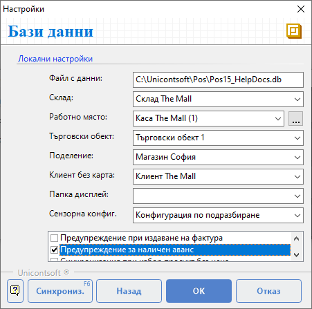
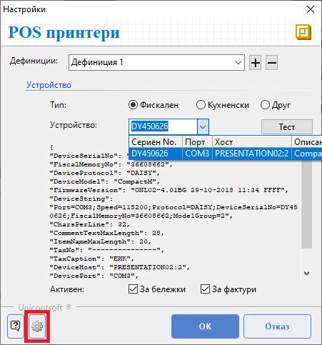
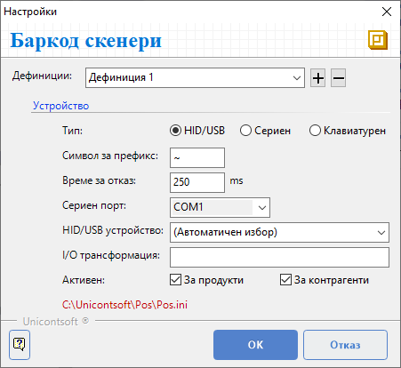

```{only} html
[Нагоре](../000-index)
```

# **Фронтофис система**

Настройките на POS терминала включват създаване на връзка с:  

 - База данни;  
 - Фискален принтер;  
 - Баркод скенер;  

> Стандартно тези настройки се извършват еднократно от администратор при инсталиране на Dreem POS.

## **База данни и локални настройки**

Настройката за връзка с базата данни зависи от изданието на системата.  
Локалните настройки се конфигурират спрямо предварително избраната схема на работа. В общия случай за всеки обект предварително са дефинирани собствени склад, каса и обект в бекофис системата **Dreem ERP**.  

1) Достъпва се функция **Настройки** от форма **Установяване на самоличност** или чрез бутон [**Функции**] на основния екран на **Dreem POS**.   

{ class=align-center }

Това отваря форма **Функции**. Избира се опция **Настройки база данни**.  

{ class=align-center }

2) На първия екран **База данни** се намират настройки за достъп до базата на **Dreem ERP**. Те са специфични и могат да бъдат локални или връзки за отдалечен достъп.  

{ class=align-center }

Чрез бутони [**Назад**] и [**Напред**] се преминава към предходен или следващ екран с настройки.  
С бутон [**Отказ**] настройките могат да бъдат отхвърлени.  

3) Вторият екран **Бази данни** съдържа опции за локални настройки.  
Тук се посочва път до локалната база **Dreem POS**, в която се съхраняват регистрираните продажби.  
Избира се **Склад**, от който ще се изписват продадените стоки.  
В **Работно място** се определя касата, в която се регистрират всички движения на парични средства в брой. Това включва приемане на плащания в брой, сторно операции, служебно въвеждане и извеждане.  
Чрез избор на **Обект** се указва за кой от обектите на организацията се генерират документи. Обектът определя номерацията на документи според настройките в **Номератори**.  
При опцията **Клиент без карта** задължително се избира специално настроен [контрагент за клиент на дребно](001-back-office-settings.md#контрагенти).  

{ class=align-center }

С поставяне/махане на отметка могат да се активират/деактивират някои допълнителни настройки:  
   - **Предупреждение при издаване на фактура** - Извежда съобщение при приключване на продажба с фактура, което изисква потвърждение от оператора за извършване на операцията.  

   - **Предупреждение за наличен аванс** - Системата сигнализира за неусвоен аванс на клиента при приключване на продажба.

   - **Синхронизация при избор продукт без цена** - Системата автоматично ще синхронизира с **Dreem ERP** продуктите, ако операторът избере продукт без цена.   

   - **Плащане през реда за добавяне на нов продукт** - Позволява регистриране на плащане в брой от реда за добавяне на нов продукт. В реда се изписва получената сума и с [**Enter**] продажбата се приключва.  
   Когато опцията е активирана, за добавянето на нов продукт се използва клавиш [**+**].  

   - **Запомняне последен потребител** - Във форма **Установяване на самоличност** предлага потребителя, който последен е достъпвал системата.  

   - **Звуков сигнал при маркиране** - Регистрира маркирането на продукт, клиентска карта или др. баркод със звуков сигнал.  

Бутон [**Синхрон.**] стартира синхронизация на номенклатури, наличности и настройки с бекофис системата **Dreem ERP**.  
При необходимост от връщане на предходен екран на формата се използва бутон [**Назад**].  
Чрез бутони [**Ok**] или [**Отказ**] настройките могат да бъдат потвърдени или отхвърлени.  

## **Фискален принтер**

От **Функции » Настройки » Настройки POS принтери** се отваря форма за конфигуриране настройките на фискалното устройство.    

```{tip}
Системата позволява един фискален принтер (ФП) да се споделя от няколко терминала. Предварително фискалното устройство трябва да бъде споделено от терминала, за който физически е закачен серийният порт. За останалите терминали се настройва мрежови ФП, като се указва връзка през терминала, на който ФП е закачен физически.  
```

{ class=align-center }
  
При успешно свързване фискалният принтер се визуализира в падащия списък от поле **Устройство** и може да бъде избран. Автоматично се показват данните за намерените активни устройства - *Сериен No.*, *Порт*, *Хост*, *Описание*.   

> Връзката с фискален принтер може да изисква активиране на режим *Продажби*, опция за връзка с PC, инсталиране на драйвер за емулация на сериен порт или друго.  

Чрез бутон [**Настройки**] се отваря форма за програмиране на ФП. Могат да се въведат имена на оператори, да се променят много други системни настройки по фискалния принтер - име, адрес и т.н.

След избор на ФП се извършва тест на връзката чрез бутона [**Тест**].  
Чрез бутони [**Ok**] или [**Отказ**] настройките могат да бъдат потвърдени или отхвърлени.  

## **Баркод скенер**

От **Функции » Настройки » Настройки баркод скенери** се отваря форма за конфигуриране настройките на баркод скенера. Те указват дали се използва клавиатурен скенер (в това число USB устройства) или сериен баркод скенер.  

{ class=align-center }

За оптимална работа на клавиатурните устройства е желателно скенерът да се настрои да изпраща префиксен символ. По подразбиране се очаква той да е **~** (тилда). Задължително след баркода скенерът трябва да изпраща символ за нов ред.  

```{tip}
За програмиране на скенери може да се разгледа ръководството от производителя.   
```
