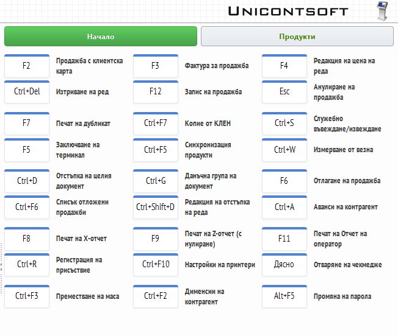

```{only} html
[Нагоре](../000-index)
```
# **Основен екран**

**Dreem POS** предлага интуитивен потребителски интерфейс. Операциите са опростени и без излишни стъпки. За всяка от тях са реализирани бутони и/или клавишни комбинации за бърз достъп.  

{ class=align-center w=15cm }

По подразбиране основният екран на системата е оцветен в сиво. Това сигнализира, че текущият тип документ е **Продажба**. При промяна на типа основният екран ще се оцвети в различен цвят:  

- **сив** – продажба на контрагент, настроен за клиент на дребно;  
- **син** – продажба на избран контрагент с клиентска карта;  
- **зелен** – издаване на фактура;  
- **червен** – сторно бележка;  

## **Характеристики на основния екран**

1) **Текущ документ** 

В първото поле системата показва тип на документа, който се обработва текущо.  
В следващите две полета в черно се визуализира информация за последно маркиран продукт и обща стойност на документа до момента.  

{ class=align-center w=15cm }

В долната част на списъка се намира текущо обработваният документ.  


2) **Списък с приключени продажби**  

{ class=align-center w=15cm }

3) **Функционални бутони**  

{ class=align-center w=15cm }

4) **Тотали за оператора**  

Полетата в тази секция показват на оператора тотали с дължима и платена сума.  

{ class=align-center w=15cm }

- **Общо** - Полето показва общата стойност на документа.  
- **Платено** - Полето се обзавежда след приключване на продажбата с платената сума. Показаните стойности при смесено плащане са във вид: сума платено с карта + сума платено в брой.   
- **Ресто** - Полето показва дължимото ресто. Обзавежда се, когато при плащане операторът е въвел получена от клиента сума, надвишаваща общо дължимата.  


5) **Бутони за бърз достъп**  

{ class=align-center w=15cm }

   - **Продукти**  

   - **Функции**  

   - **Плащане**  

   - **Запис**  

6) **Клавиатура**  
